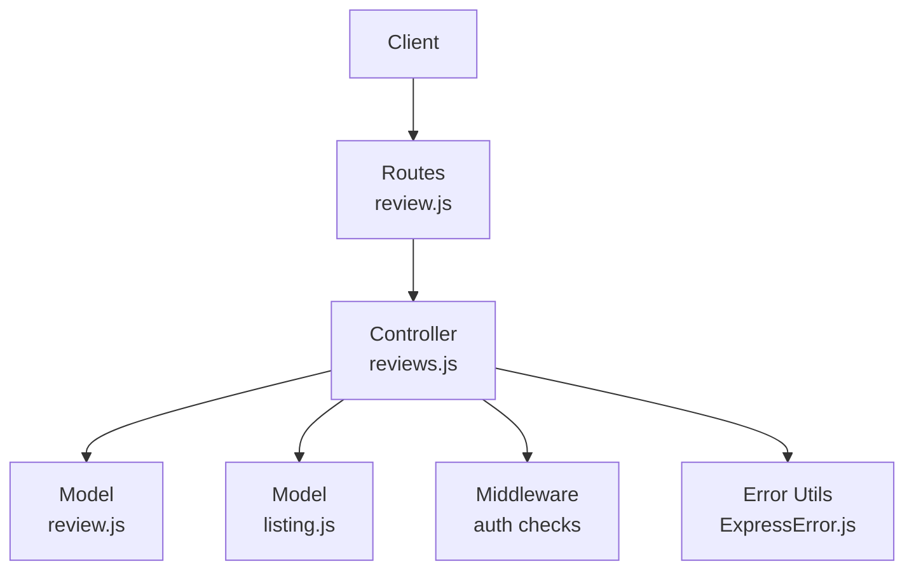
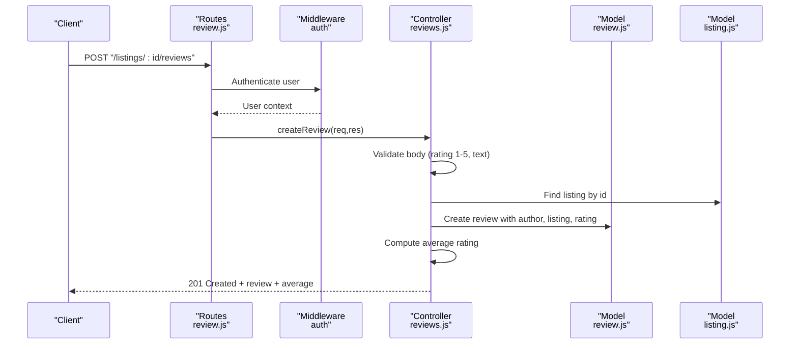
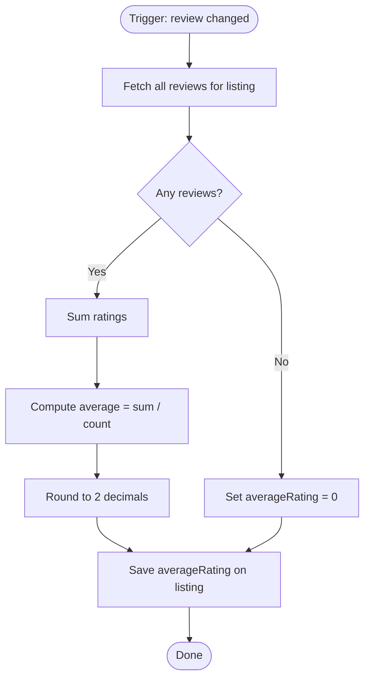
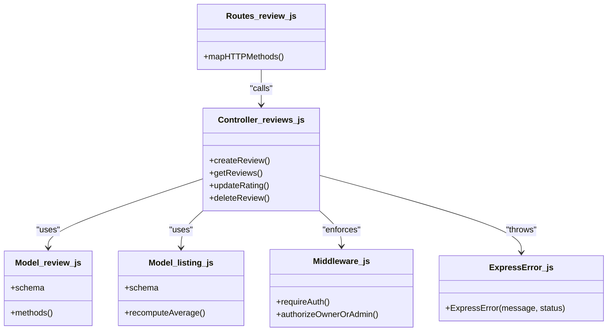

# Review and Rating API

<cite>
**Referenced Files in This Document**
- [controllers/reviews.js](file://controllers/reviews.js)
- [routes/review.js](file://routes/review.js)
- [models/review.js](file://models/review.js)
- [models/listing.js](file://models/listing.js)
- [middleware.js](file://middleware.js)
- [utils/ExpressError.js](file://utils/ExpressError.js)
</cite>

## Table of Contents
1. [Introduction](#introduction)
2. [Project Structure](#project-structure)
3. [Core Components](#core-components)
4. [Architecture Overview](#architecture-overview)
5. [Detailed Component Analysis](#detailed-component-analysis)
6. [Dependency Analysis](#dependency-analysis)
7. [Performance Considerations](#performance-considerations)
8. [Troubleshooting Guide](#troubleshooting-guide)
9. [Conclusion](#conclusion)

## Introduction
This document specifies the Review and Rating API for listing reviews and ratings. It covers:
- Adding a review to a listing
- Viewing reviews for a listing
- Updating a rating (star value) on an existing review
- Deleting a review
- Authentication requirements, request/response schemas, validation rules, average rating calculation, moderation/spam prevention considerations, and error handling.

The endpoints are implemented using Express routes and controllers with Mongoose models for persistence.

## Project Structure
Review and rating functionality is organized across routes, controllers, and models:
- Routes define URL patterns and HTTP methods
- Controllers implement business logic and orchestrate model operations
- Models define data schemas and aggregation helpers

**Diagram sources**
- [routes/review.js](file://routes/review.js)
- [controllers/reviews.js](file://controllers/reviews.js)
- [models/review.js](file://models/review.js)
- [models/listing.js](file://models/listing.js)
- [middleware.js](file://middleware.js)
- [utils/ExpressError.js](file://utils/ExpressError.js)

**Section sources**
- [routes/review.js](file://routes/review.js)
- [controllers/reviews.js](file://controllers/reviews.js)
- [models/review.js](file://models/review.js)
- [models/listing.js](file://models/listing.js)
- [middleware.js](file://middleware.js)
- [utils/ExpressError.js](file://utils/ExpressError.js)

## Core Components
- Route definitions: Map HTTP verbs and URL patterns to controller handlers.
- Controller logic: Validates inputs, enforces authentication, performs CRUD operations, and computes averages.
- Data models: Define schema constraints (e.g., rating range), store references between listings and reviews, and provide helper fields/methods for aggregations.
- Middleware: Enforces authentication and authorization where required.
- Error utilities: Standardize error responses.

Key responsibilities:
- Reviews: Create, read, update, delete
- Ratings: Validate star values (1–5), aggregate per listing, compute average
- Moderation/Spam: Input validation, rate limiting, content checks (recommended)
- Security: Require authenticated users; restrict actions to owners/admins as needed

**Section sources**
- [routes/review.js](file://routes/review.js)
- [controllers/reviews.js](file://controllers/reviews.js)
- [models/review.js](file://models/review.js)
- [models/listing.js](file://models/listing.js)
- [middleware.js](file://middleware.js)
- [utils/ExpressError.js](file://utils/ExpressError.js)

## Architecture Overview
End-to-end flow for creating a review:

**Diagram sources**
- [routes/review.js](file://routes/review.js)
- [controllers/reviews.js](file://controllers/reviews.js)
- [models/review.js](file://models/review.js)
- [models/listing.js](file://models/listing.js)
- [middleware.js](file://middleware.js)

## Detailed Component Analysis

### Endpoints

#### Add a Review
- Method: POST
- URL: /listings/:id/reviews
- Authentication: Required (authenticated user)
- Path Parameters:
  - id: Listing identifier
- Request Body:
  - rating: number, integer, 1–5 inclusive
  - text: string, non-empty, reasonable length limits recommended
- Response:
  - 201 Created: { review, averageRating }
  - 400 Bad Request: Validation errors
  - 404 Not Found: Listing not found
  - 401 Unauthorized: Missing or invalid session/token
  - 403 Forbidden: Insufficient permissions (if enforced)
  - 429 Too Many Requests: Rate limit exceeded (if enabled)
  - 500 Internal Server Error: Unexpected server error

Notes:
- The system should reject ratings outside 1–5.
- Average rating is recalculated after creation.

**Section sources**
- [routes/review.js](file://routes/review.js)
- [controllers/reviews.js](file://controllers/reviews.js)
- [models/review.js](file://models/review.js)
- [models/listing.js](file://models/listing.js)
- [middleware.js](file://middleware.js)

#### View Reviews for a Listing
- Method: GET
- URL: /listings/:id/reviews
- Authentication: Optional (depends on policy; typically public)
- Query Parameters:
  - page: integer, optional, default 1
  - limit: integer, optional, default N
- Response:
  - 200 OK: { reviews[], averageRating }
  - 404 Not Found: Listing not found
  - 500 Internal Server Error: Unexpected server error

Notes:
- Pagination is recommended for large datasets.
- Average rating should be included.

**Section sources**
- [routes/review.js](file://routes/review.js)
- [controllers/reviews.js](file://controllers/reviews.js)
- [models/review.js](file://models/review.js)
- [models/listing.js](file://models/listing.js)

#### Update Rating on a Review
- Method: PUT or PATCH
- URL: /listings/:id/reviews/:reviewId
- Authentication: Required (owner or admin)
- Path Parameters:
  - id: Listing identifier
  - reviewId: Review identifier
- Request Body:
  - rating: number, integer, 1–5 inclusive
- Response:
  - 200 OK: { review, averageRating }
  - 400 Bad Request: Validation errors
  - 404 Not Found: Review or listing not found
  - 401 Unauthorized: Missing or invalid session/token
  - 403 Forbidden: Not authorized to modify this review
  - 500 Internal Server Error: Unexpected server error

Notes:
- Only the review author or an admin should be allowed to update.
- Average rating is recalculated after update.

**Section sources**
- [routes/review.js](file://routes/review.js)
- [controllers/reviews.js](file://controllers/reviews.js)
- [models/review.js](file://models/review.js)
- [models/listing.js](file://models/listing.js)
- [middleware.js](file://middleware.js)

#### Delete a Review
- Method: DELETE
- URL: /listings/:id/reviews/:reviewId
- Authentication: Required (owner or admin)
- Path Parameters:
  - id: Listing identifier
  - reviewId: Review identifier
- Response:
  - 200 OK: { message }
  - 404 Not Found: Review or listing not found
  - 401 Unauthorized: Missing or invalid session/token
  - 403 Forbidden: Not authorized to delete this review
  - 500 Internal Server Error: Unexpected server error

Notes:
- After deletion, average rating should be recalculated if applicable.

**Section sources**
- [routes/review.js](file://routes/review.js)
- [controllers/reviews.js](file://controllers/reviews.js)
- [models/review.js](file://models/review.js)
- [models/listing.js](file://models/listing.js)
- [middleware.js](file://middleware.js)

### Data Schemas

#### Review
- Fields:
  - _id: ObjectId
  - author: reference to User
  - listing: reference to Listing
  - rating: number, integer, 1–5
  - text: string
  - createdAt: timestamp
  - updatedAt: timestamp

Constraints:
- rating must be an integer between 1 and 5 inclusive
- text must be present and within length limits
- author and listing must exist

**Section sources**
- [models/review.js](file://models/review.js)

#### Listing
- Relevant fields:
  - _id: ObjectId
  - title, description, etc.
  - averageRating: number (computed or stored)
  - ratingCount: number (optional, computed or stored)

Aggregation helpers:
- Recompute averageRating from associated reviews
- Maintain ratingCount when reviews change

**Section sources**
- [models/listing.js](file://models/listing.js)

### Validation Rules
- rating: integer, 1 ≤ rating ≤ 5
- text: non-empty, max length recommended (e.g., 1000 characters)
- path parameters: valid MongoDB ObjectIds
- authentication: required for write operations

**Section sources**
- [controllers/reviews.js](file://controllers/reviews.js)
- [models/review.js](file://models/review.js)

### Authentication and Authorization
- All write endpoints require an authenticated user.
- Update/Delete require ownership or admin privileges.
- Use middleware to enforce authN/authZ before reaching controllers.

**Section sources**
- [middleware.js](file://middleware.js)
- [controllers/reviews.js](file://controllers/reviews.js)

### Average Rating Calculation
- Formula: average = sum(rating_i) / count(reviews)
- Precision: round to two decimal places
- Recalculate on:
  - Create
  - Update
  - Delete

**Diagram sources**
- [controllers/reviews.js](file://controllers/reviews.js)
- [models/listing.js](file://models/listing.js)
- [models/review.js](file://models/review.js)

**Section sources**
- [controllers/reviews.js](file://controllers/reviews.js)
- [models/listing.js](file://models/listing.js)

### Moderation and Spam Prevention
Recommendations:
- Content filtering for text (profanity, links, PII)
- Rate limiting per user per listing
- Duplicate detection (prevent identical reviews from same user on same listing)
- Report/flag mechanism and admin moderation queue
- CAPTCHA for anonymous submissions (if allowed)

Implementation hooks:
- Apply middleware for rate limiting
- Add validation in controller/model
- Integrate external moderation service

[No sources needed since this section provides general guidance]

### Example Requests and Responses

- Add Review
  - Request:
    - POST /listings/:id/reviews
    - Headers: Authorization: Bearer <token>
    - Body: { "rating": 4, "text": "Great place!" }
  - Response 201:
    - { "review": { "_id": "...", "author": "...", "listing": "...", "rating": 4, "text": "Great place!", "createdAt": "...", "updatedAt": "..." }, "averageRating": 4.0 }

- View Reviews
  - Request:
    - GET /listings/:id/reviews?page=1&limit=10
  - Response 200:
    - { "reviews": [ ... ], "averageRating": 3.75 }

- Update Rating
  - Request:
    - PUT /listings/:id/reviews/:reviewId
    - Headers: Authorization: Bearer <token>
    - Body: { "rating": 5 }
  - Response 200:
    - { "review": { ... }, "averageRating": 4.2 }

- Delete Review
  - Request:
    - DELETE /listings/:id/reviews/:reviewId
    - Headers: Authorization: Bearer <token>
  - Response 200:
    - { "message": "Review deleted" }

[No sources needed since these examples illustrate standard REST behavior]

### Error Handling
Standardized error responses via utility:
- 400 Bad Request: Invalid input (e.g., rating out of range)
- 401 Unauthorized: Missing or invalid credentials
- 403 Forbidden: Not authorized to perform action
- 404 Not Found: Resource missing
- 429 Too Many Requests: Rate limited
- 500 Internal Server Error: Unexpected failure

Use consistent JSON structure:
- { "error": "<message>", "code": "<optional code>" }

**Section sources**
- [utils/ExpressError.js](file://utils/ExpressError.js)
- [controllers/reviews.js](file://controllers/reviews.js)

## Dependency Analysis
Relationships among components:

**Diagram sources**
- [routes/review.js](file://routes/review.js)
- [controllers/reviews.js](file://controllers/reviews.js)
- [models/review.js](file://models/review.js)
- [models/listing.js](file://models/listing.js)
- [middleware.js](file://middleware.js)
- [utils/ExpressError.js](file://utils/ExpressError.js)

**Section sources**
- [routes/review.js](file://routes/review.js)
- [controllers/reviews.js](file://controllers/reviews.js)
- [models/review.js](file://models/review.js)
- [models/listing.js](file://models/listing.js)
- [middleware.js](file://middleware.js)
- [utils/ExpressError.js](file://utils/ExpressError.js)

## Performance Considerations
- Indexes:
  - listingId on reviews for fast retrieval
  - authorId + listingId unique index to prevent duplicates
- Aggregation:
  - Use database-level aggregation pipelines for average calculations
- Caching:
  - Cache averageRating per listing with short TTL
- Pagination:
  - Implement cursor-based pagination for large review sets
- Concurrency:
  - Use transactions when updating listing aggregates to avoid race conditions

[No sources needed since this section provides general guidance]

## Troubleshooting Guide
Common issues and resolutions:
- Rating out of range: Ensure client sends integer 1–5; validate server-side
- Unauthorized updates/deletes: Verify owner/admin checks in middleware/controller
- Average rating drift: Re-run recalculation job or fix triggers on CRUD ops
- High latency on list: Check indexes and add pagination/caching
- Duplicate reviews: Enforce uniqueness constraint at DB level

**Section sources**
- [controllers/reviews.js](file://controllers/reviews.js)
- [models/review.js](file://models/review.js)
- [models/listing.js](file://models/listing.js)
- [middleware.js](file://middleware.js)

## Conclusion
The Review and Rating API provides secure, validated endpoints for managing reviews and ratings on listings. It enforces strict rating ranges, supports average rating computation, and includes clear error semantics. For production readiness, add robust moderation, spam protection, caching, and comprehensive monitoring.