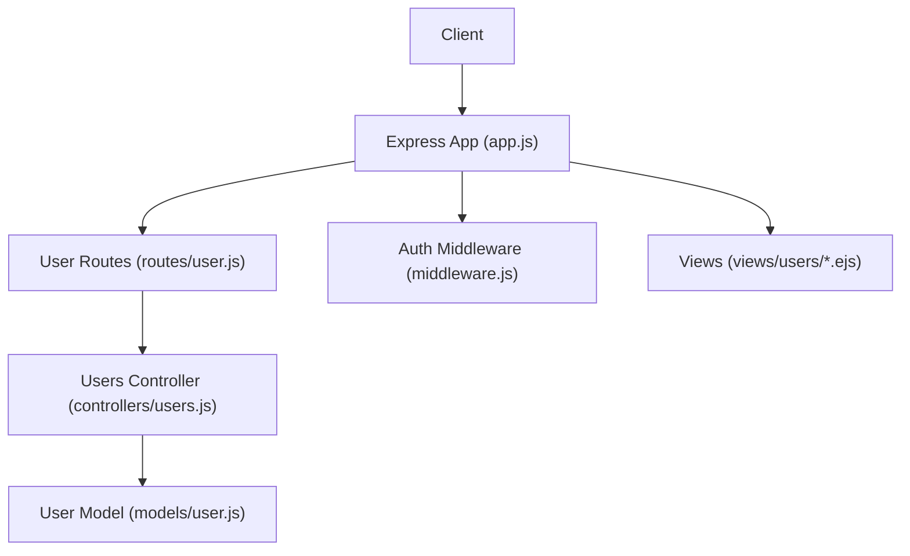
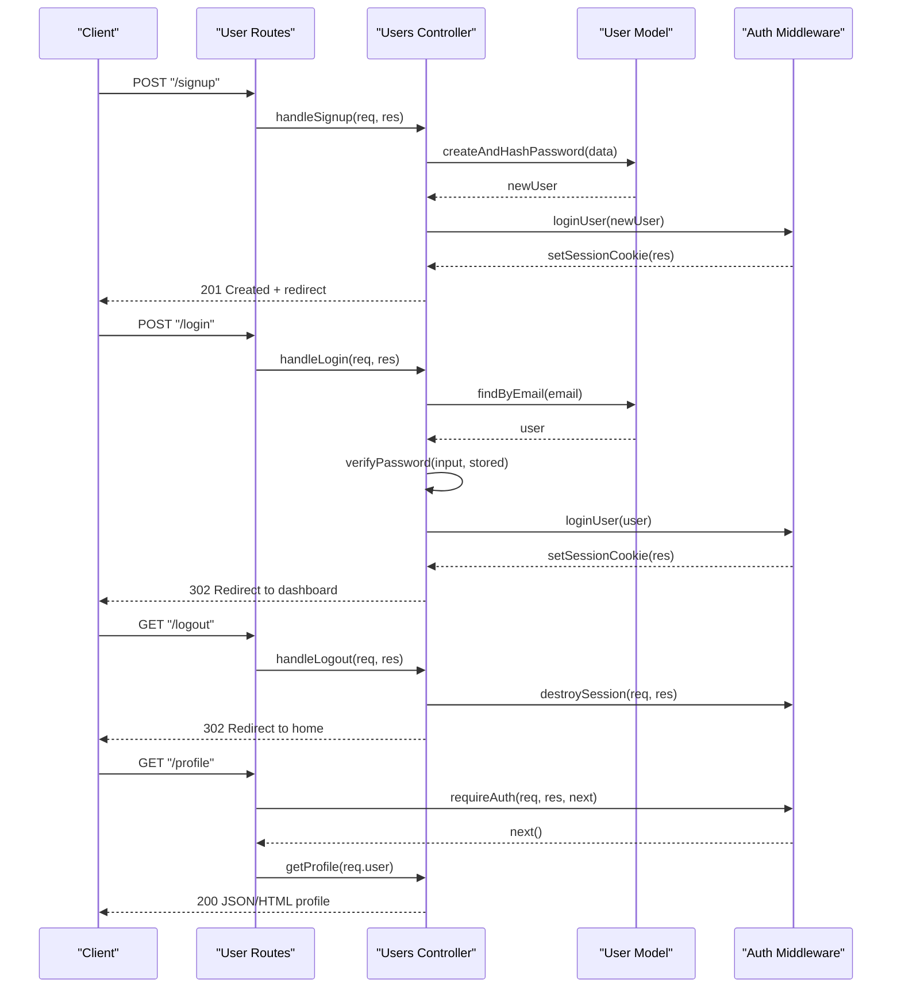
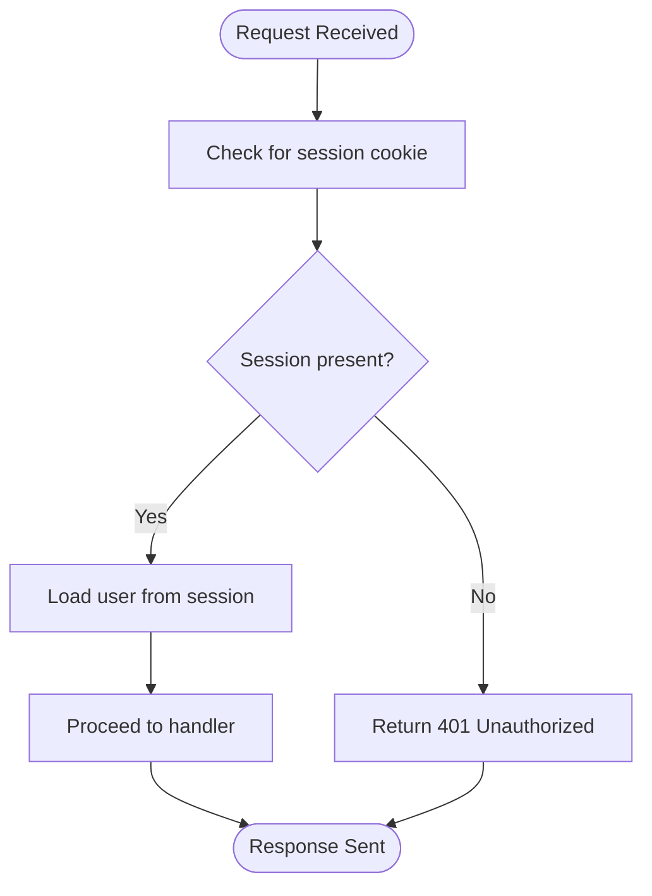
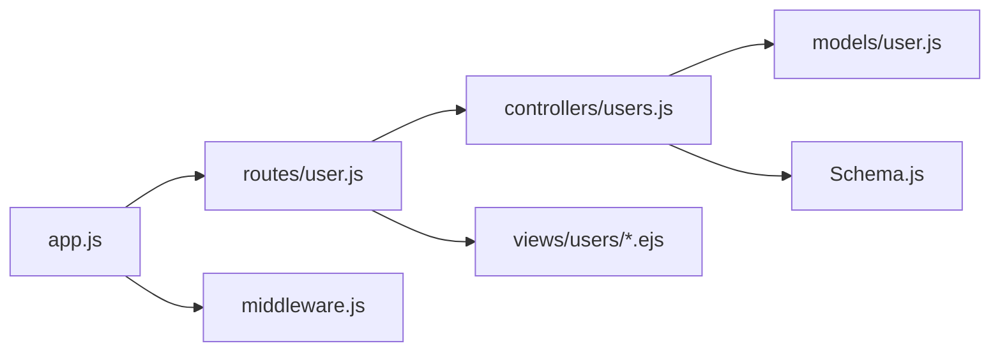

# User Authentication API

<cite>
**Referenced Files in This Document**
- [app.js](file://app.js)
- [routes/user.js](file://routes/user.js)
- [controllers/users.js](file://controllers/users.js)
- [models/user.js](file://models/user.js)
- [middleware.js](file://middleware.js)
- [Schema.js](file://Schema.js)
- [views/users/signup.ejs](file://views/users/signup.ejs)
- [views/users/login.ejs](file://views/users/login.ejs)
</cite>

## Table of Contents
1. [Introduction](#introduction)
2. [Project Structure](#project-structure)
3. [Core Components](#core-components)
4. [Architecture Overview](#architecture-overview)
5. [Detailed Component Analysis](#detailed-component-analysis)
6. [Dependency Analysis](#dependency-analysis)
7. [Performance Considerations](#performance-considerations)
8. [Troubleshooting Guide](#troubleshooting-guide)
9. [Conclusion](#conclusion)

## Introduction
This document specifies the user authentication endpoints for registration, login, logout, and profile management. It covers HTTP methods, URL patterns, request/response schemas, authentication requirements, example headers, session handling, password validation, and security considerations such as password hashing, session management, and CSRF protection.

## Project Structure
The authentication feature is implemented across routes, controllers, models, middleware, and views:
- Routes define URL patterns and bind them to controller handlers.
- Controllers implement business logic for signup, login, logout, and profile operations.
- Models represent users and interact with persistence.
- Middleware provides authentication guards and error utilities.
- Views render HTML forms for signup and login flows.

**Diagram sources**
- [app.js](file://app.js)
- [routes/user.js](file://routes/user.js)
- [controllers/users.js](file://controllers/users.js)
- [models/user.js](file://models/user.js)
- [middleware.js](file://middleware.js)
- [views/users/signup.ejs](file://views/users/signup.ejs)
- [views/users/login.ejs](file://views/users/login.ejs)

**Section sources**
- [app.js](file://app.js)
- [routes/user.js](file://routes/user.js)
- [controllers/users.js](file://controllers/users.js)
- [models/user.js](file://models/user.js)
- [middleware.js](file://middleware.js)
- [views/users/signup.ejs](file://views/users/signup.ejs)
- [views/users/login.ejs](file://views/users/login.ejs)

## Core Components
- User model: Defines user schema and any built-in validations or hooks used by controllers.
- Users controller: Implements handlers for signup, login, logout, and profile actions.
- User routes: Mounts endpoints under /signup, /login, /logout, and profile-related paths.
- Middleware: Provides authentication checks and shared utilities.
- Views: Render signup and login pages that submit to the above endpoints.

Key responsibilities:
- Validate inputs using a schema definition.
- Hash passwords before persisting.
- Manage sessions via cookies after successful authentication.
- Protect profile endpoints with an authentication guard.

**Section sources**
- [models/user.js](file://models/user.js)
- [controllers/users.js](file://controllers/users.js)
- [routes/user.js](file://routes/user.js)
- [middleware.js](file://middleware.js)
- [Schema.js](file://Schema.js)
- [views/users/signup.ejs](file://views/users/signup.ejs)
- [views/users/login.ejs](file://views/users/login.ejs)

## Architecture Overview
The authentication flow uses Express routes to delegate to controller functions, which validate input, interact with the user model, and manage sessions. Profile endpoints are guarded by middleware to ensure only authenticated users can access them.

**Diagram sources**
- [routes/user.js](file://routes/user.js)
- [controllers/users.js](file://controllers/users.js)
- [models/user.js](file://models/user.js)
- [middleware.js](file://middleware.js)

## Detailed Component Analysis

### Endpoints

#### POST /signup
- Purpose: Register a new user account.
- Authentication: Not required.
- Content-Type: application/x-www-form-urlencoded (form submission from view).
- Request body fields:
  - username: string, required, unique.
  - email: string, required, valid email format, unique.
  - password: string, required, meets minimum length and complexity rules.
- Response:
  - 302 Found: Redirect to dashboard or login page upon success.
  - 400 Bad Request: Validation errors returned with flash messages or form re-render.
  - 409 Conflict: Username or email already exists.
- Example headers:
  - Content-Type: application/x-www-form-urlencoded
- Session handling:
  - On success, a session cookie is created and attached to the response.
- Password validation:
  - Enforced by schema and/or model hooks; see Schema.js and models/user.js.

**Section sources**
- [routes/user.js](file://routes/user.js)
- [controllers/users.js](file://controllers/users.js)
- [models/user.js](file://models/user.js)
- [Schema.js](file://Schema.js)
- [views/users/signup.ejs](file://views/users/signup.ejs)

#### POST /login
- Purpose: Authenticate an existing user and start a session.
- Authentication: Not required.
- Content-Type: application/x-www-form-urlencoded (form submission from view).
- Request body fields:
  - email: string, required.
  - password: string, required.
- Response:
  - 302 Found: Redirect to dashboard on success.
  - 401 Unauthorized: Invalid credentials.
  - 400 Bad Request: Missing fields or malformed input.
- Example headers:
  - Content-Type: application/x-www-form-urlencoded
- Session handling:
  - On success, a session cookie is created and attached to the response.
- Password verification:
  - Compare provided password with stored hash securely.

**Section sources**
- [routes/user.js](file://routes/user.js)
- [controllers/users.js](file://controllers/users.js)
- [models/user.js](file://models/user.js)
- [views/users/login.ejs](file://views/users/login.ejs)

#### GET /logout
- Purpose: Terminate the current session.
- Authentication: Required.
- Response:
  - 302 Found: Redirect to home or login page after destroying the session.
- Session handling:
  - Destroys the server-side session and clears the session cookie.

**Section sources**
- [routes/user.js](file://routes/user.js)
- [controllers/users.js](file://controllers/users.js)
- [middleware.js](file://middleware.js)

#### GET /profile
- Purpose: Retrieve the authenticated user’s profile information.
- Authentication: Required.
- Response:
  - 200 OK: Returns profile data (JSON or HTML depending on route implementation).
  - 401 Unauthorized: If not authenticated.
- Security:
  - Protected by authentication middleware.

**Section sources**
- [routes/user.js](file://routes/user.js)
- [controllers/users.js](file://controllers/users.js)
- [middleware.js](file://middleware.js)

### Request and Response Schemas

- Common request headers:
  - Content-Type: application/x-www-form-urlencoded for form submissions.
  - Cookie: Present when accessing protected endpoints.

- Signup request body:
  - username: string
  - email: string
  - password: string

- Login request body:
  - email: string
  - password: string

- Typical responses:
  - Success: 302 redirect with Set-Cookie header containing session identifier.
  - Validation failure: 400 with error details or re-rendered form.
  - Conflict: 409 indicating duplicate username/email.
  - Unauthorized: 401 for missing or invalid session.

[No sources needed since this section summarizes schemas without quoting specific files]

### Authentication Requirements and Headers

- Unauthenticated endpoints:
  - POST /signup
  - POST /login

- Authenticated endpoints:
  - GET /logout
  - GET /profile

- Example headers for protected requests:
  - Cookie: <session-id>

- Example headers for form submissions:
  - Content-Type: application/x-www-form-urlencoded

**Section sources**
- [routes/user.js](file://routes/user.js)
- [middleware.js](file://middleware.js)

### Session Handling

- Creation:
  - After successful signup or login, a session is established and a session cookie is set in the response.
- Usage:
  - Subsequent requests include the session cookie to identify the user.
- Destruction:
  - Logging out destroys the session and clears the cookie.

**Diagram sources**
- [middleware.js](file://middleware.js)

**Section sources**
- [middleware.js](file://middleware.js)

### Password Validation and Hashing

- Validation:
  - Enforced by schema/model constraints (e.g., minimum length, complexity).
- Storage:
  - Passwords are hashed before being persisted; never store plaintext.
- Verification:
  - Use secure comparison against stored hashes during login.

**Section sources**
- [Schema.js](file://Schema.js)
- [models/user.js](file://models/user.js)

### CSRF Protection

- Recommendation:
  - Include CSRF tokens in forms and validate them server-side to prevent cross-site request forgery.
- Implementation note:
  - Ensure your session and CSRF middleware are configured and applied to state-changing routes.

[No sources needed since this section provides general guidance]

## Dependency Analysis

**Diagram sources**
- [app.js](file://app.js)
- [routes/user.js](file://routes/user.js)
- [controllers/users.js](file://controllers/users.js)
- [models/user.js](file://models/user.js)
- [middleware.js](file://middleware.js)
- [Schema.js](file://Schema.js)
- [views/users/signup.ejs](file://views/users/signup.ejs)
- [views/users/login.ejs](file://views/users/login.ejs)

**Section sources**
- [app.js](file://app.js)
- [routes/user.js](file://routes/user.js)
- [controllers/users.js](file://controllers/users.js)
- [models/user.js](file://models/user.js)
- [middleware.js](file://middleware.js)
- [Schema.js](file://Schema.js)
- [views/users/signup.ejs](file://views/users/signup.ejs)
- [views/users/login.ejs](file://views/users/login.ejs)

## Performance Considerations
- Avoid unnecessary database reads by caching user lookups where appropriate.
- Use efficient password hashing algorithms with appropriate work factors.
- Keep session payloads minimal to reduce cookie size.
- Return redirects rather than large payloads for post-processing flows.

[No sources needed since this section provides general guidance]

## Troubleshooting Guide
- 401 Unauthorized on protected endpoints:
  - Verify session cookie is present and valid.
  - Ensure authentication middleware is applied to the route.
- 400 Bad Request on signup/login:
  - Check form field names and content type.
  - Review validation errors returned by the schema/model.
- 409 Conflict on signup:
  - Username or email may already exist; prompt the user to choose different values.
- Session not persisting:
  - Confirm session storage configuration and cookie settings (domain, path, secure flags).

**Section sources**
- [middleware.js](file://middleware.js)
- [Schema.js](file://Schema.js)
- [models/user.js](file://models/user.js)

## Conclusion
The authentication system provides clear endpoints for user registration, login, logout, and profile access. Inputs are validated, passwords are hashed, and sessions are managed through cookies. For production deployments, ensure robust CSRF protection, secure cookie configuration, and strong password policies.