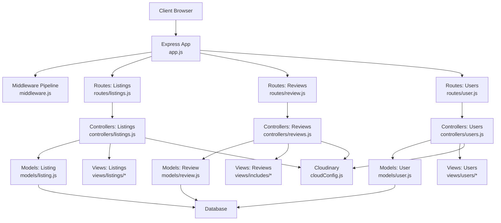
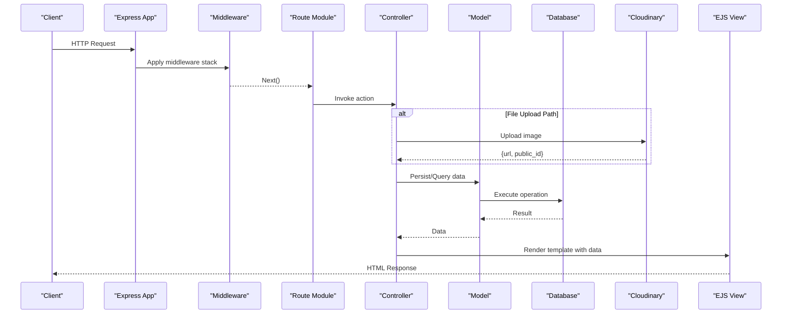
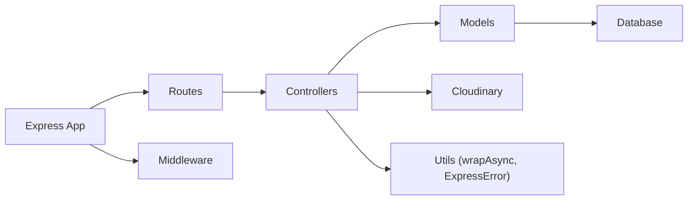

# Architecture Overview

<cite>
**Referenced Files in This Document**
- [app.js](file://app.js)
- [middleware.js](file://middleware.js)
- [cloudConfig.js](file://cloudConfig.js)
- [Schema.js](file://Schema.js)
- [package.json](file://package.json)
- [controllers/listings.js](file://controllers/listings.js)
- [controllers/reviews.js](file://controllers/reviews.js)
- [controllers/users.js](file://controllers/users.js)
- [routes/listings.js](file://routes/listings.js)
- [routes/review.js](file://routes/review.js)
- [routes/user.js](file://routes/user.js)
- [models/listing.js](file://models/listing.js)
- [models/review.js](file://models/review.js)
- [models/user.js](file://models/user.js)
- [utils/ExpressError.js](file://utils/ExpressError.js)
- [utils/wrapAsync.js](file://utils/wrapAsync.js)
- [init/index.js](file://init/index.js)
- [init/data.js](file://init/data.js)
</cite>

## Table of Contents
1. [Introduction](#introduction)
2. [Project Structure](#project-structure)
3. [Core Components](#core-components)
4. [Architecture Overview](#architecture-overview)
5. [Detailed Component Analysis](#detailed-component-analysis)
6. [Dependency Analysis](#dependency-analysis)
7. [Performance Considerations](#performance-considerations)
8. [Troubleshooting Guide](#troubleshooting-guide)
9. [Conclusion](#conclusion)

## Introduction
This document describes the architecture of the Major Project, focusing on its Model-View-Controller (MVC) separation, Express middleware pipeline, and end-to-end request-response flow. It explains how routes delegate to controllers, how controllers interact with models for data persistence, and how views render responses. It also covers integration points such as Cloudinary for media uploads, error handling strategies, and considerations for scalability and deployment topology.

## Project Structure
The project follows a conventional MVC layout:
- Controllers encapsulate request handling logic and orchestrate business operations.
- Models define data schemas and database interactions.
- Views are EJS templates that render HTML responses.
- Routes map HTTP endpoints to controller actions.
- Middleware provides cross-cutting concerns like authentication, validation, and error formatting.
- Utilities include async wrapper helpers and custom error types.
- Initialization scripts seed or prepare data at startup.

**Diagram sources**
- [app.js](file://app.js)
- [middleware.js](file://middleware.js)
- [cloudConfig.js](file://cloudConfig.js)
- [routes/listings.js](file://routes/listings.js)
- [routes/review.js](file://routes/review.js)
- [routes/user.js](file://routes/user.js)
- [controllers/listings.js](file://controllers/listings.js)
- [controllers/reviews.js](file://controllers/reviews.js)
- [controllers/users.js](file://controllers/users.js)
- [models/listing.js](file://models/listing.js)
- [models/review.js](file://models/review.js)
- [models/user.js](file://models/user.js)

**Section sources**
- [app.js](file://app.js)
- [middleware.js](file://middleware.js)
- [cloudConfig.js](file://cloudConfig.js)
- [routes/listings.js](file://routes/listings.js)
- [routes/review.js](file://routes/review.js)
- [routes/user.js](file://routes/user.js)
- [controllers/listings.js](file://controllers/listings.js)
- [controllers/reviews.js](file://controllers/reviews.js)
- [controllers/users.js](file://controllers/users.js)
- [models/listing.js](file://models/listing.js)
- [models/review.js](file://models/review.js)
- [models/user.js](file://models/user.js)

## Core Components
- Application bootstrap and configuration: centralizes middleware registration, view engine setup, route mounting, and global error handling.
- Middleware pipeline: handles session management, flash messages, authentication guards, authorization checks, and input sanitization.
- Route modules: declare RESTful endpoints and delegate to controller methods.
- Controllers: parse requests, invoke services/models, manage form data and file uploads, and render views or return JSON.
- Models: define schemas, validations, and CRUD operations against the database.
- Views: EJS templates for rendering HTML pages and partials.
- Utilities: async wrapper to simplify error propagation from async handlers; custom error class for consistent error responses.
- External integrations: Cloudinary client configured for image upload workflows.
- Initialization: seeders or preparatory tasks executed at startup.

Key technical decisions:
- MVC separation improves maintainability and testability by isolating concerns.
- Express middleware enables reusable cross-cutting logic.
- EJS templating integrates smoothly with Node/Express for server-side rendering.
- Centralized error handling via a custom error type ensures consistent API behavior.

**Section sources**
- [app.js](file://app.js)
- [middleware.js](file://middleware.js)
- [utils/ExpressError.js](file://utils/ExpressError.js)
- [utils/wrapAsync.js](file://utils/wrapAsync.js)
- [cloudConfig.js](file://cloudConfig.js)
- [init/index.js](file://init/index.js)
- [init/data.js](file://init/data.js)

## Architecture Overview
The system is an Express-based web application following MVC patterns. Requests enter through the Express app, traverse middleware (auth, sessions, body parsing), reach route handlers, which call controllers. Controllers coordinate business logic, interact with models for persistence, and render views. Media assets are uploaded to Cloudinary via the configured client. Errors are normalized using a custom error class and handled globally.

**Diagram sources**
- [app.js](file://app.js)
- [middleware.js](file://middleware.js)
- [routes/listings.js](file://routes/listings.js)
- [routes/review.js](file://routes/review.js)
- [routes/user.js](file://routes/user.js)
- [controllers/listings.js](file://controllers/listings.js)
- [controllers/reviews.js](file://controllers/reviews.js)
- [controllers/users.js](file://controllers/users.js)
- [models/listing.js](file://models/listing.js)
- [models/review.js](file://models/review.js)
- [models/user.js](file://models/user.js)
- [cloudConfig.js](file://cloudConfig.js)

## Detailed Component Analysis

### Application Bootstrap and Configuration
- Registers view engine and layouts.
- Mounts route modules under appropriate prefixes.
- Configures static assets and template includes.
- Sets up global error-handling middleware.
- Initializes external clients (e.g., Cloudinary).

**Section sources**
- [app.js](file://app.js)
- [cloudConfig.js](file://cloudConfig.js)

### Middleware Pipeline
- Authentication and authorization guards protect sensitive routes.
- Session and flash message middleware enable user feedback across requests.
- Body parsers handle JSON and URL-encoded payloads.
- Custom middleware may sanitize inputs or enforce policies.
- Error formatter converts internal errors into standardized responses.

**Section sources**
- [middleware.js](file://middleware.js)
- [utils/ExpressError.js](file://utils/ExpressError.js)
- [utils/wrapAsync.js](file://utils/wrapAsync.js)

### Routes
- Declarative mapping of HTTP verbs and paths to controller methods.
- Grouped by domain (listings, reviews, users).
- May apply route-level middleware for access control or validation.

**Section sources**
- [routes/listings.js](file://routes/listings.js)
- [routes/review.js](file://routes/review.js)
- [routes/user.js](file://routes/user.js)

### Controllers
- Parse and validate incoming request data.
- Orchestrate business logic and coordinate with models.
- Handle file uploads by invoking Cloudinary.
- Render EJS views with context data or return JSON responses.
- Use async wrappers to avoid try/catch boilerplate.

**Section sources**
- [controllers/listings.js](file://controllers/listings.js)
- [controllers/reviews.js](file://controllers/reviews.js)
- [controllers/users.js](file://controllers/users.js)
- [utils/wrapAsync.js](file://utils/wrapAsync.js)

### Models
- Define schemas and validations for entities (listing, review, user).
- Implement CRUD operations and queries.
- Encapsulate database interaction details.

**Section sources**
- [models/listing.js](file://models/listing.js)
- [models/review.js](file://models/review.js)
- [models/user.js](file://models/user.js)
- [Schema.js](file://Schema.js)

### Views
- EJS templates for listing pages, user auth flows, and shared components.
- Layouts and partials promote reuse and consistency.

**Section sources**
- [views/listings/index.ejs](file://views/listings/index.ejs)
- [views/listings/show.ejs](file://views/listings/show.ejs)
- [views/listings/new.ejs](file://views/listings/new.ejs)
- [views/listings/edit.ejs](file://views/listings/edit.ejs)
- [views/users/login.ejs](file://views/users/login.ejs)
- [views/users/signup.ejs](file://views/users/signup.ejs)
- [views/layouts/boilerplate.ejs](file://views/layouts/boilerplate.ejs)
- [views/includes/navbar.ejs](file://views/includes/navbar.ejs)
- [views/includes/footer.ejs](file://views/includes/footer.ejs)
- [views/includes/flash.ejs](file://views/includes/flash.ejs)
- [views/error.ejs](file://views/error.ejs)

### External Integration: Cloudinary
- Centralized configuration for credentials and upload presets.
- Controllers use the client to upload images and receive URLs for storage in models.

**Section sources**
- [cloudConfig.js](file://cloudConfig.js)
- [controllers/listings.js](file://controllers/listings.js)

### Initialization and Seeding
- Startup script orchestrates environment setup and optional data seeding.
- Seed data definitions provide sample records for development.

**Section sources**
- [init/index.js](file://init/index.js)
- [init/data.js](file://init/data.js)

## Dependency Analysis
High-level dependencies between layers:
- Routes depend on controllers.
- Controllers depend on models and external services (Cloudinary).
- Models depend on the database layer.
- The app depends on middleware and view engine.
- Utilities support controllers and middleware.

**Diagram sources**
- [routes/listings.js](file://routes/listings.js)
- [routes/review.js](file://routes/review.js)
- [routes/user.js](file://routes/user.js)
- [controllers/listings.js](file://controllers/listings.js)
- [controllers/reviews.js](file://controllers/reviews.js)
- [controllers/users.js](file://controllers/users.js)
- [models/listing.js](file://models/listing.js)
- [models/review.js](file://models/review.js)
- [models/user.js](file://models/user.js)
- [cloudConfig.js](file://cloudConfig.js)
- [utils/wrapAsync.js](file://utils/wrapAsync.js)
- [utils/ExpressError.js](file://utils/ExpressError.js)

**Section sources**
- [package.json](file://package.json)

## Performance Considerations
- Database indexing: ensure indexes on frequently queried fields in listings, reviews, and users.
- Pagination and limiting: implement cursor or offset pagination for list endpoints.
- Caching: cache expensive reads (e.g., listing index) with short TTLs where appropriate.
- Connection pooling: tune pool sizes for the database driver based on workload.
- Static asset optimization: minify CSS/JS and leverage CDN caching headers.
- Asynchronous processing: offload heavy tasks (e.g., image resizing) to background jobs if needed.
- Rate limiting and throttling: protect endpoints from abuse.

[No sources needed since this section provides general guidance]

## Troubleshooting Guide
- Global error handling: verify that the custom error class is thrown consistently and caught by the error-handling middleware.
- Async errors: ensure controller actions are wrapped so unhandled rejections do not crash the process.
- Flash messages: confirm session middleware is active and flash messages are rendered in the layout.
- Cloudinary failures: check configuration values and network connectivity; log upload errors for diagnosis.
- Template rendering issues: validate that required locals are passed to views and partials exist.

**Section sources**
- [utils/ExpressError.js](file://utils/ExpressError.js)
- [utils/wrapAsync.js](file://utils/wrapAsync.js)
- [middleware.js](file://middleware.js)
- [cloudConfig.js](file://cloudConfig.js)

## Conclusion
The Major Project adopts a clear MVC architecture with Express middleware providing cross-cutting concerns, robust error handling, and clean separation of concerns. Controllers orchestrate business logic and integrate with models and Cloudinary, while views render user-facing content. This structure supports maintainability and extensibility. For scale, consider adding caching, connection tuning, and background job processing, and deploy behind a reverse proxy with horizontal scaling in mind.