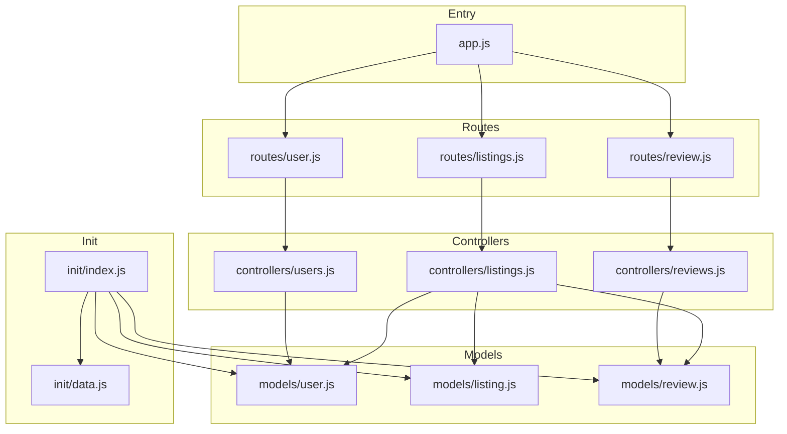
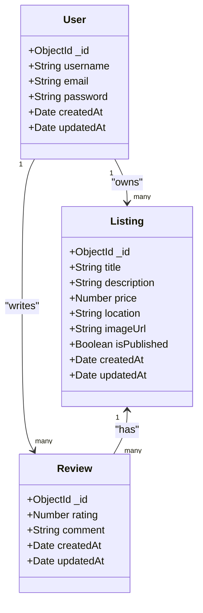
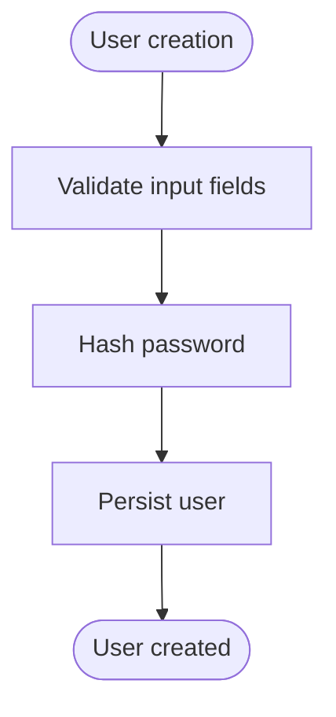
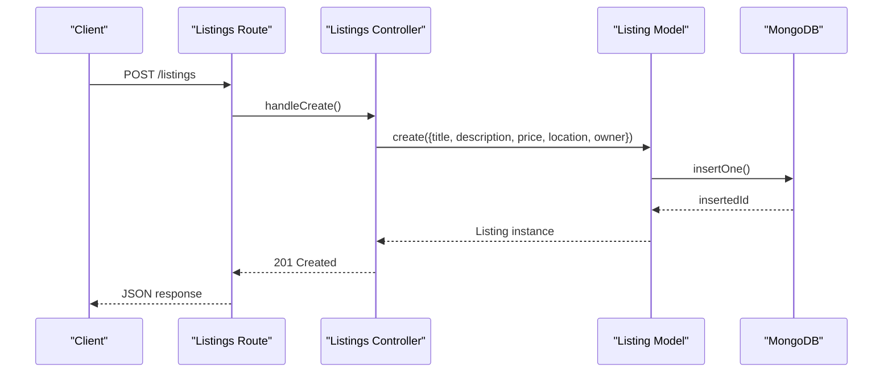
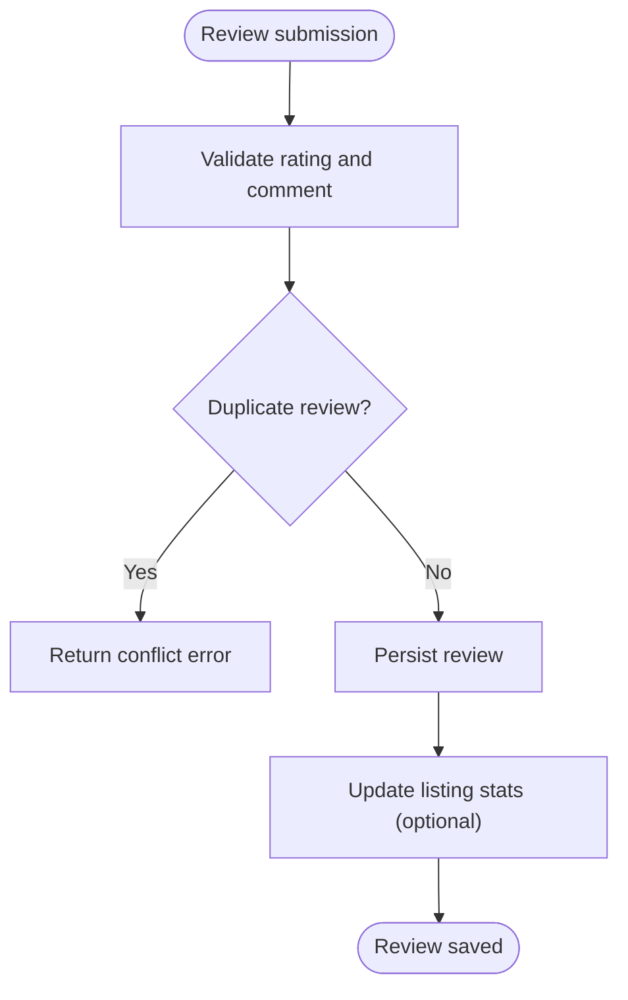
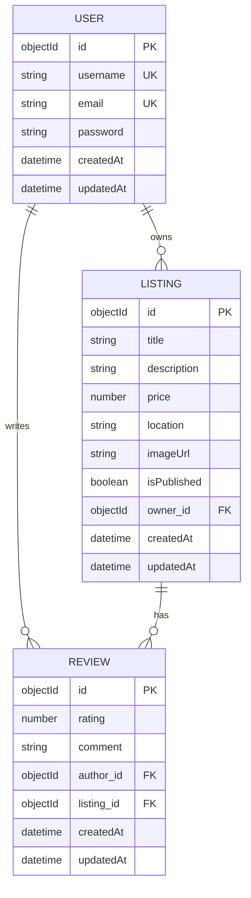
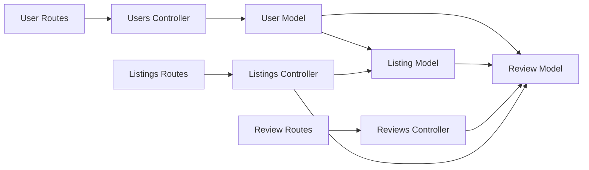
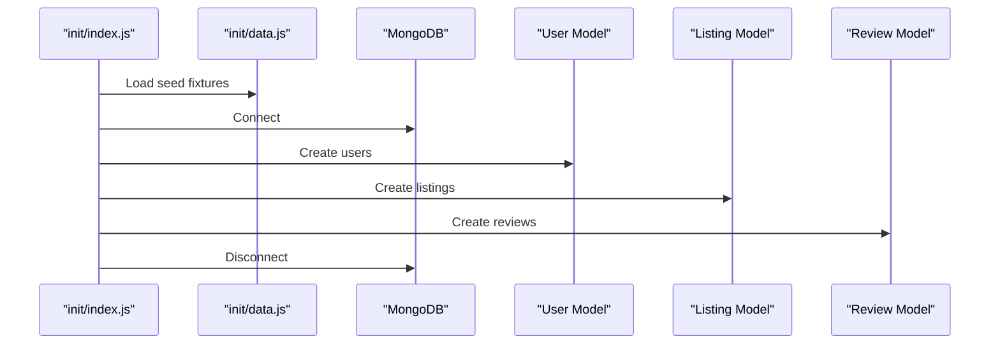
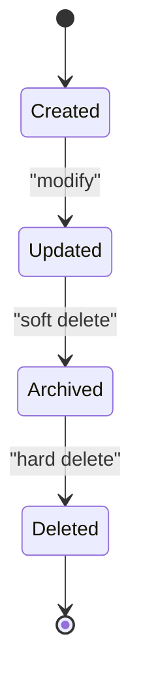

# Database Schema Design

<cite>
**Referenced Files in This Document**
- [models/user.js](file://models/user.js)
- [models/listing.js](file://models/listing.js)
- [models/review.js](file://models/review.js)
- [init/data.js](file://init/data.js)
- [init/index.js](file://init/index.js)
- [controllers/users.js](file://controllers/users.js)
- [controllers/listings.js](file://controllers/listings.js)
- [controllers/reviews.js](file://controllers/reviews.js)
- [routes/user.js](file://routes/user.js)
- [routes/listings.js](file://routes/listings.js)
- [routes/review.js](file://routes/review.js)
- [app.js](file://app.js)
</cite>

## Table of Contents
1. [Introduction](#introduction)
2. [Project Structure](#project-structure)
3. [Core Components](#core-components)
4. [Architecture Overview](#architecture-overview)
5. [Detailed Component Analysis](#detailed-component-analysis)
6. [Dependency Analysis](#dependency-analysis)
7. [Performance Considerations](#performance-considerations)
8. [Troubleshooting Guide](#troubleshooting-guide)
9. [Conclusion](#conclusion)
10. [Appendices](#appendices)

## Introduction
This document describes the database schema design for the Major Project, focusing on the core entities User, Listing, and Review. It explains entity relationships, field definitions, data types, primary and foreign keys, indexes, constraints, validation rules, and business logic embedded in Mongoose schemas. It also covers data access patterns, seeding procedures, initialization scripts, data lifecycle, relationship management, and query optimization strategies.

## Project Structure
The project follows a feature-based organization with separate directories for models (data schemas), controllers (business logic), routes (HTTP endpoints), and init (seed/initialization). The application entry point wires up routes and middleware.

**Diagram sources**
- [app.js:1-200](file://app.js#L1-L200)
- [routes/user.js:1-200](file://routes/user.js#L1-L200)
- [routes/listings.js:1-200](file://routes/listings.js#L1-L200)
- [routes/review.js:1-200](file://routes/review.js#L1-L200)
- [controllers/users.js:1-200](file://controllers/users.js#L1-L200)
- [controllers/listings.js:1-200](file://controllers/listings.js#L1-L200)
- [controllers/reviews.js:1-200](file://controllers/reviews.js#L1-L200)
- [models/user.js:1-200](file://models/user.js#L1-L200)
- [models/listing.js:1-200](file://models/listing.js#L1-L200)
- [models/review.js:1-200](file://models/review.js#L1-L200)
- [init/data.js:1-200](file://init/data.js#L1-L200)
- [init/index.js:1-200](file://init/index.js#L1-L200)

**Section sources**
- [app.js:1-200](file://app.js#L1-L200)
- [routes/user.js:1-200](file://routes/user.js#L1-L200)
- [routes/listings.js:1-200](file://routes/listings.js#L1-L200)
- [routes/review.js:1-200](file://routes/review.js#L1-L200)
- [controllers/users.js:1-200](file://controllers/users.js#L1-L200)
- [controllers/listings.js:1-200](file://controllers/listings.js#L1-L200)
- [controllers/reviews.js:1-200](file://controllers/reviews.js#L1-L200)
- [models/user.js:1-200](file://models/user.js#L1-L200)
- [models/listing.js:1-200](file://models/listing.js#L1-L200)
- [models/review.js:1-200](file://models/review.js#L1-L200)
- [init/data.js:1-200](file://init/data.js#L1-L200)
- [init/index.js:1-200](file://init/index.js#L1-L200)

## Core Components
This section summarizes the three core Mongoose models and their responsibilities:
- User: Represents authenticated users with credentials and profile metadata.
- Listing: Represents items or places that can be reviewed.
- Review: Represents user-generated reviews attached to listings.

Key aspects covered include:
- Field definitions and data types
- Primary and foreign key references
- Indexes and constraints
- Validation rules and business logic
- Relationship management between models

**Section sources**
- [models/user.js:1-200](file://models/user.js#L1-L200)
- [models/listing.js:1-200](file://models/listing.js#L1-L200)
- [models/review.js:1-200](file://models/review.js#L1-L200)

## Architecture Overview
The data layer is implemented using Mongoose ODM over MongoDB. Models define schemas with validation and relationships. Controllers orchestrate CRUD operations and enforce business rules. Routes expose HTTP endpoints. Initialization scripts seed sample data for development and testing.

**Diagram sources**
- [models/user.js:1-200](file://models/user.js#L1-L200)
- [models/listing.js:1-200](file://models/listing.js#L1-L200)
- [models/review.js:1-200](file://models/review.js#L1-L200)

## Detailed Component Analysis

### User Model
- Purpose: Stores authentication and profile information for users.
- Key fields:
  - Identifier: ObjectId primary key (_id)
  - Username: String, unique index
  - Email: String, unique index
  - Password: String, hashed at write time
  - Timestamps: createdAt, updatedAt
- Relationships:
  - One-to-many with Listing (owner reference)
  - One-to-many with Review (author reference)
- Validation and business logic:
  - Required fields enforced by schema validators
  - Unique constraints on username and email
  - Password hashing via pre-save hook
- Indexes:
  - Unique indexes on username and email
- Data access patterns:
  - Create user during signup
  - Authenticate by username/email and verify password
  - Fetch user profile and related listings/reviews via population

**Diagram sources**
- [models/user.js:1-200](file://models/user.js#L1-L200)

**Section sources**
- [models/user.js:1-200](file://models/user.js#L1-L200)
- [controllers/users.js:1-200](file://controllers/users.js#L1-L200)
- [routes/user.js:1-200](file://routes/user.js#L1-L200)

### Listing Model
- Purpose: Represents items or places available for review.
- Key fields:
  - Identifier: ObjectId primary key (_id)
  - Title: String, required
  - Description: String, required
  - Price: Number, required
  - Location: String, required
  - Image URL: String, optional
  - Published flag: Boolean, default true
  - Owner reference: ObjectId referencing User
  - Timestamps: createdAt, updatedAt
- Relationships:
  - Many-to-one with User (owner)
  - One-to-many with Review
- Validation and business logic:
  - Required fields enforced by schema validators
  - Numeric range checks for price
  - Optional image URL validation
- Indexes:
  - Index on owner reference for efficient queries
  - Compound index on published status and location for filtering
- Data access patterns:
  - Create listing with owner reference
  - Query listings by owner, location, and publication status
  - Populate owner details when retrieving listings

**Diagram sources**
- [routes/listings.js:1-200](file://routes/listings.js#L1-L200)
- [controllers/listings.js:1-200](file://controllers/listings.js#L1-L200)
- [models/listing.js:1-200](file://models/listing.js#L1-L200)

**Section sources**
- [models/listing.js:1-200](file://models/listing.js#L1-L200)
- [controllers/listings.js:1-200](file://controllers/listings.js#L1-L200)
- [routes/listings.js:1-200](file://routes/listings.js#L1-L200)

### Review Model
- Purpose: Captures user feedback for listings.
- Key fields:
  - Identifier: ObjectId primary key (_id)
  - Rating: Number, required, within a defined range
  - Comment: String, optional
  - Author reference: ObjectId referencing User
  - Listing reference: ObjectId referencing Listing
  - Timestamps: createdAt, updatedAt
- Relationships:
  - Many-to-one with User (author)
  - Many-to-one with Listing (target)
- Validation and business logic:
  - Required rating with min/max bounds
  - Optional comment text length limits
  - Prevent duplicate reviews per user per listing
- Indexes:
  - Compound index on author and listing for uniqueness enforcement
  - Index on listing for aggregation queries (average rating)
- Data access patterns:
  - Create review with author and listing references
  - Aggregate ratings per listing
  - Fetch reviews for a listing with author details via populate

**Diagram sources**
- [models/review.js:1-200](file://models/review.js#L1-L200)
- [controllers/reviews.js:1-200](file://controllers/reviews.js#L1-L200)

**Section sources**
- [models/review.js:1-200](file://models/review.js#L1-L200)
- [controllers/reviews.js:1-200](file://controllers/reviews.js#L1-L200)
- [routes/review.js:1-200](file://routes/review.js#L1-L200)

### Entity Relationship Diagram

**Diagram sources**
- [models/user.js:1-200](file://models/user.js#L1-L200)
- [models/listing.js:1-200](file://models/listing.js#L1-L200)
- [models/review.js:1-200](file://models/review.js#L1-L200)

## Dependency Analysis
- Model dependencies:
  - Listing depends on User via owner reference
  - Review depends on User via author reference
  - Review depends on Listing via listing reference
- Controller dependencies:
  - Listings controller uses Listing and Review models
  - Reviews controller uses Review model and validates against Listing
  - Users controller uses User model for authentication and profile operations
- Route dependencies:
  - Each route file maps HTTP endpoints to controller methods
- Initialization dependencies:
  - Seed script creates sample users, listings, and reviews

**Diagram sources**
- [models/user.js:1-200](file://models/user.js#L1-L200)
- [models/listing.js:1-200](file://models/listing.js#L1-L200)
- [models/review.js:1-200](file://models/review.js#L1-L200)
- [controllers/users.js:1-200](file://controllers/users.js#L1-L200)
- [controllers/listings.js:1-200](file://controllers/listings.js#L1-L200)
- [controllers/reviews.js:1-200](file://controllers/reviews.js#L1-L200)
- [routes/user.js:1-200](file://routes/user.js#L1-L200)
- [routes/listings.js:1-200](file://routes/listings.js#L1-L200)
- [routes/review.js:1-200](file://routes/review.js#L1-L200)

**Section sources**
- [models/user.js:1-200](file://models/user.js#L1-L200)
- [models/listing.js:1-200](file://models/listing.js#L1-L200)
- [models/review.js:1-200](file://models/review.js#L1-L200)
- [controllers/users.js:1-200](file://controllers/users.js#L1-L200)
- [controllers/listings.js:1-200](file://controllers/listings.js#L1-L200)
- [controllers/reviews.js:1-200](file://controllers/reviews.js#L1-L200)
- [routes/user.js:1-200](file://routes/user.js#L1-L200)
- [routes/listings.js:1-200](file://routes/listings.js#L1-L200)
- [routes/review.js:1-200](file://routes/review.js#L1-L200)

## Performance Considerations
- Indexing strategy:
  - Unique indexes on username and email to prevent duplicates and speed up lookups
  - Index on Listing.owner_id for owner-specific queries
  - Compound index on Listing.isPublished and Listing.location for filtered browsing
  - Compound index on Review.author_id and Review.listing_id to enforce uniqueness efficiently
  - Index on Review.listing_id for aggregations and listing detail pages
- Population vs. embedding:
  - Use references for User and Listing in Review to maintain normalization and avoid duplication
  - Populate selectively to reduce payload size
- Aggregation pipelines:
  - Compute average rating per listing using $group and $avg
  - Cache computed metrics if needed for high-read scenarios
- Query optimization:
  - Project only required fields
  - Use lean queries where possible to bypass Mongoose overhead
  - Limit result sets for list views

[No sources needed since this section provides general guidance]

## Troubleshooting Guide
Common issues and resolutions:
- Duplicate key errors:
  - Occur when inserting users with existing username or email
  - Resolution: Ensure uniqueness checks before insert; handle conflicts gracefully
- Validation errors:
  - Missing required fields or out-of-range values
  - Resolution: Provide client-side hints and server-side validation messages
- Referential integrity:
  - Deleting a user or listing referenced by reviews
  - Resolution: Implement cascade delete or update references appropriately
- Authentication failures:
  - Incorrect password or missing user
  - Resolution: Verify credentials and return consistent error responses

**Section sources**
- [models/user.js:1-200](file://models/user.js#L1-L200)
- [models/listing.js:1-200](file://models/listing.js#L1-L200)
- [models/review.js:1-200](file://models/review.js#L1-L200)
- [controllers/users.js:1-200](file://controllers/users.js#L1-L200)
- [controllers/listings.js:1-200](file://controllers/listings.js#L1-L200)
- [controllers/reviews.js:1-200](file://controllers/reviews.js#L1-L200)

## Conclusion
The database schema centers around three core entities—User, Listing, and Review—with clear relationships and robust validation. Proper indexing and selective population ensure efficient querying and scalable performance. Seeding scripts facilitate rapid development and testing. Adhering to the documented data access patterns and constraints will help maintain data integrity and system reliability.

[No sources needed since this section summarizes without analyzing specific files]

## Appendices

### Seeding Procedures and Initialization
- Seed data structure:
  - Sample users with credentials
  - Sample listings with owner references
  - Sample reviews with author and listing references
- Initialization flow:
  - Connect to database
  - Clear existing collections (optional)
  - Insert seed data
  - Close connection

**Diagram sources**
- [init/index.js:1-200](file://init/index.js#L1-L200)
- [init/data.js:1-200](file://init/data.js#L1-L200)
- [models/user.js:1-200](file://models/user.js#L1-L200)
- [models/listing.js:1-200](file://models/listing.js#L1-L200)
- [models/review.js:1-200](file://models/review.js#L1-L200)

**Section sources**
- [init/index.js:1-200](file://init/index.js#L1-L200)
- [init/data.js:1-200](file://init/data.js#L1-L200)

### Data Lifecycle
- Creation:
  - User signs up; Listing created by owner; Review submitted by author
- Updates:
  - Profile updates for User; Listing edits by owner; Review edits by author
- Deletion:
  - Cascading deletes or referential updates to maintain consistency
- Archival:
  - Soft delete flags for auditability if required

[No sources needed since this diagram shows conceptual workflow, not actual code structure]