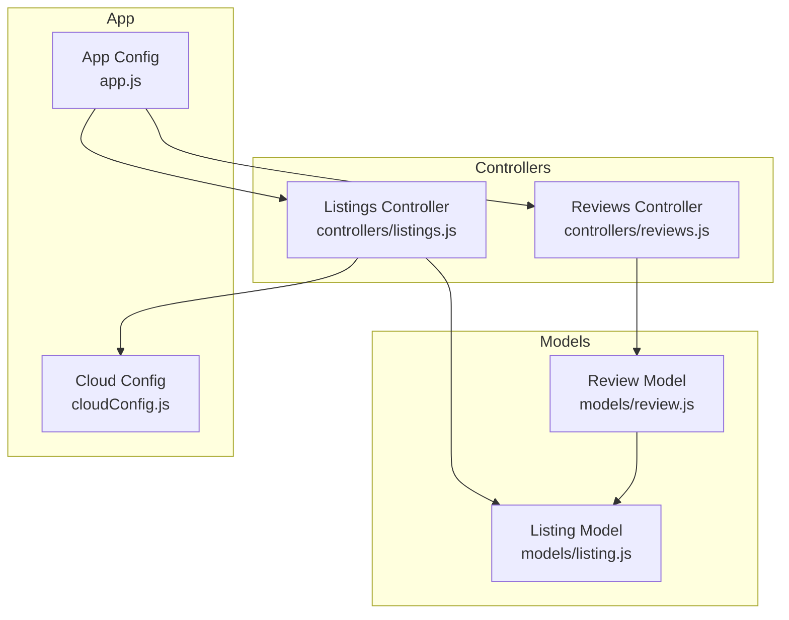
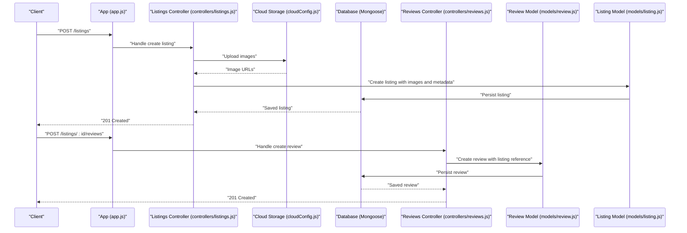
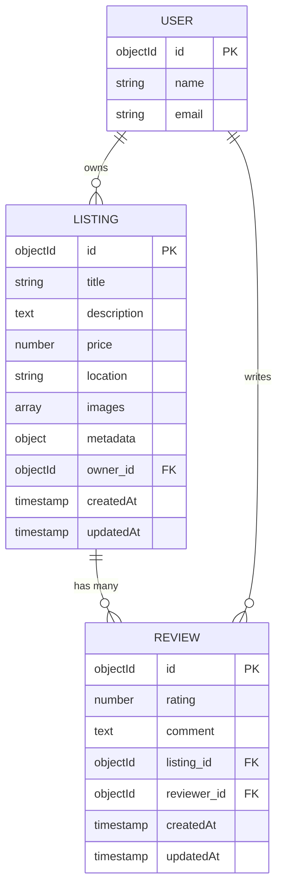
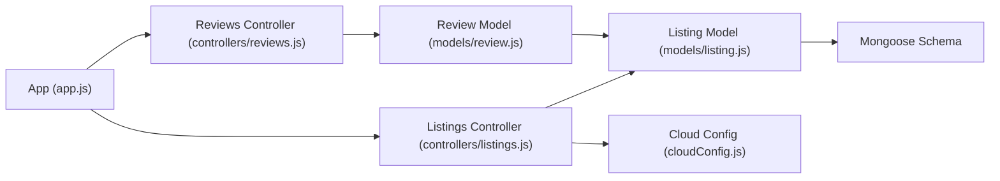

# Listing Model

<cite>
**Referenced Files in This Document**
- [listing.js](file://models/listing.js)
- [review.js](file://models/review.js)
- [listings.js](file://controllers/listings.js)
- [reviews.js](file://controllers/reviews.js)
- [cloudConfig.js](file://cloudConfig.js)
- [app.js](file://app.js)
</cite>

## Table of Contents
1. [Introduction](#introduction)
2. [Project Structure](#project-structure)
3. [Core Components](#core-components)
4. [Architecture Overview](#architecture-overview)
5. [Detailed Component Analysis](#detailed-component-analysis)
6. [Dependency Analysis](#dependency-analysis)
7. [Performance Considerations](#performance-considerations)
8. [Troubleshooting Guide](#troubleshooting-guide)
9. [Conclusion](#conclusion)

## Introduction
This document provides comprehensive data model documentation for the Listing model, including field definitions, validation rules, business logic, image upload handling, cloud storage integration, sample document structures, common query patterns, and relationships with the Review model and owner references. It is intended for both developers and non-technical readers to understand how listings are modeled, validated, stored, and related to other entities.

## Project Structure
The Listing model resides under models/listing.js and is used by controllers and routes to manage listing resources. Image uploads are handled via a cloud configuration module, and reviews reference listings through a relationship defined in the Review model.

**Diagram sources**
- [listing.js](file://models/listing.js)
- [review.js](file://models/review.js)
- [listings.js](file://controllers/listings.js)
- [reviews.js](file://controllers/reviews.js)
- [cloudConfig.js](file://cloudConfig.js)
- [app.js](file://app.js)

**Section sources**
- [listing.js](file://models/listing.js)
- [review.js](file://models/review.js)
- [listings.js](file://controllers/listings.js)
- [reviews.js](file://controllers/reviews.js)
- [cloudConfig.js](file://cloudConfig.js)
- [app.js](file://app.js)

## Core Components
- Listing model: Defines fields such as title, description, price, location, images, and metadata; includes validation rules and any embedded business logic (e.g., default values, transforms).
- Review model: Contains a reference to a Listing and possibly an owner reference, enabling relational queries between reviews and listings.
- Listings controller: Orchestrates CRUD operations for listings, integrates with cloud storage for image uploads, and applies validation before persistence.
- Reviews controller: Manages review creation and associations with listings.
- Cloud configuration: Provides credentials and settings for cloud storage used to store listing images.

Key responsibilities:
- Data modeling and validation for listings.
- Image upload workflow and cloud storage integration.
- Relationship management between listings and reviews.
- Owner references for ownership and access control.

**Section sources**
- [listing.js](file://models/listing.js)
- [review.js](file://models/review.js)
- [listings.js](file://controllers/listings.js)
- [reviews.js](file://controllers/reviews.js)
- [cloudConfig.js](file://cloudConfig.js)

## Architecture Overview
The Listing model is central to the application’s marketplace functionality. The typical flow involves creating or updating a listing with optional images, storing images in cloud storage, and persisting listing metadata in the database. Reviews can be created for listings, referencing the listing and the reviewer.

**Diagram sources**
- [app.js](file://app.js)
- [listings.js](file://controllers/listings.js)
- [cloudConfig.js](file://cloudConfig.js)
- [review.js](file://models/review.js)
- [listing.js](file://models/listing.js)

## Detailed Component Analysis

### Listing Model Fields and Validation
- Title: String field representing the listing title. Typically required and may include length constraints.
- Description: Text field describing the listing details. May allow longer content and optional formatting.
- Price: Numeric field representing the listing price. Often requires positive values and may include currency considerations.
- Location: String or structured object containing geographic information (e.g., city, region). May include validation for presence.
- Images: Array of image references or URLs. Supports multiple images per listing.
- Metadata: Additional properties such as tags, category, availability status, timestamps, and other attributes.

Validation rules and business logic:
- Required fields: Title, description, price, and location are commonly enforced.
- Type checks: Ensures correct data types (string, number, array).
- Range checks: Price must be greater than zero; image arrays may have size limits.
- Defaults: Timestamps like createdAt and updatedAt may be auto-managed.
- Transforms: Lowercasing or trimming strings, sanitizing inputs.

Sample listing document structure:
- _id: ObjectId
- title: string
- description: string
- price: number
- location: string or object
- images: array of strings (URLs)
- metadata: object (tags, category, etc.)
- createdAt: timestamp
- updatedAt: timestamp

Common query patterns:
- Find all listings: Basic retrieval without filters.
- Filter by price range: Greater than or less than comparisons.
- Search by title or description: Text search using regex or full-text indexes.
- Filter by location: Exact match or substring matching.
- Sort by price or date: Ascending or descending order.
- Populate related reviews: Join with Review model to fetch associated reviews.

Relationships:
- Owner reference: A foreign key linking the listing to a user who owns it.
- Review references: Reviews reference the listing via a foreign key, enabling one-to-many relationships.

**Section sources**
- [listing.js](file://models/listing.js)
- [review.js](file://models/review.js)

### Image Upload Handling and Cloud Storage Integration
- Upload process: Images are uploaded via the listings controller to cloud storage configured in cloudConfig.js.
- URL storage: After successful upload, image URLs are stored in the listing’s images array.
- Error handling: Failed uploads return errors to the client; partial failures may require rollback or cleanup.
- Security: File type validation, size limits, and access controls ensure safe uploads.

Integration points:
- Cloud configuration: Credentials and bucket settings are centralized in cloudConfig.js.
- Controller orchestration: The listings controller coordinates upload and persistence.

**Section sources**
- [listings.js](file://controllers/listings.js)
- [cloudConfig.js](file://cloudConfig.js)

### Relationships with Review Model and Owner References
- One-to-many relationship: A listing can have many reviews; each review references a single listing.
- Owner reference: Each listing references its owner (user), supporting ownership and permissions.
- Query population: Fetching a listing with populated reviews allows efficient retrieval of related data.

**Diagram sources**
- [listing.js](file://models/listing.js)
- [review.js](file://models/review.js)

**Section sources**
- [listing.js](file://models/listing.js)
- [review.js](file://models/review.js)

## Dependency Analysis
The Listing model depends on Mongoose for schema definition and validation. The listings controller depends on cloud storage configuration for image uploads. The review model depends on the listing model via a reference field.

**Diagram sources**
- [listing.js](file://models/listing.js)
- [listings.js](file://controllers/listings.js)
- [cloudConfig.js](file://cloudConfig.js)
- [review.js](file://models/review.js)
- [app.js](file://app.js)

**Section sources**
- [listing.js](file://models/listing.js)
- [listings.js](file://controllers/listings.js)
- [cloudConfig.js](file://cloudConfig.js)
- [review.js](file://models/review.js)
- [app.js](file://app.js)

## Performance Considerations
- Indexing: Add indexes on frequently queried fields such as price, location, and title to improve search performance.
- Population: Use selective population for reviews to avoid loading large datasets when not needed.
- Pagination: Implement pagination for listing lists and review collections to reduce payload sizes.
- Image optimization: Store optimized images and use CDN caching to speed up delivery.
- Validation efficiency: Keep validation rules concise and avoid heavy computations during save.

[No sources needed since this section provides general guidance]

## Troubleshooting Guide
- Upload failures: Check cloud storage credentials and network connectivity; verify file size and type restrictions.
- Validation errors: Ensure required fields are present and conform to expected types and ranges.
- Relationship issues: Confirm that listing IDs referenced by reviews exist and are valid.
- Query performance: Monitor slow queries and add appropriate indexes; consider aggregations for complex filters.

**Section sources**
- [listings.js](file://controllers/listings.js)
- [cloudConfig.js](file://cloudConfig.js)
- [review.js](file://models/review.js)

## Conclusion
The Listing model encapsulates core marketplace data with robust validation and clear relationships to reviews and owners. Image uploads integrate seamlessly with cloud storage, and common query patterns support efficient retrieval and filtering. Proper indexing, pagination, and error handling will enhance performance and reliability.

[No sources needed since this section summarizes without analyzing specific files]