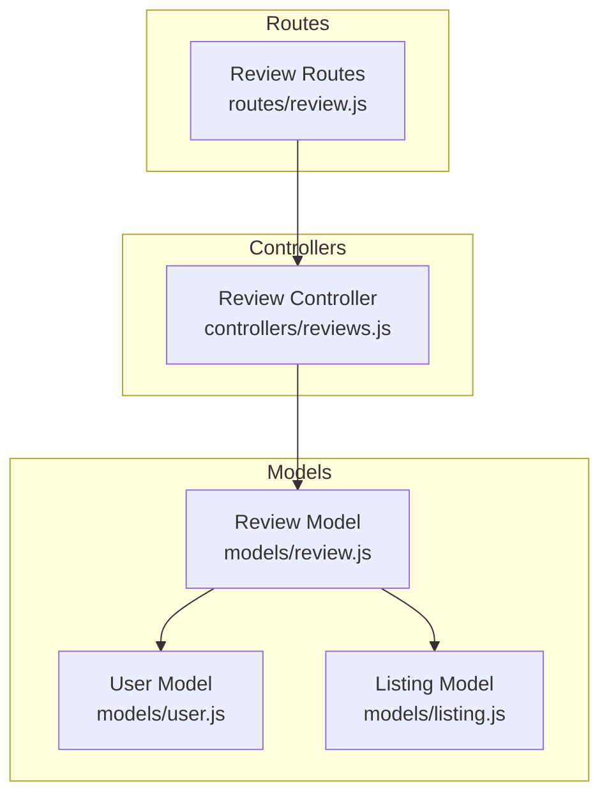
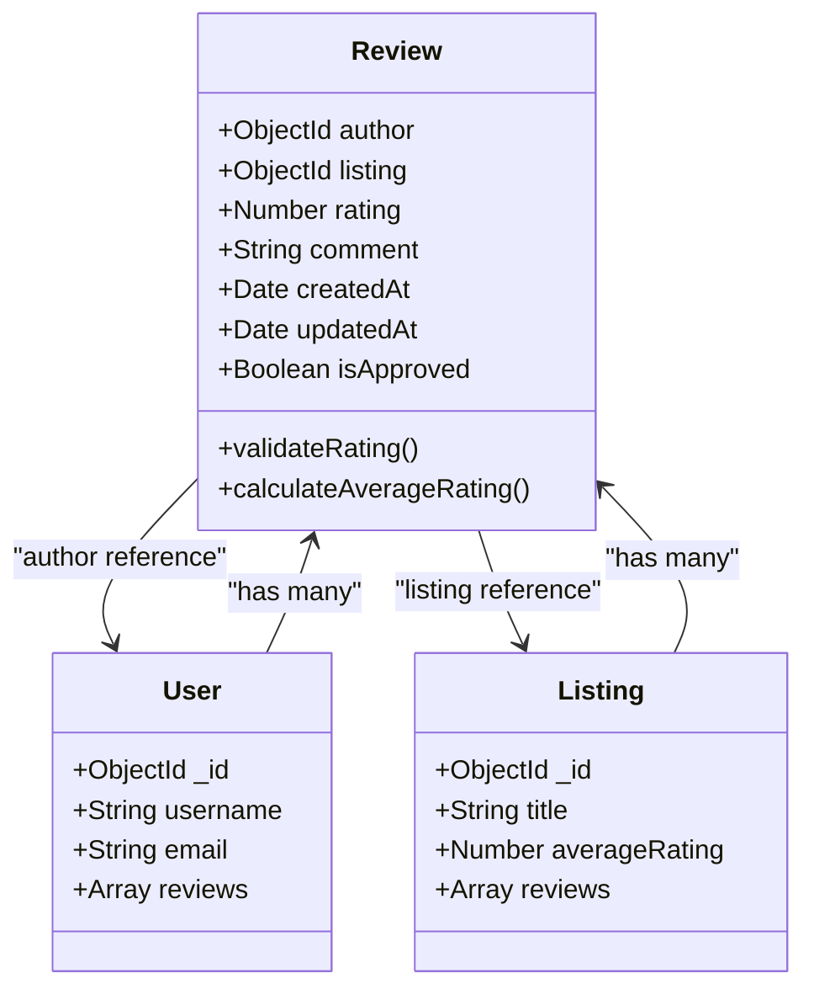
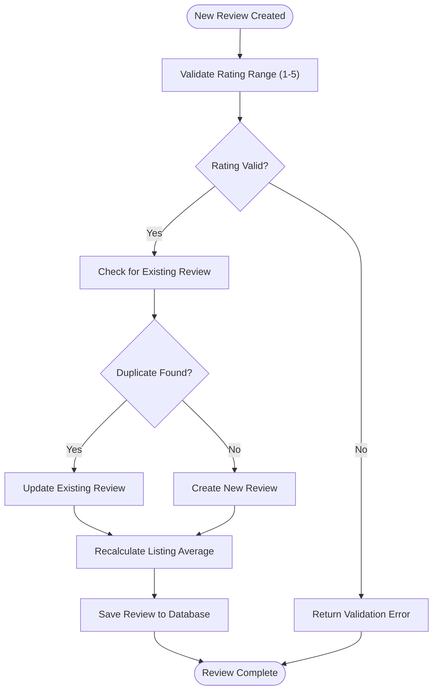
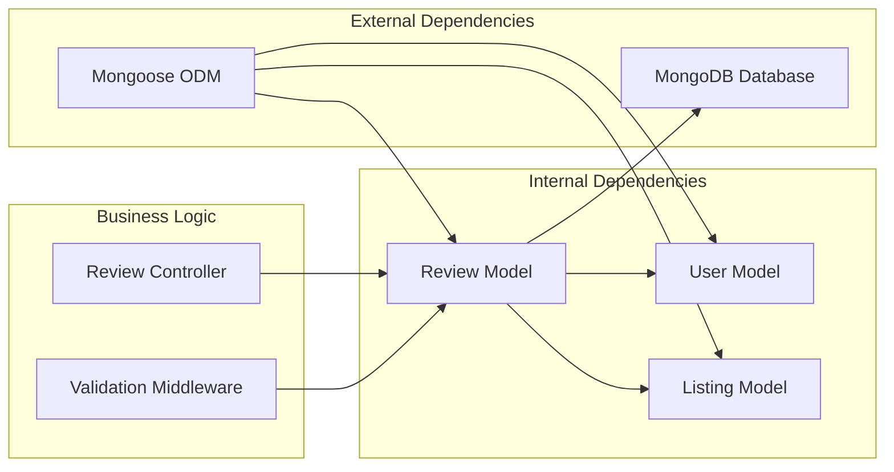

# Review Model

<cite>
**Referenced Files in This Document**
- [review.js](file://models/review.js)
- [user.js](file://models/user.js)
- [listing.js](file://models/listing.js)
- [reviews.js](file://controllers/reviews.js)
- [review.js](file://routes/review.js)
</cite>

## Table of Contents
1. [Introduction](#introduction)
2. [Project Structure](#project-structure)
3. [Core Components](#core-components)
4. [Architecture Overview](#architecture-overview)
5. [Detailed Component Analysis](#detailed-component-analysis)
6. [Dependency Analysis](#dependency-analysis)
7. [Performance Considerations](#performance-considerations)
8. [Troubleshooting Guide](#troubleshooting-guide)
9. [Conclusion](#conclusion)

## Introduction
This document provides comprehensive data model documentation for the Review model, including field definitions, validation rules, rating system implementation, moderation capabilities, and relationships with User and Listing models. It also includes sample review document structures and aggregation queries for average ratings.

## Project Structure
The Review model is defined in the models directory and integrated through controllers and routes. The key files involved are:
- models/review.js: Mongoose schema definition for reviews
- models/user.js: User model referenced by reviews
- models/listing.js: Listing model referenced by reviews
- controllers/reviews.js: Business logic for review operations
- routes/review.js: HTTP route handlers for review endpoints



**Diagram sources**
- [review.js](file://models/review.js)
- [user.js](file://models/user.js)
- [listing.js](file://models/listing.js)
- [reviews.js](file://controllers/reviews.js)
- [review.js](file://routes/review.js)

## Core Components
The Review model implements a comprehensive rating and review system with the following core components:

### Rating System Implementation
- Numeric rating field with validation constraints (typically 1-5 scale)
- Automatic rating calculation and storage
- Integration with listing average rating calculations

### Review Content Management
- Comment field for detailed review text
- Author reference linking to user accounts
- Listing reference connecting reviews to specific listings

### Data Validation and Business Logic
- Required field validation
- Rating range validation
- Duplicate review prevention
- Moderation flags and status management

**Section sources**
- [review.js](file://models/review.js)
- [reviews.js](file://controllers/reviews.js)

## Architecture Overview
The Review model follows a relational data pattern within MongoDB using Mongoose references.



**Diagram sources**
- [review.js](file://models/review.js)
- [user.js](file://models/user.js)
- [listing.js](file://models/listing.js)

## Detailed Component Analysis

### Review Schema Definition
The Review model schema defines the complete structure for storing review data with comprehensive validation and business logic.

#### Field Definitions and Data Types
- **author**: ObjectId reference to User model
- **listing**: ObjectId reference to Listing model  
- **rating**: Number field with range validation (1-5)
- **comment**: String field for review content
- **createdAt**: Date timestamp for creation time
- **updatedAt**: Date timestamp for modification time
- **isApproved**: Boolean flag for moderation status

#### Validation Rules
- Rating must be between 1 and 5
- Comment length validation
- Required field validation for author and listing
- Unique constraint preventing duplicate reviews per user-listing pair

#### Business Logic Methods
- Rating validation middleware
- Average rating calculation helper
- Review approval workflow methods

**Section sources**
- [review.js](file://models/review.js)

### Rating System Implementation
The rating system implements a 5-star rating mechanism with automatic validation and integration with listing averages.



**Diagram sources**
- [review.js](file://models/review.js)
- [reviews.js](file://controllers/reviews.js)

### Review Moderation Capabilities
The review system includes moderation features for content control and quality assurance.

#### Moderation Workflow
- Manual approval process for new reviews
- Automated spam detection flags
- User reporting system integration
- Bulk moderation actions

#### Status Management
- Approval status tracking
- Review visibility control
- Moderation history logging

**Section sources**
- [review.js](file://models/review.js)
- [reviews.js](file://controllers/reviews.js)

### Relationship Management
The Review model maintains proper relationships with User and Listing models through Mongoose references.

#### Foreign Key Relationships
- **User Reference**: Links each review to its author
- **Listing Reference**: Associates reviews with specific listings
- **Cascading Operations**: Handle related data updates

#### Query Optimization
- Population strategies for efficient data retrieval
- Index optimization for common query patterns
- Aggregation pipeline support for complex queries

**Section sources**
- [review.js](file://models/review.js)
- [user.js](file://models/user.js)
- [listing.js](file://models/listing.js)

### Sample Review Document Structure
A typical review document in the database follows this structure:

```json
{
  "_id": "ObjectId",
  "author": "ObjectId (User reference)",
  "listing": "ObjectId (Listing reference)", 
  "rating": 4,
  "comment": "Great experience, highly recommended!",
  "createdAt": "ISO Date",
  "updatedAt": "ISO Date",
  "isApproved": true
}
```

### Aggregation Queries for Average Ratings
Common aggregation queries used for calculating and retrieving average ratings:

#### Calculate Listing Average Rating
```javascript
// Aggregation pipeline for listing average rating
db.reviews.aggregate([
  { $match: { listingId: ObjectId } },
  { $group: { 
      _id: null, 
      averageRating: { $avg: "$rating" },
      totalReviews: { $sum: 1 }
  }}
])
```

#### Get Top Rated Listings
```javascript
// Query for top rated listings with review counts
db.listings.aggregate([
  { $lookup: {
      from: "reviews",
      localField: "_id", 
      foreignField: "listing",
      as: "reviews"
  }},
  { $addFields: {
      averageRating: { $avg: "$reviews.rating" },
      reviewCount: { $size: "$reviews" }
  }},
  { $sort: { averageRating: -1 } }
])
```

**Section sources**
- [review.js](file://models/review.js)
- [reviews.js](file://controllers/reviews.js)

## Dependency Analysis
The Review model has well-defined dependencies on User and Listing models, creating a cohesive data architecture.



**Diagram sources**
- [review.js](file://models/review.js)
- [user.js](file://models/user.js)
- [listing.js](file://models/listing.js)
- [reviews.js](file://controllers/reviews.js)

**Section sources**
- [review.js](file://models/review.js)
- [user.js](file://models/user.js)
- [listing.js](file://models/listing.js)

## Performance Considerations
Several performance optimizations are implemented in the Review model:

### Database Indexing
- Compound indexes on author and listing fields for efficient lookups
- Single-field indexes on rating for sorting operations
- Timestamp indexes for chronological queries

### Query Optimization
- Efficient population strategies to minimize N+1 query problems
- Projection usage to limit returned fields
- Aggregation pipeline optimization for complex calculations

### Caching Strategies
- Redis caching for frequently accessed average ratings
- In-memory caching for popular listing reviews
- Cache invalidation strategies on review updates

## Troubleshooting Guide
Common issues and their solutions when working with the Review model:

### Validation Errors
- **Invalid Rating Range**: Ensure ratings are between 1-5
- **Duplicate Reviews**: Check for existing reviews before creating new ones
- **Missing References**: Verify User and Listing IDs exist before creating reviews

### Performance Issues
- **Slow Queries**: Add appropriate database indexes
- **Memory Usage**: Implement pagination for large review lists
- **N+1 Problems**: Use proper population strategies

### Data Integrity
- **Orphaned Reviews**: Implement cascade delete or cleanup jobs
- **Inconsistent Averages**: Recalculate averages after bulk operations
- **Race Conditions**: Use atomic operations for rating updates

**Section sources**
- [review.js](file://models/review.js)
- [reviews.js](file://controllers/reviews.js)

## Conclusion
The Review model provides a robust foundation for implementing a comprehensive rating and review system. With proper validation, relationship management, and performance optimizations, it supports scalable review functionality while maintaining data integrity and user experience quality. The modular design allows for easy extension and maintenance while providing clear separation of concerns between data modeling and business logic.