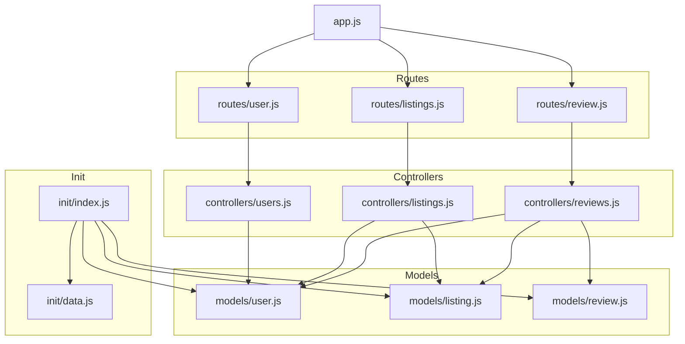
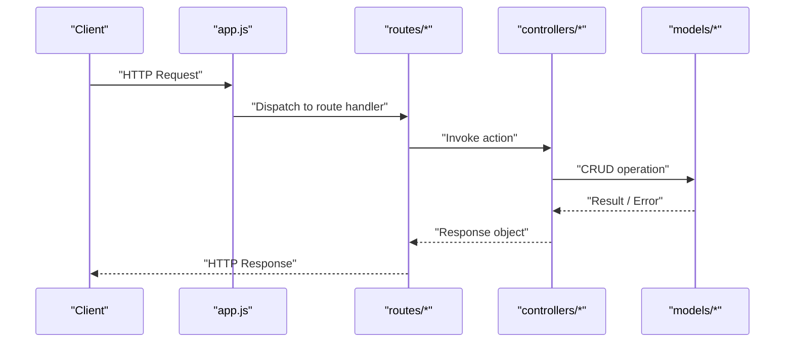
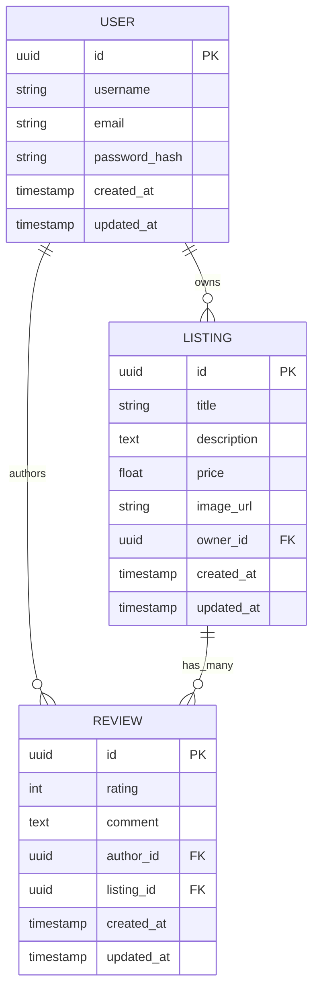
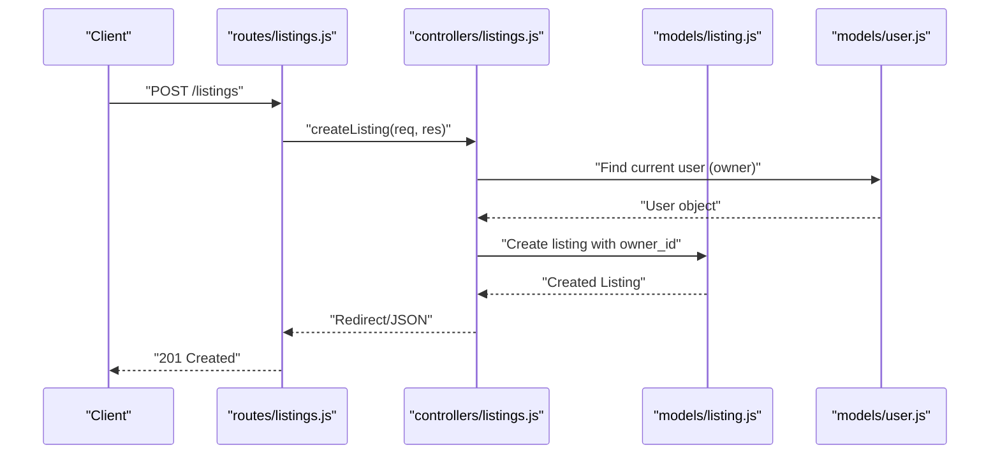
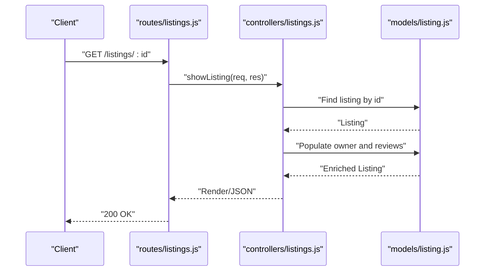
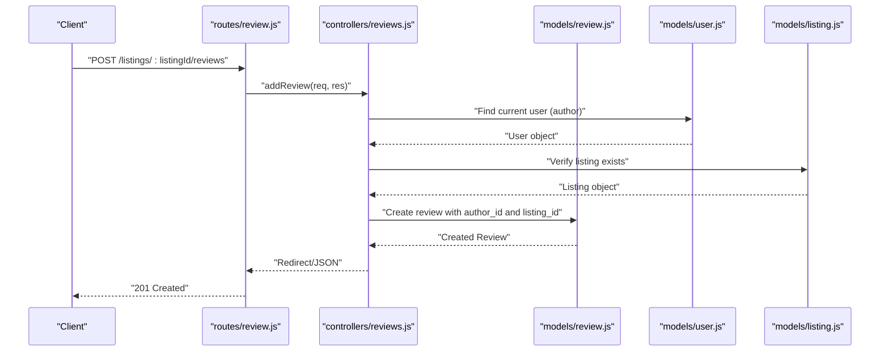
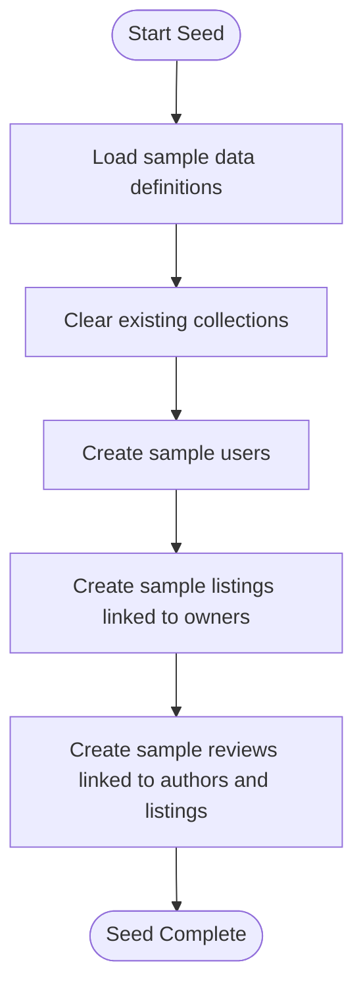
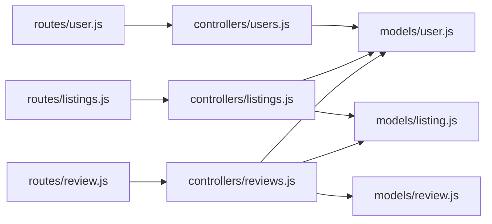

# Schema Relationships & Data Flow

<cite>
**Referenced Files in This Document**
- [models/user.js](file://models/user.js)
- [models/listing.js](file://models/listing.js)
- [models/review.js](file://models/review.js)
- [controllers/users.js](file://controllers/users.js)
- [controllers/listings.js](file://controllers/listings.js)
- [controllers/reviews.js](file://controllers/reviews.js)
- [routes/user.js](file://routes/user.js)
- [routes/listings.js](file://routes/listings.js)
- [routes/review.js](file://routes/review.js)
- [init/index.js](file://init/index.js)
- [init/data.js](file://init/data.js)
- [app.js](file://app.js)
</cite>

## Table of Contents
1. [Introduction](#introduction)
2. [Project Structure](#project-structure)
3. [Core Components](#core-components)
4. [Architecture Overview](#architecture-overview)
5. [Detailed Component Analysis](#detailed-component-analysis)
6. [Dependency Analysis](#dependency-analysis)
7. [Performance Considerations](#performance-considerations)
8. [Troubleshooting Guide](#troubleshooting-guide)
9. [Conclusion](#conclusion)
10. [Appendices](#appendices)

## Introduction
This document explains the database schema relationships and data flow patterns for the User, Listing, and Review models. It covers foreign key constraints, referential integrity, population strategies, query optimization techniques, seeding procedures, initialization scripts, sample data generation, lifecycle management, cascading operations, and performance considerations for complex queries. The goal is to provide a clear understanding of how entities relate and how data flows through CRUD operations across controllers and routes.

## Project Structure
The application follows a standard MVC-like structure with:
- Models defining schemas and relationships
- Controllers implementing business logic and data access
- Routes mapping HTTP endpoints to controller actions
- Initialization scripts for seeding sample data
- Application entry point wiring routes and middleware

**Diagram sources**
- [app.js](file://app.js)
- [routes/user.js](file://routes/user.js)
- [routes/listings.js](file://routes/listings.js)
- [routes/review.js](file://routes/review.js)
- [controllers/users.js](file://controllers/users.js)
- [controllers/listings.js](file://controllers/listings.js)
- [controllers/reviews.js](file://controllers/reviews.js)
- [models/user.js](file://models/user.js)
- [models/listing.js](file://models/listing.js)
- [models/review.js](file://models/review.js)
- [init/index.js](file://init/index.js)
- [init/data.js](file://init/data.js)

**Section sources**
- [app.js](file://app.js)
- [routes/user.js](file://routes/user.js)
- [routes/listings.js](file://routes/listings.js)
- [routes/review.js](file://routes/review.js)
- [controllers/users.js](file://controllers/users.js)
- [controllers/listings.js](file://controllers/listings.js)
- [controllers/reviews.js](file://controllers/reviews.js)
- [models/user.js](file://models/user.js)
- [models/listing.js](file://models/listing.js)
- [models/review.js](file://models/review.js)
- [init/index.js](file://init/index.js)
- [init/data.js](file://init/data.js)

## Core Components
- User model: Represents users who can create listings and reviews.
- Listing model: Represents items or places that belong to a user and can have multiple reviews.
- Review model: Represents feedback on a listing authored by a user.

Key relationships:
- User has many Listings (foreign key: owner reference on Listing).
- User has many Reviews (foreign key: author reference on Review).
- Listing has many Reviews (foreign key: listing reference on Review).

Population strategies:
- When showing a Listing, populate its owner and associated Reviews.
- When showing a Review, populate its author and listing details.
- Avoid over-fetching by selecting only required fields when possible.

Data access patterns:
- Use find/populate for read-heavy endpoints.
- Use create/update/delete with validation and error handling.
- Prefer transactions for multi-step writes where necessary.

**Section sources**
- [models/user.js](file://models/user.js)
- [models/listing.js](file://models/listing.js)
- [models/review.js](file://models/review.js)
- [controllers/listings.js](file://controllers/listings.js)
- [controllers/reviews.js](file://controllers/reviews.js)
- [controllers/users.js](file://controllers/users.js)

## Architecture Overview
The system exposes RESTful endpoints via routes that delegate to controllers. Controllers interact with models to perform CRUD operations. Seeding scripts initialize sample data at startup or during development.

**Diagram sources**
- [app.js](file://app.js)
- [routes/user.js](file://routes/user.js)
- [routes/listings.js](file://routes/listings.js)
- [routes/review.js](file://routes/review.js)
- [controllers/users.js](file://controllers/users.js)
- [controllers/listings.js](file://controllers/listings.js)
- [controllers/reviews.js](file://controllers/reviews.js)
- [models/user.js](file://models/user.js)
- [models/listing.js](file://models/listing.js)
- [models/review.js](file://models/review.js)

## Detailed Component Analysis

### Entity Relationship Diagram
This diagram shows the core entities and their relationships, including typical foreign keys used to enforce referential integrity.

**Diagram sources**
- [models/user.js](file://models/user.js)
- [models/listing.js](file://models/listing.js)
- [models/review.js](file://models/review.js)

#### Referential Integrity and Cascades
- Owner constraint: Listing.owner_id references User.id; deleting a user should cascade to remove their listings or be prevented depending on policy.
- Author constraint: Review.author_id references User.id; deleting a user should cascade to remove their reviews.
- Listing constraint: Review.listing_id references Listing.id; deleting a listing should cascade to remove its reviews.

Recommended behavior:
- Cascade delete from User to Listing and Review to maintain consistency.
- Cascade delete from Listing to Review to avoid orphaned reviews.

**Section sources**
- [models/user.js](file://models/user.js)
- [models/listing.js](file://models/listing.js)
- [models/review.js](file://models/review.js)

### Data Access Patterns and Population Strategies
- Show Listing:
  - Query Listing by id.
  - Populate owner (User) and reviews (Review[]).
  - Optionally compute average rating from reviews.
- Show Review:
  - Query Review by id.
  - Populate author (User) and listing (Listing).
- List Listings:
  - Paginate results.
  - Optionally include owner and review count without full review payloads.
- Create/Update/Delete:
  - Validate inputs.
  - Enforce ownership checks for updates/deletes.
  - Handle conflicts and errors gracefully.

Optimization tips:
- Select only needed fields using projection.
- Use indexes on frequently filtered/sorted columns (e.g., owner_id, listing_id, rating).
- Avoid N+1 queries by populating in bulk or using joins where supported.

**Section sources**
- [controllers/listings.js](file://controllers/listings.js)
- [controllers/reviews.js](file://controllers/reviews.js)
- [controllers/users.js](file://controllers/users.js)

### CRUD Sequence Examples

#### Create Listing

**Diagram sources**
- [routes/listings.js](file://routes/listings.js)
- [controllers/listings.js](file://controllers/listings.js)
- [models/listing.js](file://models/listing.js)
- [models/user.js](file://models/user.js)

#### Show Listing with Reviews

**Diagram sources**
- [routes/listings.js](file://routes/listings.js)
- [controllers/listings.js](file://controllers/listings.js)
- [models/listing.js](file://models/listing.js)

#### Create Review

**Diagram sources**
- [routes/review.js](file://routes/review.js)
- [controllers/reviews.js](file://controllers/reviews.js)
- [models/review.js](file://models/review.js)
- [models/user.js](file://models/user.js)
- [models/listing.js](file://models/listing.js)

### Seeding Procedures and Sample Data Generation
Initialization scripts generate sample users, listings, and reviews to bootstrap the database.

**Diagram sources**
- [init/index.js](file://init/index.js)
- [init/data.js](file://init/data.js)
- [models/user.js](file://models/user.js)
- [models/listing.js](file://models/listing.js)
- [models/review.js](file://models/review.js)

**Section sources**
- [init/index.js](file://init/index.js)
- [init/data.js](file://init/data.js)

## Dependency Analysis
The following diagram maps dependencies between routes, controllers, and models.

**Diagram sources**
- [routes/user.js](file://routes/user.js)
- [routes/listings.js](file://routes/listings.js)
- [routes/review.js](file://routes/review.js)
- [controllers/users.js](file://controllers/users.js)
- [controllers/listings.js](file://controllers/listings.js)
- [controllers/reviews.js](file://controllers/reviews.js)
- [models/user.js](file://models/user.js)
- [models/listing.js](file://models/listing.js)
- [models/review.js](file://models/review.js)

**Section sources**
- [routes/user.js](file://routes/user.js)
- [routes/listings.js](file://routes/listings.js)
- [routes/review.js](file://routes/review.js)
- [controllers/users.js](file://controllers/users.js)
- [controllers/listings.js](file://controllers/listings.js)
- [controllers/reviews.js](file://controllers/reviews.js)
- [models/user.js](file://models/user.js)
- [models/listing.js](file://models/listing.js)
- [models/review.js](file://models/review.js)

## Performance Considerations
- Indexes:
  - Add indexes on owner_id (Listing), author_id (Review), and listing_id (Review) to speed up lookups and joins.
- Projections:
  - Select only required fields to reduce payload size and memory usage.
- Pagination:
  - Implement cursor or offset-based pagination for listing lists and review lists.
- Aggregation:
  - Compute average ratings using aggregation pipelines rather than client-side calculations.
- Caching:
  - Cache frequent reads (e.g., popular listings) with appropriate invalidation policies.
- Transactions:
  - Use transactions for multi-step writes to ensure consistency.

[No sources needed since this section provides general guidance]

## Troubleshooting Guide
Common issues and resolutions:
- Foreign key violations:
  - Ensure referenced users and listings exist before creating reviews or listings.
  - Verify cascade rules are configured if deleting users or listings.
- Overpopulation:
  - Limit populated fields to avoid large responses.
- N+1 queries:
  - Batch population or use joins/aggregations to reduce round trips.
- Validation errors:
  - Return meaningful error messages and status codes.
- Seed failures:
  - Clear existing data before re-seeding; handle duplicate entries gracefully.

**Section sources**
- [controllers/listings.js](file://controllers/listings.js)
- [controllers/reviews.js](file://controllers/reviews.js)
- [controllers/users.js](file://controllers/users.js)
- [init/index.js](file://init/index.js)
- [init/data.js](file://init/data.js)

## Conclusion
The User, Listing, and Review models form a cohesive relational structure with clear ownership and association semantics. Properly enforcing foreign keys and cascading deletes ensures referential integrity. Efficient population strategies, indexing, and aggregation improve performance for complex queries. Seeding scripts facilitate rapid development and testing by providing realistic sample data.

[No sources needed since this section summarizes without analyzing specific files]

## Appendices

### Lifecycle Management and Cascading Operations
- Creation:
  - Users create Listings; Users author Reviews; Listings receive Reviews.
- Updates:
  - Ownership checks prevent unauthorized modifications.
- Deletion:
  - Deleting a User cascades to their Listings and Reviews.
  - Deleting a Listing cascades to its Reviews.

**Section sources**
- [models/user.js](file://models/user.js)
- [models/listing.js](file://models/listing.js)
- [models/review.js](file://models/review.js)
- [controllers/listings.js](file://controllers/listings.js)
- [controllers/reviews.js](file://controllers/reviews.js)
- [controllers/users.js](file://controllers/users.js)