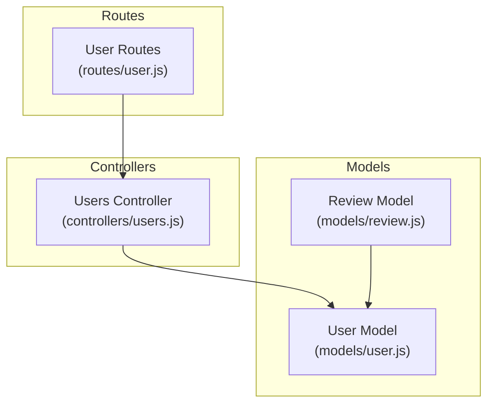
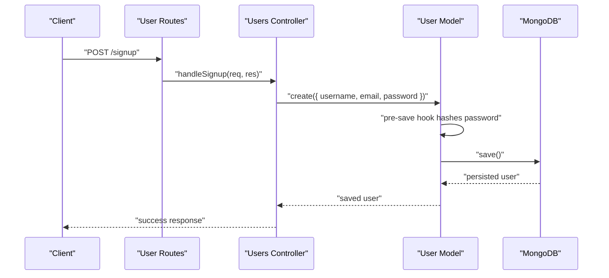
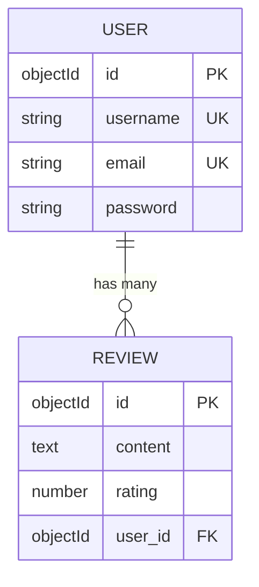
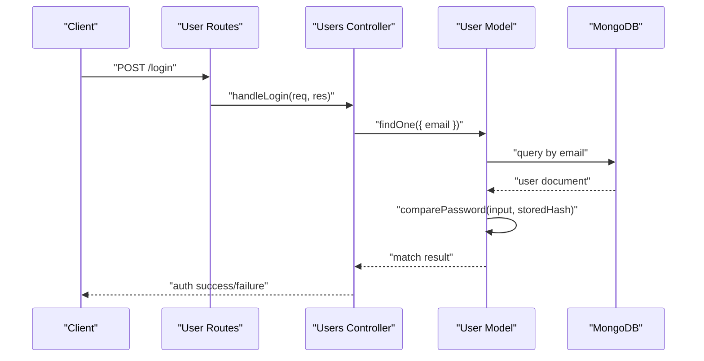
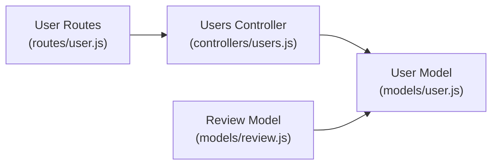

# User Model

<cite>
**Referenced Files in This Document**
- [user.js](file://models/user.js)
- [review.js](file://models/review.js)
- [users.js](file://controllers/users.js)
- [user.js](file://routes/user.js)
</cite>

## Table of Contents
1. [Introduction](#introduction)
2. [Project Structure](#project-structure)
3. [Core Components](#core-components)
4. [Architecture Overview](#architecture-overview)
5. [Detailed Component Analysis](#detailed-component-analysis)
6. [Dependency Analysis](#dependency-analysis)
7. [Performance Considerations](#performance-considerations)
8. [Troubleshooting Guide](#troubleshooting-guide)
9. [Conclusion](#conclusion)

## Introduction
This document provides comprehensive data model documentation for the User model, focusing on field definitions, validation rules, authentication-related fields, password hashing implementation, and security measures. It also covers relationships with other models (notably reviews), sample user document structures, common query patterns, and referential integrity constraints. The goal is to make the User model accessible to both technical and non-technical readers while remaining grounded in the actual codebase.

## Project Structure
The User model resides under the models directory and is used by controllers and routes that handle user registration, login, and profile operations. Reviews are modeled separately and reference users via a foreign key relationship.

**Diagram sources**
- [user.js](file://models/user.js)
- [review.js](file://models/review.js)
- [users.js](file://controllers/users.js)
- [user.js](file://routes/user.js)

**Section sources**
- [user.js](file://models/user.js)
- [review.js](file://models/review.js)
- [users.js](file://controllers/users.js)
- [user.js](file://routes/user.js)

## Core Components
- User Model: Defines the schema for user accounts, including identity fields (username, email), authentication fields (password), and optional profile attributes. It includes Mongoose validations and hooks for secure password handling.
- Review Model: Represents user-generated reviews and references the User model through a foreign key to enforce referential integrity.

Key responsibilities:
- Enforce data integrity at the schema level (required fields, formats).
- Securely hash passwords before persistence.
- Provide methods or middleware integration for authentication flows.
- Maintain relationships with related documents (reviews).

**Section sources**
- [user.js](file://models/user.js)
- [review.js](file://models/review.js)

## Architecture Overview
The User model integrates into the application’s authentication and authorization flow. Controllers orchestrate user signup/login workflows, leveraging the User model for persistence and validation. Reviews reference users to maintain relational context.

**Diagram sources**
- [user.js](file://models/user.js)
- [users.js](file://controllers/users.js)
- [user.js](file://routes/user.js)

## Detailed Component Analysis

### User Schema Fields and Types
- Username: Unique identifier for display and login; typically required and validated for uniqueness.
- Email: Primary contact and login credential; validated for format and uniqueness.
- Password: Secret credential stored as a hashed string; never persisted in plaintext.
- Optional Profile Fields: May include name, avatar URL, bio, or similar attributes depending on implementation.

Validation Rules:
- Required fields enforced at the schema level.
- Format checks for email.
- Uniqueness constraints for username and email.
- Password strength requirements may be enforced via custom validators.

Authentication-Related Fields:
- Password: Hashed using a secure algorithm (e.g., bcrypt) within a pre-save hook.
- Sensitive fields excluded from serialization where applicable.

Security Measures:
- Password hashing via pre-save hook ensures all new and updated passwords are securely stored.
- Validation prevents invalid or unsafe inputs.
- Middleware and controller logic should enforce HTTPS, rate limiting, and input sanitization at the application layer.

Sample User Document Structure:
- A typical user document contains an ObjectId _id, username, email, and a hashed password. Additional profile fields may be present if defined in the schema.

Common Query Patterns:
- Find by username or email for authentication.
- Check existence of username/email during signup to avoid duplicates.
- Retrieve user profiles for display or editing.

**Section sources**
- [user.js](file://models/user.js)

### Password Hashing Implementation
- Pre-save Hook: Intercepts save operations to hash plain-text passwords before they are written to the database.
- Algorithm: Uses a strong hashing function (commonly bcrypt) with appropriate salt rounds.
- Update Behavior: Ensures only modified passwords are re-hashed to avoid unnecessary work.

Security Implications:
- Prevents plaintext storage of credentials.
- Mitigates risk of credential exposure in case of database compromise.
- Complements application-level protections such as HTTPS and secure session management.

**Section sources**
- [user.js](file://models/user.js)

### Relationships with Reviews and Referential Integrity
- Foreign Key Reference: The Review model stores a reference to the User model (typically via a user ID field).
- Referential Integrity: MongoDB does not enforce foreign keys natively; application logic must ensure valid references when creating or deleting reviews and users.
- Common Operations:
  - Create review with a valid user ID.
  - Delete user and cascade or handle dependent reviews appropriately (e.g., delete reviews or anonymize authorship).

**Diagram sources**
- [user.js](file://models/user.js)
- [review.js](file://models/review.js)

**Section sources**
- [review.js](file://models/review.js)
- [user.js](file://models/user.js)

### Authentication Flow Integration
- Signup: Controller receives registration data, validates against the User schema, creates a new user, and returns success.
- Login: Controller authenticates by comparing provided credentials with stored hashed password via the User model.
- Session Management: Handled by middleware and controllers outside the User model scope.

**Diagram sources**
- [user.js](file://models/user.js)
- [users.js](file://controllers/users.js)
- [user.js](file://routes/user.js)

**Section sources**
- [users.js](file://controllers/users.js)
- [user.js](file://routes/user.js)
- [user.js](file://models/user.js)

## Dependency Analysis
The User model is depended upon by controllers and routes for user operations and referenced by the Review model for relational context.

**Diagram sources**
- [user.js](file://models/user.js)
- [review.js](file://models/review.js)
- [users.js](file://controllers/users.js)
- [user.js](file://routes/user.js)

**Section sources**
- [user.js](file://models/user.js)
- [review.js](file://models/review.js)
- [users.js](file://controllers/users.js)
- [user.js](file://routes/user.js)

## Performance Considerations
- Indexes: Ensure indexes on unique fields (username, email) to optimize lookups and enforce uniqueness efficiently.
- Password Hashing Cost: Choose salt rounds that balance security and performance based on deployment environment.
- Query Optimization: Use selective field projection and lean queries where possible to reduce payload size.
- Connection Pooling: Configure Mongoose connection pool settings to handle concurrent requests effectively.

[No sources needed since this section provides general guidance]

## Troubleshooting Guide
Common issues and resolutions:
- Duplicate username/email: Validate uniqueness at the schema level and handle duplicate key errors gracefully in controllers.
- Invalid email format: Ensure schema-level regex validation and provide clear error messages.
- Authentication failures: Verify password comparison logic and ensure pre-save hashing is applied consistently.
- Orphaned reviews after user deletion: Implement application-level cascading or anonymization strategies to maintain referential integrity.

**Section sources**
- [user.js](file://models/user.js)
- [review.js](file://models/review.js)
- [users.js](file://controllers/users.js)

## Conclusion
The User model enforces robust data integrity and security through schema validations and password hashing. Its relationships with reviews require careful application-level handling to maintain referential integrity. By following the documented patterns and best practices, developers can implement secure and reliable user management features.

[No sources needed since this section summarizes without analyzing specific files]