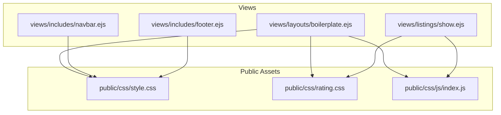
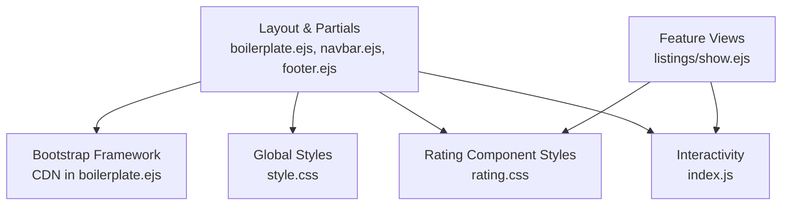
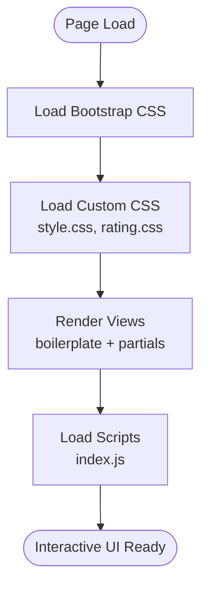

# CSS Styling and Responsive Design

<cite>
**Referenced Files in This Document**
- [style.css](file://public/css/style.css)
- [rating.css](file://public/css/rating.css)
- [index.js](file://public/css/js/index.js)
- [boilerplate.ejs](file://views/layouts/boilerplate.ejs)
- [navbar.ejs](file://views/includes/navbar.ejs)
- [footer.ejs](file://views/includes/footer.ejs)
- [show.ejs](file://views/listings/show.ejs)
</cite>

## Table of Contents
1. [Introduction](#introduction)
2. [Project Structure](#project-structure)
3. [Core Components](#core-components)
4. [Architecture Overview](#architecture-overview)
5. [Detailed Component Analysis](#detailed-component-analysis)
6. [Dependency Analysis](#dependency-analysis)
7. [Performance Considerations](#performance-considerations)
8. [Troubleshooting Guide](#troubleshooting-guide)
9. [Conclusion](#conclusion)
10. [Appendices](#appendices)

## Introduction
This document explains the CSS styling system used across the application, focusing on organization, conventions, responsive design with Bootstrap integration, custom styles, and the star rating implementation. It also provides guidelines for adding new styles, maintaining consistency, and ensuring cross-browser compatibility.

## Project Structure
The styling assets are organized under a dedicated public directory:
- Stylesheets: public/css/style.css (global layout and typography), public/css/rating.css (star rating component)
- Client-side scripts: public/css/js/index.js (interactivity for ratings and other UI behaviors)
- Views reference these assets via EJS templates, including the base layout and partials

**Diagram sources**
- [boilerplate.ejs](file://views/layouts/boilerplate.ejs)
- [navbar.ejs](file://views/includes/navbar.ejs)
- [footer.ejs](file://views/includes/footer.ejs)
- [show.ejs](file://views/listings/show.ejs)
- [style.css](file://public/css/style.css)
- [rating.css](file://public/css/rating.css)
- [index.js](file://public/css/js/index.js)

**Section sources**
- [boilerplate.ejs](file://views/layouts/boilerplate.ejs)
- [navbar.ejs](file://views/includes/navbar.ejs)
- [footer.ejs](file://views/includes/footer.ejs)
- [show.ejs](file://views/listings/show.ejs)
- [style.css](file://public/css/style.css)
- [rating.css](file://public/css/rating.css)
- [index.js](file://public/css/js/index.js)

## Core Components
- Global stylesheet (layout, typography, spacing, utilities): style.css
- Star rating component styles: rating.css
- Interactive behavior for ratings and related UI: index.js
- Base template that wires Bootstrap and custom assets: boilerplate.ejs
- Reusable page sections: navbar.ejs, footer.ejs
- Feature view demonstrating rating usage: show.ejs

Key responsibilities:
- style.css establishes the visual baseline, grid overrides, and shared components
- rating.css defines the star rating states, hover effects, and interactive feedback
- index.js enhances interactivity for the rating widget and other UI elements
- boilerplate.ejs includes Bootstrap CDN links and custom styles/scripts to ensure consistent loading order
- Partial views include common UI patterns and may leverage both global and component-specific styles

**Section sources**
- [style.css](file://public/css/style.css)
- [rating.css](file://public/css/rating.css)
- [index.js](file://public/css/js/index.js)
- [boilerplate.ejs](file://views/layouts/boilerplate.ejs)
- [navbar.ejs](file://views/includes/navbar.ejs)
- [footer.ejs](file://views/includes/footer.ejs)
- [show.ejs](file://views/listings/show.ejs)

## Architecture Overview
The styling architecture follows a layered approach:
- Bootstrap framework provides responsive grid, utility classes, and base components
- Custom global styles in style.css refine layout, typography, and shared components
- Component-level styles in rating.css encapsulate the star rating behavior
- JavaScript in index.js augments interactivity without tightly coupling to presentation logic

**Diagram sources**
- [boilerplate.ejs](file://views/layouts/boilerplate.ejs)
- [navbar.ejs](file://views/includes/navbar.ejs)
- [footer.ejs](file://views/includes/footer.ejs)
- [show.ejs](file://views/listings/show.ejs)
- [style.css](file://public/css/style.css)
- [rating.css](file://public/css/rating.css)
- [index.js](file://public/css/js/index.js)

## Detailed Component Analysis

### Global Styles (style.css)
Responsibilities:
- Layout scaffolding and container constraints
- Typography scale, headings, paragraphs, and link styles
- Shared component styles (cards, buttons, badges, navbars)
- Spacing utilities and color tokens aligned with Bootstrap theme
- Responsive adjustments where Bootstrap defaults need refinement

Design conventions:
- Use semantic class names and avoid deep nesting
- Prefer extending or overriding Bootstrap variables/classes when possible
- Keep selectors specific enough to avoid conflicts but not overly scoped
- Centralize colors, fonts, and spacing values for consistency

Responsive strategy:
- Rely on Bootstrap’s grid and breakpoints
- Add minimal custom media queries only when necessary
- Ensure text scales and images remain fluid

**Section sources**
- [style.css](file://public/css/style.css)

### Star Rating System (rating.css)
Implementation overview:
- Uses a set of star icons represented by HTML elements
- CSS classes control filled vs. empty states
- Hover effects provide immediate visual feedback
- Active/selected state reflects user choice
- Focus styles support keyboard navigation

Interactive states:
- Default: empty stars
- Hover: highlight current and preceding stars
- Selected: persist filled state after click
- Focus: visible outline for accessibility

Accessibility considerations:
- Maintain focus indicators
- Ensure sufficient contrast between filled and empty stars
- Provide meaningful labels via aria attributes in markup (handled in views)

**Section sources**
- [rating.css](file://public/css/rating.css)
- [show.ejs](file://views/listings/show.ejs)

### Interactivity (index.js)
Responsibilities:
- Attach event listeners to star elements
- Update selected rating on click
- Toggle hover highlights while moving the cursor
- Optionally integrate with form submission or AJAX calls

Behavioral flow:
- On mouseover: temporarily fill stars up to the hovered position
- On click: permanently set the selected rating
- On blur/focus: manage focus outlines and accessibility cues

**Section sources**
- [index.js](file://public/css/js/index.js)
- [show.ejs](file://views/listings/show.ejs)

### Template Integration (boilerplate.ejs, navbar.ejs, footer.ejs)
Integration points:
- Base layout includes Bootstrap CSS/JS via CDN
- Loads custom styles and scripts in correct order
- Ensures consistent header/footer across pages
- Provides a clean structure for content injection

Best practices:
- Keep asset loading order: Bootstrap CSS first, then custom CSS, then scripts
- Avoid duplicating CDN links across partials
- Use consistent meta tags and viewport settings

**Section sources**
- [boilerplate.ejs](file://views/layouts/boilerplate.ejs)
- [navbar.ejs](file://views/includes/navbar.ejs)
- [footer.ejs](file://views/includes/footer.ejs)

### Usage Example (listings/show.ejs)
Demonstrates:
- Rendering the star rating component
- Including rating styles and script
- Wiring data bindings for initial rating value

Guidelines:
- Wrap rating in a container with appropriate classes
- Ensure aria attributes describe the rating purpose
- Initialize any client-side behavior if required

**Section sources**
- [show.ejs](file://views/listings/show.ejs)
- [rating.css](file://public/css/rating.css)
- [index.js](file://public/css/js/index.js)

## Dependency Analysis
Asset loading and dependency order:
- Bootstrap must load before custom styles to allow safe overrides
- Custom styles should load before scripts to ensure DOM-ready styling
- Scripts depend on DOM elements rendered by views

**Diagram sources**
- [boilerplate.ejs](file://views/layouts/boilerplate.ejs)
- [style.css](file://public/css/style.css)
- [rating.css](file://public/css/rating.css)
- [index.js](file://public/css/js/index.js)

**Section sources**
- [boilerplate.ejs](file://views/layouts/boilerplate.ejs)
- [style.css](file://public/css/style.css)
- [rating.css](file://public/css/rating.css)
- [index.js](file://public/css/js/index.js)

## Performance Considerations
- Minimize redundant CSS rules; prefer shared utilities
- Defer non-critical scripts to improve perceived performance
- Leverage Bootstrap’s prebuilt components to reduce custom CSS size
- Use efficient selectors and avoid deep nesting
- Ensure images and icons are optimized and appropriately sized

[No sources needed since this section provides general guidance]

## Troubleshooting Guide
Common issues and resolutions:
- Styles not applying: verify load order (Bootstrap before custom CSS) and file paths
- Rating hover flicker: ensure pointer events are not blocked by overlays
- Focus styles missing: confirm focus-visible rules and browser support
- Mobile layout breaks: check container widths and grid classes; validate viewport meta tag
- Cross-browser inconsistencies: test on multiple browsers and adjust vendor prefixes if needed

**Section sources**
- [boilerplate.ejs](file://views/layouts/boilerplate.ejs)
- [style.css](file://public/css/style.css)
- [rating.css](file://public/css/rating.css)
- [index.js](file://public/css/js/index.js)

## Conclusion
The styling system combines Bootstrap’s responsive foundation with targeted custom styles and a well-scoped star rating component. By following the conventions outlined here—consistent naming, careful override strategies, and clear separation of concerns—you can extend the UI predictably and maintain high quality across devices and browsers.

[No sources needed since this section summarizes without analyzing specific files]

## Appendices

### Guidelines for Adding New Styles
- Place global layout and typography changes in style.css
- Encapsulate feature-specific styles in dedicated files (e.g., rating.css pattern)
- Prefer Bootstrap utilities and variables to minimize custom CSS
- Keep selectors flat and semantic; avoid excessive specificity
- Test responsiveness at common breakpoints and update media queries sparingly

### Maintaining Consistency
- Define reusable tokens (colors, spacing, typography) centrally
- Follow established naming conventions for classes
- Document new components with comments and examples in views

### Ensuring Cross-Browser Compatibility
- Validate CSS with a linter and check known incompatibilities
- Use widely supported properties; add fallbacks where necessary
- Test on major desktop and mobile browsers regularly

[No sources needed since this section provides general guidance]