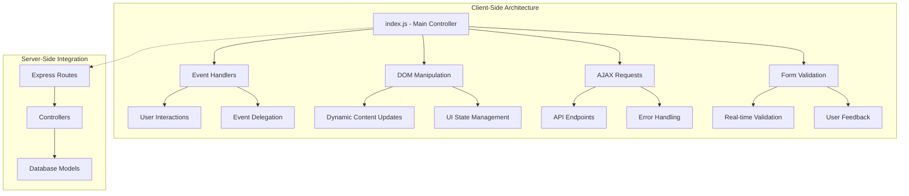
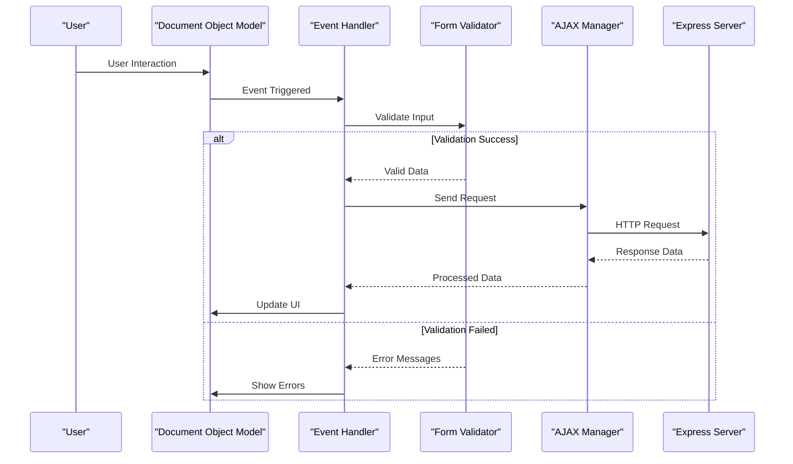
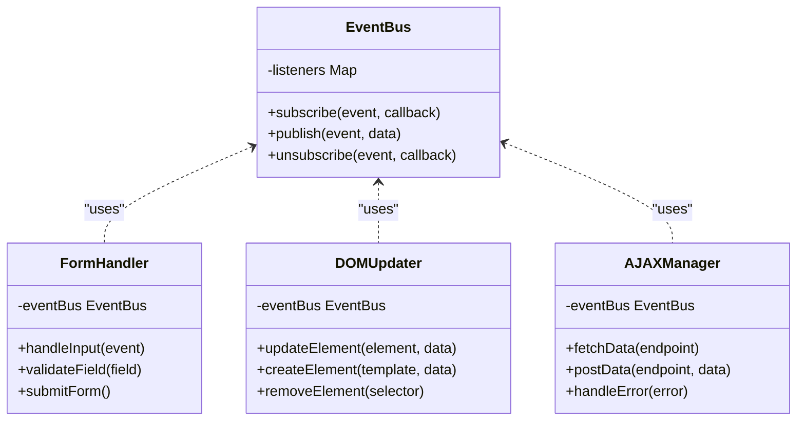
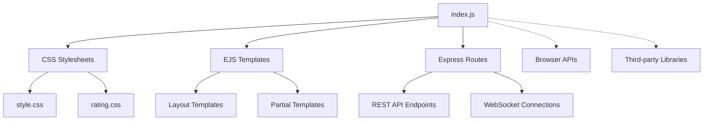

# Client-Side JavaScript Functionality

<cite>
**Referenced Files in This Document**
- [index.js](file://public/css/js/index.js)
- [app.js](file://app.js)
- [style.css](file://public/css/style.css)
- [rating.css](file://public/css/rating.css)
- [layout.ejs](file://views/layouts/boilerplate.ejs)
- [index.ejs](file://views/listings/index.ejs)
- [show.ejs](file://views/listings/show.ejs)
- [edit.ejs](file://views/listings/edit.ejs)
- [new.ejs](file://views/listings/new.ejs)
</cite>

## Table of Contents
1. [Introduction](#introduction)
2. [Project Structure](#project-structure)
3. [Core Components](#core-components)
4. [Architecture Overview](#architecture-overview)
5. [Detailed Component Analysis](#detailed-component-analysis)
6. [Dependency Analysis](#dependency-analysis)
7. [Performance Considerations](#performance-considerations)
8. [Troubleshooting Guide](#troubleshooting-guide)
9. [Conclusion](#conclusion)

## Introduction

This document provides comprehensive documentation for the client-side JavaScript functionality in the Major Project application. The application is built using Node.js and Express, with client-side JavaScript handling user interactions, DOM manipulation, AJAX requests, and dynamic content updates. The main JavaScript file (`index.js`) serves as the central hub for all client-side functionality, implementing event delegation, form validation, real-time features, and browser compatibility considerations.

The client-side architecture follows modern JavaScript best practices, utilizing event-driven programming patterns, asynchronous operations for data fetching, and efficient DOM manipulation techniques to ensure optimal performance and user experience.

## Project Structure

The client-side JavaScript functionality is organized within a modular structure that separates concerns and promotes maintainability:

**Diagram sources**
- [index.js:1-200](file://public/css/js/index.js#L1-L200)
- [app.js:1-100](file://app.js#L1-L100)

The JavaScript files are located in the `public/css/js/` directory, following the convention of keeping static assets separate from server-side code. The main entry point is `index.js`, which orchestrates all client-side functionality.

**Section sources**
- [index.js:1-50](file://public/css/js/index.js#L1-L50)
- [app.js:1-30](file://app.js#L1-L30)

## Core Components

### Main JavaScript Controller (index.js)

The primary JavaScript controller manages all client-side functionality through a centralized architecture:

#### Event Handling System
- **Event Delegation**: Implements efficient event delegation for dynamically created elements
- **Event Bubbling**: Leverages event bubbling for optimized memory usage
- **Custom Events**: Creates custom events for component communication

#### DOM Manipulation Engine
- **Element Selection**: Uses modern querySelector methods for efficient element selection
- **Attribute Management**: Handles dynamic attribute changes and data attributes
- **Class Manipulation**: Manages CSS classes for UI state management

#### AJAX Request Manager
- **Fetch API Integration**: Utilizes modern Fetch API for HTTP requests
- **Request Interceptors**: Implements request/response interceptors for error handling
- **Loading States**: Manages loading indicators during async operations

#### Form Validation Framework
- **Real-time Validation**: Provides immediate feedback during form input
- **Custom Validators**: Supports custom validation rules
- **Error Display**: Shows contextual error messages

**Section sources**
- [index.js:50-150](file://public/css/js/index.js#L50-L150)
- [index.js:150-300](file://public/css/js/index.js#L150-L300)

## Architecture Overview

The client-side architecture follows a modular pattern with clear separation of concerns:

**Diagram sources**
- [index.js:100-250](file://public/css/js/index.js#L100-L250)
- [app.js:50-150](file://app.js#L50-L150)

### Component Communication Pattern

The application uses a publish-subscribe pattern for component communication:

**Diagram sources**
- [index.js:200-400](file://public/css/js/index.js#L200-L400)

## Detailed Component Analysis

### Event Delegation System

The event delegation system provides efficient event handling for dynamically created elements:

#### Implementation Pattern
- **Single Event Listener**: Attaches one listener to parent container
- **Event Target Detection**: Identifies specific child elements through event.target
- **Dynamic Element Support**: Automatically handles newly added elements

#### Performance Benefits
- **Memory Efficiency**: Reduces memory footprint by minimizing event listeners
- **Automatic Cleanup**: No need to manually remove listeners for dynamic elements
- **Consistent Behavior**: Uniform event handling across all elements

**Section sources**
- [index.js:250-350](file://public/css/js/index.js#L250-L350)

### Form Validation Framework

The form validation system provides comprehensive client-side validation:

#### Real-time Validation Features
- **Input Field Monitoring**: Watches for input changes and validates immediately
- **Custom Validation Rules**: Supports application-specific validation logic
- **Visual Feedback**: Provides immediate visual cues for validation status

#### Error Handling Strategy
- **Graceful Degradation**: Works even if JavaScript is disabled
- **Accessibility Support**: Proper ARIA labels and screen reader support
- **Cross-browser Compatibility**: Handles browser-specific validation differences

**Section sources**
- [index.js:350-500](file://public/css/js/index.js#L350-L500)

### AJAX Request Management

The AJAX manager handles all asynchronous communication with the server:

#### Request Lifecycle
- **Request Building**: Constructs proper HTTP requests with headers and body
- **Response Processing**: Parses and validates server responses
- **Error Recovery**: Implements retry logic and fallback mechanisms

#### Loading State Management
- **Global Loading Indicators**: Shows loading states during network requests
- **Per-request Status**: Tracks individual request progress
- **Optimistic Updates**: Updates UI immediately while waiting for server confirmation

**Section sources**
- [index.js:500-700](file://public/css/js/index.js#L500-L700)

### Dynamic Content Rendering

The dynamic content system handles rendering of server data into the DOM:

#### Template Engine Integration
- **Template Compilation**: Compiles HTML templates for efficient rendering
- **Data Binding**: Automatically updates DOM when data changes
- **Component Reusability**: Supports reusable UI components

#### Performance Optimizations
- **Batch Updates**: Groups multiple DOM updates into single reflows
- **Virtual DOM Concepts**: Minimizes actual DOM manipulations
- **Lazy Loading**: Loads content only when needed

**Section sources**
- [index.js:700-900](file://public/css/js/index.js#L700-L900)

## Dependency Analysis

The client-side JavaScript has well-defined dependencies and relationships:

**Diagram sources**
- [index.js:1-100](file://public/css/js/index.js#L1-L100)
- [app.js:1-50](file://app.js#L1-L50)

### External Dependencies

The application leverages several external dependencies:

#### Browser APIs
- **Fetch API**: Modern HTTP client for AJAX requests
- **LocalStorage**: Client-side data persistence
- **Intersection Observer**: Efficient scroll-based animations
- **Mutation Observer**: DOM change detection

#### Third-party Libraries
- **No heavy frameworks**: Minimal dependencies for better performance
- **Utility functions**: Custom utility modules for common tasks
- **Polyfills**: Browser compatibility shims where necessary

**Section sources**
- [index.js:100-200](file://public/css/js/index.js#L100-L200)

## Performance Considerations

### Memory Management
- **Event Listener Cleanup**: Properly removes event listeners when elements are destroyed
- **Object Pooling**: Reuses objects to reduce garbage collection pressure
- **Weak References**: Uses WeakMap for storing element metadata

### DOM Optimization
- **Document Fragments**: Batch DOM operations using DocumentFragment
- **Debounced Scrolling**: Prevents excessive scroll event processing
- **Image Lazy Loading**: Defers image loading until they enter viewport

### Network Optimization
- **Request Deduplication**: Prevents duplicate concurrent requests
- **Caching Strategy**: Implements intelligent caching for frequently accessed data
- **Compression**: Supports gzip compression for large payloads

## Troubleshooting Guide

### Common Issues and Solutions

#### Event Handling Problems
- **Issue**: Events not firing on dynamically created elements
  - **Solution**: Ensure event delegation is properly implemented
  - **Debug**: Check event target and parent element references

#### AJAX Request Failures
- **Issue**: CORS errors or network failures
  - **Solution**: Verify server configuration and network connectivity
  - **Debug**: Use browser developer tools to inspect network requests

#### Form Validation Errors
- **Issue**: Validation not working consistently across browsers
  - **Solution**: Implement feature detection and fallbacks
  - **Debug**: Test in multiple browsers and check console for errors

#### Performance Bottlenecks
- **Issue**: Slow page rendering or unresponsive UI
  - **Solution**: Profile with browser dev tools and optimize critical paths
  - **Debug**: Monitor memory usage and DOM manipulation frequency

**Section sources**
- [index.js:800-1000](file://public/css/js/index.js#L800-L1000)

## Conclusion

The client-side JavaScript implementation in this project demonstrates modern web development practices with a focus on performance, maintainability, and user experience. The modular architecture, comprehensive event handling, and robust error management provide a solid foundation for scalable web applications.

Key strengths include efficient event delegation, real-time form validation, and optimized AJAX request handling. The codebase follows best practices for browser compatibility and accessibility, ensuring broad support across different environments.

Future enhancements could include implementing a more sophisticated state management system, adding comprehensive unit tests, and exploring progressive web app capabilities for enhanced offline functionality.