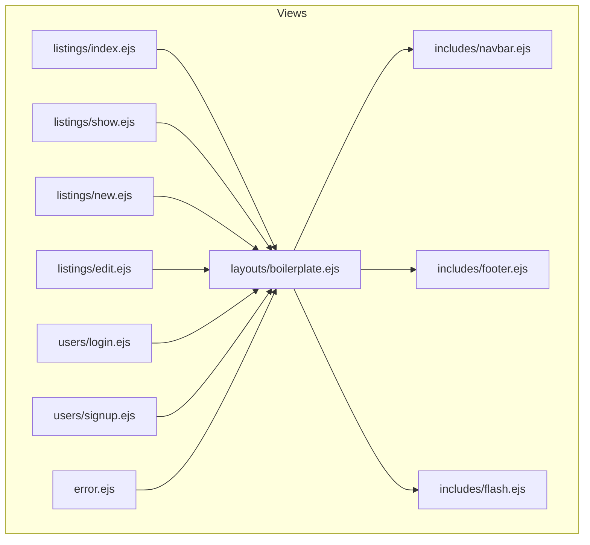
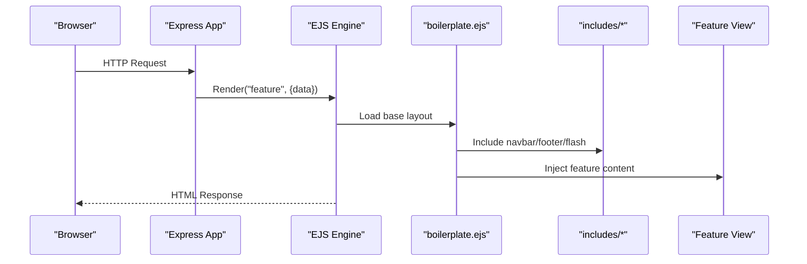
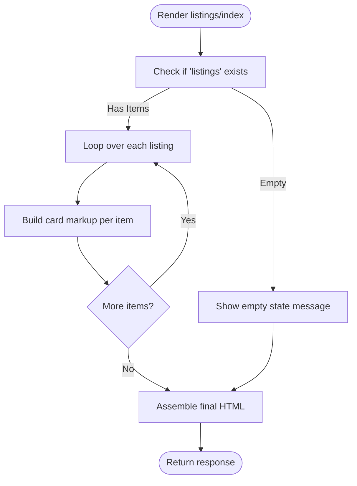
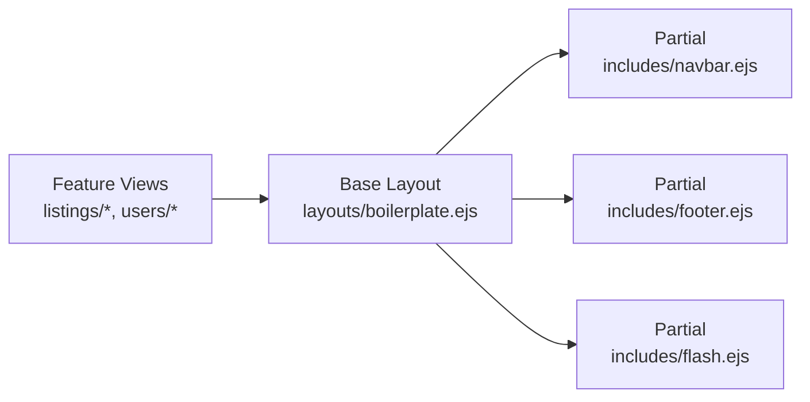

# EJS Templates and Layouts

<cite>
**Referenced Files in This Document**
- [app.js](file://app.js)
- [boilerplate.ejs](file://views/layouts/boilerplate.ejs)
- [navbar.ejs](file://views/includes/navbar.ejs)
- [footer.ejs](file://views/includes/footer.ejs)
- [flash.ejs](file://views/includes/flash.ejs)
- [index.ejs](file://views/listings/index.ejs)
- [show.ejs](file://views/listings/show.ejs)
- [new.ejs](file://views/listings/new.ejs)
- [edit.ejs](file://views/listings/edit.ejs)
- [login.ejs](file://views/users/login.ejs)
- [signup.ejs](file://views/users/signup.ejs)
- [error.ejs](file://views/error.ejs)
</cite>

## Table of Contents
1. [Introduction](#introduction)
2. [Project Structure](#project-structure)
3. [Core Components](#core-components)
4. [Architecture Overview](#architecture-overview)
5. [Detailed Component Analysis](#detailed-component-analysis)
6. [Dependency Analysis](#dependency-analysis)
7. [Performance Considerations](#performance-considerations)
8. [Troubleshooting Guide](#troubleshooting-guide)
9. [Conclusion](#conclusion)

## Introduction
This document explains the EJS templating system used in the project, focusing on layout inheritance via a base template, reusable partials, feature-based view organization, data binding patterns, conditional rendering, loops, form handling, best practices, performance optimization, and security considerations when rendering user-generated content.

## Project Structure
The templates are organized under views with clear separation:
- layouts: shared page shell (base layout)
- includes: reusable partials (navigation, footer, flash messages)
- listings: feature-specific views for listing resources
- users: feature-specific views for authentication flows
- error.ejs: global error display

**Diagram sources**
- [boilerplate.ejs](file://views/layouts/boilerplate.ejs)
- [navbar.ejs](file://views/includes/navbar.ejs)
- [footer.ejs](file://views/includes/footer.ejs)
- [flash.ejs](file://views/includes/flash.ejs)
- [index.ejs](file://views/listings/index.ejs)
- [show.ejs](file://views/listings/show.ejs)
- [new.ejs](file://views/listings/new.ejs)
- [edit.ejs](file://views/listings/edit.ejs)
- [login.ejs](file://views/users/login.ejs)
- [signup.ejs](file://views/users/signup.ejs)
- [error.ejs](file://views/error.ejs)

**Section sources**
- [app.js](file://app.js)

## Core Components
- Base layout (boilerplate.ejs): Provides the HTML skeleton, head section, CSS/JS includes, and slots where feature views are injected. It also includes common partials such as navbar, footer, and flash messages.
- Partials:
  - navbar.ejs: Top navigation links and branding.
  - footer.ejs: Site-wide footer content.
  - flash.ejs: Displays success/info/warning/error messages set by middleware or controllers.
- Feature views:
  - listings: index, show, new, edit
  - users: login, signup
- Global error view: error.ejs

These components work together to render pages consistently while keeping code DRY and maintainable.

**Section sources**
- [boilerplate.ejs](file://views/layouts/boilerplate.ejs)
- [navbar.ejs](file://views/includes/navbar.ejs)
- [footer.ejs](file://views/includes/footer.ejs)
- [flash.ejs](file://views/includes/flash.ejs)
- [index.ejs](file://views/listings/index.ejs)
- [show.ejs](file://views/listings/show.ejs)
- [new.ejs](file://views/listings/new.ejs)
- [edit.ejs](file://views/listings/edit.ejs)
- [login.ejs](file://views/users/login.ejs)
- [signup.ejs](file://views/users/signup.ejs)
- [error.ejs](file://views/error.ejs)

## Architecture Overview
The application renders EJS templates using Express. The base layout composes partials and injects feature-specific content. Flash messages flow from server-side logic into the flash partial.

**Diagram sources**
- [app.js](file://app.js)
- [boilerplate.ejs](file://views/layouts/boilerplate.ejs)
- [navbar.ejs](file://views/includes/navbar.ejs)
- [footer.ejs](file://views/includes/footer.ejs)
- [flash.ejs](file://views/includes/flash.ejs)
- [index.ejs](file://views/listings/index.ejs)
- [show.ejs](file://views/listings/show.ejs)
- [new.ejs](file://views/listings/new.ejs)
- [edit.ejs](file://views/listings/edit.ejs)
- [login.ejs](file://views/users/login.ejs)
- [signup.ejs](file://views/users/signup.ejs)
- [error.ejs](file://views/error.ejs)

## Detailed Component Analysis

### Layout Inheritance with boilerplate.ejs
- Purpose: Centralizes HTML structure, meta tags, stylesheets, scripts, and common UI elements.
- Composition: Includes partials (navbar, footer, flash) and provides an injection point for feature views.
- Data scope: Variables passed to the feature view are available within the layout context after inclusion.

Best practices:
- Keep layout minimal; move heavy logic to helpers or controllers.
- Use consistent block names for content injection.
- Avoid duplicating assets; include once in the layout.

**Section sources**
- [boilerplate.ejs](file://views/layouts/boilerplate.ejs)

### Partials Organization (includes)
- navbar.ejs: Renders navigation links and active state based on request path or data.
- footer.ejs: Static or lightly dynamic site footer.
- flash.ejs: Reads message objects and renders appropriate alert classes.

Data binding patterns:
- Arrays and objects are iterated or accessed directly.
- Conditional rendering uses boolean flags or presence checks.
- Message types map to CSS classes for styling.

Security:
- Always escape user input when printing values.
- Validate message shapes before rendering.

**Section sources**
- [navbar.ejs](file://views/includes/navbar.ejs)
- [footer.ejs](file://views/includes/footer.ejs)
- [flash.ejs](file://views/includes/flash.ejs)

### Listings Views (feature-based organization)
- index.ejs: Lists multiple items; typically loops over an array and renders cards or rows.
- show.ejs: Displays details for a single item; binds properties like title, description, images, ratings.
- new.ejs / edit.ejs: Forms for creating/updating listings; pre-populates fields on edit.

Common patterns:
- Loops over collections to generate repeated markup.
- Conditional blocks for empty states or permissions.
- Form submission targets route handlers; CSRF protection should be enabled if applicable.

Accessibility:
- Provide labels and alt text for images.
- Ensure keyboard navigability.

**Section sources**
- [index.ejs](file://views/listings/index.ejs)
- [show.ejs](file://views/listings/show.ejs)
- [new.ejs](file://views/listings/new.ejs)
- [edit.ejs](file://views/listings/edit.ejs)

### Users Views (authentication flows)
- login.ejs: Email/password form; handles validation feedback and redirects.
- signup.ejs: Registration form; may include password confirmation and terms acceptance.

Patterns:
- Pre-fill known values (e.g., email) when returning from validation errors.
- Display field-level errors next to inputs.
- Secure forms with HTTPS and CSRF tokens.

**Section sources**
- [login.ejs](file://views/users/login.ejs)
- [signup.ejs](file://views/users/signup.ejs)

### Error Handling View
- error.ejs: Presents a friendly error page with optional debug info in development.
- Integrates with global error middleware to receive status and message.

**Section sources**
- [error.ejs](file://views/error.ejs)

### Template Data Binding Patterns
- Rendering variables: Output model properties safely.
- Conditional rendering: Show/hide sections based on booleans or presence.
- Iteration: Loop over arrays to build lists, tables, or grids.
- Forms: Bind to request body fields; preserve values across validation failures.

Examples (conceptual):
- Conditional rendering: Show admin-only actions only when a flag is true.
- Loops: Iterate over a list of listings to render cards.
- Forms: Submit POST requests to create/update resources; handle errors inline.

[No sources needed since this section describes general patterns]

### Flowchart: Listing Index Rendering

[No sources needed since this diagram shows conceptual workflow, not actual code structure]

## Dependency Analysis
Template dependencies:
- Feature views depend on the base layout.
- Base layout depends on partials.
- Flash messages depend on server-side message storage.

**Diagram sources**
- [boilerplate.ejs](file://views/layouts/boilerplate.ejs)
- [navbar.ejs](file://views/includes/navbar.ejs)
- [footer.ejs](file://views/includes/footer.ejs)
- [flash.ejs](file://views/includes/flash.ejs)
- [index.ejs](file://views/listings/index.ejs)
- [show.ejs](file://views/listings/show.ejs)
- [new.ejs](file://views/listings/new.ejs)
- [edit.ejs](file://views/listings/edit.ejs)
- [login.ejs](file://views/users/login.ejs)
- [signup.ejs](file://views/users/signup.ejs)

**Section sources**
- [app.js](file://app.js)

## Performance Considerations
- Minimize heavy computations inside templates; pre-process data in controllers/middleware.
- Cache static assets and leverage browser caching headers.
- Use pagination for large lists to reduce DOM size.
- Defer non-critical JavaScript and load CSS efficiently.
- Avoid unnecessary re-renders by passing only required data.
- Consider enabling EJS cache in production environments.

[No sources needed since this section provides general guidance]

## Troubleshooting Guide
Common issues and resolutions:
- Missing variables: Ensure controllers pass required data to views.
- Undefined partials: Verify include paths and file locations.
- Flash messages not showing: Confirm middleware sets messages and that the flash partial is included.
- XSS risks: Escape user-generated content; avoid raw output of untrusted strings.
- Form submissions failing: Check method, action URLs, and CSRF configuration.

Operational tips:
- Enable detailed error pages in development; sanitize in production.
- Log rendering errors and missing data during development.

**Section sources**
- [error.ejs](file://views/error.ejs)
- [flash.ejs](file://views/includes/flash.ejs)

## Conclusion
The EJS setup leverages a clean layout/partial architecture with feature-based views, enabling consistent UI composition and maintainable templates. By following data binding patterns, applying conditional rendering and loops responsibly, and adhering to security and performance best practices, the application remains scalable and robust.