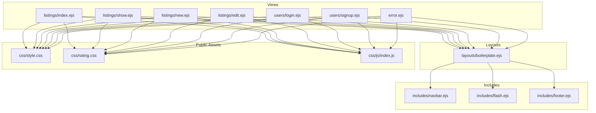
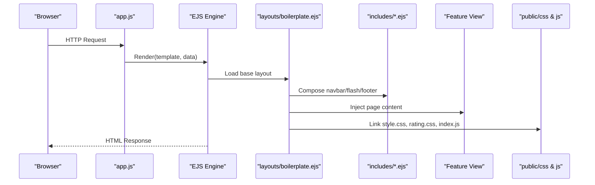
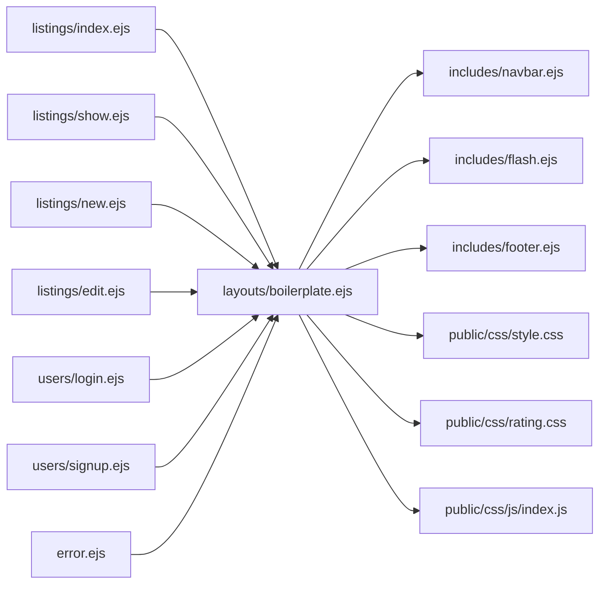

# Frontend Architecture

<cite>
**Referenced Files in This Document**
- [app.js](file://app.js)
- [boilerplate.ejs](file://views/layouts/boilerplate.ejs)
- [navbar.ejs](file://views/includes/navbar.ejs)
- [flash.ejs](file://views/includes/flash.ejs)
- [footer.ejs](file://views/includes/footer.ejs)
- [index.ejs](file://views/listings/index.ejs)
- [show.ejs](file://views/listings/show.ejs)
- [new.ejs](file://views/listings/new.ejs)
- [edit.ejs](file://views/listings/edit.ejs)
- [login.ejs](file://views/users/login.ejs)
- [signup.ejs](file://views/users/signup.ejs)
- [error.ejs](file://views/error.ejs)
- [style.css](file://public/css/style.css)
- [rating.css](file://public/css/rating.css)
- [index.js](file://public/css/js/index.js)
</cite>

## Table of Contents
1. [Introduction](#introduction)
2. [Project Structure](#project-structure)
3. [Core Components](#core-components)
4. [Architecture Overview](#architecture-overview)
5. [Detailed Component Analysis](#detailed-component-analysis)
6. [Dependency Analysis](#dependency-analysis)
7. [Performance Considerations](#performance-considerations)
8. [Troubleshooting Guide](#troubleshooting-guide)
9. [Conclusion](#conclusion)

## Introduction
This document describes the frontend architecture built with EJS server-side templating. It explains layout inheritance, partial organization, and component reuse patterns; documents the navigation system, flash messages, and responsive design approach; outlines CSS organization and styling conventions including custom components like star ratings; and covers client-side JavaScript functionality, event handling, and DOM manipulation patterns. It also provides template best practices, performance considerations, and cross-browser compatibility guidance.

## Project Structure
The frontend is organized around a clear separation of concerns:
- Layouts define the overall page shell and shared resources.
- Includes contain reusable fragments such as navigation, flash messages, and footer.
- Feature-specific views implement page-level content for listings and users.
- Public assets include CSS stylesheets and client-side scripts.

**Diagram sources**
- [boilerplate.ejs](file://views/layouts/boilerplate.ejs)
- [navbar.ejs](file://views/includes/navbar.ejs)
- [flash.ejs](file://views/includes/flash.ejs)
- [footer.ejs](file://views/includes/footer.ejs)
- [index.ejs](file://views/listings/index.ejs)
- [show.ejs](file://views/listings/show.ejs)
- [new.ejs](file://views/listings/new.ejs)
- [edit.ejs](file://views/listings/edit.ejs)
- [login.ejs](file://views/users/login.ejs)
- [signup.ejs](file://views/users/signup.ejs)
- [error.ejs](file://views/error.ejs)
- [style.css](file://public/css/style.css)
- [rating.css](file://public/css/rating.css)
- [index.js](file://public/css/js/index.js)

**Section sources**
- [boilerplate.ejs](file://views/layouts/boilerplate.ejs)
- [navbar.ejs](file://views/includes/navbar.ejs)
- [flash.ejs](file://views/includes/flash.ejs)
- [footer.ejs](file://views/includes/footer.ejs)
- [index.ejs](file://views/listings/index.ejs)
- [show.ejs](file://views/listings/show.ejs)
- [new.ejs](file://views/listings/new.ejs)
- [edit.ejs](file://views/listings/edit.ejs)
- [login.ejs](file://views/users/login.ejs)
- [signup.ejs](file://views/users/signup.ejs)
- [error.ejs](file://views/error.ejs)
- [style.css](file://public/css/style.css)
- [rating.css](file://public/css/rating.css)
- [index.js](file://public/css/js/index.js)

## Core Components
- Layout inheritance: The base layout defines the HTML skeleton, global meta tags, stylesheet links, and script includes. Views extend this layout to render their specific content within a consistent structure.
- Partials: Navigation, flash messages, and footer are extracted into reusable includes and composed into pages via the layout.
- Page views: Feature-specific templates (listings and users) focus on domain content and rely on the layout and includes for chrome.
- Client assets: Global styles and rating-specific styles are loaded once per page; a single client-side script file centralizes interactive behavior.

Key responsibilities:
- Layout: Provides structural consistency and resource loading.
- Navbar: Centralized navigation markup and active state logic.
- Flash: Displays transient user feedback from server responses.
- Footer: Shared site information and links.
- Pages: Render data-driven content for listings and authentication flows.
- Styles: Organized by scope (global vs. feature).
- Scripts: Centralized DOM interactions and event handling.

**Section sources**
- [boilerplate.ejs](file://views/layouts/boilerplate.ejs)
- [navbar.ejs](file://views/includes/navbar.ejs)
- [flash.ejs](file://views/includes/flash.ejs)
- [footer.ejs](file://views/includes/footer.ejs)
- [index.ejs](file://views/listings/index.ejs)
- [show.ejs](file://views/listings/show.ejs)
- [new.ejs](file://views/listings/new.ejs)
- [edit.ejs](file://views/listings/edit.ejs)
- [login.ejs](file://views/users/login.ejs)
- [signup.ejs](file://views/users/signup.ejs)
- [error.ejs](file://views/error.ejs)
- [style.css](file://public/css/style.css)
- [rating.css](file://public/css/rating.css)
- [index.js](file://public/css/js/index.js)

## Architecture Overview
The rendering pipeline starts at the application entry point, which configures the view engine and routes. Routes pass data to EJS templates, which compose layouts and includes to produce final HTML. Static assets are served from the public directory and referenced by templates.

**Diagram sources**
- [app.js](file://app.js)
- [boilerplate.ejs](file://views/layouts/boilerplate.ejs)
- [navbar.ejs](file://views/includes/navbar.ejs)
- [flash.ejs](file://views/includes/flash.ejs)
- [footer.ejs](file://views/includes/footer.ejs)
- [index.ejs](file://views/listings/index.ejs)
- [show.ejs](file://views/listings/show.ejs)
- [new.ejs](file://views/listings/new.ejs)
- [edit.ejs](file://views/listings/edit.ejs)
- [login.ejs](file://views/users/login.ejs)
- [signup.ejs](file://views/users/signup.ejs)
- [error.ejs](file://views/error.ejs)
- [style.css](file://public/css/style.css)
- [rating.css](file://public/css/rating.css)
- [index.js](file://public/css/js/index.js)

## Detailed Component Analysis

### Layout Inheritance and Composition
- The base layout encapsulates the HTML boilerplate, global metadata, and asset references.
- Feature views extend the layout and supply only their unique content.
- Includes are composed inside the layout to avoid duplication across pages.

Best practices:
- Keep layout minimal and focused on structure and resource management.
- Pass only necessary variables to includes to reduce template complexity.
- Use consistent block or section names if your templating setup supports them.

**Section sources**
- [boilerplate.ejs](file://views/layouts/boilerplate.ejs)
- [navbar.ejs](file://views/includes/navbar.ejs)
- [flash.ejs](file://views/includes/flash.ejs)
- [footer.ejs](file://views/includes/footer.ejs)

### Partial Organization and Reuse
- Navbar partial centralizes navigation markup and can compute active states based on route context.
- Flash partial renders transient messages set by server middleware.
- Footer partial contains shared site information and links.

Reuse patterns:
- Compose multiple includes within a single layout to build pages consistently.
- Keep partials small and focused on a single responsibility.
- Avoid heavy logic in includes; prefer passing precomputed values from controllers.

**Section sources**
- [navbar.ejs](file://views/includes/navbar.ejs)
- [flash.ejs](file://views/includes/flash.ejs)
- [footer.ejs](file://views/includes/footer.ejs)

### Navigation System
- The navbar partial provides top-level navigation links and highlights the current route when applicable.
- Active state determination should be driven by request path or a passed variable from the controller.
- Ensure accessibility attributes (aria-current, labels) are present for screen readers.

Implementation notes:
- Use conditional classes to mark the active link.
- Keep navigation structure semantic (nav, ul, li, a).
- Consider mobile-friendly toggles if needed.

**Section sources**
- [navbar.ejs](file://views/includes/navbar.ejs)

### Flash Message Implementation
- The flash partial reads server-provided message arrays and renders notifications.
- Messages are typically categorized (e.g., success, error) and styled accordingly.
- Auto-dismiss behavior can be implemented via client-side timers.

Accessibility and UX:
- Use ARIA live regions for dynamic updates.
- Provide dismiss controls where appropriate.
- Ensure sufficient color contrast for all message types.

**Section sources**
- [flash.ejs](file://views/includes/flash.ejs)

### Responsive Design Approach
- Global styles define base typography, spacing, and utility classes.
- Media queries adjust layouts for different viewport sizes.
- Flexible grids and fluid images improve adaptability.

Recommendations:
- Adopt a mobile-first strategy.
- Use relative units (rem, em, %) for scalable layouts.
- Test common breakpoints and device orientations.

**Section sources**
- [style.css](file://public/css/style.css)

### Custom Components: Star Ratings
- Rating visuals are provided by a dedicated stylesheet scoped to rating elements.
- Templates render rating stars using semantic markup and classes defined in the rating stylesheet.
- Interactions (hover, click) are handled by the centralized client script.

Integration points:
- Ensure rating elements have descriptive roles and aria attributes.
- Debounce rapid interactions to prevent excessive reflows.
- Cache computed positions for smooth animations.

**Section sources**
- [rating.css](file://public/css/rating.css)
- [index.js](file://public/css/js/index.js)

### Client-Side JavaScript Functionality
- The main script file centralizes DOM manipulation, event delegation, and UI behaviors.
- Event listeners are attached after the DOM is ready to ensure elements exist.
- Common patterns include:
  - Delegated events for dynamically added nodes.
  - Safe element selection with null checks.
  - Minimal reflow triggers and batched updates.

Performance tips:
- Prefer event delegation over attaching many listeners.
- Throttle scroll/resize handlers.
- Avoid synchronous layout reads/writes in tight loops.

**Section sources**
- [index.js](file://public/css/js/index.js)

### Page Views: Listings and Users
- Listing views (index, show, new, edit) render list details, forms, and actions.
- User views (login, signup) handle authentication flows and form submissions.
- Error view displays standardized error pages.

Form handling:
- Validate inputs on the client before submission.
- Provide inline feedback and preserve entered values on errors.
- Use CSRF tokens if required by backend security.

**Section sources**
- [index.ejs](file://views/listings/index.ejs)
- [show.ejs](file://views/listings/show.ejs)
- [new.ejs](file://views/listings/new.ejs)
- [edit.ejs](file://views/listings/edit.ejs)
- [login.ejs](file://views/users/login.ejs)
- [signup.ejs](file://views/users/signup.ejs)
- [error.ejs](file://views/error.ejs)

### CSS Organization and Styling Conventions
- Global styles reside in a single stylesheet for base rules and utilities.
- Feature-specific styles (e.g., ratings) are isolated to minimize coupling.
- Naming conventions should be consistent and predictable (BEM-like or similar).

Guidelines:
- Group related selectors and keep specificity low.
- Use CSS custom properties for theming and repeated values.
- Maintain a clear hierarchy: base > components > utilities.

**Section sources**
- [style.css](file://public/css/style.css)
- [rating.css](file://public/css/rating.css)

## Dependency Analysis
The frontend dependencies among templates and assets are straightforward:
- Layout depends on includes.
- Feature views depend on layout and includes.
- All views reference global styles and the client script.

**Diagram sources**
- [boilerplate.ejs](file://views/layouts/boilerplate.ejs)
- [navbar.ejs](file://views/includes/navbar.ejs)
- [flash.ejs](file://views/includes/flash.ejs)
- [footer.ejs](file://views/includes/footer.ejs)
- [index.ejs](file://views/listings/index.ejs)
- [show.ejs](file://views/listings/show.ejs)
- [new.ejs](file://views/listings/new.ejs)
- [edit.ejs](file://views/listings/edit.ejs)
- [login.ejs](file://views/users/login.ejs)
- [signup.ejs](file://views/users/signup.ejs)
- [error.ejs](file://views/error.ejs)
- [style.css](file://public/css/style.css)
- [rating.css](file://public/css/rating.css)
- [index.js](file://public/css/js/index.js)

**Section sources**
- [boilerplate.ejs](file://views/layouts/boilerplate.ejs)
- [navbar.ejs](file://views/includes/navbar.ejs)
- [flash.ejs](file://views/includes/flash.ejs)
- [footer.ejs](file://views/includes/footer.ejs)
- [index.ejs](file://views/listings/index.ejs)
- [show.ejs](file://views/listings/show.ejs)
- [new.ejs](file://views/listings/new.ejs)
- [edit.ejs](file://views/listings/edit.ejs)
- [login.ejs](file://views/users/login.ejs)
- [signup.ejs](file://views/users/signup.ejs)
- [error.ejs](file://views/error.ejs)
- [style.css](file://public/css/style.css)
- [rating.css](file://public/css/rating.css)
- [index.js](file://public/css/js/index.js)

## Performance Considerations
- Minimize template logic: Precompute values in controllers and pass simple data to views.
- Reduce DOM operations: Batch updates and use event delegation.
- Optimize assets:
  - Combine and minify CSS/JS in production.
  - Leverage browser caching with cache-busting filenames.
- Improve perceived performance:
  - Defer non-critical scripts.
  - Inline critical CSS for above-the-fold content if needed.
- Accessibility and SEO:
  - Ensure semantic markup and proper heading order.
  - Provide alt text for images and meaningful labels for controls.

[No sources needed since this section provides general guidance]

## Troubleshooting Guide
Common issues and resolutions:
- Missing includes or layout paths: Verify template paths and that the view engine is configured correctly.
- Flash messages not appearing: Confirm server sets the expected message keys and that the flash partial reads them.
- Interactive features not working: Ensure the DOM is ready before attaching listeners and check for null selections.
- Styles not applied: Confirm asset paths and that stylesheets are linked in the layout.
- Cross-browser inconsistencies: Use feature detection and polyfills where necessary; test on major browsers.

Operational checks:
- Inspect network requests to verify asset loading.
- Review console errors for DOM-related exceptions.
- Validate generated HTML for missing closing tags or invalid attributes.

**Section sources**
- [boilerplate.ejs](file://views/layouts/boilerplate.ejs)
- [flash.ejs](file://views/includes/flash.ejs)
- [index.js](file://public/css/js/index.js)

## Conclusion
The frontend architecture leverages EJS layout inheritance and modular includes to maintain consistency and reusability. Global styles and a centralized script provide cohesive styling and interactivity. By following the recommended best practices—keeping templates declarative, organizing CSS by scope, and optimizing client-side interactions—you can achieve a performant, accessible, and maintainable user interface.