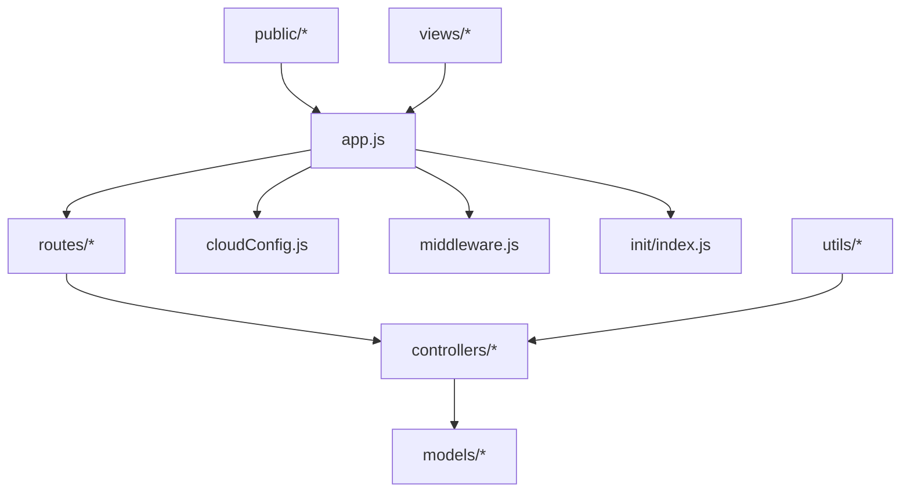
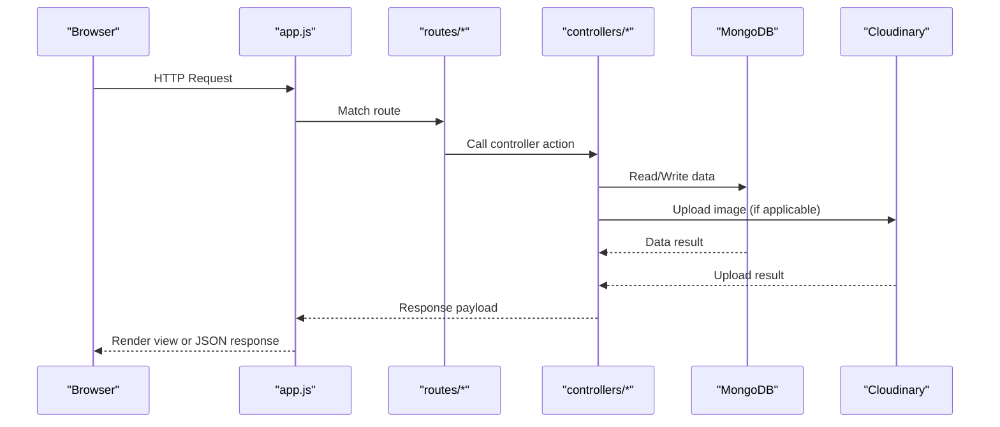

# Getting Started

<cite>
**Referenced Files in This Document**
- [README.md](file://README.md)
- [package.json](file://package.json)
- [app.js](file://app.js)
- [cloudConfig.js](file://cloudConfig.js)
- [Schema.js](file://Schema.js)
- [middleware.js](file://middleware.js)
- [controllers/listings.js](file://controllers/listings.js)
- [controllers/reviews.js](file://controllers/reviews.js)
- [controllers/users.js](file://controllers/users.js)
- [models/listing.js](file://models/listing.js)
- [models/review.js](file://models/review.js)
- [models/user.js](file://models/user.js)
- [routes/listings.js](file://routes/listings.js)
- [routes/review.js](file://routes/review.js)
- [routes/user.js](file://routes/user.js)
- [init/index.js](file://init/index.js)
- [init/data.js](file://init/data.js)
- [utils/ExpressError.js](file://utils/ExpressError.js)
- [utils/wrapAsync.js](file://utils/wrapAsync.js)
</cite>

## Table of Contents
1. [Introduction](#introduction)
2. [Prerequisites](#prerequisites)
3. [Installation](#installation)
4. [Environment Variables](#environment-variables)
5. [Database Configuration](#database-configuration)
6. [Cloudinary Setup](#cloudinary-setup)
7. [First-Time Run](#first-time-run)
8. [Verification Steps](#verification-steps)
9. [Troubleshooting Guide](#troubleshooting-guide)
10. [Project Structure Overview](#project-structure-overview)
11. [Architecture Overview](#architecture-overview)
12. [Conclusion](#conclusion)

## Introduction
This guide helps you set up and run the Major Project locally. It covers prerequisites, installation steps, environment configuration, database setup, Cloudinary integration, and first-time execution. You will also find verification steps and troubleshooting tips to ensure a smooth start.

## Prerequisites
Before you begin, make sure your development environment includes:
- Node.js (LTS recommended)
- npm or yarn
- MongoDB (local instance or MongoDB Atlas connection string)
- A Cloudinary account for image uploads

Verify installations:
- node -v
- npm -v
- mongod --version (for local MongoDB)

[No sources needed since this section provides general guidance]

## Installation
Follow these steps to clone and install dependencies:

1. Clone the repository:
   - git clone <repository-url>
   - cd <project-directory>

2. Install project dependencies:
   - npm install

3. Confirm that package.json lists the expected runtime dependencies and scripts.

**Section sources**
- [package.json](file://package.json)

## Environment Variables
Create a file named .env at the project root with the following variables:

- MONGODB_URI: Your MongoDB connection string (local or Atlas). Example format: mongodb://localhost:27017/<db-name>
- CLOUDINARY_CLOUD_NAME: Your Cloudinary cloud name
- CLOUDINARY_API_KEY: Your Cloudinary API key
- CLOUDINARY_API_SECRET: Your Cloudinary API secret
- SESSION_SECRET: A secure random string used by session middleware
- PORT: The port the server listens on (default 3000 if not provided)

Notes:
- Keep .env out of version control; it is typically ignored by default.
- Ensure all values are present before starting the server.

**Section sources**
- [app.js](file://app.js)
- [cloudConfig.js](file://cloudConfig.js)

## Database Configuration
The application uses MongoDB via Mongoose. Configure the connection using the MONGODB_URI environment variable.

Key points:
- Connection is established at application startup.
- Models are defined under models/.
- Seed data can be initialized using the init script.

To seed sample data on first run:
- Execute the initialization script from the terminal as described in First-Time Run.

**Section sources**
- [app.js](file://app.js)
- [models/listing.js](file://models/listing.js)
- [models/review.js](file://models/review.js)
- [models/user.js](file://models/user.js)
- [init/index.js](file://init/index.js)
- [init/data.js](file://init/data.js)

## Cloudinary Setup
Image upload functionality relies on Cloudinary. Configure the following in your .env file:
- CLOUDINARY_CLOUD_NAME
- CLOUDINARY_API_KEY
- CLOUDINARY_API_SECRET

The Cloudinary client is configured in the project and used by controllers that handle listing images.

**Section sources**
- [cloudConfig.js](file://cloudConfig.js)
- [controllers/listings.js](file://controllers/listings.js)

## First-Time Run
Start the development server and initialize sample data:

1. Start the server:
   - npm start

2. Initialize seed data (optional but recommended for first run):
   - npm run seed

Access the application:
- Open http://localhost:3000 in your browser

If you changed the PORT in .env, use that port instead of 3000.

**Section sources**
- [package.json](file://package.json)
- [app.js](file://app.js)
- [init/index.js](file://init/index.js)

## Verification Steps
After starting the server, verify the setup:

- Health check:
  - Visit http://localhost:3000 and confirm the page loads without errors.

- Database connectivity:
  - Create a new listing and review to ensure data persists.
  - Check MongoDB logs or connect via a MongoDB client to confirm collections exist.

- Cloudinary integration:
  - Upload an image through the listing creation flow.
  - Verify the image appears and is accessible.

- Authentication flows:
  - Sign up and log in to ensure user routes work.

- Error handling:
  - Trigger a 404 route to confirm custom error pages render.

[No sources needed since this section provides general guidance]

## Troubleshooting Guide
Common issues and resolutions:

- Missing environment variables:
  - Symptom: Server fails to start or features like uploads fail.
  - Fix: Ensure .env contains all required variables listed in Environment Variables.

- MongoDB connection errors:
  - Symptom: Connection refused or authentication failed.
  - Fix: Verify MONGODB_URI is correct, MongoDB is running, and credentials are valid. For Atlas, ensure network access allows your IP.

- Cloudinary upload failures:
  - Symptom: Image upload returns an error or images do not appear.
  - Fix: Double-check CLOUDINARY_* variables and permissions in your Cloudinary dashboard.

- Port conflicts:
  - Symptom: EADDRINUSE error when starting the server.
  - Fix: Change PORT in .env or stop the process using the conflicting port.

- Session-related errors:
  - Symptom: Login/session issues.
  - Fix: Ensure SESSION_SECRET is set and consistent across restarts.

- Seed data not loading:
  - Symptom: No initial listings or users.
  - Fix: Run the seed script again and verify MongoDB connectivity.

**Section sources**
- [app.js](file://app.js)
- [cloudConfig.js](file://cloudConfig.js)
- [init/index.js](file://init/index.js)

## Project Structure Overview
High-level structure relevant to setup and operation:

**Diagram sources**
- [app.js](file://app.js)
- [routes/listings.js](file://routes/listings.js)
- [routes/review.js](file://routes/review.js)
- [routes/user.js](file://routes/user.js)
- [controllers/listings.js](file://controllers/listings.js)
- [controllers/reviews.js](file://controllers/reviews.js)
- [controllers/users.js](file://controllers/users.js)
- [models/listing.js](file://models/listing.js)
- [models/review.js](file://models/review.js)
- [models/user.js](file://models/user.js)
- [cloudConfig.js](file://cloudConfig.js)
- [middleware.js](file://middleware.js)
- [init/index.js](file://init/index.js)
- [utils/ExpressError.js](file://utils/ExpressError.js)
- [utils/wrapAsync.js](file://utils/wrapAsync.js)

**Section sources**
- [app.js](file://app.js)
- [package.json](file://package.json)

## Architecture Overview
The application follows a standard Express MVC pattern with middleware and external integrations:

**Diagram sources**
- [app.js](file://app.js)
- [routes/listings.js](file://routes/listings.js)
- [routes/review.js](file://routes/review.js)
- [routes/user.js](file://routes/user.js)
- [controllers/listings.js](file://controllers/listings.js)
- [controllers/reviews.js](file://controllers/reviews.js)
- [controllers/users.js](file://controllers/users.js)
- [models/listing.js](file://models/listing.js)
- [models/review.js](file://models/review.js)
- [models/user.js](file://models/user.js)
- [cloudConfig.js](file://cloudConfig.js)

## Conclusion
You should now have a fully functional local environment for the Major Project. Use the verification steps to confirm everything works end-to-end. If you encounter issues, consult the troubleshooting guide and ensure all environment variables and services are correctly configured.

[No sources needed since this section summarizes without analyzing specific files]