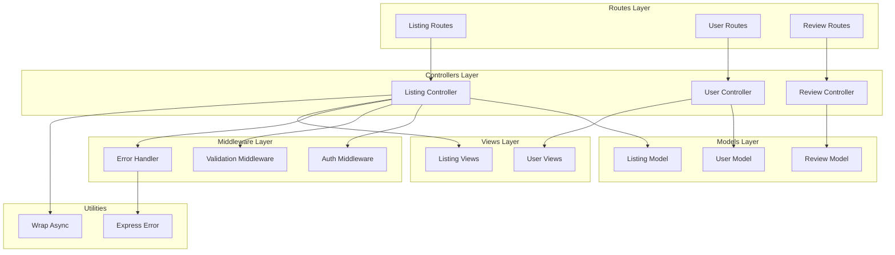
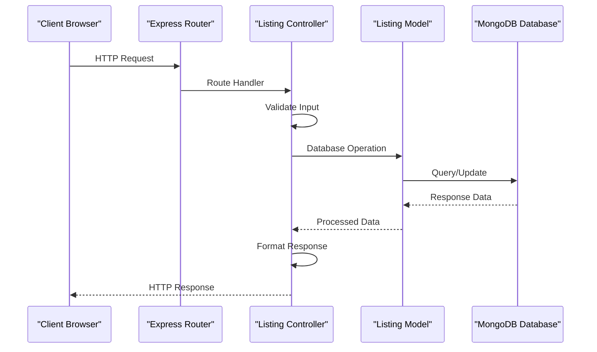
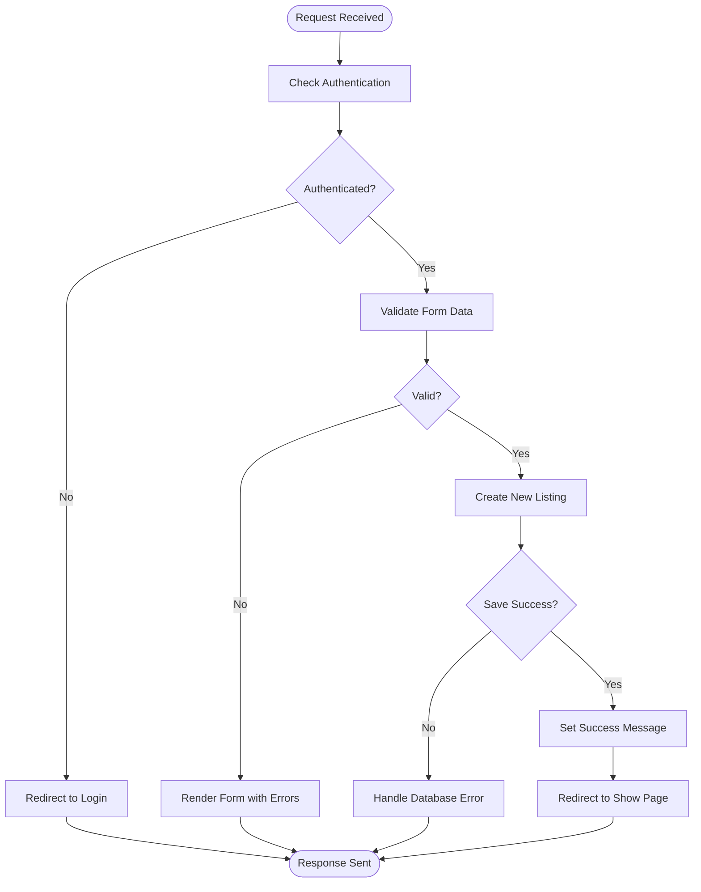
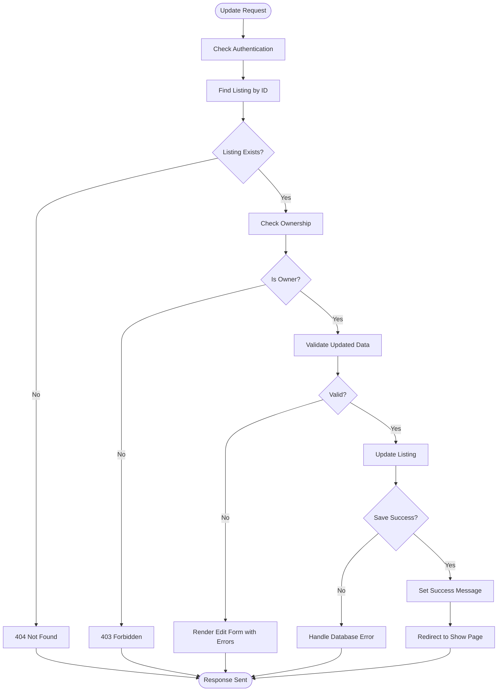
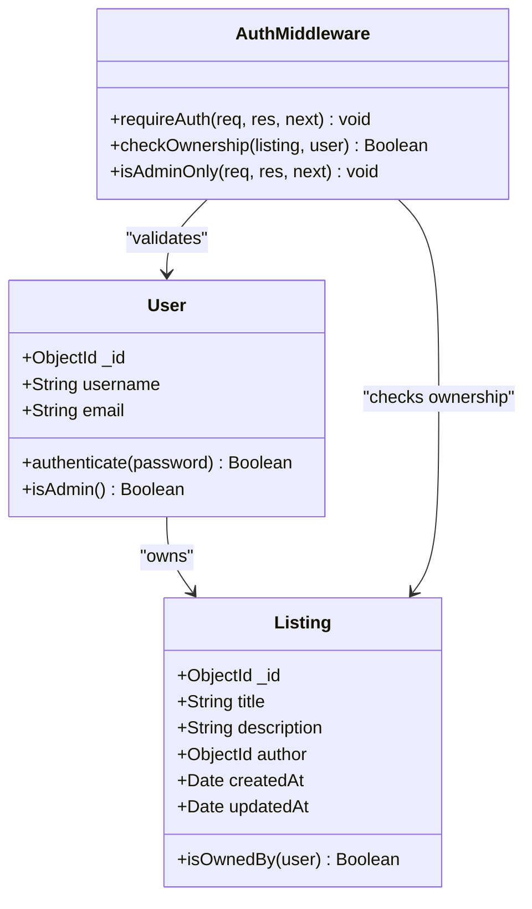
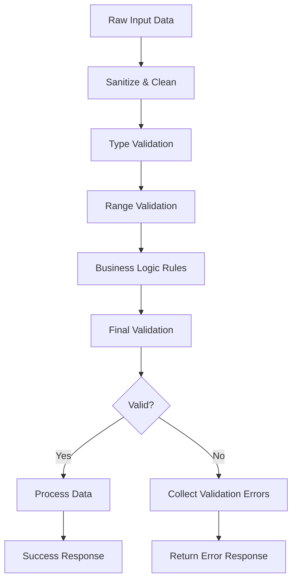
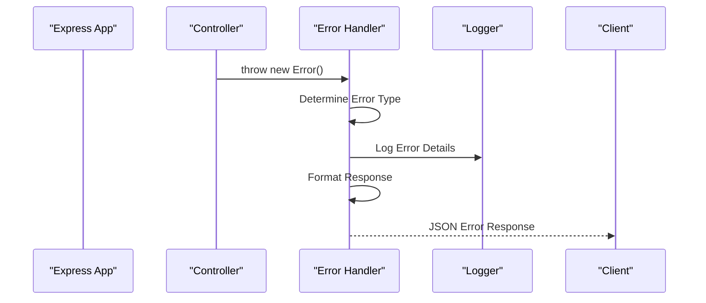

# CRUD Operations

<cite>
**Referenced Files in This Document**
- [controllers/listings.js](file://controllers/listings.js)
- [routes/listings.js](file://routes/listings.js)
- [models/listing.js](file://models/listing.js)
- [middleware.js](file://middleware.js)
- [Schema.js](file://Schema.js)
- [views/listings/new.ejs](file://views/listings/new.ejs)
- [views/listings/edit.ejs](file://views/listings/edit.ejs)
- [views/listings/index.ejs](file://views/listings/index.ejs)
- [views/listings/show.ejs](file://views/listings/show.ejs)
- [utils/ExpressError.js](file://utils/ExpressError.js)
- [utils/wrapAsync.js](file://utils/wrapAsync.js)
</cite>

## Table of Contents
1. [Introduction](#introduction)
2. [Project Structure](#project-structure)
3. [Core Components](#core-components)
4. [Architecture Overview](#architecture-overview)
5. [Detailed Component Analysis](#detailed-component-analysis)
6. [Authentication and Authorization](#authentication-and-authorization)
7. [Request/Response Patterns](#requestresponse-patterns)
8. [Validation Rules](#validation-rules)
9. [Error Handling](#error-handling)
10. [Performance Considerations](#performance-considerations)
11. [Troubleshooting Guide](#troubleshooting-guide)
12. [Conclusion](#conclusion)

## Introduction

This document provides comprehensive documentation for implementing CRUD (Create, Read, Update, Delete) operations in a Node.js/Express application with MongoDB/Mongoose. The documentation covers complete workflows including route definitions, controller methods, business logic, authentication requirements, authorization checks, validation rules, and error handling patterns.

The application follows a standard MVC architecture pattern with separate concerns for routes, controllers, models, and views, ensuring maintainable and scalable code organization.

## Project Structure

The application follows a feature-based organization with clear separation of concerns:



**Diagram sources**
- [controllers/listings.js](file://controllers/listings.js)
- [routes/listings.js](file://routes/listings.js)
- [models/listing.js](file://models/listing.js)
- [middleware.js](file://middleware.js)

## Core Components

### Listing Model Schema

The listing model defines the data structure and validation rules for listings in the application. It includes fields for title, description, price, location, country, image URL, and timestamps.

**Key Features:**
- Required field validation
- Default value assignments
- Timestamp management
- Reference relationships with other models

### Controller Architecture

The listing controller implements all CRUD operations with proper error handling, validation, and business logic. Each method follows consistent patterns for request processing and response formatting.

**Section sources**
- [models/listing.js](file://models/listing.js)
- [controllers/listings.js](file://controllers/listings.js)

## Architecture Overview

The application follows a layered architecture pattern with clear separation between presentation, business logic, and data access layers.



**Diagram sources**
- [routes/listings.js](file://routes/listings.js)
- [controllers/listings.js](file://controllers/listings.js)
- [models/listing.js](file://models/listing.js)

## Detailed Component Analysis

### Create Operation (POST /listings/new)

The create operation handles new listing creation with form validation and data persistence.

#### Route Definition
- **Method**: POST
- **Path**: `/listings/new`
- **Authentication**: Required
- **Authorization**: Any authenticated user

#### Controller Method Flow



**Diagram sources**
- [controllers/listings.js](file://controllers/listings.js)
- [middleware.js](file://middleware.js)

#### Request/Response Pattern

**Request Body:**
```json
{
  "title": "String - Required",
  "description": "String - Required", 
  "price": "Number - Required",
  "location": "String - Required",
  "country": "String - Required",
  "image": "File - Optional"
}
```

**Success Response:**
- Status Code: 302 Found
- Location Header: `/listings/{id}`
- Flash Message: Success notification

**Error Response:**
- Status Code: 400 Bad Request
- Content Type: text/html
- Body: Form with validation errors

**Section sources**
- [routes/listings.js](file://routes/listings.js)
- [controllers/listings.js](file://controllers/listings.js)
- [views/listings/new.ejs](file://views/listings/new.ejs)

### Read Operations (GET /listings)

The read operations handle listing retrieval for display, editing, and deletion.

#### List All Listings (GET /listings)

**Route Configuration:**
- **Method**: GET
- **Path**: `/listings`
- **Authentication**: Optional
- **Authorization**: Public access

**Query Parameters:**
- `page`: Integer - Pagination page number
- `limit`: Integer - Items per page
- `search`: String - Search query
- `sort`: String - Sort field

**Response Format:**
```json
{
  "listings": [Array of Listing Objects],
  "pagination": {
    "currentPage": Number,
    "totalPages": Number,
    "totalItems": Number
  }
}
```

#### Get Single Listing (GET /listings/:id)

**Route Configuration:**
- **Method**: GET  
- **Path**: `/listings/:id`
- **Authentication**: Optional
- **Authorization**: Public access

**URL Parameters:**
- `id`: String - MongoDB ObjectId

**Response Format:**
```json
{
  "listing": Listing Object,
  "isOwner": Boolean,
  "averageRating": Number,
  "reviewCount": Number
}
```

**Section sources**
- [routes/listings.js](file://routes/listings.js)
- [controllers/listings.js](file://controllers/listings.js)
- [views/listings/index.ejs](file://views/listings/index.ejs)
- [views/listings/show.ejs](file://views/listings/show.ejs)

### Update Operation (PUT /listings/:id/edit)

The update operation handles modification of existing listings with ownership verification.

#### Route Definition
- **Method**: PUT/PATCH
- **Path**: `/listings/:id/edit`
- **Authentication**: Required
- **Authorization**: Owner only

#### Ownership Verification Flow



**Diagram sources**
- [controllers/listings.js](file://controllers/listings.js)
- [middleware.js](file://middleware.js)

**Section sources**
- [routes/listings.js](file://routes/listings.js)
- [controllers/listings.js](file://controllers/listings.js)
- [views/listings/edit.ejs](file://views/listings/edit.ejs)

### Delete Operation (DELETE /listings/:id)

The delete operation removes listings with strict ownership verification.

#### Route Definition
- **Method**: DELETE
- **Path**: `/listings/:id`
- **Authentication**: Required
- **Authorization**: Owner only

#### Security Considerations

**CSRF Protection:**
- Token validation required
- Same-origin policy enforcement

**Ownership Verification:**
- User session validation
- Listing ownership check
- Cascade deletion handling

**Section sources**
- [routes/listings.js](file://routes/listings.js)
- [controllers/listings.js](file://controllers/listings.js)

## Authentication and Authorization

### Authentication Requirements

All write operations (Create, Update, Delete) require user authentication through session-based authentication middleware.

**Authentication Middleware Stack:**
1. Session initialization
2. User deserialization from session
3. Passport.js strategy validation
4. CSRF token verification

### Authorization Checks

#### Ownership Verification Pattern



**Diagram sources**
- [models/user.js](file://models/user.js)
- [models/listing.js](file://models/listing.js)
- [middleware.js](file://middleware.js)

### Permission Matrix

| Operation | Authentication | Authorization | Description |
|-----------|---------------|---------------|-------------|
| GET /listings | Optional | None | View all listings |
| GET /listings/:id | Optional | None | View single listing |
| POST /listings/new | Required | None | Create new listing |
| PUT /listings/:id | Required | Owner Only | Update listing |
| DELETE /listings/:id | Required | Owner Only | Delete listing |

**Section sources**
- [middleware.js](file://middleware.js)
- [models/user.js](file://models/user.js)

## Request/Response Patterns

### Standard Response Format

All API responses follow a consistent format for better client-side handling:

```json
{
  "success": Boolean,
  "data": Any,
  "message": String,
  "errors": Array,
  "meta": {
    "timestamp": String,
    "version": String
  }
}
```

### Error Response Format

```json
{
  "success": false,
  "message": "Error description",
  "errors": [
    {
      "field": String,
      "message": String,
      "code": String
    }
  ],
  "meta": {
    "errorCode": String,
    "timestamp": String
  }
}
```

### File Upload Handling

For image uploads, the application uses multipart/form-data encoding with file size limits and type validation.

**Section sources**
- [controllers/listings.js](file://controllers/listings.js)
- [utils/ExpressError.js](file://utils/ExpressError.js)

## Validation Rules

### Server-Side Validation

The application implements comprehensive server-side validation using schema definitions and custom validators.

#### Listing Creation Validation

| Field | Type | Required | Min Length | Max Length | Custom Rules |
|-------|------|----------|------------|------------|--------------|
| title | String | Yes | 3 | 100 | Unique, alphanumeric |
| description | String | Yes | 10 | 5000 | HTML sanitization |
| price | Number | Yes | 0 | 999999.99 | Positive decimal |
| location | String | Yes | 2 | 100 | Alphanumeric with spaces |
| country | String | Yes | 2 | 50 | ISO country code |
| image | File | No | - | 5MB | JPG, PNG, WebP |

#### Custom Validators



**Diagram sources**
- [Schema.js](file://Schema.js)
- [controllers/listings.js](file://controllers/listings.js)

**Section sources**
- [Schema.js](file://Schema.js)
- [models/listing.js](file://models/listing.js)

## Error Handling

### Centralized Error Management

The application implements a centralized error handling system using Express middleware and custom error classes.

#### Error Types

| Error Class | HTTP Status | Description | Common Causes |
|-------------|-------------|-------------|---------------|
| ExpressError | 400/404/500 | General application errors | Invalid input, not found |
| ValidationError | 422 | Data validation failures | Missing fields, invalid formats |
| AuthError | 401 | Authentication failures | Invalid credentials, expired sessions |
| AuthzError | 403 | Authorization failures | Insufficient permissions |
| DatabaseError | 500 | Database operation failures | Connection issues, constraint violations |

#### Error Response Middleware



**Diagram sources**
- [utils/ExpressError.js](file://utils/ExpressError.js)
- [controllers/listings.js](file://controllers/listings.js)

**Section sources**
- [utils/ExpressError.js](file://utils/ExpressError.js)
- [utils/wrapAsync.js](file://utils/wrapAsync.js)

## Performance Considerations

### Database Query Optimization

- **Index Usage**: Proper indexing on frequently queried fields
- **Query Projection**: Select only required fields
- **Pagination**: Implement cursor-based pagination for large datasets
- **Caching**: Redis caching for frequently accessed listings

### Memory Management

- **Stream Processing**: Use streams for large file uploads
- **Connection Pooling**: Configure optimal database connection pool size
- **Garbage Collection**: Monitor and optimize memory usage patterns

### Response Optimization

- **Compression**: Enable gzip compression for responses
- **Caching Headers**: Implement appropriate cache-control headers
- **Lazy Loading**: Load related data on demand

## Troubleshooting Guide

### Common Issues and Solutions

#### Authentication Problems

**Symptoms:**
- Users unable to access protected routes
- Session expiration errors
- CSRF token validation failures

**Solutions:**
- Verify session configuration
- Check cookie settings and domain restrictions
- Ensure CSRF tokens are properly generated and validated

#### Database Connection Issues

**Symptoms:**
- Connection timeout errors
- Query execution failures
- Memory allocation errors

**Solutions:**
- Verify MongoDB connection string
- Check database server availability
- Review connection pool configuration

#### Validation Errors

**Symptoms:**
- Form submission failures
- Unexpected data rejections
- Inconsistent validation behavior

**Solutions:**
- Review schema definitions
- Check client-side vs server-side validation consistency
- Verify data transformation pipelines

**Section sources**
- [utils/ExpressError.js](file://utils/ExpressError.js)
- [controllers/listings.js](file://controllers/listings.js)

## Conclusion

This comprehensive documentation covers the complete implementation of CRUD operations in the Node.js/Express application. The system follows industry best practices for security, performance, and maintainability while providing a robust foundation for listing management functionality.

Key architectural decisions include:
- Separation of concerns through MVC pattern
- Comprehensive authentication and authorization
- Centralized error handling and logging
- Consistent request/response formatting
- Scalable database query patterns

The implementation ensures data integrity, security, and excellent user experience while maintaining code quality and testability standards.