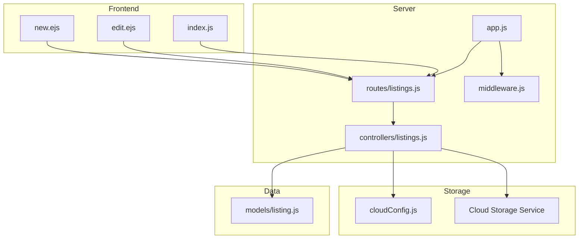
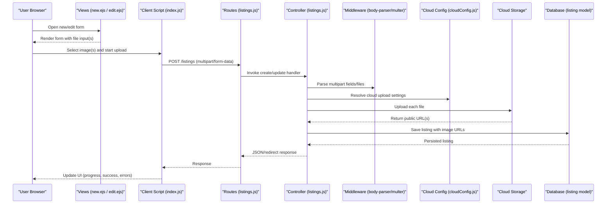
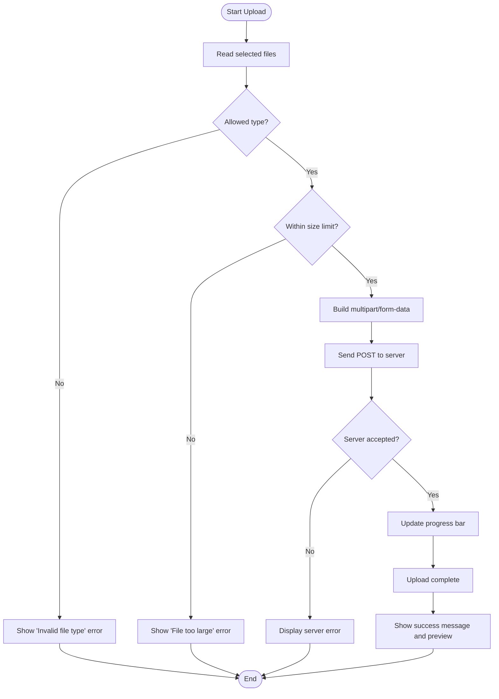
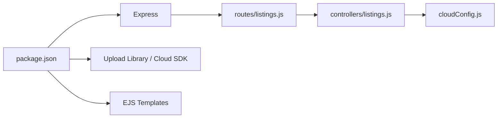

# Image Upload and Cloud Storage

<cite>
**Referenced Files in This Document**
- [app.js](file://app.js)
- [cloudConfig.js](file://cloudConfig.js)
- [middleware.js](file://middleware.js)
- [controllers/listings.js](file://controllers/listings.js)
- [routes/listings.js](file://routes/listings.js)
- [models/listing.js](file://models/listing.js)
- [views/listings/new.ejs](file://views/listings/new.ejs)
- [views/listings/edit.ejs](file://views/listings/edit.ejs)
- [public/css/js/index.js](file://public/css/js/index.js)
- [package.json](file://package.json)
</cite>

## Table of Contents
1. [Introduction](#introduction)
2. [Project Structure](#project-structure)
3. [Core Components](#core-components)
4. [Architecture Overview](#architecture-overview)
5. [Detailed Component Analysis](#detailed-component-analysis)
6. [Dependency Analysis](#dependency-analysis)
7. [Performance Considerations](#performance-considerations)
8. [Troubleshooting Guide](#troubleshooting-guide)
9. [Conclusion](#conclusion)
10. [Appendices](#appendices)

## Introduction
This document explains the image upload functionality and cloud storage integration across the application. It covers how images are uploaded from forms, validated and secured on the server, stored in a cloud service, and referenced by listings. It also includes guidance for handling multiple images, progress tracking, error scenarios, file size limits, supported formats, and optimization techniques.

## Project Structure
The image upload feature spans several layers:
- Frontend forms to select and submit images
- Client-side scripts to handle progress and errors
- Server routes and controllers to process uploads
- Middleware to parse multipart/form-data and enforce security
- Cloud configuration for storage credentials and options
- Data models to persist image URLs

**Diagram sources**
- [app.js](file://app.js)
- [routes/listings.js](file://routes/listings.js)
- [controllers/listings.js](file://controllers/listings.js)
- [middleware.js](file://middleware.js)
- [cloudConfig.js](file://cloudConfig.js)
- [models/listing.js](file://models/listing.js)
- [views/listings/new.ejs](file://views/listings/new.ejs)
- [views/listings/edit.ejs](file://views/listings/edit.ejs)
- [public/css/js/index.js](file://public/css/js/index.js)

**Section sources**
- [app.js](file://app.js)
- [routes/listings.js](file://routes/listings.js)
- [controllers/listings.js](file://controllers/listings.js)
- [middleware.js](file://middleware.js)
- [cloudConfig.js](file://cloudConfig.js)
- [models/listing.js](file://models/listing.js)
- [views/listings/new.ejs](file://views/listings/new.ejs)
- [views/listings/edit.ejs](file://views/listings/edit.ejs)
- [public/css/js/index.js](file://public/css/js/index.js)

## Core Components
- Cloud configuration module defines credentials and upload options for the cloud storage provider.
- Listing controller implements endpoints to create and update listings with one or more images.
- Routes expose HTTP endpoints that accept multipart/form-data submissions.
- Middleware configures body parsing and may include upload-specific middleware.
- Models store listing data including references to image URLs.
- Views provide forms for selecting images and display existing images.
- Client script handles upload progress, success, and error feedback.

Key responsibilities:
- Validate and sanitize incoming files (type, size).
- Stream uploads to cloud storage and capture public URLs.
- Persist image URLs in the database.
- Return user-friendly responses and errors.

**Section sources**
- [cloudConfig.js](file://cloudConfig.js)
- [controllers/listings.js](file://controllers/listings.js)
- [routes/listings.js](file://routes/listings.js)
- [middleware.js](file://middleware.js)
- [models/listing.js](file://models/listing.js)
- [views/listings/new.ejs](file://views/listings/new.ejs)
- [views/listings/edit.ejs](file://views/listings/edit.ejs)
- [public/css/js/index.js](file://public/css/js/index.js)

## Architecture Overview
The upload flow integrates client forms, server routes/controllers, cloud storage, and the database.

**Diagram sources**
- [views/listings/new.ejs](file://views/listings/new.ejs)
- [views/listings/edit.ejs](file://views/listings/edit.ejs)
- [public/css/js/index.js](file://public/css/js/index.js)
- [routes/listings.js](file://routes/listings.js)
- [controllers/listings.js](file://controllers/listings.js)
- [middleware.js](file://middleware.js)
- [cloudConfig.js](file://cloudConfig.js)
- [models/listing.js](file://models/listing.js)

## Detailed Component Analysis

### Cloud Configuration
- Purpose: Centralize cloud storage credentials and upload options such as folder path, access control, and metadata.
- Typical keys: API key/secret, bucket/container name, region, and optional transformation parameters.
- Security: Load secrets from environment variables; avoid hardcoding values.

Best practices:
- Use environment-specific configurations.
- Restrict permissions to only required operations.
- Enable secure defaults (e.g., private buckets with signed URLs if needed).

**Section sources**
- [cloudConfig.js](file://cloudConfig.js)

### Upload Endpoints and Controllers
- Create listing endpoint accepts one or more images via multipart/form-data.
- Update listing endpoint allows adding/removing images.
- Controller validates inputs, streams files to cloud storage, captures URLs, and persists them.

Validation and security measures:
- Enforce allowed MIME types (e.g., JPEG, PNG, WebP).
- Enforce maximum file size per file and total payload.
- Sanitize filenames and prevent directory traversal.
- Reject empty or corrupted files.
- Rate-limit or throttle uploads if necessary.

Error handling:
- Return descriptive errors for invalid files, size exceeded, or cloud failures.
- Roll back partial uploads when possible.

**Section sources**
- [routes/listings.js](file://routes/listings.js)
- [controllers/listings.js](file://controllers/listings.js)

### Middleware and Body Parsing
- Configure multipart/form-data parsing with size limits.
- Optionally integrate an upload library to stream files directly to cloud storage.
- Apply global security headers and CORS as needed.

Security considerations:
- Limit request size globally and per field.
- Whitelist content types.
- Ensure streaming to avoid loading entire files into memory.

**Section sources**
- [middleware.js](file://middleware.js)
- [app.js](file://app.js)

### Data Model and Persistence
- Listing model stores image URLs in an array or reference field.
- On create/update, controller writes URLs after successful cloud upload.
- On delete, consider removing files from cloud storage and updating the model.

Indexes and queries:
- Index frequently queried fields (e.g., owner, tags).
- Avoid storing large binary data in the database.

**Section sources**
- [models/listing.js](file://models/listing.js)

### Frontend Forms and Client-Side Handling
- Forms use enctype="multipart/form-data" and allow multiple files.
- Client script shows progress bars, handles retries, and displays errors.
- Provide previews before upload to improve UX.

Accessibility and UX:
- Clear labels and instructions.
- Show file type and size constraints.
- Allow drag-and-drop and multi-select.

**Section sources**
- [views/listings/new.ejs](file://views/listings/new.ejs)
- [views/listings/edit.ejs](file://views/listings/edit.ejs)
- [public/css/js/index.js](file://public/css/js/index.js)

### Upload Flow Algorithm

[No sources needed since this diagram shows conceptual workflow, not actual code structure]

## Dependency Analysis
External dependencies related to uploads and cloud storage are declared in the package manifest. The application uses Express, a templating engine, and likely a cloud SDK or upload helper.

**Diagram sources**
- [package.json](file://package.json)
- [routes/listings.js](file://routes/listings.js)
- [controllers/listings.js](file://controllers/listings.js)
- [cloudConfig.js](file://cloudConfig.js)

**Section sources**
- [package.json](file://package.json)

## Performance Considerations
- Stream uploads directly to cloud storage to minimize memory usage.
- Set appropriate timeouts and retry policies for network calls.
- Compress or resize images on the server or via cloud transformations where possible.
- Use CDN caching for static image delivery.
- Implement pagination and lazy loading for listing galleries.
- Monitor upload throughput and adjust concurrency limits.

[No sources needed since this section provides general guidance]

## Troubleshooting Guide
Common issues and resolutions:
- Invalid file type: Ensure whitelist matches expected MIME types and extensions.
- File too large: Adjust server and client limits consistently.
- Network errors: Implement retries with exponential backoff and show meaningful messages.
- Missing credentials: Verify environment variables and cloud permissions.
- Partial uploads: Detect incomplete uploads and prompt re-upload.
- CORS and CSRF: Configure CORS appropriately and protect state-changing routes.

Operational checks:
- Inspect server logs for upload errors.
- Validate cloud storage ACLs and bucket policies.
- Confirm that the app can reach the cloud endpoint.

**Section sources**
- [controllers/listings.js](file://controllers/listings.js)
- [middleware.js](file://middleware.js)
- [cloudConfig.js](file://cloudConfig.js)

## Conclusion
The image upload system combines secure frontend forms, robust server-side validation, streaming uploads to cloud storage, and persistent URL references in the database. By enforcing strict validation, using environment-based configuration, and optimizing performance, the application delivers a reliable and scalable image management experience.

[No sources needed since this section summarizes without analyzing specific files]

## Appendices

### Supported Formats and Limits
- Recommended formats: JPEG, PNG, WebP.
- Maximum file size: Define per-file and total payload limits based on server capacity and business needs.
- Max number of images per listing: Enforce at both client and server.

[No sources needed since this section provides general guidance]

### Example Scenarios
- Multiple images upload:
  - Form allows selecting multiple files.
  - Client sends a single multipart request with all files.
  - Server processes each file, uploads to cloud, and saves all URLs.
- Progress tracking:
  - Client updates progress bar during upload.
  - Displays percentage and estimated time remaining.
- Error scenarios:
  - Invalid type or oversized file triggers immediate client-side feedback.
  - Server returns structured error details for handling.

[No sources needed since this section provides general guidance]