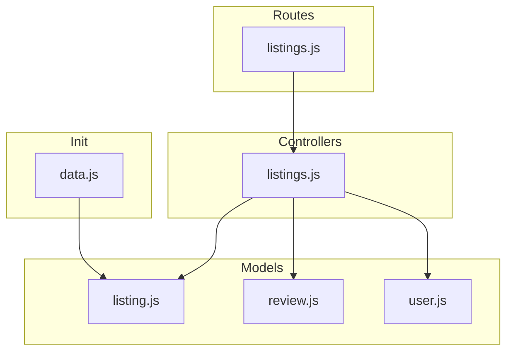
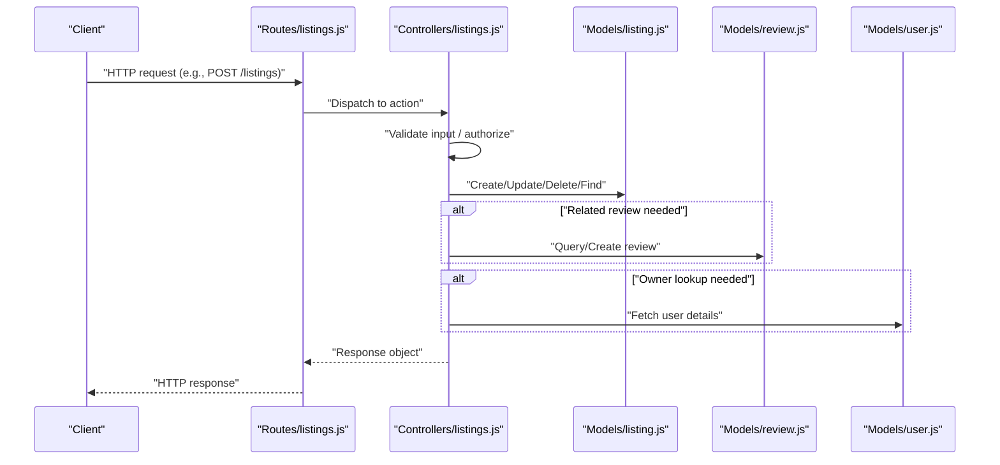
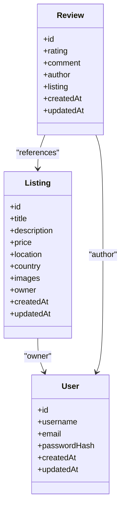

# Listing Model and Schema

<cite>
**Referenced Files in This Document**
- [models/listing.js](file://models/listing.js)
- [models/review.js](file://models/review.js)
- [models/user.js](file://models/user.js)
- [controllers/listings.js](file://controllers/listings.js)
- [routes/listings.js](file://routes/listings.js)
- [init/data.js](file://init/data.js)
</cite>

## Table of Contents
1. [Introduction](#introduction)
2. [Project Structure](#project-structure)
3. [Core Components](#core-components)
4. [Architecture Overview](#architecture-overview)
5. [Detailed Component Analysis](#detailed-component-analysis)
6. [Dependency Analysis](#dependency-analysis)
7. [Performance Considerations](#performance-considerations)
8. [Troubleshooting Guide](#troubleshooting-guide)
9. [Conclusion](#conclusion)

## Introduction
This document describes the listing data model and schema design, including fields, types, validation rules, constraints, relationships with other models (User, Review), indexing strategies, default values, business rule validations, example structures, and common query patterns. It is intended for developers and maintainers who need to understand how listings are modeled and persisted.

## Project Structure
The listing-related code spans models, controllers, routes, and seed data:
- Data modeling and validation live in the models directory.
- HTTP request handling and orchestration live in controllers and routes.
- Seed data provides example listings used during development or initialization.

**Diagram sources**
- [models/listing.js](file://models/listing.js)
- [models/review.js](file://models/review.js)
- [models/user.js](file://models/user.js)
- [controllers/listings.js](file://controllers/listings.js)
- [routes/listings.js](file://routes/listings.js)
- [init/data.js](file://init/data.js)

**Section sources**
- [models/listing.js](file://models/listing.js)
- [models/review.js](file://models/review.js)
- [models/user.js](file://models/user.js)
- [controllers/listings.js](file://controllers/listings.js)
- [routes/listings.js](file://routes/listings.js)
- [init/data.js](file://init/data.js)

## Core Components
- Listing model defines the schema for a listing entity, including field definitions, validators, and defaults.
- Review model defines reviews associated with listings.
- User model defines users who can own listings and create reviews.
- Listings controller orchestrates CRUD operations and applies validation/middleware.
- Listings routes map HTTP endpoints to controller actions.
- Seed data populates initial listings for development.

Key responsibilities:
- Models: Define schemas, validate inputs, enforce constraints, and manage relationships.
- Controllers: Handle request/response flow, apply authorization checks, and coordinate model interactions.
- Routes: Expose RESTful endpoints that delegate to controllers.
- Init: Provide sample data to bootstrap the application.

**Section sources**
- [models/listing.js](file://models/listing.js)
- [models/review.js](file://models/review.js)
- [models/user.js](file://models/user.js)
- [controllers/listings.js](file://controllers/listings.js)
- [routes/listings.js](file://routes/listings.js)
- [init/data.js](file://init/data.js)

## Architecture Overview
The listing subsystem follows a layered architecture:
- Routes receive HTTP requests and call controller methods.
- Controllers perform authorization, input validation, and orchestrate model operations.
- Models implement persistence logic and validation rules.
- Reviews and Users are related entities referenced by listings.

**Diagram sources**
- [routes/listings.js](file://routes/listings.js)
- [controllers/listings.js](file://controllers/listings.js)
- [models/listing.js](file://models/listing.js)
- [models/review.js](file://models/review.js)
- [models/user.js](file://models/user.js)

## Detailed Component Analysis

### Listing Model and Schema
The listing model defines the structure and behavior of a listing record. Typical aspects include:
- Fields: title, description, price, location, country, image URL(s), coordinates (optional), timestamps, and owner reference.
- Data types: strings, numbers, arrays, references to other models, and timestamps.
- Validation rules: required fields, length limits, numeric ranges, format checks (e.g., email-like or URL formats if applicable).
- Constraints: uniqueness on certain fields (e.g., slug or title within a user), referential integrity with User and Review.
- Defaults: createdAt and updatedAt timestamps, status flags, and possibly empty arrays for images.

Relationships:
- Owner: A listing belongs to a User via a foreign key reference.
- Reviews: A listing has many Review records; each review references a listing and an author (User).

Indexing strategy:
- Primary key on listing ID.
- Indexes on frequently queried fields such as owner reference, location/country, price range, and timestamps.
- Compound indexes for common filters (e.g., country + price range, owner + created date).

Business rule validations:
- Price must be positive and within allowed bounds.
- Title and description must meet minimum/maximum lengths.
- Location and country should not be empty when required.
- Ownership checks: only the owner (or authorized user) can update/delete a listing.

Example listing data structure (conceptual):
- id: unique identifier
- title: string
- description: string
- price: number
- location: string
- country: string
- images: array of URLs
- owner: reference to User
- createdAt: timestamp
- updatedAt: timestamp

Common query patterns:
- Find all listings by owner.
- Filter listings by country and price range.
- Paginated listing index sorted by newest first.
- Get a single listing by ID with populated owner and review counts.

**Section sources**
- [models/listing.js](file://models/listing.js)
- [controllers/listings.js](file://controllers/listings.js)
- [routes/listings.js](file://routes/listings.js)
- [init/data.js](file://init/data.js)

### Review Model and Schema
The review model captures feedback for listings:
- Fields: rating (numeric), comment (string), author reference (User), listing reference (Listing), timestamps.
- Validation: rating within a valid range, non-empty comment if required, referential integrity with Listing and User.
- Relationships: belongs to Listing and User.

Indexing strategy:
- Index on listing reference for fast retrieval of reviews per listing.
- Index on author reference for user-specific review queries.
- Optional compound index on listing + author to prevent duplicate reviews.

Business rule validations:
- Rating must be within defined bounds.
- Prevent duplicate reviews from the same user on the same listing.

**Section sources**
- [models/review.js](file://models/review.js)
- [controllers/listings.js](file://controllers/listings.js)

### User Model and Schema
The user model represents system users:
- Fields: username/email, password hash, profile info, timestamps.
- Validation: unique username/email, password strength requirements.
- Relationships: owns many listings; authors many reviews.

Indexing strategy:
- Unique index on username/email.
- Index on createdAt for activity-based queries.

**Section sources**
- [models/user.js](file://models/user.js)
- [controllers/listings.js](file://controllers/listings.js)

### Controller and Route Integration
The listings controller implements CRUD operations and enforces business rules:
- Create: validates input, associates owner, persists listing.
- Read: retrieves listing by ID, optionally populates owner and review statistics.
- Update: ensures ownership/authorization before modifying.
- Delete: ensures ownership/authorization before removal.
- Reviews integration: creates or updates reviews linked to listings.

Routes expose endpoints that map to controller actions, enabling standard RESTful interactions.

**Section sources**
- [controllers/listings.js](file://controllers/listings.js)
- [routes/listings.js](file://routes/listings.js)

### Seed Data Usage
Seed data provides example listings to bootstrap the application:
- Populates initial listings with realistic values.
- Useful for local development and testing.

**Section sources**
- [init/data.js](file://init/data.js)

## Dependency Analysis
The listing subsystem depends on related models and uses controllers/routes to mediate external access.

**Diagram sources**
- [models/listing.js](file://models/listing.js)
- [models/review.js](file://models/review.js)
- [models/user.js](file://models/user.js)

**Section sources**
- [models/listing.js](file://models/listing.js)
- [models/review.js](file://models/review.js)
- [models/user.js](file://models/user.js)

## Performance Considerations
- Use appropriate indexes on owner, location/country, price, and timestamps to optimize filtering and sorting.
- Avoid N+1 queries by populating related data (owner, review counts) in bulk where possible.
- Implement pagination for listing indexes to reduce payload size.
- Cache frequently accessed listing details and aggregated metrics (e.g., average rating) if read-heavy.

[No sources needed since this section provides general guidance]

## Troubleshooting Guide
Common issues and resolutions:
- Validation errors: ensure required fields are present and conform to type/format constraints.
- Authorization failures: verify the requesting user is the listing owner or has permission.
- Duplicate reviews: check constraints preventing multiple reviews from the same user on the same listing.
- Missing references: confirm owner exists before creating a listing; ensure listing exists before creating a review.

Operational checks:
- Inspect controller error handling paths for consistent responses.
- Validate database constraints and indexes after schema changes.

**Section sources**
- [controllers/listings.js](file://controllers/listings.js)

## Conclusion
The listing model is central to the application’s marketplace functionality, with clear relationships to User and Review models. Proper schema design, validation, and indexing ensure correctness, performance, and scalability. The controller and route layers provide a clean API surface while enforcing business rules and authorization.

[No sources needed since this section summarizes without analyzing specific files]