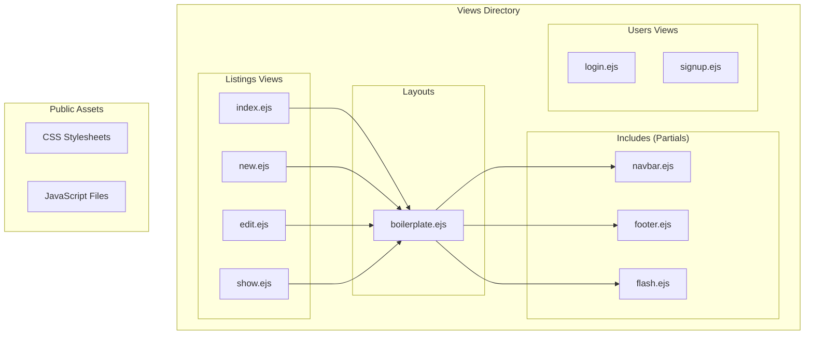
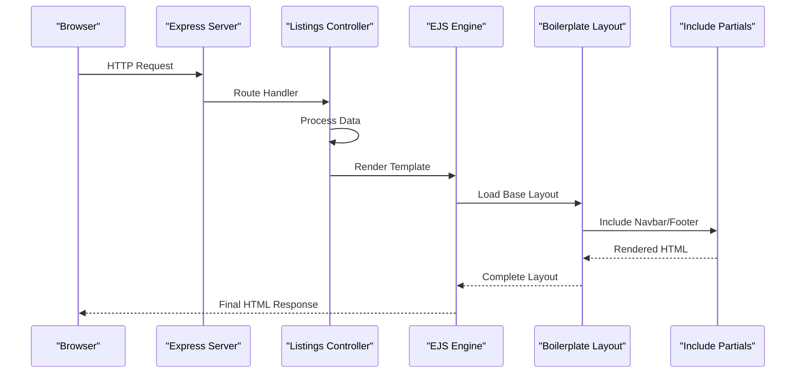
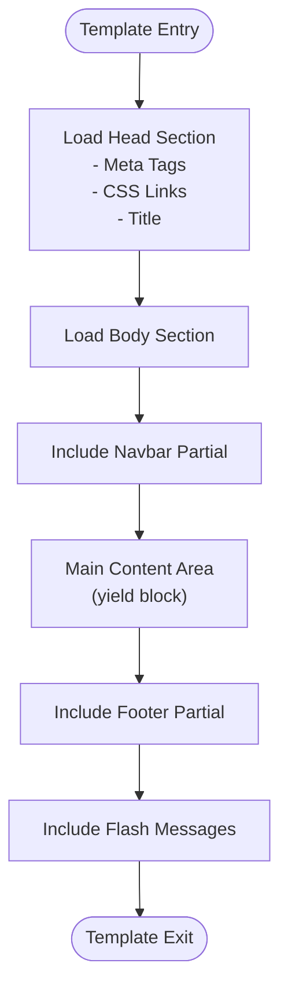
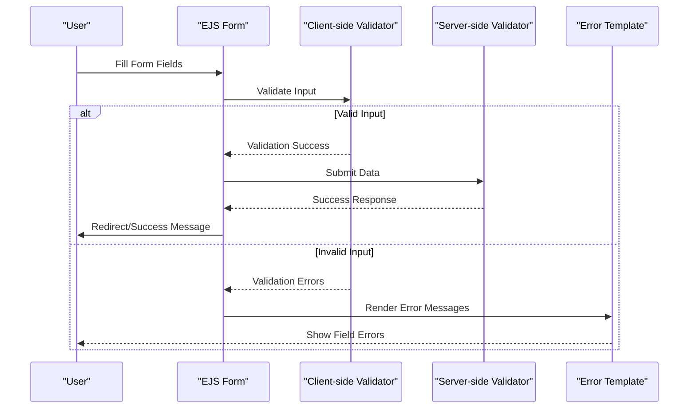
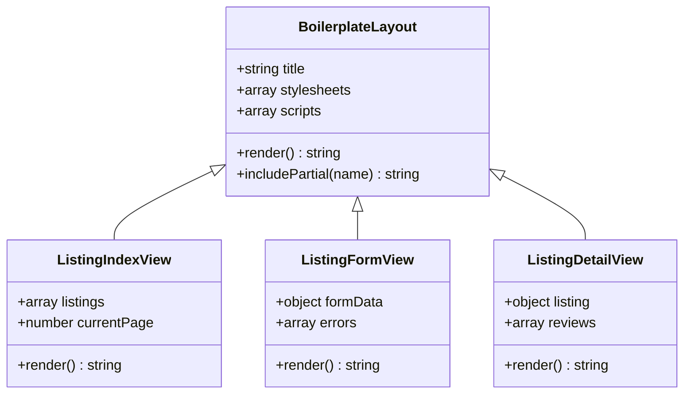
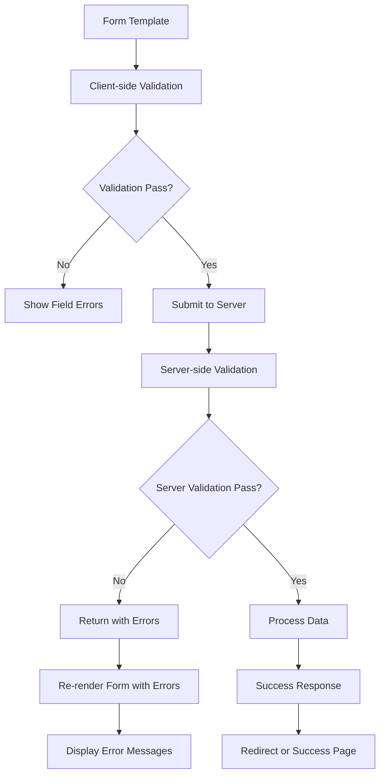
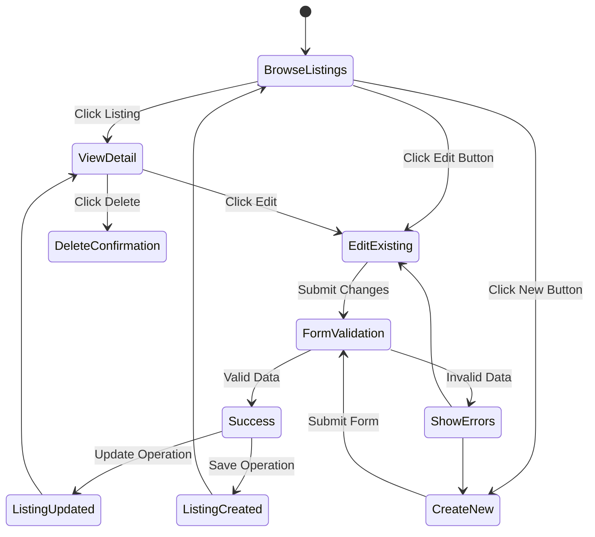

# Listing Templates and User Interface

<cite>
**Referenced Files in This Document**
- [boilerplate.ejs](file://views/layouts/boilerplate.ejs)
- [index.ejs](file://views/listings/index.ejs)
- [new.ejs](file://views/listings/new.ejs)
- [edit.ejs](file://views/listings/edit.ejs)
- [show.ejs](file://views/listings/show.ejs)
- [navbar.ejs](file://views/includes/navbar.ejs)
- [footer.ejs](file://views/includes/footer.ejs)
- [flash.ejs](file://views/includes/flash.ejs)
- [style.css](file://public/css/style.css)
- [rating.css](file://public/css/rating.css)
- [listings.js](file://controllers/listings.js)
- [listings.js](file://routes/listings.js)
</cite>

## Table of Contents
1. [Introduction](#introduction)
2. [Project Structure](#project-structure)
3. [Core Components](#core-components)
4. [Architecture Overview](#architecture-overview)
5. [Detailed Component Analysis](#detailed-component-analysis)
6. [Template Inheritance and Layout System](#template-inheritance-and-layout-system)
7. [Form Rendering and Data Binding](#form-rendering-and-data-binding)
8. [User Interaction Patterns](#user-interaction-patterns)
9. [Styling and Responsive Design](#styling-and-responsive-design)
10. [Template Customization Options](#template-customization-options)
11. [Performance Considerations](#performance-considerations)
12. [Troubleshooting Guide](#troubleshooting-guide)
13. [Conclusion](#conclusion)

## Introduction

This document provides comprehensive documentation for listing-related EJS templates and user interface components in the application. It covers template structure, layout inheritance, partial usage, form rendering, data binding, user interaction patterns, and responsive design considerations. The documentation aims to help developers understand how to customize and extend the listing functionality while maintaining consistency across the user interface.

## Project Structure

The listing templates follow a well-organized structure that separates concerns between layouts, partials, and page-specific content:



**Diagram sources**
- [boilerplate.ejs](file://views/layouts/boilerplate.ejs)
- [navbar.ejs](file://views/includes/navbar.ejs)
- [footer.ejs](file://views/includes/footer.ejs)
- [flash.ejs](file://views/includes/flash.ejs)

**Section sources**
- [boilerplate.ejs](file://views/layouts/boilerplate.ejs)
- [index.ejs](file://views/listings/index.ejs)
- [new.ejs](file://views/listings/new.ejs)
- [edit.ejs](file://views/listings/edit.ejs)
- [show.ejs](file://views/listings/show.ejs)

## Core Components

### Template Layout System

The application uses a master layout system where `boilerplate.ejs` serves as the main template wrapper. All listing views inherit from this base layout, ensuring consistent headers, footers, and overall page structure.

### Partial Components

The includes directory contains reusable UI components:
- **navbar.ejs**: Navigation menu component
- **footer.ejs**: Site footer with links and information
- **flash.ejs**: Flash message display system for user feedback

### Listing View Components

Each listing view serves a specific purpose:
- **index.ejs**: Displays all listings in a grid or list format
- **new.ejs**: Form for creating new listings
- **edit.ejs**: Form for editing existing listings
- **show.ejs**: Detailed view of individual listings

**Section sources**
- [boilerplate.ejs](file://views/layouts/boilerplate.ejs)
- [navbar.ejs](file://views/includes/navbar.ejs)
- [footer.ejs](file://views/includes/footer.ejs)
- [flash.ejs](file://views/includes/flash.ejs)

## Architecture Overview

The listing template architecture follows a hierarchical pattern with clear separation of concerns:



**Diagram sources**
- [listings.js](file://controllers/listings.js)
- [listings.js](file://routes/listings.js)
- [boilerplate.ejs](file://views/layouts/boilerplate.ejs)

## Detailed Component Analysis

### Master Layout Template (boilerplate.ejs)

The boilerplate template serves as the foundation for all pages in the application. It typically includes:

- HTML document structure with proper DOCTYPE and meta tags
- CSS stylesheet references
- JavaScript file includes
- Container divs for content injection
- Common structural elements

#### Layout Structure Pattern



**Diagram sources**
- [boilerplate.ejs](file://views/layouts/boilerplate.ejs)

### Index Page Template (index.ejs)

The index template displays all available listings with filtering and pagination capabilities.

#### Key Features:
- Dynamic listing grid generation
- Search and filter functionality
- Pagination controls
- Responsive card layout
- Image optimization

#### Data Binding Pattern:


**Diagram sources**
- [index.ejs](file://views/listings/index.ejs)

### Form Templates (new.ejs and edit.ejs)

Both form templates share similar structures but serve different purposes:

#### Form Structure Components:
- Input field validation
- Error message display
- Submit button handling
- File upload support
- Real-time validation feedback

#### Form Validation Flow:


**Diagram sources**
- [new.ejs](file://views/listings/new.ejs)
- [edit.ejs](file://views/listings/edit.ejs)

### Detail Page Template (show.ejs)

The show template provides detailed information about a single listing with rich media support.

#### Content Organization:
- Hero image gallery
- Detailed property information
- Review section integration
- Action buttons (edit/delete)
- Related listings suggestions

**Section sources**
- [boilerplate.ejs](file://views/layouts/boilerplate.ejs)
- [index.ejs](file://views/listings/index.ejs)
- [new.ejs](file://views/listings/new.ejs)
- [edit.ejs](file://views/listings/edit.ejs)
- [show.ejs](file://views/listings/show.ejs)

## Template Inheritance and Layout System

### Layout Inheritance Pattern

The application implements a clean template inheritance system where child templates extend the base boilerplate layout:



**Diagram sources**
- [boilerplate.ejs](file://views/layouts/boilerplate.ejs)
- [index.ejs](file://views/listings/index.ejs)
- [new.ejs](file://views/listings/new.ejs)
- [show.ejs](file://views/listings/show.ejs)

### Partial Reusability

Partials are included throughout the application to maintain consistency:

| Partial Name | Purpose | Usage Context |
|--------------|---------|---------------|
| navbar.ejs | Navigation menu | All authenticated pages |
| footer.ejs | Site footer | All pages |
| flash.ejs | User feedback messages | After form submissions |

**Section sources**
- [boilerplate.ejs](file://views/layouts/boilerplate.ejs)
- [navbar.ejs](file://views/includes/navbar.ejs)
- [footer.ejs](file://views/includes/footer.ejs)
- [flash.ejs](file://views/includes/flash.ejs)

## Form Rendering and Data Binding

### Form Data Flow

The application implements a comprehensive form handling system with client-side and server-side validation:



### Data Binding Patterns

#### List Rendering Pattern:
```javascript
// Typical data binding in listing templates
listings.forEach(listing => {
    // Create listing card element
    const card = createListingCard(listing);
    container.appendChild(card);
});
```

#### Form Data Binding:
```javascript
// Form field population for edit operations
function populateFormFields(listingData) {
    Object.keys(listingData).forEach(field => {
        const input = document.querySelector(`[name="${field}"]`);
        if (input) input.value = listingData[field];
    });
}
```

### Error Handling and Validation Feedback

The template system provides immediate feedback for form validation:

| Error Type | Display Method | User Experience |
|------------|----------------|-----------------|
| Required fields | Red border + error text | Immediate visual cue |
| Format validation | Inline error messages | Contextual guidance |
| Server errors | Flash message banner | Clear notification |
| Network errors | Toast notifications | Non-intrusive alerts |

**Section sources**
- [new.ejs](file://views/listings/new.ejs)
- [edit.ejs](file://views/listings/edit.ejs)
- [flash.ejs](file://views/includes/flash.ejs)

## User Interaction Patterns

### Listing Management Workflow



### Interactive Features

#### Real-time Validation:
- Input field validation on blur events
- Character count indicators for text areas
- Image preview for file uploads
- Auto-save functionality for long forms

#### Dynamic Content Loading:
- Lazy loading for listing images
- Infinite scroll for large listing collections
- Modal dialogs for quick actions
- AJAX-powered search and filtering

**Section sources**
- [index.ejs](file://views/listings/index.ejs)
- [show.ejs](file://views/listings/show.ejs)

## Styling and Responsive Design

### CSS Architecture

The application uses a modular CSS approach with separate files for different functionalities:

| CSS File | Purpose | Scope |
|----------|---------|-------|
| style.css | Global styles and utilities | Application-wide |
| rating.css | Star rating component styling | Review sections |
| custom.css | Theme-specific overrides | Visual customization |

### Responsive Design Implementation

#### Mobile-First Approach:
```css
/* Base mobile styles */
.listing-card {
    width: 100%;
    margin-bottom: 1rem;
}

/* Tablet breakpoint */
@media (min-width: 768px) {
    .listing-grid {
        display: grid;
        grid-template-columns: repeat(2, 1fr);
        gap: 1.5rem;
    }
}

/* Desktop breakpoint */
@media (min-width: 1024px) {
    .listing-grid {
        grid-template-columns: repeat(3, 1fr);
        gap: 2rem;
    }
}
```

#### Touch-Friendly Interactions:
- Minimum touch target size of 44x44 pixels
- Swipe gestures for image galleries
- Pull-to-refresh functionality
- Bottom navigation for mobile devices

### Accessibility Features

- Semantic HTML structure
- ARIA labels for interactive elements
- Keyboard navigation support
- Screen reader compatibility
- High contrast mode support

**Section sources**
- [style.css](file://public/css/style.css)
- [rating.css](file://public/css/rating.css)

## Template Customization Options

### Configuration Points

#### Layout Customization:
- Header and footer content modification
- Navigation menu structure
- Sidebar widget inclusion
- Branding and logo updates

#### Styling Customization:
- Color scheme variables
- Typography settings
- Spacing and layout parameters
- Component appearance overrides

### Extension Points

#### Adding New Listing Fields:
1. Update database schema
2. Modify form templates
3. Add validation rules
4. Update display templates
5. Extend API endpoints

#### Creating Custom Components:
1. Create new partial template
2. Define CSS styles
3. Implement JavaScript behavior
4. Integrate with existing layout

### Performance Optimization

#### Template Optimization Strategies:
- Use EJS includes for reusable components
- Implement lazy loading for heavy content
- Optimize image sizes and formats
- Minimize DOM manipulation

#### Caching Strategies:
- Browser caching for static assets
- Server-side template caching
- Database query optimization
- CDN integration for global distribution

**Section sources**
- [boilerplate.ejs](file://views/layouts/boilerplate.ejs)
- [style.css](file://public/css/style.css)

## Performance Considerations

### Template Rendering Optimization

#### Efficient Data Loading:
- Implement pagination for large datasets
- Use virtual scrolling for extensive lists
- Cache frequently accessed data
- Optimize database queries

#### Asset Optimization:
- Minify CSS and JavaScript files
- Compress images and use modern formats
- Implement code splitting for large applications
- Use browser caching headers

### Memory Management

#### Client-side Optimization:
- Clean up event listeners when removing elements
- Avoid memory leaks in dynamic content
- Implement proper garbage collection
- Monitor performance with browser dev tools

## Troubleshooting Guide

### Common Template Issues

#### Template Not Found Errors:
- Verify file paths in include statements
- Check template engine configuration
- Ensure proper file permissions
- Validate EJS syntax

#### Data Binding Problems:
- Inspect server response data structure
- Verify variable names match template expectations
- Check for undefined or null values
- Debug with console logging

#### Styling Conflicts:
- Use CSS specificity debugging tools
- Check for conflicting class names
- Verify CSS file loading order
- Test cross-browser compatibility

### Debugging Techniques

#### Template Debugging:
```javascript
// Enable debug mode in development
app.set('view options', {
    debug: true
});

// Log template rendering times
app.use((req, res, next) => {
    const start = Date.now();
    res.on('finish', () => {
        const duration = Date.now() - start;
        console.log(`${req.path} rendered in ${duration}ms`);
    });
    next();
});
```

#### Performance Monitoring:
- Use browser developer tools
- Implement performance tracking
- Monitor network requests
- Analyze bundle sizes

**Section sources**
- [flash.ejs](file://views/includes/flash.ejs)
- [style.css](file://public/css/style.css)

## Conclusion

The listing templates and user interface components in this application demonstrate a well-structured approach to web development using EJS templates. The modular architecture, comprehensive form handling, and responsive design principles ensure a robust and maintainable codebase.

Key strengths of the implementation include:
- Clean separation of concerns through layout inheritance
- Comprehensive form validation and error handling
- Responsive design with mobile-first approach
- Extensible architecture for future enhancements
- Performance optimization strategies

For further development, consider implementing:
- Advanced search and filtering capabilities
- Real-time collaboration features
- Enhanced accessibility compliance
- Progressive Web App (PWA) capabilities
- Advanced analytics and user tracking

This documentation provides a solid foundation for understanding and extending the listing functionality while maintaining code quality and user experience standards.