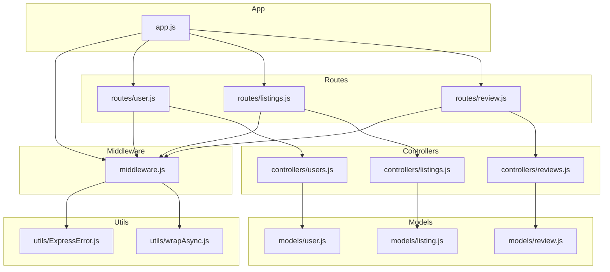
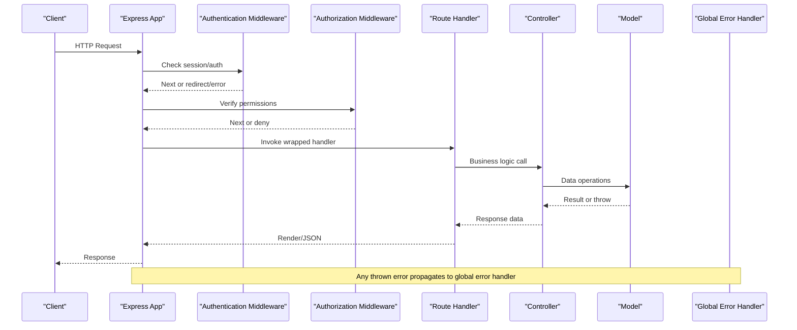
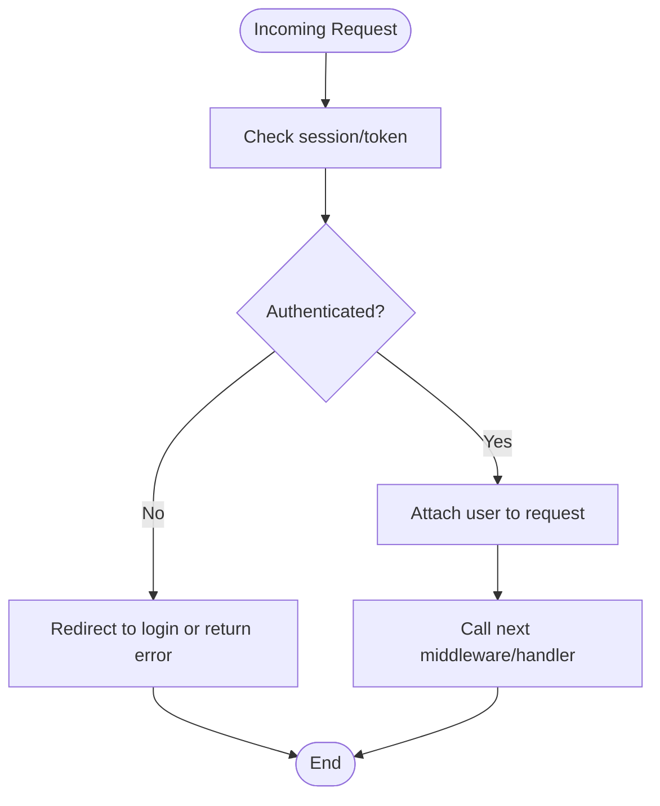
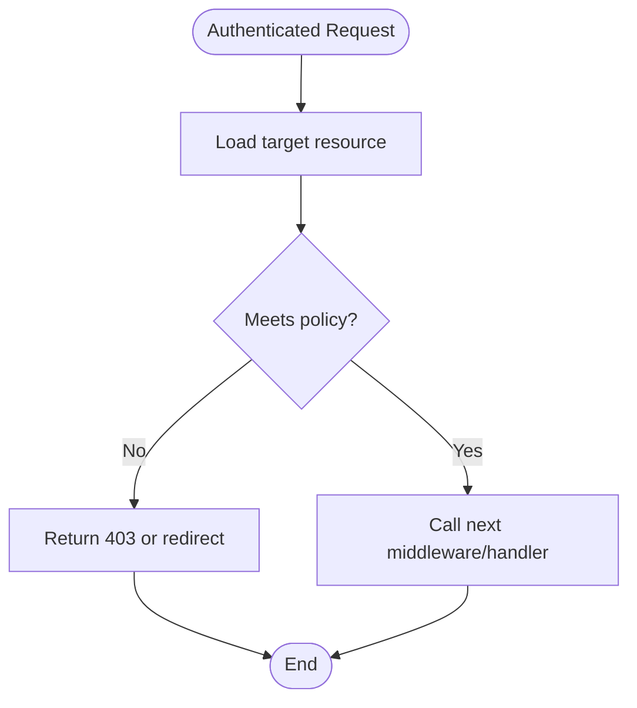
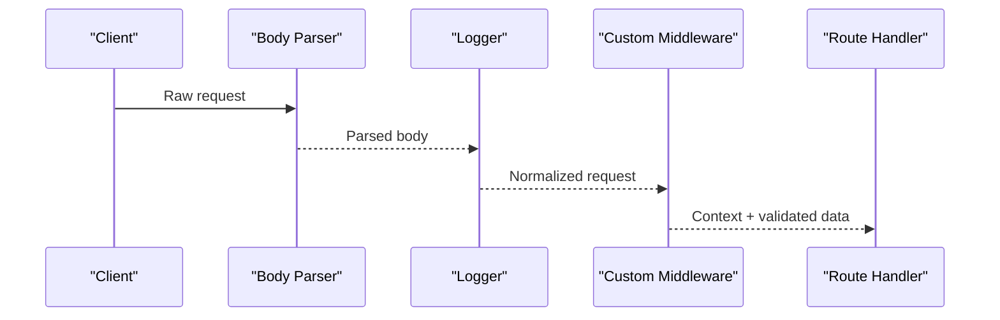
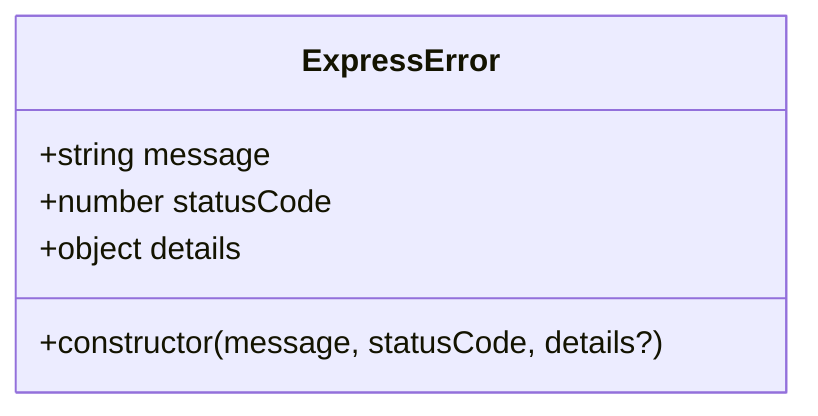
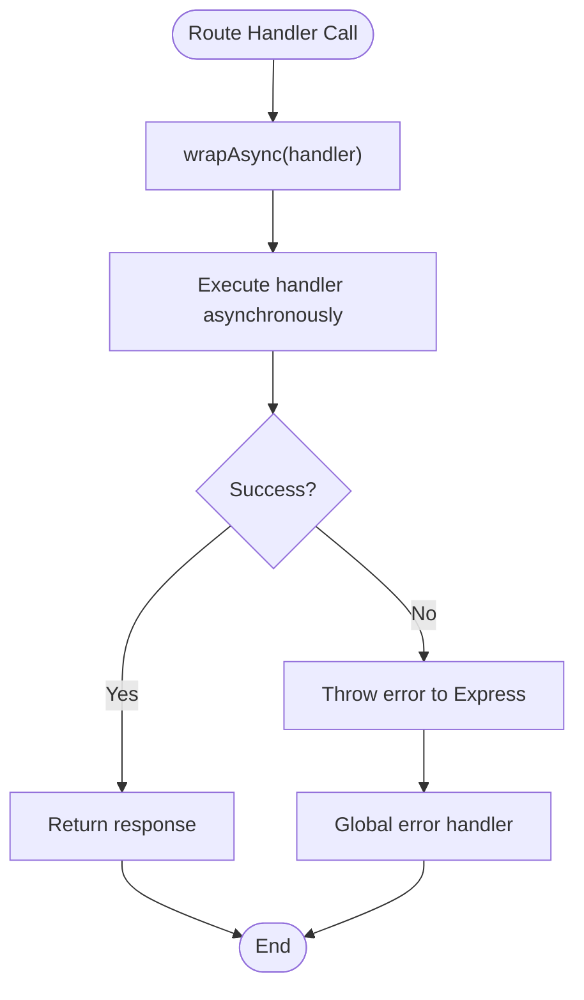
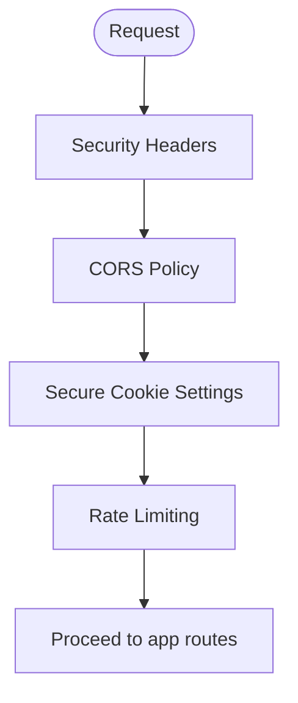
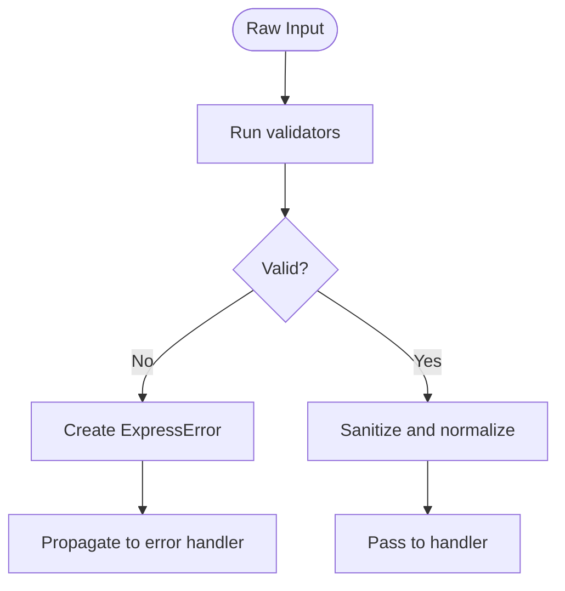
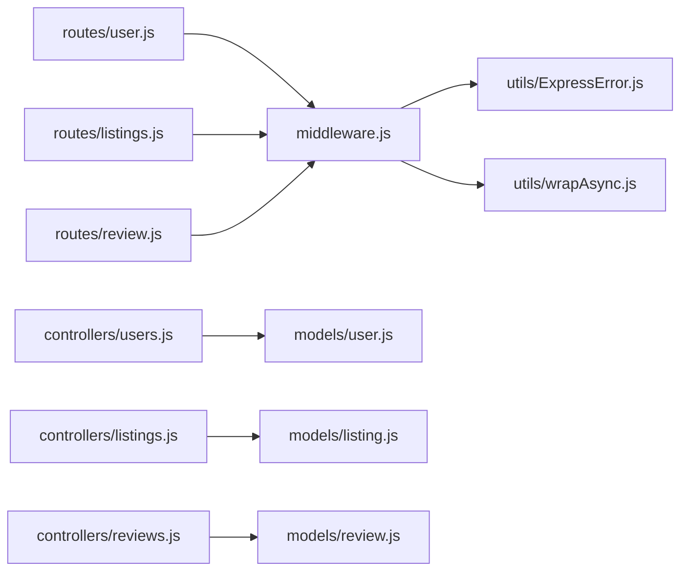

# Middleware and Utilities

<cite>
**Referenced Files in This Document**
- [middleware.js](file://middleware.js)
- [utils/ExpressError.js](file://utils/ExpressError.js)
- [utils/wrapAsync.js](file://utils/wrapAsync.js)
- [app.js](file://app.js)
- [routes/user.js](file://routes/user.js)
- [routes/listings.js](file://routes/listings.js)
- [routes/review.js](file://routes/review.js)
- [controllers/users.js](file://controllers/users.js)
- [controllers/listings.js](file://controllers/listings.js)
- [controllers/reviews.js](file://controllers/reviews.js)
- [models/user.js](file://models/user.js)
- [models/listing.js](file://models/listing.js)
- [models/review.js](file://models/review.js)
</cite>

## Table of Contents
1. [Introduction](#introduction)
2. [Project Structure](#project-structure)
3. [Core Components](#core-components)
4. [Architecture Overview](#architecture-overview)
5. [Detailed Component Analysis](#detailed-component-analysis)
6. [Dependency Analysis](#dependency-analysis)
7. [Performance Considerations](#performance-considerations)
8. [Troubleshooting Guide](#troubleshooting-guide)
9. [Conclusion](#conclusion)

## Introduction
This document explains the custom middleware functions and utility libraries used across the application, focusing on authentication, authorization, request processing, error handling, and reusable utilities. It provides usage examples, configuration options, integration patterns, middleware composition strategies, error propagation, logging approaches, security considerations, validation helpers, and best practices for building robust Express pipelines.

## Project Structure
The project organizes middleware and utilities in dedicated modules:
- Custom middleware is centralized in a single module for easy composition and reuse.
- Utility classes and helpers live under utils to keep concerns separated from business logic.
- Routes import and apply middleware where needed, keeping route handlers focused on controller calls.
- Controllers implement business logic and interact with models.

**Diagram sources**
- [app.js](file://app.js)
- [middleware.js](file://middleware.js)
- [utils/ExpressError.js](file://utils/ExpressError.js)
- [utils/wrapAsync.js](file://utils/wrapAsync.js)
- [routes/user.js](file://routes/user.js)
- [routes/listings.js](file://routes/listings.js)
- [routes/review.js](file://routes/review.js)
- [controllers/users.js](file://controllers/users.js)
- [controllers/listings.js](file://controllers/listings.js)
- [controllers/reviews.js](file://controllers/reviews.js)
- [models/user.js](file://models/user.js)
- [models/listing.js](file://models/listing.js)
- [models/review.js](file://models/review.js)

**Section sources**
- [app.js](file://app.js)
- [middleware.js](file://middleware.js)
- [utils/ExpressError.js](file://utils/ExpressError.js)
- [utils/wrapAsync.js](file://utils/wrapAsync.js)
- [routes/user.js](file://routes/user.js)
- [routes/listings.js](file://routes/listings.js)
- [routes/review.js](file://routes/review.js)
- [controllers/users.js](file://controllers/users.js)
- [controllers/listings.js](file://controllers/listings.js)
- [controllers/reviews.js](file://controllers/reviews.js)
- [models/user.js](file://models/user.js)
- [models/listing.js](file://models/listing.js)
- [models/review.js](file://models/review.js)

## Core Components
This section documents the core middleware and utilities that power authentication, authorization, request processing, and error handling.

- Authentication middleware
  - Purpose: Ensure a user session exists before allowing access to protected routes.
  - Behavior: Checks session state; if missing or invalid, redirects to login or returns an appropriate response. If present, attaches user context to the request for downstream use.
  - Composition: Applied at route-level or globally for protected areas.

- Authorization checks
  - Purpose: Enforce resource ownership or role-based permissions after authentication.
  - Behavior: Compares current user identity against resource owner or required roles; denies access when mismatched.
  - Composition: Used alongside authentication middleware to secure specific endpoints.

- Request processing pipeline
  - Purpose: Standardize parsing, logging, and pre/post-processing around requests.
  - Behavior: Parses bodies, sets headers, logs incoming requests and responses, and normalizes payloads for controllers.
  - Composition: Can be applied globally or per-route group.

- Error handling with ExpressError class
  - Purpose: Provide a consistent error shape and status codes across the app.
  - Behavior: Extends standard error types, carries message, statusCode, and optional details; consumed by global error handler to render user-friendly responses.
  - Integration: Throw instances within async handlers (wrapped via wrapAsync) to propagate errors to Express error middleware.

- Async function wrapping utility
  - Purpose: Simplify error propagation from async route handlers without try/catch boilerplate.
  - Behavior: Wraps async handlers so any thrown error is forwarded to Express error-handling chain.
  - Usage: Wrap all async route handlers to ensure unhandled rejections are caught.

- Logging strategies
  - Approach: Centralized logging middleware records method, path, timestamp, and response status; optionally includes user context when available.
  - Configuration: Toggle verbose mode, filter sensitive fields, and adjust log levels.

- Security middleware
  - Recommendations: Use helmet-like protections, secure cookies, CORS configuration, rate limiting, and input sanitization.
  - Integration: Apply globally before routes; customize per domain needs.

- Validation helpers
  - Role: Validate and sanitize inputs early in the pipeline; return structured errors using ExpressError.
  - Examples: Email format, password strength, numeric IDs, enum values.

- Reusable utilities
  - Examples: ID normalization, date formatting, pagination helpers, file upload validators, and common query builders.

**Section sources**
- [middleware.js](file://middleware.js)
- [utils/ExpressError.js](file://utils/ExpressError.js)
- [utils/wrapAsync.js](file://utils/wrapAsync.js)

## Architecture Overview
The request lifecycle flows through middleware layers before reaching route handlers and controllers. Errors bubble up to a central error handler.

**Diagram sources**
- [middleware.js](file://middleware.js)
- [utils/wrapAsync.js](file://utils/wrapAsync.js)
- [routes/user.js](file://routes/user.js)
- [routes/listings.js](file://routes/listings.js)
- [routes/review.js](file://routes/review.js)
- [controllers/users.js](file://controllers/users.js)
- [controllers/listings.js](file://controllers/listings.js)
- [controllers/reviews.js](file://controllers/reviews.js)
- [models/user.js](file://models/user.js)
- [models/listing.js](file://models/listing.js)
- [models/review.js](file://models/review.js)

## Detailed Component Analysis

### Authentication Middleware
- Responsibilities:
  - Inspect session or token to determine authenticated state.
  - Attach user context to request for downstream use.
  - Redirect or respond with error when unauthenticated.
- Typical usage:
  - Protect routes requiring login.
  - Combine with authorization middleware for fine-grained access control.
- Configuration options:
  - Login redirect path.
  - Public paths whitelist.
  - Session store settings.

**Diagram sources**
- [middleware.js](file://middleware.js)

**Section sources**
- [middleware.js](file://middleware.js)
- [routes/user.js](file://routes/user.js)

### Authorization Middleware
- Responsibilities:
  - Enforce ownership or role-based rules after authentication.
  - Compare current user against resource metadata or policy.
- Typical usage:
  - Protect edit/delete endpoints based on resource ownership.
  - Admin-only routes with role checks.
- Configuration options:
  - Policy definitions.
  - Role mappings.
  - Resource attribute names.

**Diagram sources**
- [middleware.js](file://middleware.js)

**Section sources**
- [middleware.js](file://middleware.js)
- [routes/listings.js](file://routes/listings.js)
- [routes/review.js](file://routes/review.js)

### Request Processing Pipeline
- Responsibilities:
  - Parse request bodies and files.
  - Normalize payloads and set defaults.
  - Log requests and responses consistently.
- Typical usage:
  - Global middleware for JSON/form parsing.
  - Per-feature groups for specialized parsing.
- Configuration options:
  - Body size limits.
  - File upload constraints.
  - Log verbosity and filters.

**Diagram sources**
- [middleware.js](file://middleware.js)
- [app.js](file://app.js)

**Section sources**
- [middleware.js](file://middleware.js)
- [app.js](file://app.js)

### Error Handling with ExpressError Class
- Responsibilities:
  - Provide a standardized error object with message and status code.
  - Integrate with global error handler to render consistent error pages or JSON.
- Typical usage:
  - Throw new ExpressError(message, statusCode) in controllers or services.
  - Catch validation failures and convert to ExpressError.
- Configuration options:
  - Default status codes for common cases.
  - Include stack traces only in development.

**Diagram sources**
- [utils/ExpressError.js](file://utils/ExpressError.js)

**Section sources**
- [utils/ExpressError.js](file://utils/ExpressError.js)
- [controllers/users.js](file://controllers/users.js)
- [controllers/listings.js](file://controllers/listings.js)
- [controllers/reviews.js](file://controllers/reviews.js)

### Async Function Wrapper
- Responsibilities:
  - Wrap async route handlers to catch rejections and forward them to Express error middleware.
- Typical usage:
  - Wrap every async handler passed to route definitions.
- Benefits:
  - Eliminates repetitive try/catch blocks.
  - Ensures consistent error propagation.

**Diagram sources**
- [utils/wrapAsync.js](file://utils/wrapAsync.js)

**Section sources**
- [utils/wrapAsync.js](file://utils/wrapAsync.js)
- [routes/user.js](file://routes/user.js)
- [routes/listings.js](file://routes/listings.js)
- [routes/review.js](file://routes/review.js)

### Security Middleware
- Responsibilities:
  - Harden HTTP headers, enforce secure cookies, restrict origins, and limit request rates.
- Typical usage:
  - Apply globally before routes.
  - Customize per environment (development vs production).
- Configuration options:
  - Allowed origins and methods.
  - Cookie flags (secure, httpOnly, sameSite).
  - Rate limiting thresholds.

**Diagram sources**
- [middleware.js](file://middleware.js)
- [app.js](file://app.js)

**Section sources**
- [middleware.js](file://middleware.js)
- [app.js](file://app.js)

### Validation Helpers
- Responsibilities:
  - Validate and sanitize inputs early in the pipeline.
  - Convert validation failures into ExpressError instances.
- Typical usage:
  - Validate form submissions and API payloads.
  - Normalize IDs and enums.
- Configuration options:
  - Custom validators.
  - Locale-specific formats.
  - Strictness toggles.

**Diagram sources**
- [middleware.js](file://middleware.js)
- [utils/ExpressError.js](file://utils/ExpressError.js)

**Section sources**
- [middleware.js](file://middleware.js)
- [utils/ExpressError.js](file://utils/ExpressError.js)

### Reusable Utilities
- Responsibilities:
  - Provide shared functions for common tasks such as pagination, date formatting, and file handling.
- Typical usage:
  - Import and use across controllers and middleware.
- Best practices:
  - Keep pure functions free of side effects.
  - Document expected inputs and outputs.

**Section sources**
- [middleware.js](file://middleware.js)
- [controllers/users.js](file://controllers/users.js)
- [controllers/listings.js](file://controllers/listings.js)
- [controllers/reviews.js](file://controllers/reviews.js)

## Dependency Analysis
This diagram shows how middleware depends on utilities and how routes compose middleware to protect endpoints.

**Diagram sources**
- [middleware.js](file://middleware.js)
- [utils/ExpressError.js](file://utils/ExpressError.js)
- [utils/wrapAsync.js](file://utils/wrapAsync.js)
- [routes/user.js](file://routes/user.js)
- [routes/listings.js](file://routes/listings.js)
- [routes/review.js](file://routes/review.js)
- [controllers/users.js](file://controllers/users.js)
- [controllers/listings.js](file://controllers/listings.js)
- [controllers/reviews.js](file://controllers/reviews.js)
- [models/user.js](file://models/user.js)
- [models/listing.js](file://models/listing.js)
- [models/review.js](file://models/review.js)

**Section sources**
- [middleware.js](file://middleware.js)
- [utils/ExpressError.js](file://utils/ExpressError.js)
- [utils/wrapAsync.js](file://utils/wrapAsync.js)
- [routes/user.js](file://routes/user.js)
- [routes/listings.js](file://routes/listings.js)
- [routes/review.js](file://routes/review.js)
- [controllers/users.js](file://controllers/users.js)
- [controllers/listings.js](file://controllers/listings.js)
- [controllers/reviews.js](file://controllers/reviews.js)
- [models/user.js](file://models/user.js)
- [models/listing.js](file://models/listing.js)
- [models/review.js](file://models/review.js)

## Performance Considerations
- Minimize middleware overhead by applying only where necessary.
- Avoid heavy computations in synchronous middleware; offload to background jobs when possible.
- Cache frequently accessed data and avoid redundant database queries.
- Use streaming for large file uploads and downloads.
- Tune body size limits and timeouts according to expected traffic patterns.
- Profile critical paths and monitor latency metrics.

[No sources needed since this section provides general guidance]

## Troubleshooting Guide
Common issues and resolutions:
- Unhandled promise rejections in route handlers
  - Ensure all async handlers are wrapped with the async wrapper utility.
  - Verify error propagation reaches the global error handler.
- Inconsistent error responses
  - Confirm that controllers throw standardized error objects.
  - Check global error handler renders correct status codes and messages.
- Authentication loops or redirects
  - Review session configuration and public path whitelisting.
  - Validate that authentication middleware attaches user context correctly.
- Authorization denials
  - Inspect ownership checks and role mappings.
  - Add debug logs for denied requests to identify mismatches.
- Validation failures
  - Ensure validation helpers return structured errors.
  - Test edge cases like empty strings, nulls, and malformed inputs.

**Section sources**
- [utils/wrapAsync.js](file://utils/wrapAsync.js)
- [utils/ExpressError.js](file://utils/ExpressError.js)
- [middleware.js](file://middleware.js)
- [controllers/users.js](file://controllers/users.js)
- [controllers/listings.js](file://controllers/listings.js)
- [controllers/reviews.js](file://controllers/reviews.js)

## Conclusion
By centralizing authentication and authorization in reusable middleware, standardizing errors with a dedicated class, and wrapping async handlers to propagate errors consistently, the application achieves a clear separation of concerns and robust request processing. Applying security middleware, validating inputs early, and adopting structured logging further improves reliability and maintainability. Follow the composition patterns and configuration options outlined here to extend the system safely and efficiently.