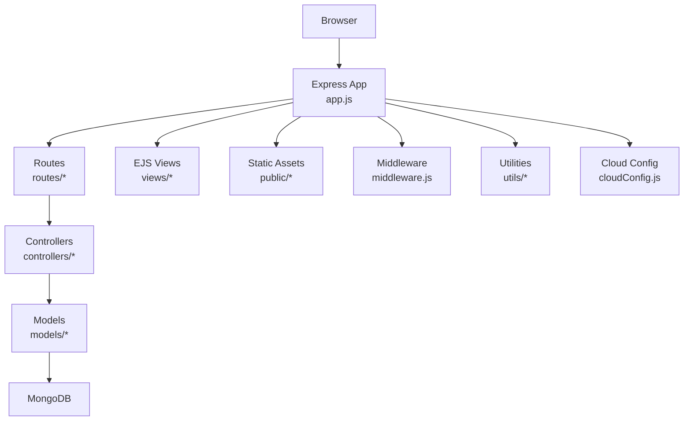
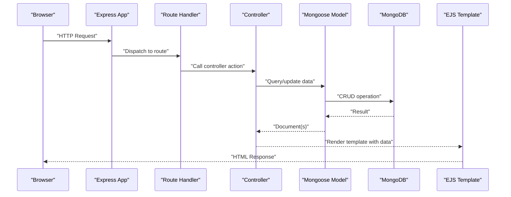
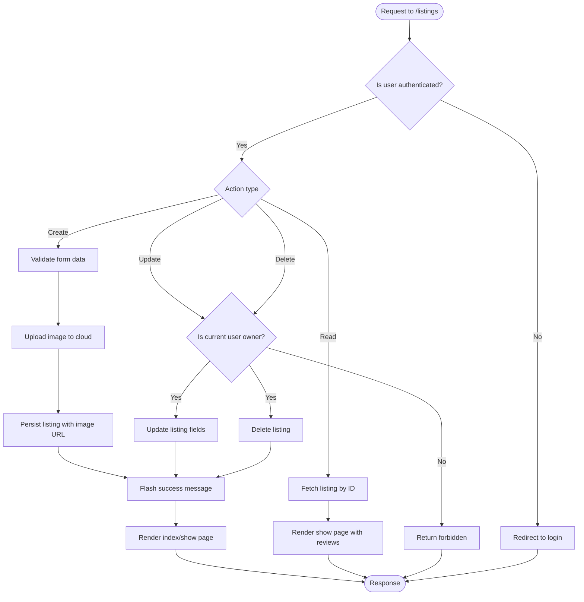
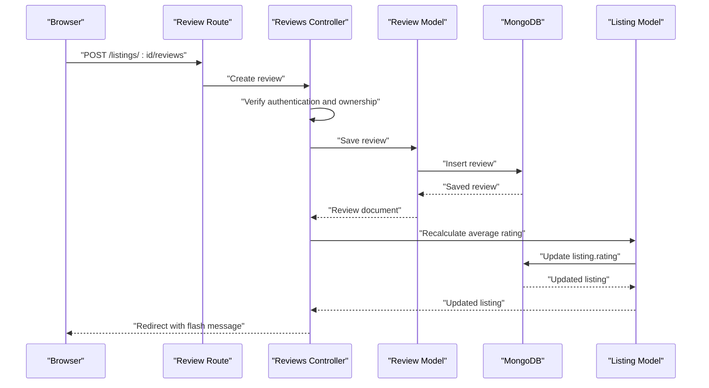
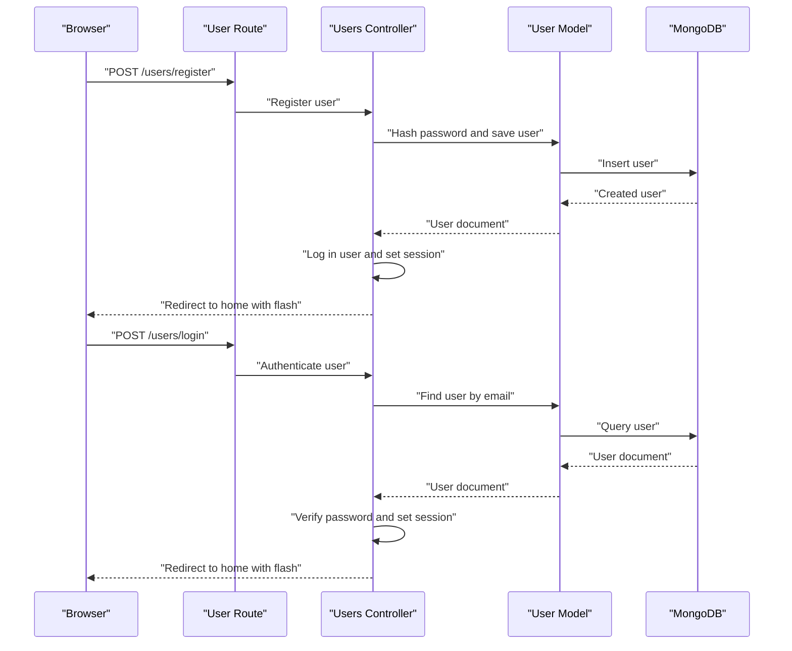
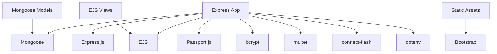

# Project Overview

<cite>
**Referenced Files in This Document**
- [README.md](file://README.md)
- [app.js](file://app.js)
- [package.json](file://package.json)
- [Schema.js](file://Schema.js)
- [middleware.js](file://middleware.js)
- [cloudConfig.js](file://cloudConfig.js)
- [controllers/listings.js](file://controllers/listings.js)
- [controllers/reviews.js](file://controllers/reviews.js)
- [controllers/users.js](file://controllers/users.js)
- [models/listing.js](file://models/listing.js)
- [models/review.js](file://models/review.js)
- [models/user.js](file://models/user.js)
- [routes/listings.js](file://routes/listings.js)
- [routes/review.js](file://routes/review.js)
- [routes/user.js](file://routes/user.js)
- [views/layouts/boilerplate.ejs](file://views/layouts/boilerplate.ejs)
- [views/includes/navbar.ejs](file://views/includes/navbar.ejs)
- [views/includes/footer.ejs](file://views/includes/footer.ejs)
- [views/includes/flash.ejs](file://views/includes/flash.ejs)
- [views/listings/index.ejs](file://views/listings/index.ejs)
- [views/listings/show.ejs](file://views/listings/show.ejs)
- [views/listings/new.ejs](file://views/listings/new.ejs)
- [views/listings/edit.ejs](file://views/listings/edit.ejs)
- [views/users/signup.ejs](file://views/users/signup.ejs)
- [views/users/login.ejs](file://views/users/login.ejs)
- [public/css/style.css](file://public/css/style.css)
- [public/css/rating.css](file://public/css/rating.css)
- [utils/ExpressError.js](file://utils/ExpressError.js)
- [utils/wrapAsync.js](file://utils/wrapAsync.js)
</cite>

## Table of Contents
1. [Introduction](#introduction)
2. [Project Structure](#project-structure)
3. [Core Components](#core-components)
4. [Architecture Overview](#architecture-overview)
5. [Detailed Component Analysis](#detailed-component-analysis)
6. [Dependency Analysis](#dependency-analysis)
7. [Performance Considerations](#performance-considerations)
8. [Troubleshooting Guide](#troubleshooting-guide)
9. [Conclusion](#conclusion)

## Introduction
This project is a full-stack web application that enables users to browse, create, update, and delete listings, as well as write reviews and ratings for those listings. It provides user authentication so that only authorized users can perform protected actions such as creating or editing listings and submitting reviews. The application demonstrates a complete end-to-end example using Node.js and Express.js on the server side, MongoDB for data persistence, EJS for server-side templating, and Bootstrap for responsive UI styling.

Key features include:
- User registration and login with session management
- CRUD operations for listings (create, read, update, delete)
- Review and rating system associated with listings
- Image upload functionality for listing media
- Flash messages for user feedback
- Organized MVC-style architecture with clear separation of concerns

The repository includes a README file that typically contains setup instructions, environment configuration, and any live demo links. Refer to the README for deployment details and usage examples.

**Section sources**
- [README.md](file://README.md)

## Project Structure
The application follows an MVC-like organization:
- Controllers handle request processing and orchestrate business logic
- Models define Mongoose schemas and database interactions
- Routes map HTTP endpoints to controller methods
- Views are EJS templates rendered by the server
- Public assets include CSS and client-side scripts
- Middleware handles authentication, error wrapping, and custom errors
- Configuration files manage app initialization, cloud storage, and dependencies

**Diagram sources**
- [app.js](file://app.js)
- [routes/listings.js](file://routes/listings.js)
- [routes/review.js](file://routes/review.js)
- [routes/user.js](file://routes/user.js)
- [controllers/listings.js](file://controllers/listings.js)
- [controllers/reviews.js](file://controllers/reviews.js)
- [controllers/users.js](file://controllers/users.js)
- [models/listing.js](file://models/listing.js)
- [models/review.js](file://models/review.js)
- [models/user.js](file://models/user.js)
- [views/layouts/boilerplate.ejs](file://views/layouts/boilerplate.ejs)
- [public/css/style.css](file://public/css/style.css)
- [middleware.js](file://middleware.js)
- [utils/ExpressError.js](file://utils/ExpressError.js)
- [utils/wrapAsync.js](file://utils/wrapAsync.js)
- [cloudConfig.js](file://cloudConfig.js)

**Section sources**
- [app.js](file://app.js)
- [package.json](file://package.json)

## Core Components
- Application entry point initializes Express, middleware, routes, views engine, static assets, and error handling.
- Authentication middleware protects routes and manages sessions.
- Controllers implement business logic for listings, reviews, and users.
- Models define Mongoose schemas for Listing, Review, and User entities.
- Routes expose RESTful endpoints mapped to controller actions.
- Views provide EJS templates for rendering pages and forms.
- Utilities wrap async handlers and standardize error responses.
- Cloud configuration supports image uploads to a cloud storage service.

Typical responsibilities:
- controllers/listings.js: Create, read, update, delete listings; associate images; enforce ownership
- controllers/reviews.js: Create, read, delete reviews; compute average ratings
- controllers/users.js: Register, login, logout; manage sessions
- models/listing.js: Listing schema with fields like title, description, price, location, and image URL(s)
- models/review.js: Review schema linked to a user and a listing, including rating value
- models/user.js: User schema with hashed password and profile fields
- routes/*: Define endpoints such as /listings, /reviews, /users
- views/*: EJS templates for layout, navigation, flash messages, and feature-specific pages
- utils/wrapAsync.js: Wrapper to catch async errors in route handlers
- utils/ExpressError.js: Custom error class for consistent error handling
- middleware.js: Authentication checks, authorization guards, and validation helpers
- cloudConfig.js: Configuration for cloud image storage integration

**Section sources**
- [app.js](file://app.js)
- [middleware.js](file://middleware.js)
- [controllers/listings.js](file://controllers/listings.js)
- [controllers/reviews.js](file://controllers/reviews.js)
- [controllers/users.js](file://controllers/users.js)
- [models/listing.js](file://models/listing.js)
- [models/review.js](file://models/review.js)
- [models/user.js](file://models/user.js)
- [routes/listings.js](file://routes/listings.js)
- [routes/review.js](file://routes/review.js)
- [routes/user.js](file://routes/user.js)
- [views/layouts/boilerplate.ejs](file://views/layouts/boilerplate.ejs)
- [views/includes/navbar.ejs](file://views/includes/navbar.ejs)
- [views/includes/footer.ejs](file://views/includes/footer.ejs)
- [views/includes/flash.ejs](file://views/includes/flash.ejs)
- [views/listings/index.ejs](file://views/listings/index.ejs)
- [views/listings/show.ejs](file://views/listings/show.ejs)
- [views/listings/new.ejs](file://views/listings/new.ejs)
- [views/listings/edit.ejs](file://views/listings/edit.ejs)
- [views/users/signup.ejs](file://views/users/signup.ejs)
- [views/users/login.ejs](file://views/users/login.ejs)
- [public/css/style.css](file://public/css/style.css)
- [public/css/rating.css](file://public/css/rating.css)
- [utils/ExpressError.js](file://utils/ExpressError.js)
- [utils/wrapAsync.js](file://utils/wrapAsync.js)
- [cloudConfig.js](file://cloudConfig.js)

## Architecture Overview
The application implements an MVC pattern:
- Model layer defines data structures and database interactions via Mongoose
- Controller layer processes requests, validates input, interacts with models, and returns responses
- View layer renders EJS templates with data provided by controllers
- Middleware enforces authentication and authorization across routes
- Static assets and client-side scripts enhance the user experience

**Diagram sources**
- [app.js](file://app.js)
- [routes/listings.js](file://routes/listings.js)
- [controllers/listings.js](file://controllers/listings.js)
- [models/listing.js](file://models/listing.js)
- [views/layouts/boilerplate.ejs](file://views/layouts/boilerplate.ejs)

## Detailed Component Analysis

### Listings Module
Responsibilities:
- List all listings with optional filtering/pagination
- Show a single listing with its reviews and average rating
- Create new listings with image upload
- Edit existing listings (ownership check)
- Delete listings (ownership check)

Data model highlights:
- Fields for title, description, price, location, and image URLs
- References to related reviews

User flows:
- New listing creation requires authentication and image upload
- Editing/deleting requires ownership verification

**Diagram sources**
- [routes/listings.js](file://routes/listings.js)
- [controllers/listings.js](file://controllers/listings.js)
- [models/listing.js](file://models/listing.js)
- [cloudConfig.js](file://cloudConfig.js)
- [middleware.js](file://middleware.js)

**Section sources**
- [routes/listings.js](file://routes/listings.js)
- [controllers/listings.js](file://controllers/listings.js)
- [models/listing.js](file://models/listing.js)
- [views/listings/index.ejs](file://views/listings/index.ejs)
- [views/listings/show.ejs](file://views/listings/show.ejs)
- [views/listings/new.ejs](file://views/listings/new.ejs)
- [views/listings/edit.ejs](file://views/listings/edit.ejs)

### Reviews Module
Responsibilities:
- Create reviews for a listing (requires authentication)
- Read reviews for a listing
- Delete reviews (ownership check)
- Compute average rating per listing

Data model highlights:
- Review references both user and listing
- Rating value stored per review

**Diagram sources**
- [routes/review.js](file://routes/review.js)
- [controllers/reviews.js](file://controllers/reviews.js)
- [models/review.js](file://models/review.js)
- [models/listing.js](file://models/listing.js)

**Section sources**
- [routes/review.js](file://routes/review.js)
- [controllers/reviews.js](file://controllers/reviews.js)
- [models/review.js](file://models/review.js)
- [views/listings/show.ejs](file://views/listings/show.ejs)

### Users Module
Responsibilities:
- Register new users with secure password hashing
- Login users and establish sessions
- Logout users and clear sessions
- Protect routes based on authentication state

Security considerations:
- Passwords are hashed before storage
- Session-based authentication controls access to protected routes

**Diagram sources**
- [routes/user.js](file://routes/user.js)
- [controllers/users.js](file://controllers/users.js)
- [models/user.js](file://models/user.js)
- [middleware.js](file://middleware.js)

**Section sources**
- [routes/user.js](file://routes/user.js)
- [controllers/users.js](file://controllers/users.js)
- [models/user.js](file://models/user.js)
- [views/users/signup.ejs](file://views/users/signup.ejs)
- [views/users/login.ejs](file://views/users/login.ejs)

### Views and Layouts
- Boilerplate layout centralizes HTML structure and includes common partials
- Navigation bar displays contextual links based on authentication state
- Footer provides consistent site-wide information
- Flash messages display success/error notifications after actions
- Feature-specific templates render listings and user forms

Styling:
- Global styles and component-specific styles improve responsiveness and readability
- Rating styles support visual representation of star ratings

**Section sources**
- [views/layouts/boilerplate.ejs](file://views/layouts/boilerplate.ejs)
- [views/includes/navbar.ejs](file://views/includes/navbar.ejs)
- [views/includes/footer.ejs](file://views/includes/footer.ejs)
- [views/includes/flash.ejs](file://views/includes/flash.ejs)
- [public/css/style.css](file://public/css/style.css)
- [public/css/rating.css](file://public/css/rating.css)

### Utilities and Error Handling
- Custom error class standardizes error responses across the app
- Async wrapper ensures unhandled promise rejections in route handlers are caught and converted to proper HTTP errors

**Section sources**
- [utils/ExpressError.js](file://utils/ExpressError.js)
- [utils/wrapAsync.js](file://utils/wrapAsync.js)

## Dependency Analysis
External dependencies are declared in package.json and include:
- Express.js for HTTP routing and middleware
- Mongoose for MongoDB object modeling
- EJS for server-side templating
- Passport.js for authentication
- bcrypt for password hashing
- multer for multipart/form-data (image uploads)
- connect-flash for flash messages
- dotenv for environment variables
- Bootstrap for UI components

**Diagram sources**
- [package.json](file://package.json)
- [app.js](file://app.js)

**Section sources**
- [package.json](file://package.json)
- [Schema.js](file://Schema.js)

## Performance Considerations
- Use efficient queries and indexes in Mongoose models to optimize database reads and writes
- Paginate listing results to reduce payload size and improve load times
- Cache frequently accessed data where appropriate
- Optimize image uploads by compressing images and using CDN delivery
- Minimize N+1 queries by leveraging population judiciously
- Keep middleware lightweight and avoid heavy computations in request paths

[No sources needed since this section provides general guidance]

## Troubleshooting Guide
Common issues and resolutions:
- Authentication failures: Ensure session configuration and passport strategies are correctly initialized
- Image upload errors: Verify cloud storage credentials and multer configuration
- Validation errors: Check form inputs and server-side validation logic
- Database connection problems: Confirm MongoDB URI and network connectivity
- Error handling: Use the custom error class and async wrapper to surface meaningful errors

Operational tips:
- Enable detailed logging during development
- Inspect flash messages for user feedback
- Validate environment variables for secrets and URIs

**Section sources**
- [middleware.js](file://middleware.js)
- [utils/ExpressError.js](file://utils/ExpressError.js)
- [utils/wrapAsync.js](file://utils/wrapAsync.js)
- [cloudConfig.js](file://cloudConfig.js)

## Conclusion
This project serves as a comprehensive full-stack example demonstrating how to build a listing and review platform with user authentication. It showcases MVC architecture, robust error handling, secure authentication, and practical features like image uploads and rating calculations. By studying its structure and implementation, developers can learn best practices for building scalable and maintainable web applications using Node.js, Express.js, MongoDB, EJS, and Bootstrap.

For setup instructions, environment configuration, and any available live demo links, refer to the README file included in the repository.

**Section sources**
- [README.md](file://README.md)