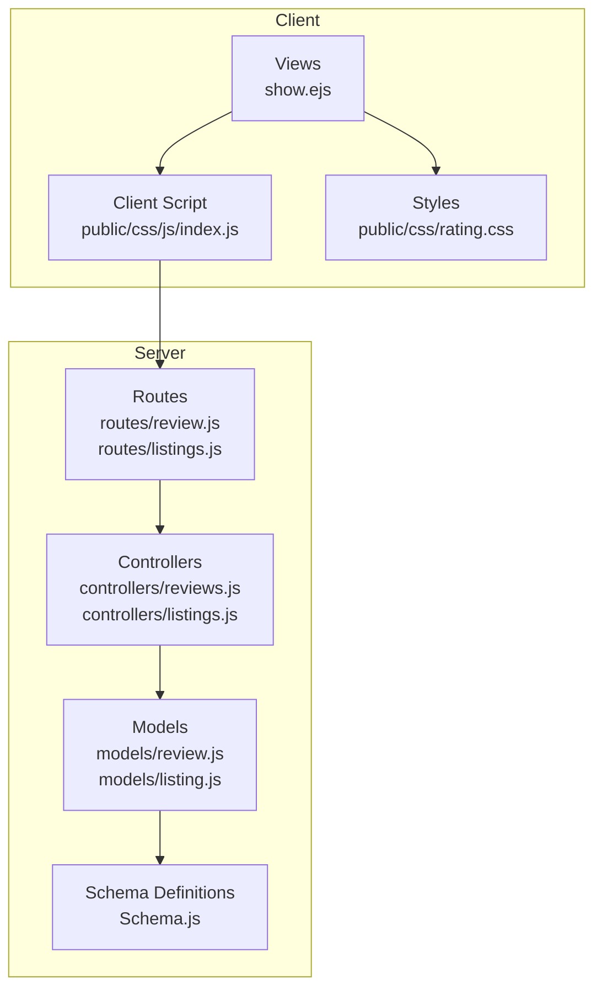
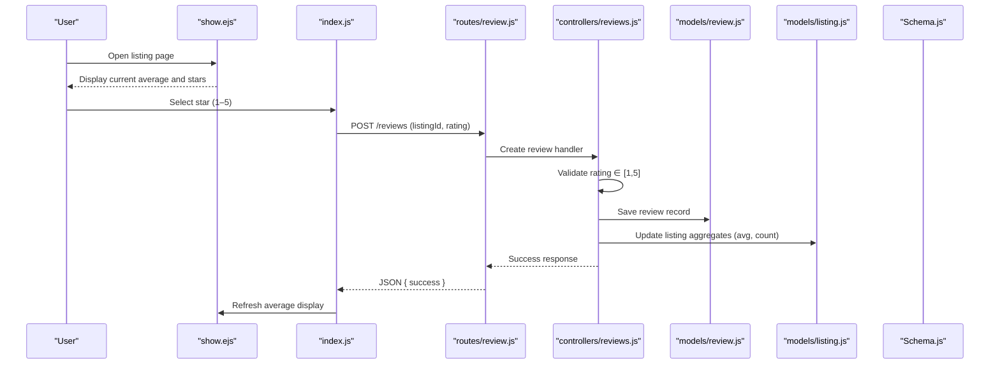
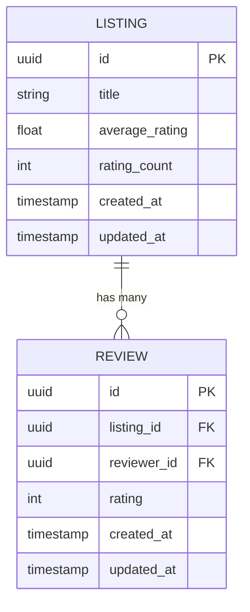
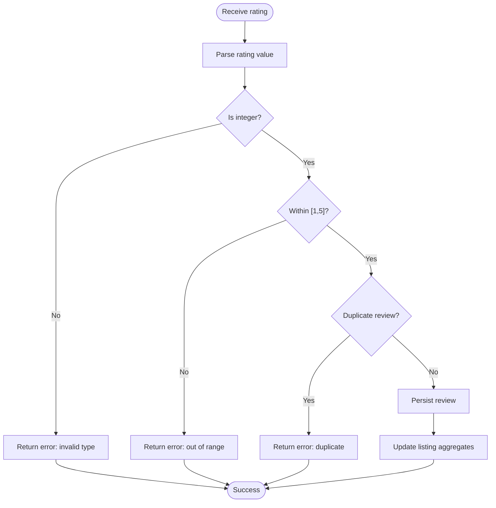
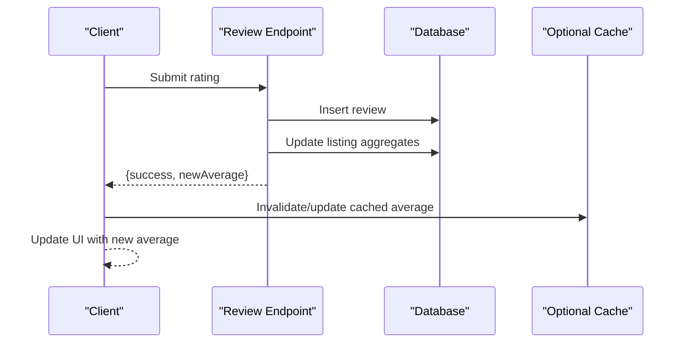
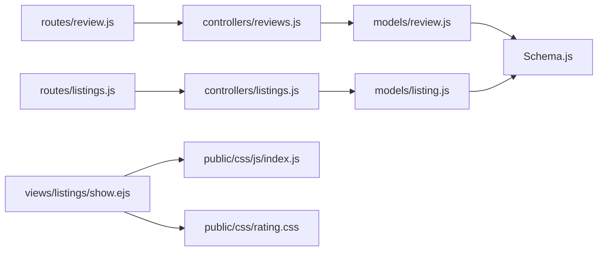

# Rating System and Calculations

<cite>
**Referenced Files in This Document**
- [review.js](file://models/review.js)
- [listing.js](file://models/listing.js)
- [reviews.js](file://controllers/reviews.js)
- [listings.js](file://controllers/listings.js)
- [review.js](file://routes/review.js)
- [listings.js](file://routes/listings.js)
- [rating.css](file://public/css/rating.css)
- [index.js](file://public/css/js/index.js)
- [show.ejs](file://views/listings/show.ejs)
- [Schema.js](file://Schema.js)
</cite>

## Table of Contents
1. [Introduction](#introduction)
2. [Project Structure](#project-structure)
3. [Core Components](#core-components)
4. [Architecture Overview](#architecture-overview)
5. [Detailed Component Analysis](#detailed-component-analysis)
6. [Dependency Analysis](#dependency-analysis)
7. [Performance Considerations](#performance-considerations)
8. [Troubleshooting Guide](#troubleshooting-guide)
9. [Conclusion](#conclusion)
10. [Appendices](#appendices)

## Introduction
This document explains the rating calculation system for star ratings (1–5). It covers how ratings are validated, stored, aggregated into averages, displayed with proper formatting, and updated efficiently at scale. It also includes guidance on handling edge cases such as empty rating sets or invalid inputs, and provides examples of aggregation queries and performance optimization techniques.

## Project Structure
The rating functionality spans models, controllers, routes, views, and client-side assets:
- Models define data schemas and any server-side calculations.
- Controllers orchestrate request handling and business logic.
- Routes expose endpoints to create and manage reviews and listings.
- Views render ratings and integrate client-side interactions.
- Client scripts and styles provide interactive star selection and display.

**Diagram sources**
- [show.ejs](file://views/listings/show.ejs)
- [index.js](file://public/css/js/index.js)
- [rating.css](file://public/css/rating.css)
- [review.js](file://routes/review.js)
- [listings.js](file://routes/listings.js)
- [reviews.js](file://controllers/reviews.js)
- [listings.js](file://controllers/listings.js)
- [review.js](file://models/review.js)
- [listing.js](file://models/listing.js)
- [Schema.js](file://Schema.js)

**Section sources**
- [review.js](file://models/review.js)
- [listing.js](file://models/listing.js)
- [reviews.js](file://controllers/reviews.js)
- [listings.js](file://controllers/listings.js)
- [review.js](file://routes/review.js)
- [listings.js](file://routes/listings.js)
- [rating.css](file://public/css/rating.css)
- [index.js](file://public/css/js/index.js)
- [show.ejs](file://views/listings/show.ejs)
- [Schema.js](file://Schema.js)

## Core Components
- Star rating domain: Ratings are integers from 1 to 5. Validation ensures only valid values are accepted.
- Review model: Stores individual ratings per listing and user, including timestamps and metadata.
- Listing model: May store precomputed aggregates (e.g., average rating and count) for fast reads.
- Controllers: Validate input, persist reviews, and compute or update averages.
- Routes: Expose endpoints for creating/updating reviews and reading listing details.
- Views and client assets: Render stars and handle user interactions.

Key responsibilities:
- Input validation: Ensure rating is an integer within [1, 5].
- Storage: Persist review records; optionally maintain listing-level aggregates.
- Aggregation: Compute average rating using sum/count with rounding rules.
- Display: Format averages to a consistent decimal precision.
- Real-time updates: Use efficient updates and optional caching/indices.

**Section sources**
- [review.js](file://models/review.js)
- [listing.js](file://models/listing.js)
- [reviews.js](file://controllers/reviews.js)
- [listings.js](file://controllers/listings.js)
- [Schema.js](file://Schema.js)

## Architecture Overview
The rating flow involves client interaction, route handling, controller logic, model persistence, and view rendering. Averages can be computed on-the-fly or maintained via denormalized fields for performance.

**Diagram sources**
- [show.ejs](file://views/listings/show.ejs)
- [index.js](file://public/css/js/index.js)
- [review.js](file://routes/review.js)
- [reviews.js](file://controllers/reviews.js)
- [review.js](file://models/review.js)
- [listing.js](file://models/listing.js)
- [Schema.js](file://Schema.js)

## Detailed Component Analysis

### Data Model and Schema
- Review entity: Contains listing reference, reviewer identity, rating value (1–5), and timestamps.
- Listing entity: Contains metadata and may include precomputed fields like averageRating and ratingCount.
- Schema constraints: Enforce rating range and required fields.

**Diagram sources**
- [review.js](file://models/review.js)
- [listing.js](file://models/listing.js)
- [Schema.js](file://Schema.js)

**Section sources**
- [review.js](file://models/review.js)
- [listing.js](file://models/listing.js)
- [Schema.js](file://Schema.js)

### Input Validation and Storage
- Validation rules:
  - Rating must be an integer.
  - Rating must be between 1 and 5 inclusive.
  - Duplicate submission prevention (optional): ensure one review per user per listing.
- Storage:
  - Insert a new review record upon successful validation.
  - Optionally enforce unique constraints on (listing_id, reviewer_id).

**Diagram sources**
- [reviews.js](file://controllers/reviews.js)
- [review.js](file://models/review.js)
- [listing.js](file://models/listing.js)

**Section sources**
- [reviews.js](file://controllers/reviews.js)
- [review.js](file://models/review.js)
- [listing.js](file://models/listing.js)

### Average Rating Calculation Logic
- Formula: average = sum(ratings) / count(ratings).
- Rounding:
  - For display, round to two decimal places using standard rounding (half-up).
  - If maintaining a stored average, use consistent rounding to avoid drift.
- Edge cases:
  - Empty set: if no reviews exist, average is undefined or null; display “No ratings yet”.
  - All zero or invalid inputs: prevented by validation; otherwise treat as missing.

Examples of aggregation queries:
- Compute average and count across all reviews for a listing:
  - SELECT AVG(rating) AS avg_rating, COUNT(*) AS rating_count FROM reviews WHERE listing_id = ?
- Incremental update approach:
  - new_avg = (old_sum + new_rating) / (old_count + 1)
  - Maintain both sum and count to avoid recomputation.

**Section sources**
- [reviews.js](file://controllers/reviews.js)
- [listing.js](file://models/listing.js)
- [Schema.js](file://Schema.js)

### Display Formatting and Decimal Precision
- Display format:
  - Show average rounded to two decimals (e.g., 4.33).
  - Render star icons based on the average (full/half/empty).
- Precision handling:
  - Always format to two decimals for consistency.
  - Avoid floating-point artifacts by rounding before formatting.

Client-side integration:
- The view renders the average and star visuals.
- Client script handles star selection and submits ratings via AJAX.
- Styles control visual appearance of selected and unselected stars.

**Section sources**
- [show.ejs](file://views/listings/show.ejs)
- [index.js](file://public/css/js/index.js)
- [rating.css](file://public/css/rating.css)

### Real-Time Rating Updates
- After submitting a rating:
  - Server validates and persists the review.
  - Server updates listing aggregates (average and count).
  - Client receives success and refreshes the average without full page reload.
- Optional enhancements:
  - Optimistic UI updates on the client with rollback on failure.
  - Debounce rapid submissions to prevent duplicates.

[No diagram sources needed since this diagram shows conceptual workflow, not actual code structure]

## Dependency Analysis
The rating system depends on clear separation between routes, controllers, models, and schema definitions. Controllers depend on models for persistence and may rely on schema constraints for validation. Views depend on client scripts and styles for interactivity.

**Diagram sources**
- [review.js](file://routes/review.js)
- [listings.js](file://routes/listings.js)
- [reviews.js](file://controllers/reviews.js)
- [listings.js](file://controllers/listings.js)
- [review.js](file://models/review.js)
- [listing.js](file://models/listing.js)
- [Schema.js](file://Schema.js)
- [show.ejs](file://views/listings/show.ejs)
- [index.js](file://public/css/js/index.js)
- [rating.css](file://public/css/rating.css)

**Section sources**
- [review.js](file://routes/review.js)
- [listings.js](file://routes/listings.js)
- [reviews.js](file://controllers/reviews.js)
- [listings.js](file://controllers/listings.js)
- [review.js](file://models/review.js)
- [listing.js](file://models/listing.js)
- [Schema.js](file://Schema.js)
- [show.ejs](file://views/listings/show.ejs)
- [index.js](file://public/css/js/index.js)
- [rating.css](file://public/css/rating.css)

## Performance Considerations
- Denormalization:
  - Store averageRating and ratingCount on listings to avoid frequent aggregations.
  - Update these fields atomically when inserting or updating reviews.
- Indexing:
  - Add indexes on listing_id and reviewer_id to speed up lookups and duplicate checks.
- Batch operations:
  - For bulk imports, batch insert reviews and then recompute aggregates once.
- Caching:
  - Cache listing averages with short TTLs; invalidate on write operations.
- Query optimization:
  - Use incremental updates instead of recomputing sums from scratch.
- Concurrency:
  - Use transactions or atomic increments to prevent race conditions during concurrent writes.

[No sources needed since this section provides general guidance]

## Troubleshooting Guide
Common issues and resolutions:
- Invalid rating values:
  - Symptom: Errors when submitting non-integer or out-of-range ratings.
  - Resolution: Enforce integer parsing and range checks in controllers; return descriptive errors.
- Duplicate reviews:
  - Symptom: Multiple reviews per user per listing.
  - Resolution: Enforce unique constraints and check before insert; return conflict responses.
- Incorrect averages:
  - Symptom: Averages drift over time.
  - Resolution: Recompute from raw reviews periodically; ensure rounding consistency.
- Slow listing pages:
  - Symptom: High latency due to heavy aggregation.
  - Resolution: Use denormalized fields and indexes; cache results.

**Section sources**
- [reviews.js](file://controllers/reviews.js)
- [review.js](file://models/review.js)
- [listing.js](file://models/listing.js)

## Conclusion
The rating system implements robust validation for 1–5 star ratings, stores reviews reliably, and computes averages with clear rounding rules. By combining denormalized aggregates, indexing, and caching, the system scales well for large datasets while providing real-time updates and consistent display formatting. Proper handling of edge cases ensures reliability and a good user experience.

## Appendices

### Example Aggregation Queries
- Full aggregation:
  - SELECT AVG(rating) AS avg_rating, COUNT(*) AS rating_count FROM reviews WHERE listing_id = ?
- Incremental update:
  - new_avg = (old_sum + new_rating) / (old_count + 1)
  - Maintain sum and count fields to avoid recomputation.

[No sources needed since this section provides general guidance]