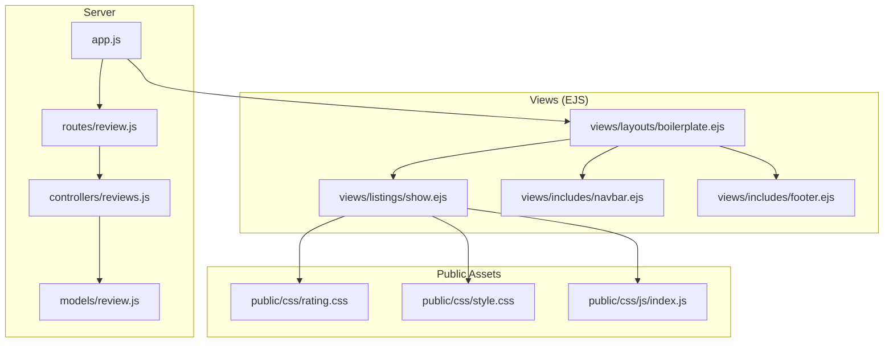
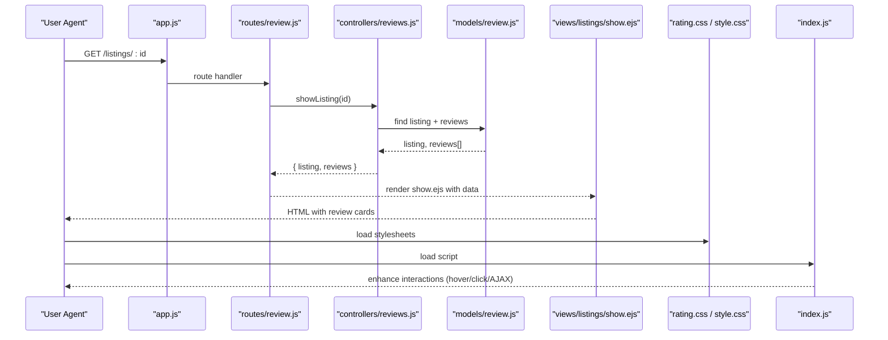
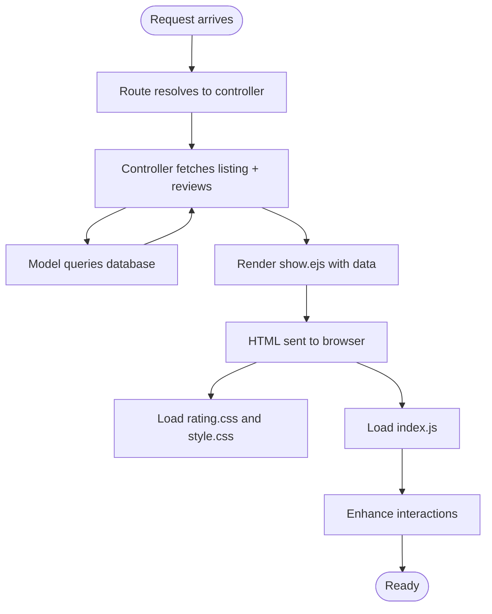
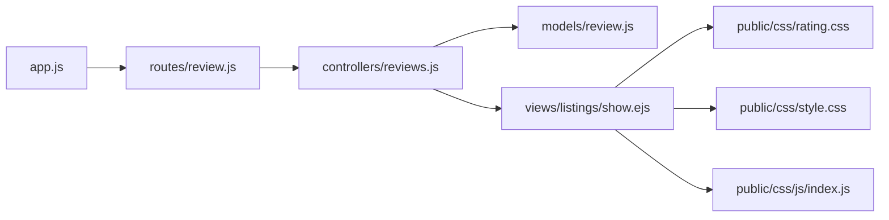

# Review Display and User Interface

<cite>
**Referenced Files in This Document**
- [app.js](file://app.js)
- [controllers/reviews.js](file://controllers/reviews.js)
- [routes/review.js](file://routes/review.js)
- [models/review.js](file://models/review.js)
- [public/css/rating.css](file://public/css/rating.css)
- [public/css/style.css](file://public/css/style.css)
- [public/css/js/index.js](file://public/css/js/index.js)
- [views/layouts/boilerplate.ejs](file://views/layouts/boilerplate.ejs)
- [views/listings/show.ejs](file://views/listings/show.ejs)
- [views/includes/navbar.ejs](file://views/includes/navbar.ejs)
- [views/includes/footer.ejs](file://views/includes/footer.ejs)
</cite>

## Table of Contents
1. [Introduction](#introduction)
2. [Project Structure](#project-structure)
3. [Core Components](#core-components)
4. [Architecture Overview](#architecture-overview)
5. [Detailed Component Analysis](#detailed-component-analysis)
6. [Dependency Analysis](#dependency-analysis)
7. [Performance Considerations](#performance-considerations)
8. [Troubleshooting Guide](#troubleshooting-guide)
9. [Conclusion](#conclusion)
10. [Appendices](#appendices)

## Introduction
This document explains the review display and user interface components, focusing on:
- CSS styling system for star ratings, review cards, and interactive elements
- EJS template integration for displaying reviews on listing pages, including partial rendering and dynamic content updates
- Responsive design patterns, accessibility considerations, and cross-browser compatibility
- User interaction patterns such as hover effects, click handlers, and visual feedback mechanisms

The goal is to provide a clear, code-mapped understanding of how reviews are rendered and styled, and how users interact with them across devices and browsers.

## Project Structure
Review-related UI spans server-side routing and controllers, client-side styles and scripts, and EJS templates that compose the page layout and review sections.

**Diagram sources**
- [app.js](file://app.js)
- [routes/review.js](file://routes/review.js)
- [controllers/reviews.js](file://controllers/reviews.js)
- [models/review.js](file://models/review.js)
- [views/layouts/boilerplate.ejs](file://views/layouts/boilerplate.ejs)
- [views/listings/show.ejs](file://views/listings/show.ejs)
- [views/includes/navbar.ejs](file://views/includes/navbar.ejs)
- [views/includes/footer.ejs](file://views/includes/footer.ejs)
- [public/css/rating.css](file://public/css/rating.css)
- [public/css/style.css](file://public/css/style.css)
- [public/css/js/index.js](file://public/css/js/index.js)

**Section sources**
- [app.js](file://app.js)
- [routes/review.js](file://routes/review.js)
- [controllers/reviews.js](file://controllers/reviews.js)
- [models/review.js](file://models/review.js)
- [views/layouts/boilerplate.ejs](file://views/layouts/boilerplate.ejs)
- [views/listings/show.ejs](file://views/listings/show.ejs)
- [views/includes/navbar.ejs](file://views/includes/navbar.ejs)
- [views/includes/footer.ejs](file://views/includes/footer.ejs)
- [public/css/rating.css](file://public/css/rating.css)
- [public/css/style.css](file://public/css/style.css)
- [public/css/js/index.js](file://public/css/js/index.js)

## Core Components
- Server-side review endpoints: Route definitions and controller logic handle creating, reading, updating, and deleting reviews, and render listing show pages with review data.
- EJS templates: The listing show view composes the page using the boilerplate layout and includes, injecting review data into the DOM.
- CSS styling: rating.css provides star rating visuals; style.css provides card layouts, typography, spacing, and responsive rules.
- Client-side interactions: index.js wires up hover states, click handlers, and optional dynamic updates (e.g., AJAX-driven review submission or live rating changes).

Key responsibilities:
- Rendering: Controllers pass review arrays and computed averages to EJS views.
- Styling: CSS classes define star shapes, filled/unfilled states, card containers, and responsive breakpoints.
- Interactions: JavaScript enhances UX with hover highlights, focus indicators, and event delegation for dynamic lists.

**Section sources**
- [controllers/reviews.js](file://controllers/reviews.js)
- [routes/review.js](file://routes/review.js)
- [views/listings/show.ejs](file://views/listings/show.ejs)
- [public/css/rating.css](file://public/css/rating.css)
- [public/css/style.css](file://public/css/style.css)
- [public/css/js/index.js](file://public/css/js/index.js)

## Architecture Overview
The review UI follows a classic MVC-like flow with EJS templating and static assets:

**Diagram sources**
- [app.js](file://app.js)
- [routes/review.js](file://routes/review.js)
- [controllers/reviews.js](file://controllers/reviews.js)
- [models/review.js](file://models/review.js)
- [views/listings/show.ejs](file://views/listings/show.ejs)
- [public/css/rating.css](file://public/css/rating.css)
- [public/css/style.css](file://public/css/style.css)
- [public/css/js/index.js](file://public/css/js/index.js)

## Detailed Component Analysis

### Star Rating System (CSS)
- Visual model: Stars are typically implemented using pseudo-elements or icon fonts where filled vs. unfilled states are toggled via CSS classes.
- Hover behavior: Hovering over a star highlights it and all preceding stars to indicate selection.
- Accessibility: Use semantic roles and labels so screen readers can announce the rating value and interactive state.
- Cross-browser: Prefer widely supported CSS features (flexbox, transforms, transitions) and avoid vendor-specific hacks unless necessary.

Implementation anchors:
- Star base and filled states: see [public/css/rating.css](file://public/css/rating.css)
- Typography and spacing for rating text: see [public/css/style.css](file://public/css/style.css)

**Section sources**
- [public/css/rating.css](file://public/css/rating.css)
- [public/css/style.css](file://public/css/style.css)

### Review Cards (Layout and Styling)
- Card container: Uses a card class with padding, border radius, shadow, and background color for visual separation.
- Content blocks: Author name, date, rating stars, and review body are arranged with consistent spacing and alignment.
- Responsive behavior: Cards stack vertically on small screens and may expand horizontally on larger screens.

Implementation anchors:
- Card structure and responsive grid/flex: see [public/css/style.css](file://public/css/style.css)
- Review list markup and iteration: see [views/listings/show.ejs](file://views/listings/show.ejs)

**Section sources**
- [public/css/style.css](file://public/css/style.css)
- [views/listings/show.ejs](file://views/listings/show.ejs)

### Interactive Elements (Hover, Click, Focus)
- Hover effects: Subtle scale or shadow changes on cards and buttons to signal interactivity.
- Click handlers: Submitting new reviews or toggling favorite states via form submissions or AJAX calls.
- Focus management: Visible focus outlines for keyboard navigation and assistive technologies.

Implementation anchors:
- Event listeners and DOM manipulation: see [public/css/js/index.js](file://public/css/js/index.js)
- Button/link styles and focus states: see [public/css/style.css](file://public/css/style.css)

**Section sources**
- [public/css/js/index.js](file://public/css/js/index.js)
- [public/css/style.css](file://public/css/style.css)

### EJS Template Integration
- Layout composition: The boilerplate layout wraps common head, meta, navbar, and footer.
- Listing show page: Injects listing details and renders review cards by iterating over the reviews array.
- Partial rendering: Reusable snippets (e.g., star component or review card) can be included via EJS partials to keep templates DRY.

Implementation anchors:
- Base layout and includes: see [views/layouts/boilerplate.ejs](file://views/layouts/boilerplate.ejs), [views/includes/navbar.ejs](file://views/includes/navbar.ejs), [views/includes/footer.ejs](file://views/includes/footer.ejs)
- Listing show view with review rendering: see [views/listings/show.ejs](file://views/listings/show.ejs)

**Section sources**
- [views/layouts/boilerplate.ejs](file://views/layouts/boilerplate.ejs)
- [views/includes/navbar.ejs](file://views/includes/navbar.ejs)
- [views/includes/footer.ejs](file://views/includes/footer.ejs)
- [views/listings/show.ejs](file://views/listings/show.ejs)

### Data Flow from Controller to View

**Diagram sources**
- [routes/review.js](file://routes/review.js)
- [controllers/reviews.js](file://controllers/reviews.js)
- [models/review.js](file://models/review.js)
- [views/listings/show.ejs](file://views/listings/show.ejs)
- [public/css/rating.css](file://public/css/rating.css)
- [public/css/style.css](file://public/css/style.css)
- [public/css/js/index.js](file://public/css/js/index.js)

## Dependency Analysis
- app.js registers routes and middleware, connecting HTTP requests to route handlers.
- routes/review.js maps URL paths to controller actions.
- controllers/reviews.js orchestrates business logic and passes data to EJS views.
- models/review.js defines schema and persistence operations used by controllers.
- Views depend on public assets (CSS/JS) for presentation and interactivity.

**Diagram sources**
- [app.js](file://app.js)
- [routes/review.js](file://routes/review.js)
- [controllers/reviews.js](file://controllers/reviews.js)
- [models/review.js](file://models/review.js)
- [views/listings/show.ejs](file://views/listings/show.ejs)
- [public/css/rating.css](file://public/css/rating.css)
- [public/css/style.css](file://public/css/style.css)
- [public/css/js/index.js](file://public/css/js/index.js)

**Section sources**
- [app.js](file://app.js)
- [routes/review.js](file://routes/review.js)
- [controllers/reviews.js](file://controllers/reviews.js)
- [models/review.js](file://models/review.js)
- [views/listings/show.ejs](file://views/listings/show.ejs)
- [public/css/rating.css](file://public/css/rating.css)
- [public/css/style.css](file://public/css/style.css)
- [public/css/js/index.js](file://public/css/js/index.js)

## Performance Considerations
- Minimize reflows: Batch DOM updates when adding multiple reviews; prefer fragment insertion.
- Debounce input: For live search or filtering within reviews, debounce events to reduce processing.
- Asset optimization: Concatenate and minify CSS/JS in production; leverage caching headers.
- Image/icon optimization: Use SVG icons for stars to reduce payload and improve crispness at any resolution.

[No sources needed since this section provides general guidance]

## Troubleshooting Guide
Common issues and resolutions:
- Reviews not appearing: Verify controller passes reviews array to the view and that the view iterates correctly. Check network tab for failed requests.
- Star ratings misaligned: Ensure CSS classes for filled/unfilled states are applied consistently; inspect computed styles in DevTools.
- Click handlers not firing: Confirm script loads after DOM elements exist; use event delegation if reviews are dynamically added.
- Keyboard navigation broken: Add tabindex and aria attributes to interactive elements; ensure visible focus styles.

**Section sources**
- [controllers/reviews.js](file://controllers/reviews.js)
- [views/listings/show.ejs](file://views/listings/show.ejs)
- [public/css/js/index.js](file://public/css/js/index.js)
- [public/css/rating.css](file://public/css/rating.css)
- [public/css/style.css](file://public/css/style.css)

## Conclusion
The review UI combines server-rendered EJS templates with modular CSS and lightweight JavaScript to deliver an accessible, responsive experience. By separating concerns—routing and controllers for data, EJS for structure, CSS for presentation, and JS for interaction—the system remains maintainable and extensible. Following the guidelines here will help you implement consistent star ratings, robust review cards, and smooth user interactions across devices and browsers.

[No sources needed since this section summarizes without analyzing specific files]

## Appendices

### Responsive Design Patterns
- Mobile-first approach: Define base styles for small screens and layer enhancements for larger breakpoints.
- Flexible grids: Use flexbox or CSS grid to adapt review card layouts based on viewport width.
- Fluid typography and spacing: Scale font sizes and margins proportionally to improve readability on all devices.

[No sources needed since this section provides general guidance]

### Accessibility Checklist
- Semantic HTML: Use headings, lists, and landmarks appropriately around review sections.
- ARIA attributes: Provide role, aria-label, and aria-live regions for dynamic updates.
- Color contrast: Ensure sufficient contrast for star colors and text.
- Keyboard support: All interactive elements must be reachable and operable via keyboard.

[No sources needed since this section provides general guidance]

### Cross-Browser Compatibility
- Feature checks: Avoid cutting-edge CSS/JS features without fallbacks.
- Vendor prefixes: Only add when necessary; rely on modern browsers’ default support.
- Testing matrix: Validate on Chrome, Firefox, Safari, and Edge across desktop and mobile.

[No sources needed since this section provides general guidance]