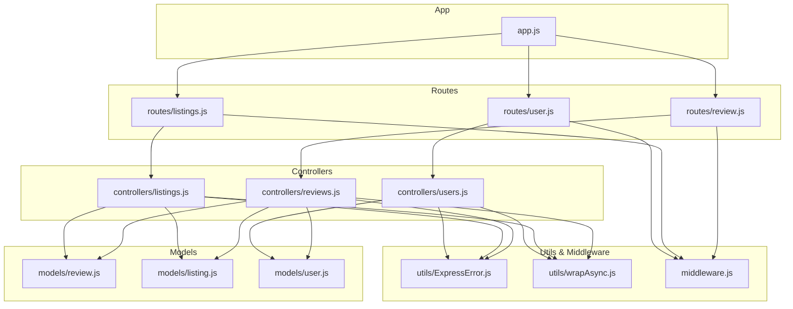
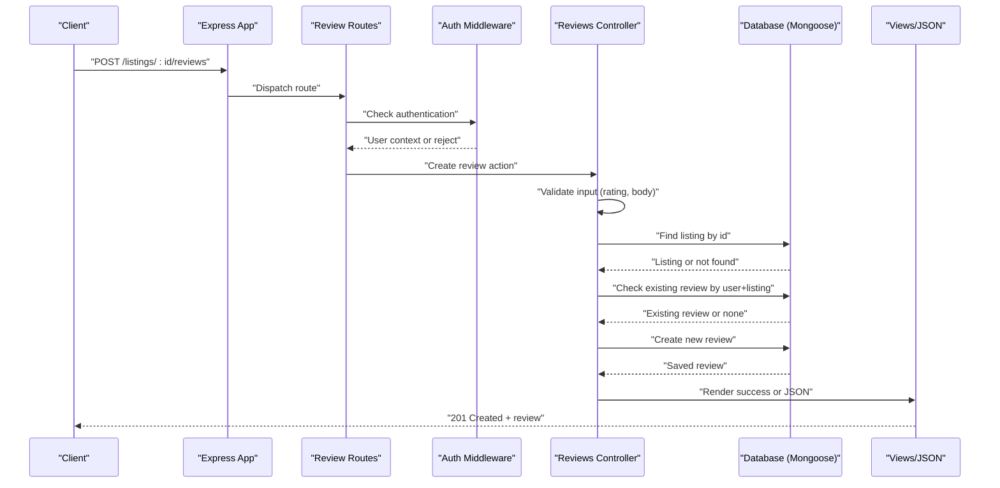
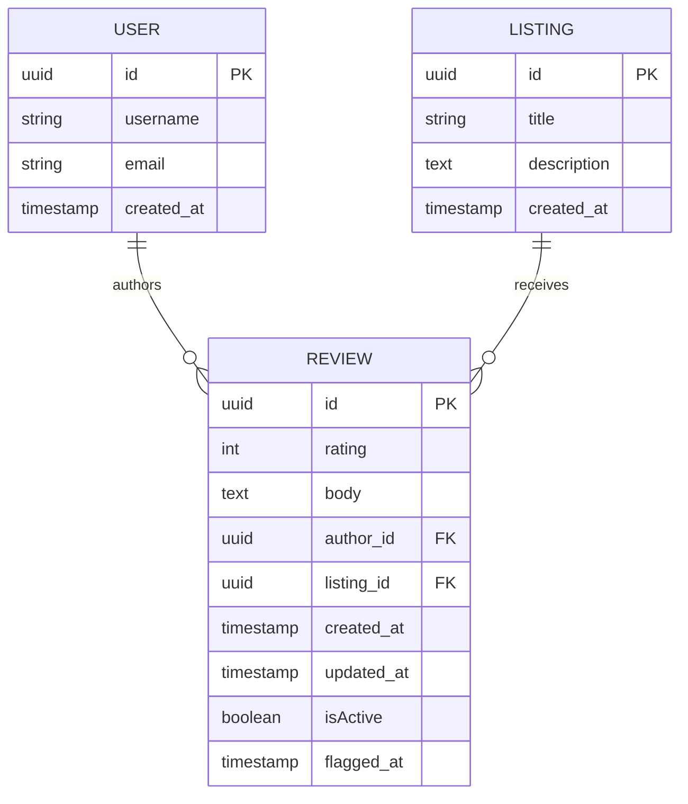
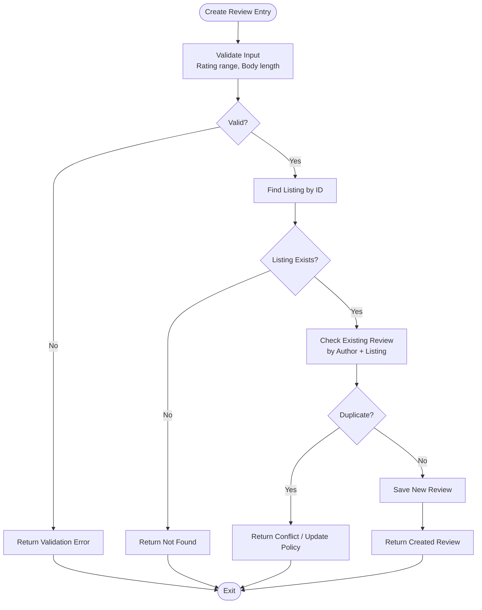
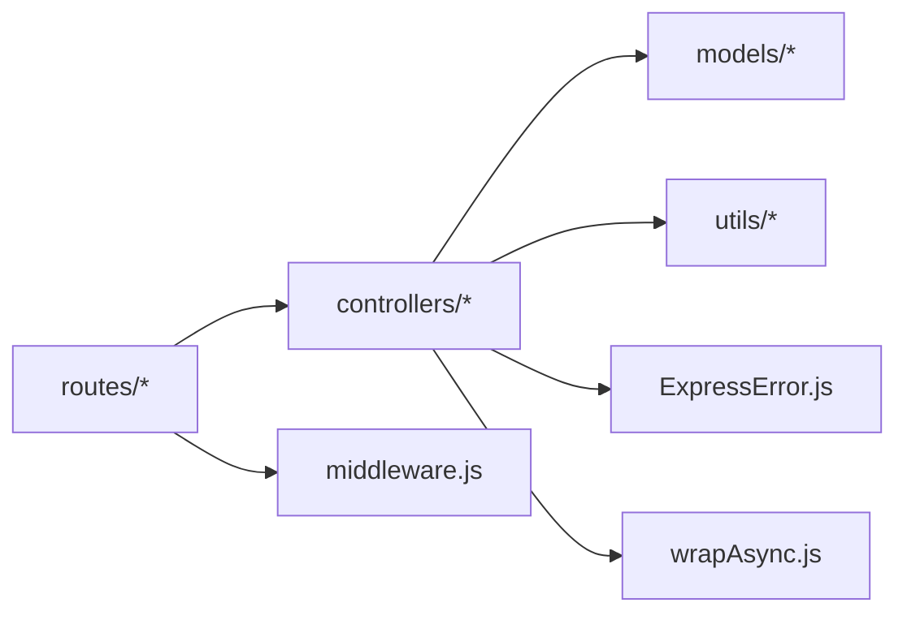

# Review Submission and Management

<cite>
**Referenced Files in This Document**
- [review.js](file://models/review.js)
- [listing.js](file://models/listing.js)
- [user.js](file://models/user.js)
- [reviews.js](file://controllers/reviews.js)
- [listings.js](file://controllers/listings.js)
- [users.js](file://controllers/users.js)
- [review.js](file://routes/review.js)
- [listings.js](file://routes/listings.js)
- [user.js](file://routes/user.js)
- [ExpressError.js](file://utils/ExpressError.js)
- [wrapAsync.js](file://utils/wrapAsync.js)
- [app.js](file://app.js)
- [middleware.js](file://middleware.js)
</cite>

## Table of Contents
1. [Introduction](#introduction)
2. [Project Structure](#project-structure)
3. [Core Components](#core-components)
4. [Architecture Overview](#architecture-overview)
5. [Detailed Component Analysis](#detailed-component-analysis)
6. [Dependency Analysis](#dependency-analysis)
7. [Performance Considerations](#performance-considerations)
8. [Troubleshooting Guide](#troubleshooting-guide)
9. [Conclusion](#conclusion)

## Introduction
This document explains the end-to-end workflow for creating, validating, storing, and managing reviews in the application. It covers:
- The review data model and its relationships to users and listings
- Authentication requirements for submitting reviews
- Form validation and error handling
- API endpoints and controller logic for review submission
- Database operations and integrity constraints
- Moderation capabilities and duplicate prevention strategies

The goal is to provide both a high-level understanding and detailed implementation references so that developers can implement or extend review functionality confidently.

## Project Structure
Review-related code spans models, controllers, routes, utilities, and middleware:
- Models define schemas and relationships (review, listing, user)
- Controllers implement business logic for review creation and management
- Routes expose HTTP endpoints for review operations
- Utilities standardize error handling and async wrapper usage
- Middleware enforces authentication and authorization

**Diagram sources**
- [app.js](file://app.js)
- [review.js](file://routes/review.js)
- [listings.js](file://routes/listings.js)
- [user.js](file://routes/user.js)
- [reviews.js](file://controllers/reviews.js)
- [listings.js](file://controllers/listings.js)
- [users.js](file://controllers/users.js)
- [review.js](file://models/review.js)
- [listing.js](file://models/listing.js)
- [user.js](file://models/user.js)
- [ExpressError.js](file://utils/ExpressError.js)
- [wrapAsync.js](file://utils/wrapAsync.js)
- [middleware.js](file://middleware.js)

**Section sources**
- [app.js](file://app.js)
- [review.js](file://routes/review.js)
- [listings.js](file://routes/listings.js)
- [user.js](file://routes/user.js)
- [reviews.js](file://controllers/reviews.js)
- [listings.js](file://controllers/listings.js)
- [users.js](file://controllers/users.js)
- [review.js](file://models/review.js)
- [listing.js](file://models/listing.js)
- [user.js](file://models/user.js)
- [ExpressError.js](file://utils/ExpressError.js)
- [wrapAsync.js](file://utils/wrapAsync.js)
- [middleware.js](file://middleware.js)

## Core Components
- Review Model: Defines fields such as rating, body, timestamps, and references to author and listing. Includes validation rules and indexes for integrity and performance.
- Listing Model: Represents the entity being reviewed; includes a reference back to reviews if needed for aggregation.
- User Model: Represents authenticated users who author reviews.
- Reviews Controller: Implements logic for creating, reading, updating, and deleting reviews, including validation and error handling.
- Listings Controller: May include actions to display reviews associated with a listing and to compute average ratings.
- Routes: Map HTTP endpoints to controller methods and apply authentication middleware.
- Utilities: ExpressError for consistent error propagation and wrapAsync for safe async handler execution.
- Middleware: Enforces login checks and ownership/moderation permissions.

Key responsibilities:
- Validate inputs before persistence
- Ensure only authenticated users can submit reviews
- Prevent duplicate reviews per user per listing
- Maintain referential integrity between reviews, users, and listings
- Provide moderation hooks (e.g., soft delete, flagging)

**Section sources**
- [review.js](file://models/review.js)
- [listing.js](file://models/listing.js)
- [user.js](file://models/user.js)
- [reviews.js](file://controllers/reviews.js)
- [listings.js](file://controllers/listings.js)
- [ExpressError.js](file://utils/ExpressError.js)
- [wrapAsync.js](file://utils/wrapAsync.js)
- [middleware.js](file://middleware.js)

## Architecture Overview
The review submission flow involves client requests routed through Express, validated by middleware, processed by controllers, persisted via models, and returning responses with proper error handling.

**Diagram sources**
- [review.js](file://routes/review.js)
- [reviews.js](file://controllers/reviews.js)
- [middleware.js](file://middleware.js)
- [review.js](file://models/review.js)
- [listing.js](file://models/listing.js)

## Detailed Component Analysis

### Review Model Schema and Relationships
The review model defines core fields and constraints:
- Rating: numeric value within an allowed range (for example, 1–5)
- Body: text content of the review
- Author: reference to a user (required)
- Listing: reference to a listing (required)
- Timestamps: createdAt, updatedAt

Validation and integrity:
- Required fields enforced at schema level
- Range validation for rating
- Unique constraint on (author, listing) to prevent duplicates
- Indexes on author and listing for efficient queries
- Optional moderation flags (e.g., isActive, flaggedAt) can be added to support moderation workflows

Relationships:
- Many-to-one with User (multiple reviews per user)
- Many-to-one with Listing (multiple reviews per listing)

**Diagram sources**
- [review.js](file://models/review.js)
- [user.js](file://models/user.js)
- [listing.js](file://models/listing.js)

**Section sources**
- [review.js](file://models/review.js)
- [user.js](file://models/user.js)
- [listing.js](file://models/listing.js)

### Authentication and Authorization
- Only authenticated users can create reviews
- Middleware checks session or token presence and attaches user context to request
- Ownership checks ensure users can edit/delete only their own reviews unless they have moderator privileges
- Moderators can view flagged reviews and toggle moderation state

Implementation patterns:
- Route-level middleware guards for protected endpoints
- Conditional checks in controllers for ownership/moderation roles

**Section sources**
- [middleware.js](file://middleware.js)
- [review.js](file://routes/review.js)
- [reviews.js](file://controllers/reviews.js)

### Controller Logic for Review Creation
High-level steps:
- Parse and validate request body (rating, body)
- Verify the target listing exists
- Check for duplicate review by current user and listing
- Create and persist the review
- Respond with success or appropriate error

Input validation:
- Rating must be within allowed bounds
- Body must meet minimum length requirements
- Missing required fields produce validation errors

Duplicate prevention:
- Query existing reviews by author and listing
- If found, return conflict response or update existing review depending on policy

Error handling:
- Use standardized error type for consistent responses
- Wrap async handlers to avoid unhandled promise rejections

**Diagram sources**
- [reviews.js](file://controllers/reviews.js)
- [ExpressError.js](file://utils/ExpressError.js)
- [wrapAsync.js](file://utils/wrapAsync.js)
- [review.js](file://models/review.js)
- [listing.js](file://models/listing.js)

**Section sources**
- [reviews.js](file://controllers/reviews.js)
- [ExpressError.js](file://utils/ExpressError.js)
- [wrapAsync.js](file://utils/wrapAsync.js)
- [review.js](file://models/review.js)
- [listing.js](file://models/listing.js)

### API Endpoints and Routing
Typical endpoints:
- POST /listings/:id/reviews: Create a review for a listing
- GET /listings/:id/reviews: List reviews for a listing
- GET /reviews/:id: Get a specific review
- PUT /reviews/:id: Update a review (owner or moderator)
- DELETE /reviews/:id: Delete a review (owner or moderator)

Routing and middleware:
- Routes map endpoints to controller actions
- Authentication middleware protects write endpoints
- Optional moderation-only endpoints for admin tasks

Example usage patterns:
- Submitting a review via form: send POST with rating and body
- Fetching reviews: GET with optional pagination and filters
- Updating/deleting: require owner or moderator role

**Section sources**
- [review.js](file://routes/review.js)
- [listings.js](file://routes/listings.js)
- [reviews.js](file://controllers/reviews.js)
- [middleware.js](file://middleware.js)

### Data Integrity Constraints and Duplicate Prevention
Constraints:
- Required fields enforced at schema level
- Rating range validation
- Unique index on (author, listing) prevents duplicate submissions
- Foreign key references ensure valid author and listing IDs

Duplicate prevention strategy:
- Before insert, query for existing review by author and listing
- On conflict, either reject with conflict status or update existing review based on business rules

Moderation capabilities:
- Add isActive flag to control visibility
- Add flaggedAt timestamp to mark reviews under review
- Provide admin endpoints to toggle flags and manage visibility

**Section sources**
- [review.js](file://models/review.js)
- [reviews.js](file://controllers/reviews.js)

### Listing Integration and Average Ratings
Listings may aggregate review statistics:
- Compute average rating from associated reviews
- Display review counts and averages on listing pages
- Cache or denormalize averages for performance if needed

Integration points:
- When a review is created or updated, recalculate listing metrics
- Expose listing show endpoint to include aggregated review data

**Section sources**
- [listings.js](file://controllers/listings.js)
- [review.js](file://models/review.js)
- [listing.js](file://models/listing.js)

## Dependency Analysis
Component dependencies:
- Routes depend on controllers and middleware
- Controllers depend on models and utilities
- Models depend on database drivers and schema definitions
- Utilities provide cross-cutting concerns (error handling, async wrapping)

**Diagram sources**
- [review.js](file://routes/review.js)
- [listings.js](file://routes/listings.js)
- [user.js](file://routes/user.js)
- [reviews.js](file://controllers/reviews.js)
- [listings.js](file://controllers/listings.js)
- [users.js](file://controllers/users.js)
- [review.js](file://models/review.js)
- [listing.js](file://models/listing.js)
- [user.js](file://models/user.js)
- [ExpressError.js](file://utils/ExpressError.js)
- [wrapAsync.js](file://utils/wrapAsync.js)
- [middleware.js](file://middleware.js)

**Section sources**
- [review.js](file://routes/review.js)
- [listings.js](file://routes/listings.js)
- [user.js](file://routes/user.js)
- [reviews.js](file://controllers/reviews.js)
- [listings.js](file://controllers/listings.js)
- [users.js](file://controllers/users.js)
- [review.js](file://models/review.js)
- [listing.js](file://models/listing.js)
- [user.js](file://models/user.js)
- [ExpressError.js](file://utils/ExpressError.js)
- [wrapAsync.js](file://utils/wrapAsync.js)
- [middleware.js](file://middleware.js)

## Performance Considerations
- Indexing: Ensure indexes on frequently queried fields (author, listing) to speed up lookups and duplicate checks
- Aggregation: For listing average ratings, consider caching results or using background jobs to avoid heavy computations on hot paths
- Pagination: Implement pagination for listing reviews to reduce payload size
- Validation: Perform server-side validation early to fail fast and minimize database round trips
- Concurrency: Handle race conditions when multiple users submit reviews simultaneously by using unique constraints and atomic updates

[No sources needed since this section provides general guidance]

## Troubleshooting Guide
Common issues and resolutions:
- Validation failures: Ensure all required fields are present and within allowed ranges; return structured validation errors
- Authentication errors: Confirm middleware is applied to protected routes and user session/token is valid
- Not found errors: Verify listing exists before creating a review; handle missing resources gracefully
- Duplicate reviews: Check existing reviews by author and listing; decide whether to reject or update
- Database errors: Use standardized error types and log contextual information for debugging

Error handling patterns:
- Use ExpressError to propagate meaningful messages and status codes
- Wrap async handlers to catch unexpected exceptions and convert them to HTTP responses
- Centralize error logging and monitoring

**Section sources**
- [ExpressError.js](file://utils/ExpressError.js)
- [wrapAsync.js](file://utils/wrapAsync.js)
- [reviews.js](file://controllers/reviews.js)

## Conclusion
The review submission and management system integrates models, controllers, routes, middleware, and utilities to provide a robust workflow from creation to storage. By enforcing validation, authentication, and integrity constraints—and by implementing duplicate prevention and moderation capabilities—the system ensures reliable and secure review operations. Following the patterns outlined here will help maintain consistency, scalability, and ease of maintenance across the application.

[No sources needed since this section summarizes without analyzing specific files]