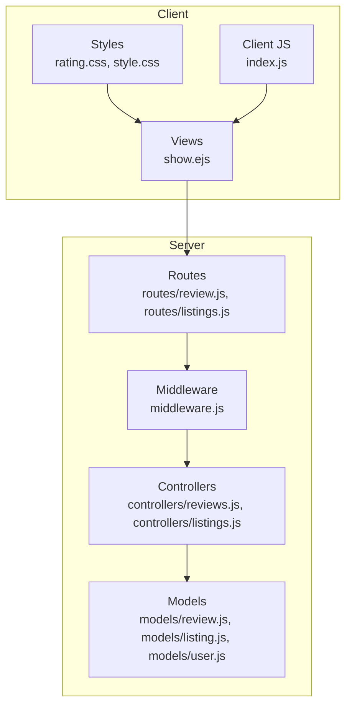
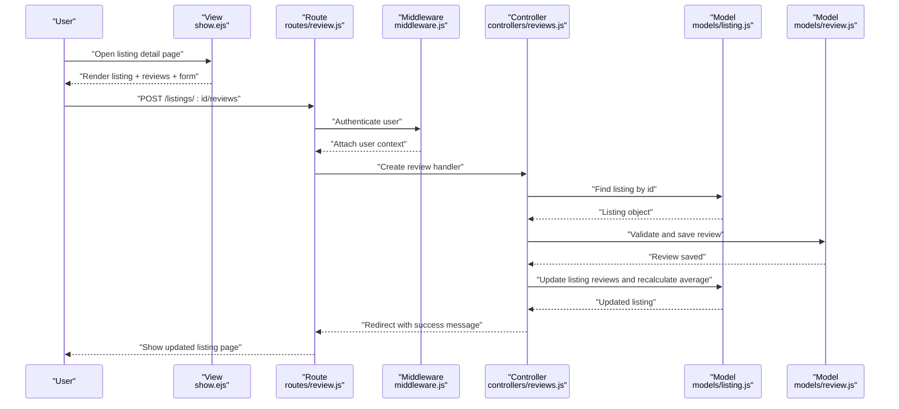
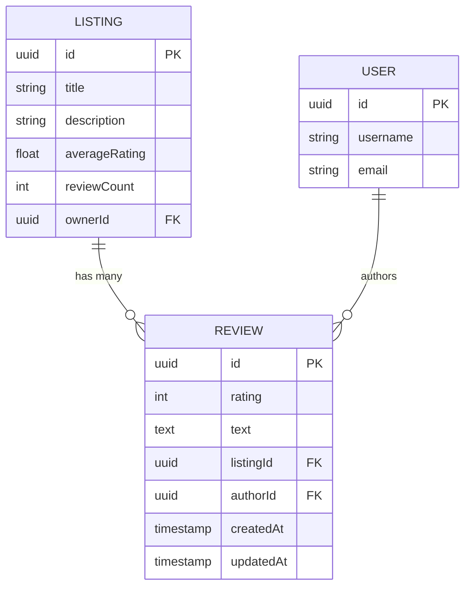
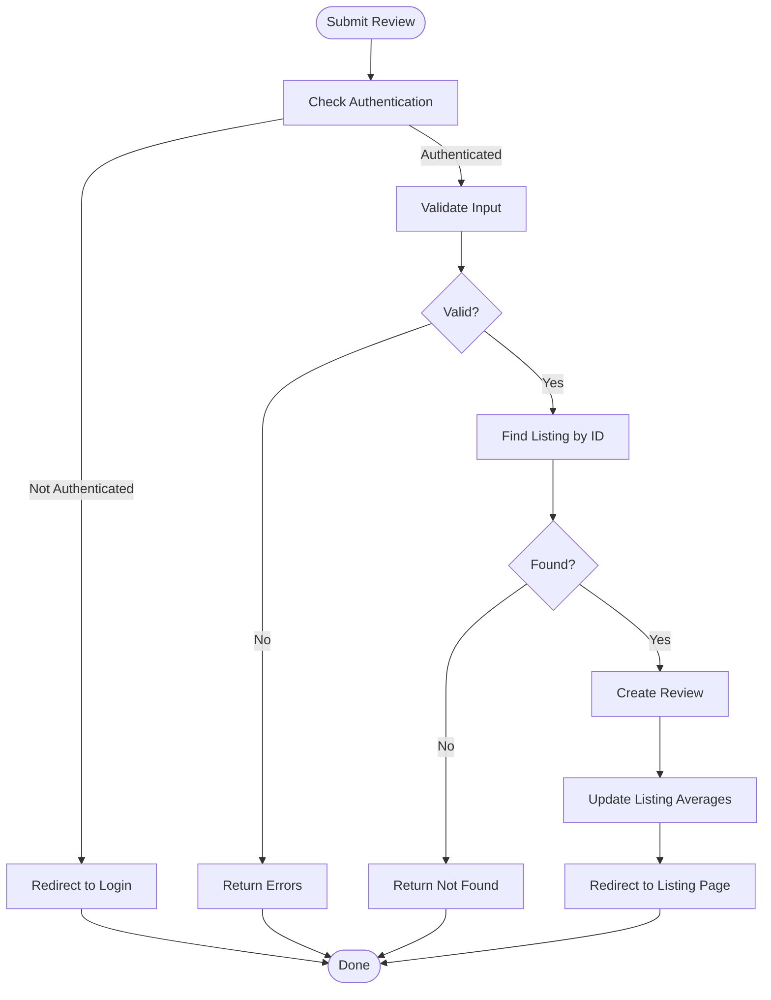
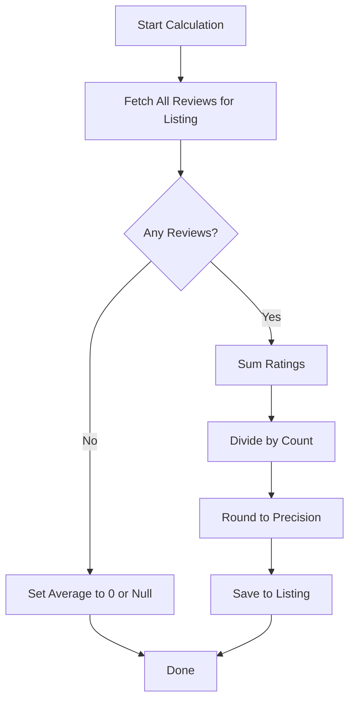
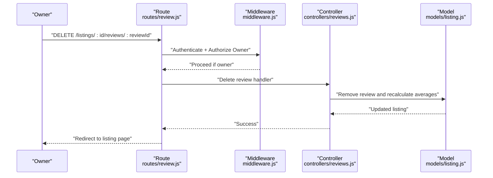
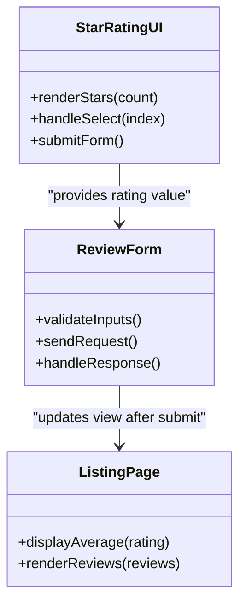
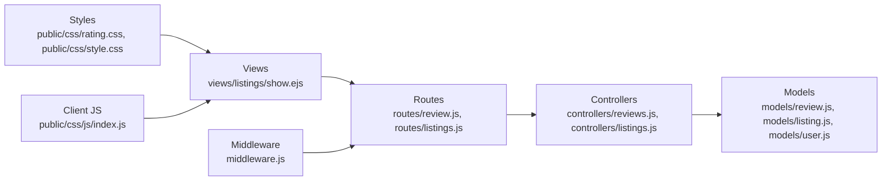

# Review and Rating System

<cite>
**Referenced Files in This Document**
- [review.js](file://models/review.js)
- [listing.js](file://models/listing.js)
- [user.js](file://models/user.js)
- [reviews.js](file://controllers/reviews.js)
- [listings.js](file://controllers/listings.js)
- [review.js](file://routes/review.js)
- [listings.js](file://routes/listings.js)
- [rating.css](file://public/css/rating.css)
- [style.css](file://public/css/style.css)
- [index.js](file://public/css/js/index.js)
- [show.ejs](file://views/listings/show.ejs)
- [app.js](file://app.js)
- [middleware.js](file://middleware.js)
</cite>

## Table of Contents
1. [Introduction](#introduction)
2. [Project Structure](#project-structure)
3. [Core Components](#core-components)
4. [Architecture Overview](#architecture-overview)
5. [Detailed Component Analysis](#detailed-component-analysis)
6. [Dependency Analysis](#dependency-analysis)
7. [Performance Considerations](#performance-considerations)
8. [Troubleshooting Guide](#troubleshooting-guide)
9. [Conclusion](#conclusion)
10. [Appendices](#appendices)

## Introduction
This document explains the review and rating system implemented across models, controllers, routes, views, and styles. It covers:
- How reviews are submitted and validated
- How ratings are calculated and displayed
- Moderation features for listing owners
- The data model schema and relationships with listings and users
- UI integration on listing pages, including star rating interaction and formatting
- Error handling and performance considerations

## Project Structure
The review and rating functionality spans several layers:
- Data models define schemas and relationships
- Controllers implement business logic (create, update, delete, average calculation)
- Routes expose endpoints and attach middleware
- Views render listing details and review forms
- Styles provide star rating visuals and general layout
- Client-side JS enhances user interactions

**Diagram sources**
- [show.ejs](file://views/listings/show.ejs)
- [rating.css](file://public/css/rating.css)
- [style.css](file://public/css/style.css)
- [index.js](file://public/css/js/index.js)
- [review.js](file://routes/review.js)
- [listings.js](file://routes/listings.js)
- [middleware.js](file://middleware.js)
- [reviews.js](file://controllers/reviews.js)
- [listings.js](file://controllers/listings.js)
- [review.js](file://models/review.js)
- [listing.js](file://models/listing.js)
- [user.js](file://models/user.js)

**Section sources**
- [app.js](file://app.js)
- [review.js](file://routes/review.js)
- [listings.js](file://routes/listings.js)
- [reviews.js](file://controllers/reviews.js)
- [listings.js](file://controllers/listings.js)
- [review.js](file://models/review.js)
- [listing.js](file://models/listing.js)
- [user.js](file://models/user.js)
- [show.ejs](file://views/listings/show.ejs)
- [rating.css](file://public/css/rating.css)
- [style.css](file://public/css/style.css)
- [index.js](file://public/css/js/index.js)

## Core Components
- Review Model: Defines fields such as rating value, text content, timestamps, and references to a Listing and a User. Includes validation rules for rating range and required fields.
- Listing Model: Maintains a reference to its owner and an array of associated Reviews. May include computed or cached aggregate fields like averageRating and reviewCount.
- User Model: Represents authenticated users who can create reviews and moderate their own listings.
- Review Controller: Implements creation, deletion, and moderation actions; calculates averages; enforces ownership checks.
- Listings Controller: Integrates review display into listing detail pages and may compute averages for rendering.
- Routes: Define RESTful endpoints for creating and deleting reviews, and for displaying listing details.
- Views: Render listing show page with review form, existing reviews, and average rating.
- Styles and Client JS: Provide interactive star rating input and visual feedback.

Key responsibilities:
- Validation: Ensure rating is within allowed bounds and required fields are present.
- Ownership: Only listing owners can delete reviews.
- Aggregation: Compute average rating from all reviews for a listing.
- UI: Display stars, allow logged-in users to submit reviews, and show moderation controls.

**Section sources**
- [review.js](file://models/review.js)
- [listing.js](file://models/listing.js)
- [user.js](file://models/user.js)
- [reviews.js](file://controllers/reviews.js)
- [listings.js](file://controllers/listings.js)
- [review.js](file://routes/review.js)
- [listings.js](file://routes/listings.js)
- [show.ejs](file://views/listings/show.ejs)
- [rating.css](file://public/css/rating.css)
- [style.css](file://public/css/style.css)
- [index.js](file://public/css/js/index.js)

## Architecture Overview
End-to-end flow for submitting a review and displaying results:

**Diagram sources**
- [show.ejs](file://views/listings/show.ejs)
- [review.js](file://routes/review.js)
- [middleware.js](file://middleware.js)
- [reviews.js](file://controllers/reviews.js)
- [listing.js](file://models/listing.js)
- [review.js](file://models/review.js)

## Detailed Component Analysis

### Review Model Schema and Relationships
- Fields typically include:
  - rating: numeric star rating with validation constraints
  - text: optional review body
  - author: reference to User
  - createdAt/updatedAt: timestamps
- Relationships:
  - belongsTo Listing via foreign key
  - belongsTo User via foreign key
- Validation rules:
  - rating must be within defined min/max (e.g., 1–5)
  - required fields enforced at creation time

**Diagram sources**
- [review.js](file://models/review.js)
- [listing.js](file://models/listing.js)
- [user.js](file://models/user.js)

**Section sources**
- [review.js](file://models/review.js)
- [listing.js](file://models/listing.js)
- [user.js](file://models/user.js)

### Review Submission Process
- Entry points:
  - Route defines POST endpoint under listing path
  - Middleware ensures user is authenticated
- Controller logic:
  - Validates request payload
  - Finds the target listing
  - Creates a new review linked to current user and listing
  - Updates listing aggregates (average rating, review count)
  - Redirects back to listing page with flash messages

**Diagram sources**
- [review.js](file://routes/review.js)
- [middleware.js](file://middleware.js)
- [reviews.js](file://controllers/reviews.js)
- [listing.js](file://models/listing.js)
- [review.js](file://models/review.js)

**Section sources**
- [review.js](file://routes/review.js)
- [middleware.js](file://middleware.js)
- [reviews.js](file://controllers/reviews.js)
- [listing.js](file://models/listing.js)
- [review.js](file://models/review.js)

### Rating Calculation Logic
- Average rating computation:
  - Sum all review ratings for a listing
  - Divide by number of reviews
  - Round to desired precision for display
- Edge cases:
  - No reviews: default to zero or null
  - Invalid ratings: filtered out by validation before aggregation
- Implementation patterns:
  - Recalculate after each create/update/delete
  - Optionally cache averageRating and reviewCount on Listing to avoid repeated queries

**Diagram sources**
- [reviews.js](file://controllers/reviews.js)
- [listing.js](file://models/listing.js)
- [review.js](file://models/review.js)

**Section sources**
- [reviews.js](file://controllers/reviews.js)
- [listing.js](file://models/listing.js)
- [review.js](file://models/review.js)

### Review Moderation Features
- Ownership enforcement:
  - Only the listing owner can delete reviews
  - Middleware or controller checks ownership before allowing deletion
- Actions:
  - Delete review endpoint tied to listing route
  - On successful deletion, recompute averages and redirect

**Diagram sources**
- [review.js](file://routes/review.js)
- [middleware.js](file://middleware.js)
- [reviews.js](file://controllers/reviews.js)
- [listing.js](file://models/listing.js)

**Section sources**
- [review.js](file://routes/review.js)
- [middleware.js](file://middleware.js)
- [reviews.js](file://controllers/reviews.js)
- [listing.js](file://models/listing.js)

### Star Rating Implementation and UI Integration
- Frontend components:
  - Interactive star inputs using CSS classes and client-side JS
  - Visual feedback for hover/select states
- Styling:
  - rating.css provides star shapes, colors, and transitions
  - style.css integrates with overall theme
- Interaction patterns:
  - Users select a star to set rating
  - Form submission includes selected rating and optional text
  - After submission, page reloads showing updated average and review list

**Diagram sources**
- [show.ejs](file://views/listings/show.ejs)
- [rating.css](file://public/css/rating.css)
- [style.css](file://public/css/style.css)
- [index.js](file://public/css/js/index.js)

**Section sources**
- [show.ejs](file://views/listings/show.ejs)
- [rating.css](file://public/css/rating.css)
- [style.css](file://public/css/style.css)
- [index.js](file://public/css/js/index.js)

### Example Scenarios
- Creating a review:
  - Logged-in user opens listing detail page
  - Selects star rating and writes optional text
  - Submits form; server validates, saves review, updates averages, redirects
- Deleting a review (owner only):
  - Owner clicks delete control
  - Server verifies ownership, removes review, recalculates averages, redirects
- Displaying average rating:
  - Listing page shows rounded average based on stored calculations

[No sources needed since this section summarizes workflows without analyzing specific files]

## Dependency Analysis
High-level dependencies among modules:

**Diagram sources**
- [review.js](file://routes/review.js)
- [listings.js](file://routes/listings.js)
- [reviews.js](file://controllers/reviews.js)
- [listings.js](file://controllers/listings.js)
- [review.js](file://models/review.js)
- [listing.js](file://models/listing.js)
- [user.js](file://models/user.js)
- [show.ejs](file://views/listings/show.ejs)
- [rating.css](file://public/css/rating.css)
- [style.css](file://public/css/style.css)
- [index.js](file://public/css/js/index.js)
- [middleware.js](file://middleware.js)

**Section sources**
- [review.js](file://routes/review.js)
- [listings.js](file://routes/listings.js)
- [reviews.js](file://controllers/reviews.js)
- [listings.js](file://controllers/listings.js)
- [review.js](file://models/review.js)
- [listing.js](file://models/listing.js)
- [user.js](file://models/user.js)
- [show.ejs](file://views/listings/show.ejs)
- [rating.css](file://public/css/rating.css)
- [style.css](file://public/css/style.css)
- [index.js](file://public/css/js/index.js)
- [middleware.js](file://middleware.js)

## Performance Considerations
- Avoid N+1 queries when fetching reviews for a listing by using population or joins where supported.
- Cache averageRating and reviewCount on Listing to reduce recomputation frequency.
- Debounce client-side interactions if implementing live previews.
- Use pagination for large review lists to improve rendering performance.
- Normalize and validate inputs early to prevent unnecessary database operations.

[No sources needed since this section provides general guidance]

## Troubleshooting Guide
Common issues and resolutions:
- Authentication failures:
  - Ensure login state is active and session middleware is configured
  - Check that routes require authentication before review actions
- Validation errors:
  - Verify rating is within allowed range and required fields are provided
  - Inspect server-side validation messages returned to the client
- Ownership errors:
  - Confirm owner checks are applied before delete operations
  - Log ownership mismatches for debugging
- Average rating not updating:
  - Ensure recalculation runs after create/update/delete
  - Verify rounding and precision settings

**Section sources**
- [middleware.js](file://middleware.js)
- [reviews.js](file://controllers/reviews.js)
- [review.js](file://models/review.js)
- [listing.js](file://models/listing.js)

## Conclusion
The review and rating system integrates models, controllers, routes, views, and styling to deliver a complete feature set:
- Robust validation and ownership enforcement
- Accurate average rating calculations
- Clean UI with interactive star ratings
- Clear separation of concerns across layers
Adhering to the outlined best practices will ensure maintainability, performance, and a positive user experience.

[No sources needed since this section summarizes without analyzing specific files]

## Appendices

### API Endpoints Summary
- Create Review:
  - Method: POST
  - Path: /listings/:id/reviews
  - Auth: Required
  - Body: rating, text (optional)
  - Response: Redirect to listing page with status message
- Delete Review:
  - Method: DELETE
  - Path: /listings/:id/reviews/:reviewId
  - Auth: Required
  - Authorization: Listing owner only
  - Response: Redirect to listing page with status message

[No sources needed since this section provides general guidance]