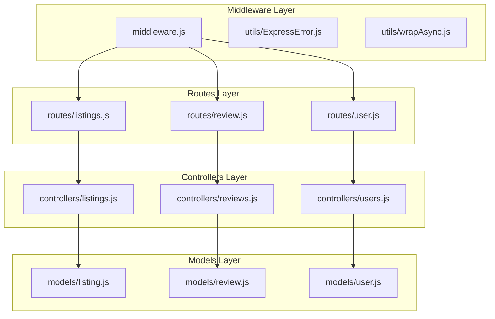
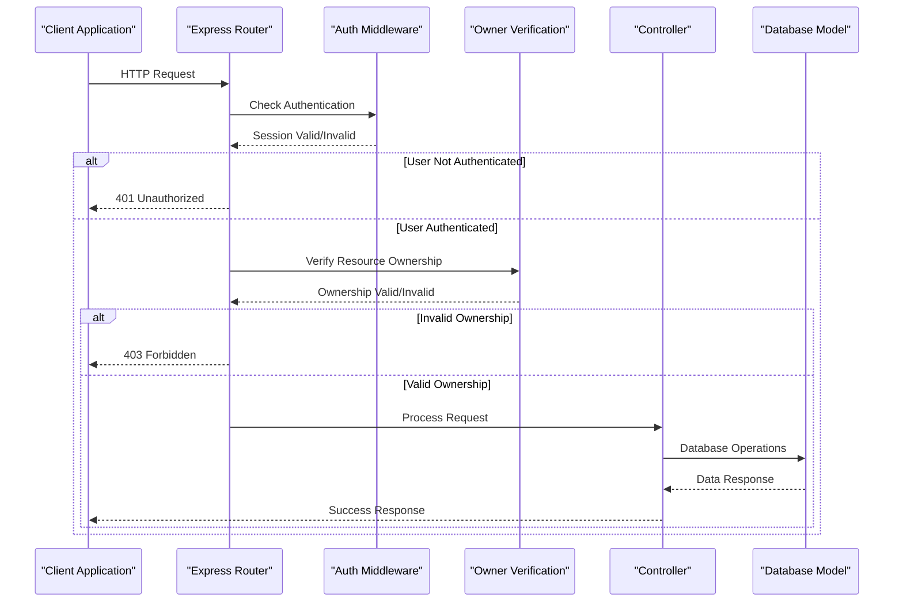
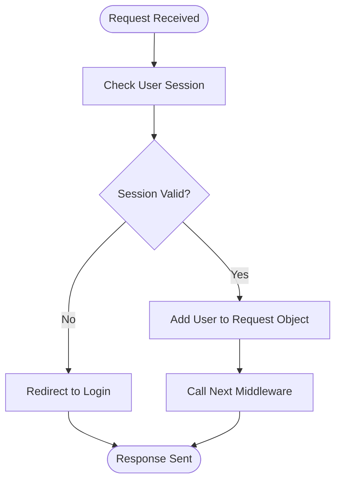
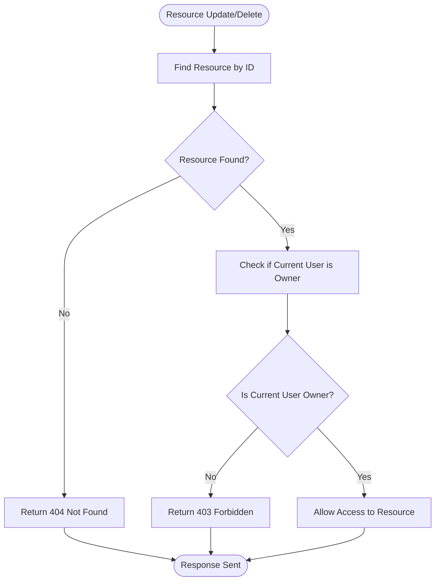
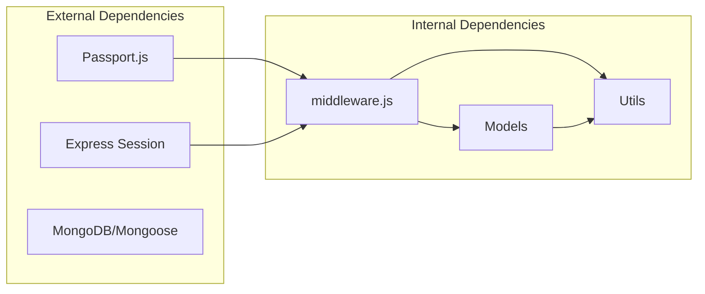

# Authorization Middleware

<cite>
**Referenced Files in This Document**
- [middleware.js](file://middleware.js)
- [routes/listings.js](file://routes/listings.js)
- [routes/review.js](file://routes/review.js)
- [routes/user.js](file://routes/user.js)
- [controllers/listings.js](file://controllers/listings.js)
- [controllers/reviews.js](file://controllers/reviews.js)
- [controllers/users.js](file://controllers/users.js)
- [models/listing.js](file://models/listing.js)
- [models/review.js](file://models/review.js)
- [models/user.js](file://models/user.js)
- [utils/ExpressError.js](file://utils/ExpressError.js)
- [utils/wrapAsync.js](file://utils/wrapAsync.js)
</cite>

## Table of Contents
1. [Introduction](#introduction)
2. [Project Structure](#project-structure)
3. [Core Components](#core-components)
4. [Architecture Overview](#architecture-overview)
5. [Detailed Component Analysis](#detailed-component-analysis)
6. [Dependency Analysis](#dependency-analysis)
7. [Performance Considerations](#performance-considerations)
8. [Troubleshooting Guide](#troubleshooting-guide)
9. [Conclusion](#conclusion)

## Introduction

This document provides comprehensive documentation for the authorization middleware system in the application. The authorization system implements route protection, user role verification, and resource ownership validation to ensure secure access control throughout the application. It covers the isAuthenticated middleware, owner verification functions, custom authorization logic, and various authorization scenarios including listing ownership and review permissions.

## Project Structure

The authorization system is distributed across several key components:



**Diagram sources**
- [middleware.js](file://middleware.js)
- [routes/listings.js](file://routes/listings.js)
- [routes/review.js](file://routes/review.js)
- [routes/user.js](file://routes/user.js)

**Section sources**
- [middleware.js](file://middleware.js)
- [routes/listings.js](file://routes/listings.js)
- [routes/review.js](file://routes/review.js)
- [routes/user.js](file://routes/user.js)

## Core Components

### Authentication Middleware

The core authentication middleware validates user sessions and ensures only authenticated users can access protected routes. This middleware typically checks for valid session data and user credentials before allowing route access.

### Route Protection Patterns

Route protection is implemented through middleware composition, where multiple authorization checks can be chained together. Common patterns include:

- **Basic Authentication**: Ensures user is logged in
- **Resource Ownership**: Validates user owns specific resources
- **Role-Based Access**: Checks user roles and permissions
- **Fine-grained Permissions**: Implements detailed access control rules

### Error Handling

The system uses centralized error handling through ExpressError utilities to provide consistent error responses for unauthorized access attempts.

**Section sources**
- [middleware.js](file://middleware.js)
- [utils/ExpressError.js](file://utils/ExpressError.js)
- [utils/wrapAsync.js](file://utils/wrapAsync.js)

## Architecture Overview

The authorization architecture follows a layered approach with clear separation of concerns:



**Diagram sources**
- [routes/listings.js](file://routes/listings.js)
- [routes/review.js](file://routes/review.js)
- [middleware.js](file://middleware.js)

## Detailed Component Analysis

### Authentication Middleware (isAuthenticated)

The isAuthenticated middleware serves as the primary gatekeeper for protected routes. It validates user sessions and redirects unauthenticated users appropriately.

#### Key Responsibilities:
- Session validation
- User existence verification
- Redirect handling for unauthenticated users
- Integration with passport.js or similar authentication strategies

#### Implementation Pattern:


**Diagram sources**
- [middleware.js](file://middleware.js)

### Owner Verification Functions

Owner verification functions ensure that users can only modify or delete resources they own. This is crucial for maintaining data integrity and security.

#### Common Owner Verification Scenarios:
- **Listing Ownership**: Users can only edit/delete their own listings
- **Review Ownership**: Users can only manage their own reviews
- **Profile Ownership**: Users can only update their own profiles

#### Verification Logic Flow:


**Diagram sources**
- [controllers/listings.js](file://controllers/listings.js)
- [controllers/reviews.js](file://controllers/reviews.js)

### Custom Authorization Logic

Custom authorization logic handles complex permission scenarios beyond basic ownership checks. This includes role-based access control and fine-grained permissions.

#### Role-Based Access Control:
- **Admin Roles**: Full system access
- **Moderator Roles**: Content moderation capabilities
- **Regular Users**: Standard user permissions

#### Permission Matrix:
| Action | Admin | Moderator | Regular User | Guest |
|--------|-------|-----------|--------------|-------|
| View Listings | ✓ | ✓ | ✓ | ✓ |
| Create Listings | ✓ | ✓ | ✓ | ✗ |
| Edit Own Listings | ✓ | ✓ | ✓ | ✗ |
| Delete Any Listing | ✓ | ✓ | ✗ | ✗ |
| Moderate Reviews | ✓ | ✓ | ✗ | ✗ |

**Section sources**
- [middleware.js](file://middleware.js)
- [controllers/listings.js](file://controllers/listings.js)
- [controllers/reviews.js](file://controllers/reviews.js)

### Route Protection Examples

#### Protected Listing Routes:
- **Create Listing**: Requires authentication
- **Edit Listing**: Requires ownership verification
- **Delete Listing**: Requires ownership verification
- **View Listing**: Public access (no authentication required)

#### Review Management Routes:
- **Create Review**: Requires authentication and listing ownership
- **Delete Review**: Requires review ownership
- **Update Review**: Requires review ownership

**Section sources**
- [routes/listings.js](file://routes/listings.js)
- [routes/review.js](file://routes/review.js)

### Middleware Composition Patterns

The system employs middleware composition to create flexible authorization chains:

#### Basic Authentication Chain:
```
Route → isAuthenticated → Controller
```

#### Ownership Verification Chain:
```
Route → isAuthenticated → verifyOwnership → Controller
```

#### Complex Authorization Chain:
```
Route → isAuthenticated → checkRole → verifyOwnership → Controller
```

#### Error Handling Integration:
```
Route → isAuthenticated → verifyOwnership → wrapAsync(Controller) → ErrorHandler
```

**Section sources**
- [routes/listings.js](file://routes/listings.js)
- [routes/review.js](file://routes/review.js)
- [utils/wrapAsync.js](file://utils/wrapAsync.js)

## Dependency Analysis

The authorization system has well-defined dependencies between components:



**Diagram sources**
- [middleware.js](file://middleware.js)
- [models/user.js](file://models/user.js)
- [models/listing.js](file://models/listing.js)
- [models/review.js](file://models/review.js)

### Component Coupling Analysis:
- **Low Coupling**: Middleware components are loosely coupled through function composition
- **High Cohesion**: Each component has a single, well-defined responsibility
- **Clear Interfaces**: Well-defined request/response objects and error handling patterns

**Section sources**
- [middleware.js](file://middleware.js)
- [models/user.js](file://models/user.js)
- [models/listing.js](file://models/listing.js)
- [models/review.js](file://models/review.js)

## Performance Considerations

### Optimization Strategies:
- **Session Caching**: Minimize database queries for session validation
- **Lazy Loading**: Load user data only when needed
- **Query Optimization**: Efficient database queries for ownership verification
- **Middleware Chaining**: Optimize middleware execution order

### Memory Management:
- Proper cleanup of session data
- Efficient object disposal in middleware
- Connection pooling for database operations

## Troubleshooting Guide

### Common Authorization Issues:

#### 401 Unauthorized Errors:
- **Cause**: Missing or invalid session
- **Solution**: Ensure proper login flow and session configuration
- **Debug**: Check session middleware configuration

#### 403 Forbidden Errors:
- **Cause**: Insufficient permissions or ownership verification failure
- **Solution**: Verify user roles and resource ownership logic
- **Debug**: Log ownership verification steps

#### Session Timeout Issues:
- **Cause**: Session expiration or server restart
- **Solution**: Implement session persistence and timeout handling
- **Debug**: Monitor session store configuration

### Debugging Techniques:
- Enable detailed logging in development mode
- Use browser developer tools to inspect requests
- Implement request tracing for authorization flows
- Test with different user roles and permissions

**Section sources**
- [utils/ExpressError.js](file://utils/ExpressError.js)
- [middleware.js](file://middleware.js)

## Conclusion

The authorization middleware system provides a robust foundation for securing the application through layered authentication and authorization mechanisms. The modular design allows for easy extension and customization while maintaining clear separation of concerns. The system effectively handles common authorization scenarios including route protection, resource ownership verification, and role-based access control.

Key strengths of the implementation include:
- Comprehensive middleware composition patterns
- Clear error handling and user feedback
- Flexible authorization logic supporting various use cases
- Well-documented integration points for future enhancements

The system is designed to scale with application requirements while maintaining security best practices and performance optimization.