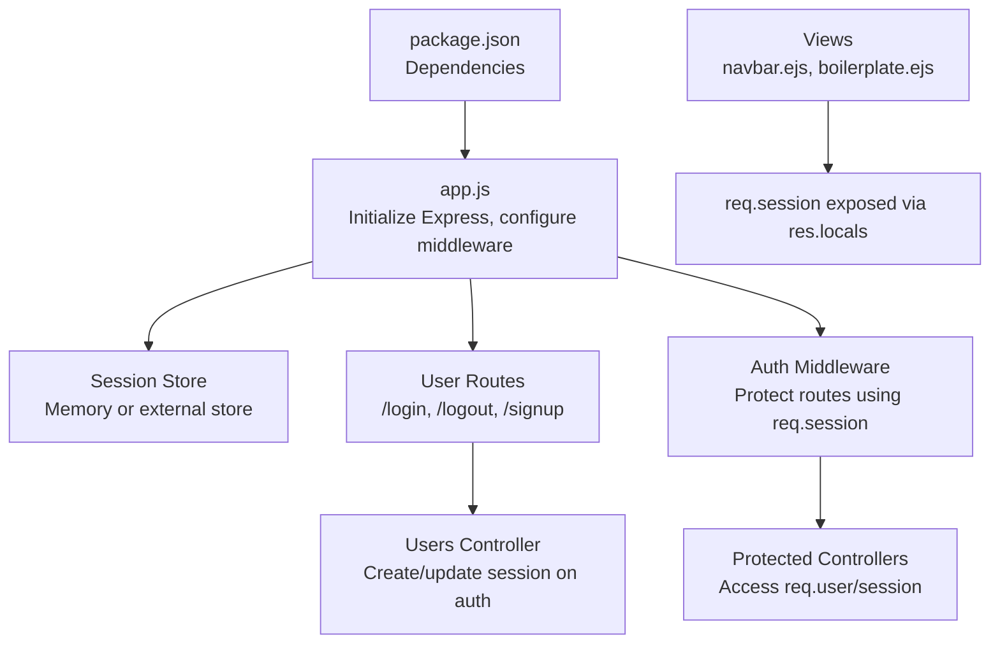
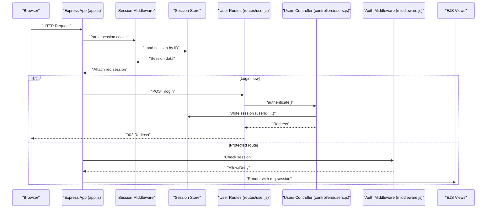
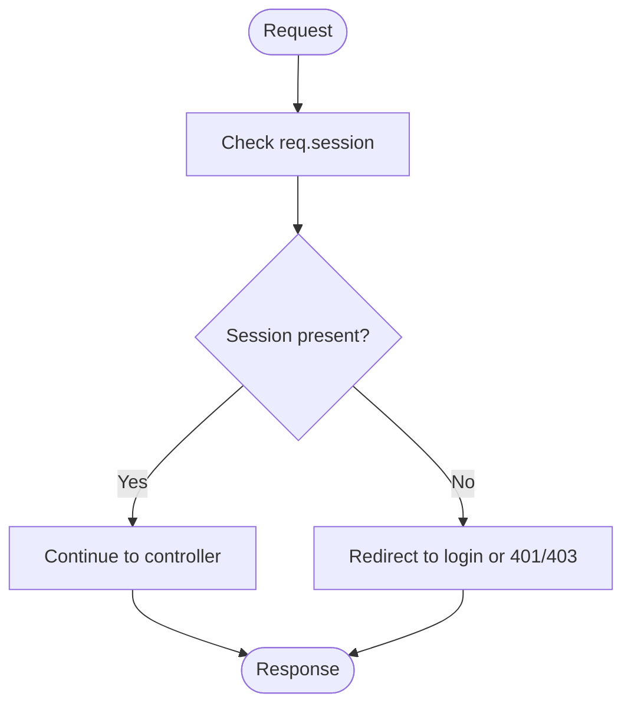
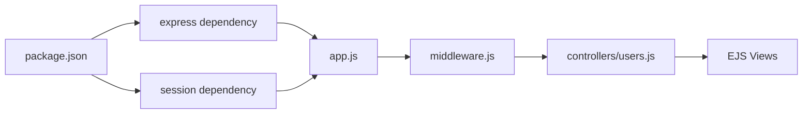

# Session Management

<cite>
**Referenced Files in This Document**
- [app.js](file://app.js)
- [middleware.js](file://middleware.js)
- [controllers/users.js](file://controllers/users.js)
- [routes/user.js](file://routes/user.js)
- [models/user.js](file://models/user.js)
- [views/includes/navbar.ejs](file://views/includes/navbar.ejs)
- [views/layouts/boilerplate.ejs](file://views/layouts/boilerplate.ejs)
- [package.json](file://package.json)
</cite>

## Table of Contents
1. [Introduction](#introduction)
2. [Project Structure](#project-structure)
3. [Core Components](#core-components)
4. [Architecture Overview](#architecture-overview)
5. [Detailed Component Analysis](#detailed-component-analysis)
6. [Dependency Analysis](#dependency-analysis)
7. [Performance Considerations](#performance-considerations)
8. [Troubleshooting Guide](#troubleshooting-guide)
9. [Conclusion](#conclusion)

## Introduction
This document explains how sessions are initialized, configured, and maintained across the application lifecycle. It covers session middleware setup, cookie configuration, storage mechanisms, persistence and expiration handling, and security measures such as secure cookies and HTTP-only flags. It also provides examples for accessing user data from sessions, implementing session-based authorization, and handling session-related errors, along with best practices and performance considerations.

## Project Structure
The session management spans several layers:
- Application bootstrap and middleware registration
- Route handlers for authentication flows
- Middleware for protecting routes and exposing session state to views
- View templates that render session-aware UI elements
- Package dependencies that provide session capabilities

**Diagram sources**
- [app.js](file://app.js)
- [middleware.js](file://middleware.js)
- [controllers/users.js](file://controllers/users.js)
- [routes/user.js](file://routes/user.js)
- [views/includes/navbar.ejs](file://views/includes/navbar.ejs)
- [views/layouts/boilerplate.ejs](file://views/layouts/boilerplate.ejs)
- [package.json](file://package.json)

**Section sources**
- [app.js](file://app.js)
- [middleware.js](file://middleware.js)
- [controllers/users.js](file://controllers/users.js)
- [routes/user.js](file://routes/user.js)
- [views/includes/navbar.ejs](file://views/includes/navbar.ejs)
- [views/layouts/boilerplate.ejs](file://views/layouts/boilerplate.ejs)
- [package.json](file://package.json)

## Core Components
- Session initialization and configuration:
  - The application registers session middleware early in the request pipeline.
  - Cookie options define security flags (secure, httpOnly), domain/path scoping, and expiration behavior.
  - A session store is configured; by default, an in-memory store may be used unless a persistent store is wired up.
- Session middleware:
  - Protects routes by checking whether a valid session exists.
  - Exposes session data to templates via res.locals for rendering.
- Authentication controllers:
  - On successful login, the controller populates the session with user identifiers and any necessary profile data.
  - On logout, the controller destroys the session.
- Views:
  - Templates read session state to conditionally render navigation links and user-specific content.

Key responsibilities:
- app.js: Registers session middleware and global settings.
- middleware.js: Provides route protection and view helpers based on req.session.
- controllers/users.js: Implements login/logout logic and updates the session.
- routes/user.js: Maps endpoints to controller actions.
- views: Render session-aware UI.

**Section sources**
- [app.js](file://app.js)
- [middleware.js](file://middleware.js)
- [controllers/users.js](file://controllers/users.js)
- [routes/user.js](file://routes/user.js)
- [views/includes/navbar.ejs](file://views/includes/navbar.ejs)
- [views/layouts/boilerplate.ejs](file://views/layouts/boilerplate.ejs)

## Architecture Overview
The session architecture follows a standard Express pattern:
- Client requests include a session cookie.
- Server validates the cookie against the configured session store.
- Authenticated routes require a valid session; protected controllers access session data.
- Views receive session context through res.locals.

**Diagram sources**
- [app.js](file://app.js)
- [middleware.js](file://middleware.js)
- [controllers/users.js](file://controllers/users.js)
- [routes/user.js](file://routes/user.js)

## Detailed Component Analysis

### Session Initialization and Configuration
- Where it happens:
  - Application bootstrap file configures session middleware and cookie options.
  - Dependencies for sessions are declared in package.json.
- What to verify:
  - Session secret is set securely.
  - Cookie options include httpOnly and secure flags when serving over HTTPS.
  - Store configuration matches deployment needs (memory vs. persistent).
- Typical configuration points:
  - Session name/id cookie key.
  - Cookie lifetime and expiration strategy.
  - Store type and connection parameters if using a persistent store.

Security checklist:
- Use a strong, randomly generated secret.
- Set httpOnly to prevent client-side script access.
- Set secure to true in production behind HTTPS.
- Restrict cookie domain/path to the minimal required scope.
- Consider sameSite policy appropriate for your cross-site usage.

**Section sources**
- [app.js](file://app.js)
- [package.json](file://package.json)

### Session Storage Mechanisms
- In-memory store:
  - Suitable for development and single-process deployments.
  - Not shared across processes; sessions lost on restart.
- Persistent stores:
  - For multi-process or horizontally scaled deployments, use a database-backed store.
  - Ensure store reliability and proper indexing for session IDs.
- Migration path:
  - Start with memory for local dev.
  - Switch to a persistent store before deploying to production.

Operational notes:
- Monitor store latency and throughput.
- Implement store health checks and fallback strategies.
- Plan for session cleanup and TTL policies.

**Section sources**
- [app.js](file://app.js)

### Session Middleware Setup
- Placement:
  - Registered early in the middleware stack so all routes can access req.session.
- Responsibilities:
  - Parse and validate session cookies.
  - Load/store session data via the configured store.
  - Attach req.session to each request.
- Error handling:
  - Fail open or closed depending on policy; ensure graceful degradation.

**Section sources**
- [app.js](file://app.js)

### Cookie Configuration
- Flags:
  - httpOnly: Prevents JavaScript access to the cookie.
  - secure: Ensures cookie sent only over HTTPS.
  - sameSite: Mitigates CSRF risks based on cross-site usage.
- Lifetime:
  - Configure maxAge or expires to control session duration.
  - Align with security requirements and UX expectations.
- Scope:
  - Limit domain and path to reduce exposure surface.

**Section sources**
- [app.js](file://app.js)

### Session Persistence and Expiration Handling
- Persistence:
  - Choose a store that survives process restarts and scales horizontally.
  - Validate connectivity and credentials at startup.
- Expiration:
  - Define absolute and sliding expiration policies.
  - Refresh session activity on sensitive operations if needed.
- Cleanup:
  - Rely on store TTL or implement periodic cleanup jobs.

**Section sources**
- [app.js](file://app.js)

### Accessing User Data from Sessions
- Pattern:
  - After login, populate req.session with user identifiers and minimal profile data.
  - In protected routes, read req.session to authorize and personalize responses.
- Best practice:
  - Avoid storing large objects in sessions; prefer IDs and fetch details on demand.

Example references:
- See where the session is populated after authentication.
- See where protected controllers read session fields.

**Section sources**
- [controllers/users.js](file://controllers/users.js)
- [middleware.js](file://middleware.js)

### Session-Based Authorization
- Protection:
  - Apply an authorization middleware to routes requiring authentication.
  - Redirect unauthenticated users to login or return 401/403 as appropriate.
- Enforcement:
  - Check presence and validity of session data before executing controller logic.
- Exposure to views:
  - Attach session-derived values to res.locals for template rendering.

**Diagram sources**
- [middleware.js](file://middleware.js)

**Section sources**
- [middleware.js](file://middleware.js)

### Logout Flow and Session Destruction
- Actions:
  - Destroy the session server-side.
  - Clear client-side cookie.
  - Redirect to a safe landing page.
- Security:
  - Invalidate any server-side tokens tied to the session.
  - Ensure no residual session data remains accessible.

**Section sources**
- [controllers/users.js](file://controllers/users.js)
- [routes/user.js](file://routes/user.js)

### Rendering Session State in Views
- Patterns:
  - Use res.locals to expose current user or flags to templates.
  - Conditionally render navigation items based on session state.
- Examples:
  - Show login/signup links when not authenticated.
  - Display user menu or profile link when authenticated.

**Section sources**
- [views/includes/navbar.ejs](file://views/includes/navbar.ejs)
- [views/layouts/boilerplate.ejs](file://views/layouts/boilerplate.ejs)

### Error Handling for Sessions
- Common issues:
  - Missing or malformed session cookies.
  - Expired sessions.
  - Store connectivity failures.
- Strategies:
  - Centralized error handler for session-related errors.
  - Graceful fallbacks (e.g., treat as unauthenticated).
  - Logging and metrics for observability.

**Section sources**
- [middleware.js](file://middleware.js)

## Dependency Analysis
Session functionality depends on Express and session-related packages. Verify versions and compatibility in package.json.

**Diagram sources**
- [package.json](file://package.json)
- [app.js](file://app.js)
- [middleware.js](file://middleware.js)
- [controllers/users.js](file://controllers/users.js)
- [views/includes/navbar.ejs](file://views/includes/navbar.ejs)

**Section sources**
- [package.json](file://package.json)

## Performance Considerations
- Keep session payloads small:
  - Store only essential identifiers and lightweight attributes.
- Choose the right store:
  - Use a low-latency, scalable store in production.
- Tune cookie size:
  - Large sessions increase bandwidth overhead on every request.
- Sliding expiration:
  - Balance security and performance; avoid excessive writes.
- Monitoring:
  - Track session creation, lookup, and write latencies.
  - Alert on store errors and high failure rates.

[No sources needed since this section provides general guidance]

## Troubleshooting Guide
- Symptoms:
  - Users logged out unexpectedly.
  - Sessions not persisting across requests.
  - Cross-site navigation breaks due to cookie settings.
- Checks:
  - Confirm httpOnly and secure flags align with deployment environment.
  - Verify store connectivity and credentials.
  - Inspect session cookie presence and values in browser DevTools.
  - Review logs for session parse or store errors.
- Fixes:
  - Adjust cookie domain/path for subdomain or path routing.
  - Migrate to a persistent store for multi-process deployments.
  - Normalize time zones and clock skew for expiration logic.

**Section sources**
- [app.js](file://app.js)
- [middleware.js](file://middleware.js)

## Conclusion
A robust session implementation requires careful configuration of middleware, cookies, and storage, combined with clear authorization patterns and resilient error handling. By keeping sessions lean, choosing an appropriate store, and enforcing secure cookie policies, you can achieve both strong security and good performance. Regular monitoring and testing under realistic loads will help maintain reliability as the application scales.