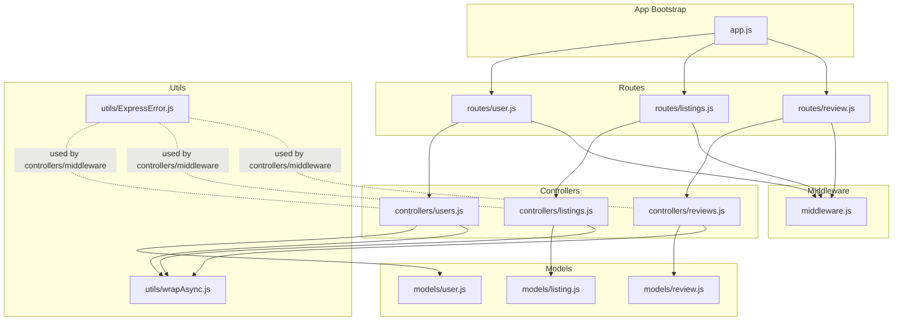
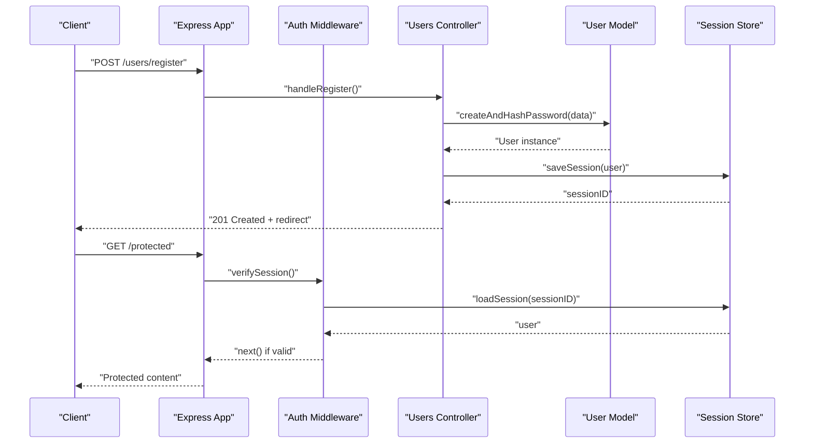
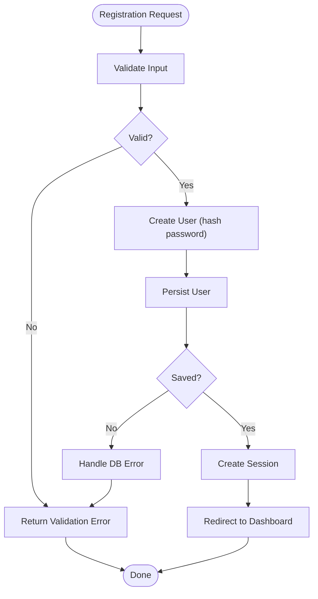
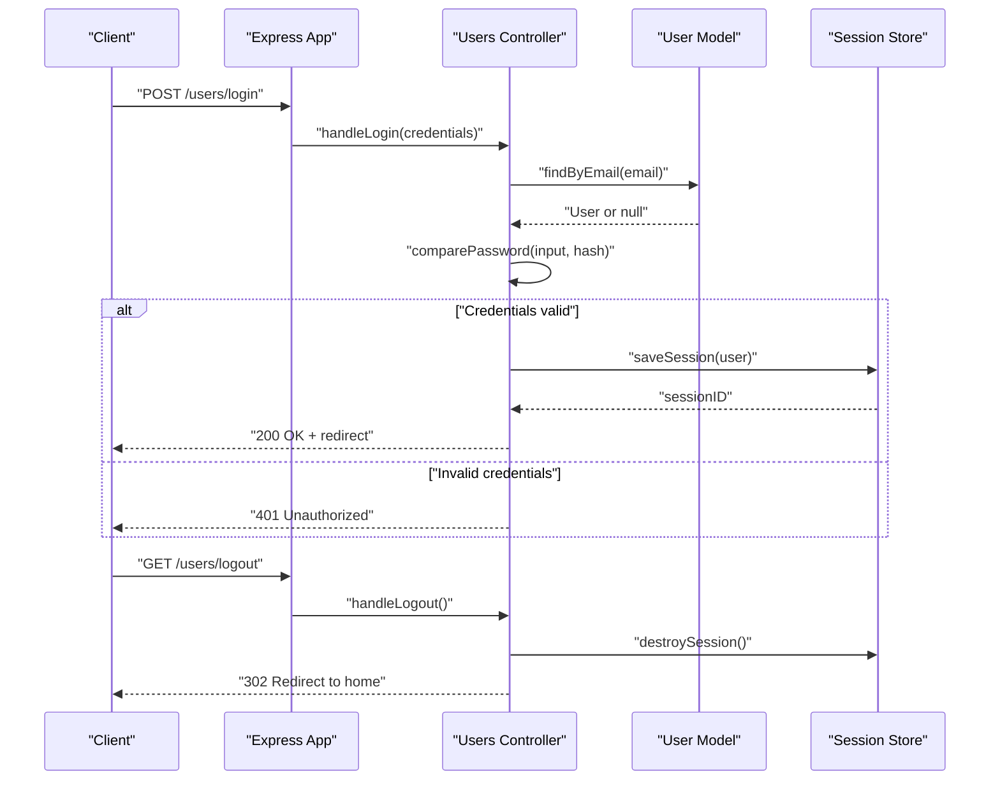
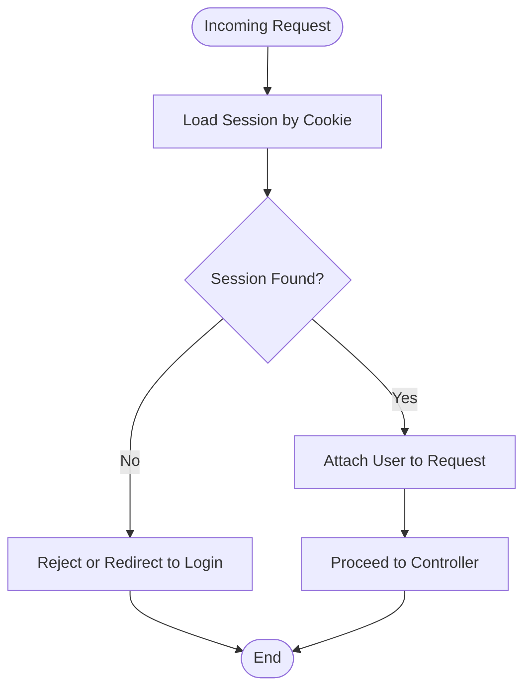
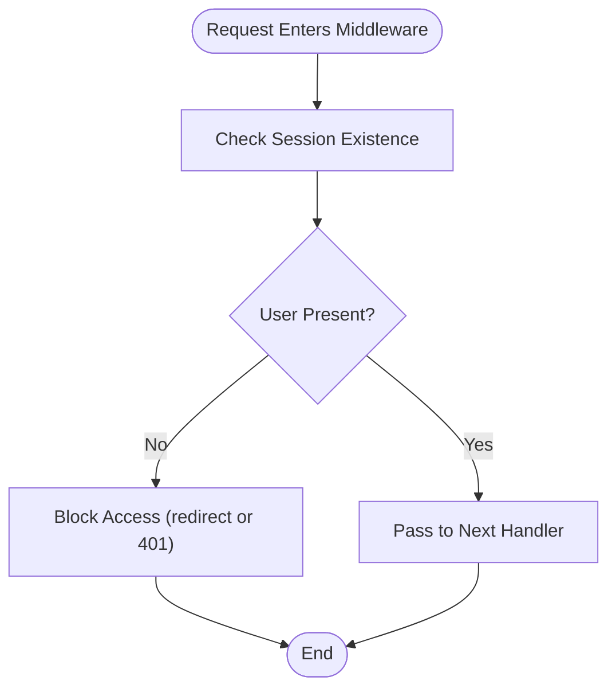
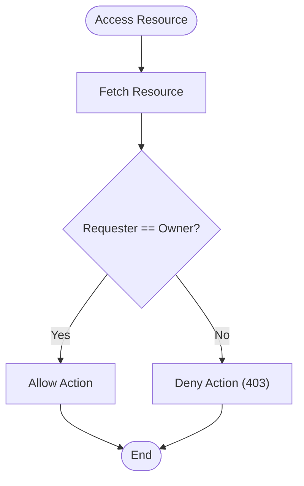
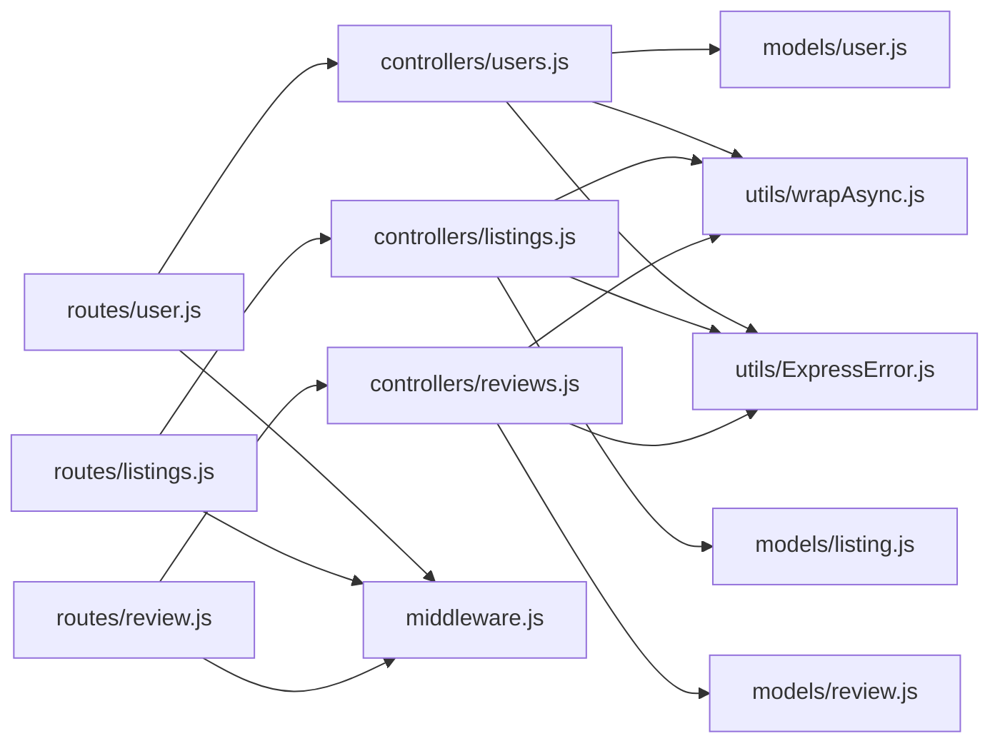

# User Authentication System

<cite>
**Referenced Files in This Document**
- [app.js](file://app.js)
- [middleware.js](file://middleware.js)
- [models/user.js](file://models/user.js)
- [controllers/users.js](file://controllers/users.js)
- [routes/user.js](file://routes/user.js)
- [models/listing.js](file://models/listing.js)
- [models/review.js](file://models/review.js)
- [controllers/listings.js](file://controllers/listings.js)
- [controllers/reviews.js](file://controllers/reviews.js)
- [utils/wrapAsync.js](file://utils/wrapAsync.js)
- [utils/ExpressError.js](file://utils/ExpressError.js)
</cite>

## Table of Contents
1. [Introduction](#introduction)
2. [Project Structure](#project-structure)
3. [Core Components](#core-components)
4. [Architecture Overview](#architecture-overview)
5. [Detailed Component Analysis](#detailed-component-analysis)
6. [Dependency Analysis](#dependency-analysis)
7. [Performance Considerations](#performance-considerations)
8. [Troubleshooting Guide](#troubleshooting-guide)
9. [Conclusion](#conclusion)

## Introduction
This document explains the user authentication system implemented in the application. It covers user registration, login and logout flows, session management, password security, middleware for protecting routes, the user model schema and validation rules, authorization patterns, and how authentication integrates with other features such as listing ownership and review permissions. It also provides concrete examples of typical workflows and highlights common security considerations and mitigations.

## Project Structure
The authentication-related code spans several layers:
- Application bootstrap and route mounting
- Middleware for authentication and authorization
- Data models for users, listings, and reviews
- Controllers handling business logic
- Routes defining HTTP endpoints
- Utilities for error handling and async wrapper



**Diagram sources**
- [app.js](file://app.js)
- [routes/user.js](file://routes/user.js)
- [routes/listings.js](file://routes/listings.js)
- [routes/review.js](file://routes/review.js)
- [controllers/users.js](file://controllers/users.js)
- [controllers/listings.js](file://controllers/listings.js)
- [controllers/reviews.js](file://controllers/reviews.js)
- [models/user.js](file://models/user.js)
- [models/listing.js](file://models/listing.js)
- [models/review.js](file://models/review.js)
- [middleware.js](file://middleware.js)
- [utils/wrapAsync.js](file://utils/wrapAsync.js)
- [utils/ExpressError.js](file://utils/ExpressError.js)

**Section sources**
- [app.js](file://app.js)
- [middleware.js](file://middleware.js)
- [routes/user.js](file://routes/user.js)
- [controllers/users.js](file://controllers/users.js)
- [models/user.js](file://models/user.js)

## Core Components
- User Model: Defines the user schema, including fields for identity, credentials, timestamps, and relationships to other entities. Includes validation rules and password hashing configuration.
- Authentication Controllers: Implement registration, login, and logout logic, including input validation, credential verification, and session creation/termination.
- Authentication Middleware: Guards protected routes by verifying active sessions and enforcing ownership or role-based access where applicable.
- Route Definitions: Mount endpoints for user registration, login, logout, and protected resource access.
- Session Management: Configured at the application level to persist authenticated state across requests.
- Error Handling Utilities: Centralized error types and async wrappers to streamline controller and middleware error propagation.

**Section sources**
- [models/user.js](file://models/user.js)
- [controllers/users.js](file://controllers/users.js)
- [middleware.js](file://middleware.js)
- [routes/user.js](file://routes/user.js)
- [app.js](file://app.js)
- [utils/wrapAsync.js](file://utils/wrapAsync.js)
- [utils/ExpressError.js](file://utils/ExpressError.js)

## Architecture Overview
The authentication architecture follows a layered approach:
- HTTP layer (routes) receives requests and delegates to controllers.
- Controllers orchestrate business logic using models and utilities.
- Middleware intercepts requests to enforce authentication and authorization before reaching controllers.
- Models encapsulate data schemas, validations, and persistence interactions.
- Sessions maintain user context across requests.



**Diagram sources**
- [routes/user.js](file://routes/user.js)
- [controllers/users.js](file://controllers/users.js)
- [models/user.js](file://models/user.js)
- [middleware.js](file://middleware.js)
- [app.js](file://app.js)

## Detailed Component Analysis

### User Model Schema and Validation
- Fields typically include identity attributes, email, hashed password, timestamps, and references to related resources.
- Validation rules ensure required fields, format constraints (e.g., email), uniqueness, and password strength requirements.
- Pre-save hooks hash passwords before persistence to avoid storing plaintext secrets.
- Relationships are modeled via references to listings and reviews, enabling ownership checks and permission enforcement.

```mermaid
classDiagram
class User {
+string id
+string email
+string username
+string passwordHash
+timestamps createdAt updatedAt
+validateInput()
+hashPassword()
+isOwnerOf(resource)
}
class Listing {
+string id
+string title
+string description
+User owner
+timestamps createdAt updatedAt
}
class Review {
+string id
+string text
+User author
+Listing target
+timestamps createdAt updatedAt
}
User ||--o{ Listing : "owns"
User ||--o{ Review : "authored"
Listing ||--o{ Review : "has"
```

**Diagram sources**
- [models/user.js](file://models/user.js)
- [models/listing.js](file://models/listing.js)
- [models/review.js](file://models/review.js)

**Section sources**
- [models/user.js](file://models/user.js)
- [models/listing.js](file://models/listing.js)
- [models/review.js](file://models/review.js)

### Registration Workflow
- Input validation occurs at the controller layer, ensuring required fields and constraints.
- The controller creates a new user record through the model, which hashes the password before saving.
- On success, a session is established and the client is redirected to a dashboard or welcome page.
- Errors (duplicate email, invalid input) return appropriate responses with messages.



**Diagram sources**
- [controllers/users.js](file://controllers/users.js)
- [models/user.js](file://models/user.js)

**Section sources**
- [controllers/users.js](file://controllers/users.js)
- [models/user.js](file://models/user.js)

### Login and Logout Functionality
- Login validates credentials against stored password hashes and establishes a session upon success.
- Logout terminates the session and clears server-side state.
- Failed attempts return consistent error messages without revealing sensitive details.



**Diagram sources**
- [routes/user.js](file://routes/user.js)
- [controllers/users.js](file://controllers/users.js)
- [models/user.js](file://models/user.js)

**Section sources**
- [routes/user.js](file://routes/user.js)
- [controllers/users.js](file://controllers/users.js)
- [models/user.js](file://models/user.js)

### Session Management
- Sessions are configured at the application level and persisted to a store (e.g., memory or database-backed).
- The middleware loads the current user from the session on each request and attaches it to the request context.
- Session cookies should be secure, httpOnly, and scoped appropriately.



**Diagram sources**
- [app.js](file://app.js)
- [middleware.js](file://middleware.js)

**Section sources**
- [app.js](file://app.js)
- [middleware.js](file://middleware.js)

### Authentication Middleware Implementation
- The middleware verifies that a valid session exists and that the request includes an authenticated user context.
- Protected routes use this middleware to restrict access to logged-in users only.
- Additional authorization checks can be layered to enforce ownership or roles.



**Diagram sources**
- [middleware.js](file://middleware.js)

**Section sources**
- [middleware.js](file://middleware.js)

### Authorization Patterns and Ownership Checks
- Ownership checks compare the requesting user’s ID with the resource owner’s ID.
- For listings, only the owner can edit or delete their own listing.
- For reviews, only the author can modify or remove their own review.



**Diagram sources**
- [controllers/listings.js](file://controllers/listings.js)
- [controllers/reviews.js](file://controllers/reviews.js)
- [models/listing.js](file://models/listing.js)
- [models/review.js](file://models/review.js)

**Section sources**
- [controllers/listings.js](file://controllers/listings.js)
- [controllers/reviews.js](file://controllers/reviews.js)
- [models/listing.js](file://models/listing.js)
- [models/review.js](file://models/review.js)

### Password Security Measures
- Passwords are hashed using a strong algorithm before storage; plaintext passwords are never persisted.
- Comparison functions verify inputs against stored hashes securely.
- Enforce minimum complexity and length during registration to mitigate weak passwords.
- Avoid logging or exposing password-related information in errors or responses.

**Section sources**
- [models/user.js](file://models/user.js)
- [controllers/users.js](file://controllers/users.js)

### Concrete Examples of Workflows
- User Creation Example:
  - POST to the registration endpoint with validated fields.
  - Server creates user, hashes password, saves record, starts session, and redirects.
  - Reference paths: [controllers/users.js](file://controllers/users.js), [models/user.js](file://models/user.js), [routes/user.js](file://routes/user.js)

- Authentication Flow Example:
  - POST to the login endpoint with email and password.
  - Server verifies credentials, creates session, and returns success.
  - Reference paths: [controllers/users.js](file://controllers/users.js), [models/user.js](file://models/user.js), [routes/user.js](file://routes/user.js)

- Protected Route Access Example:
  - GET to a protected endpoint requires a valid session.
  - Middleware ensures user presence; controller proceeds if authorized.
  - Reference paths: [middleware.js](file://middleware.js), [routes/user.js](file://routes/user.js), [controllers/listings.js](file://controllers/listings.js)

**Section sources**
- [controllers/users.js](file://controllers/users.js)
- [models/user.js](file://models/user.js)
- [routes/user.js](file://routes/user.js)
- [middleware.js](file://middleware.js)
- [controllers/listings.js](file://controllers/listings.js)

## Dependency Analysis
Authentication components depend on each other as follows:
- Routes depend on controllers and middleware.
- Controllers depend on models and utilities.
- Models define relationships between users, listings, and reviews.
- Middleware depends on session configuration and request context.



**Diagram sources**
- [routes/user.js](file://routes/user.js)
- [routes/listings.js](file://routes/listings.js)
- [routes/review.js](file://routes/review.js)
- [controllers/users.js](file://controllers/users.js)
- [controllers/listings.js](file://controllers/listings.js)
- [controllers/reviews.js](file://controllers/reviews.js)
- [models/user.js](file://models/user.js)
- [models/listing.js](file://models/listing.js)
- [models/review.js](file://models/review.js)
- [middleware.js](file://middleware.js)
- [utils/wrapAsync.js](file://utils/wrapAsync.js)
- [utils/ExpressError.js](file://utils/ExpressError.js)

**Section sources**
- [routes/user.js](file://routes/user.js)
- [routes/listings.js](file://routes/listings.js)
- [routes/review.js](file://routes/review.js)
- [controllers/users.js](file://controllers/users.js)
- [controllers/listings.js](file://controllers/listings.js)
- [controllers/reviews.js](file://controllers/reviews.js)
- [models/user.js](file://models/user.js)
- [models/listing.js](file://models/listing.js)
- [models/review.js](file://models/review.js)
- [middleware.js](file://middleware.js)
- [utils/wrapAsync.js](file://utils/wrapAsync.js)
- [utils/ExpressError.js](file://utils/ExpressError.js)

## Performance Considerations
- Use efficient lookups for user retrieval (indexed email field) to minimize login latency.
- Keep session payloads minimal to reduce cookie size and overhead.
- Prefer database-backed sessions in production for scalability and reliability.
- Avoid unnecessary re-hashing of passwords; cache verified results within request scope when safe.

[No sources needed since this section provides general guidance]

## Troubleshooting Guide
Common issues and resolutions:
- Duplicate email during registration: Ensure unique constraints and clear validation feedback.
- Invalid credentials on login: Verify password comparison logic and ensure correct hashing algorithm usage.
- Session not persisting: Confirm session store configuration and cookie settings (secure, httpOnly, sameSite).
- Authorization failures: Double-check ownership comparisons and ensure user IDs are correctly attached to requests.
- Async errors in controllers: Use the async wrapper to prevent unhandled promise rejections and centralize error formatting.

**Section sources**
- [controllers/users.js](file://controllers/users.js)
- [middleware.js](file://middleware.js)
- [utils/wrapAsync.js](file://utils/wrapAsync.js)
- [utils/ExpressError.js](file://utils/ExpressError.js)

## Conclusion
The authentication system combines robust user modeling, secure password handling, session-based state management, and middleware-driven protection of routes. Authorization patterns enforce ownership for listings and reviews, ensuring users can only manage their own resources. By following the documented workflows and security practices, developers can extend the system safely and maintain high standards for confidentiality, integrity, and availability.