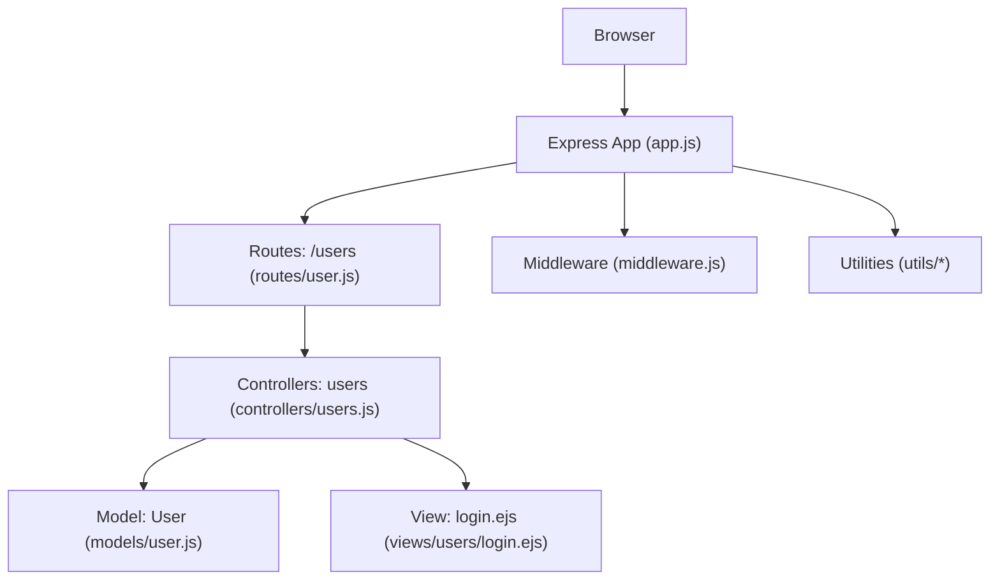
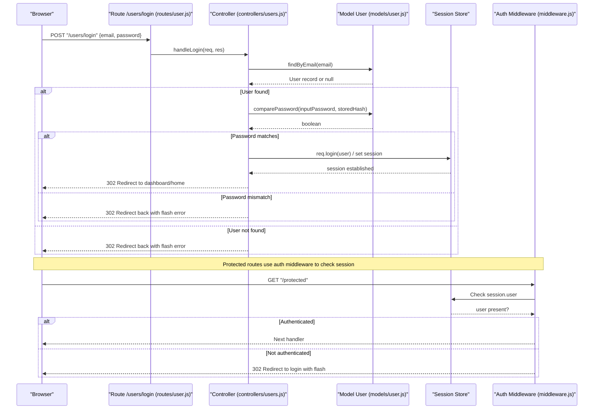
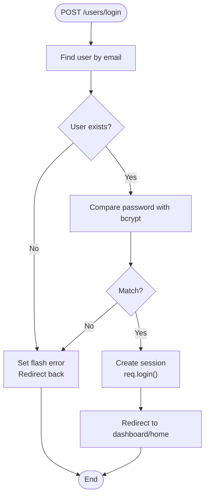
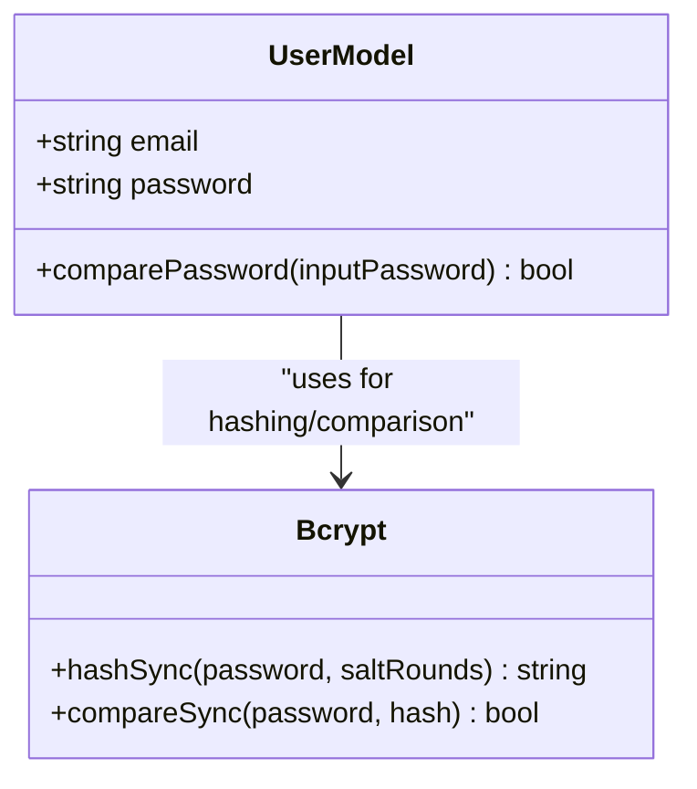
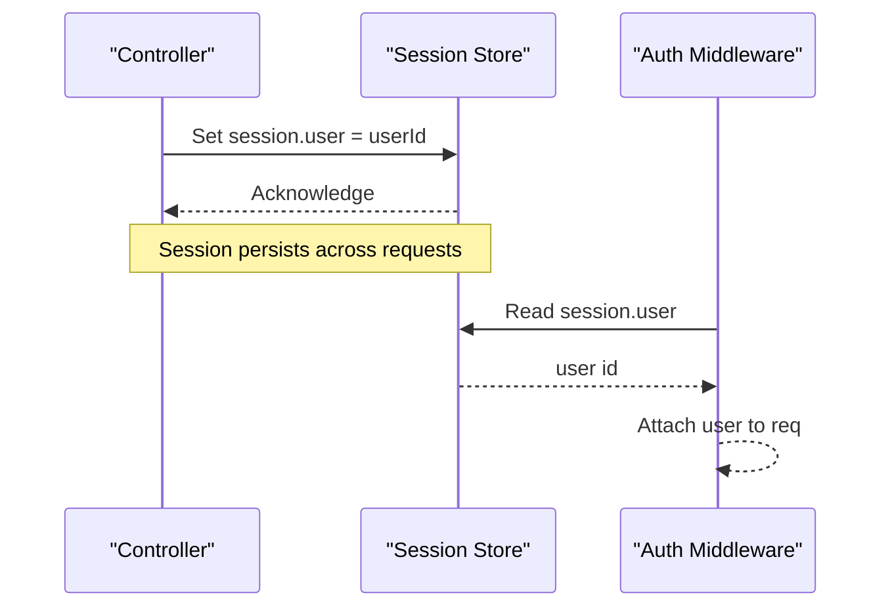
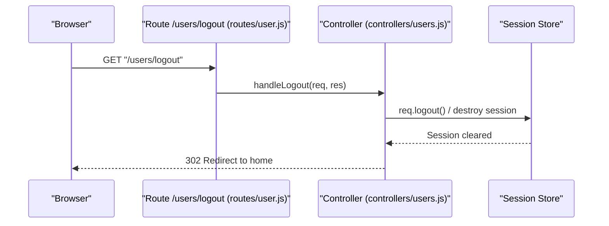
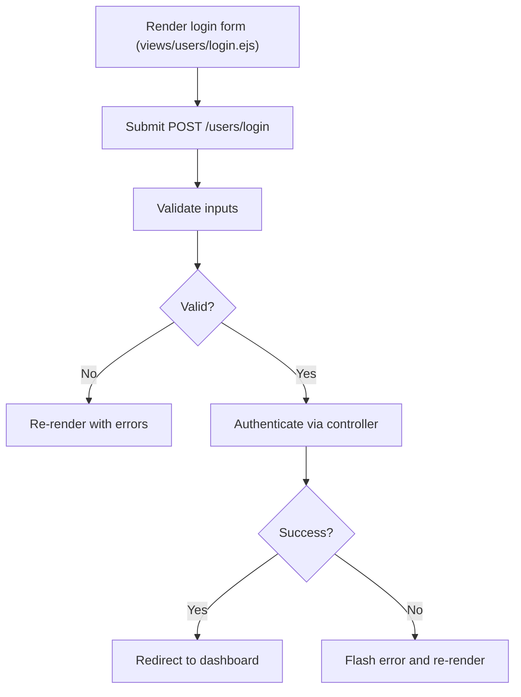
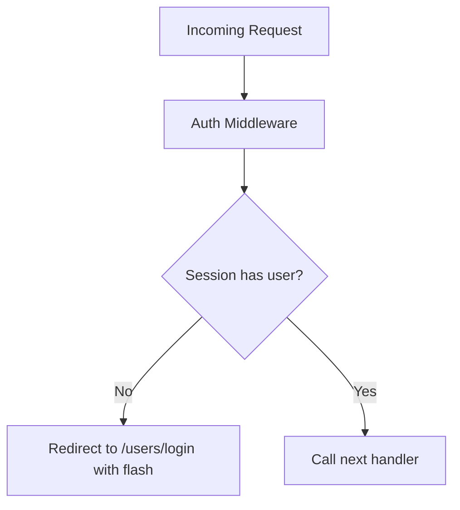
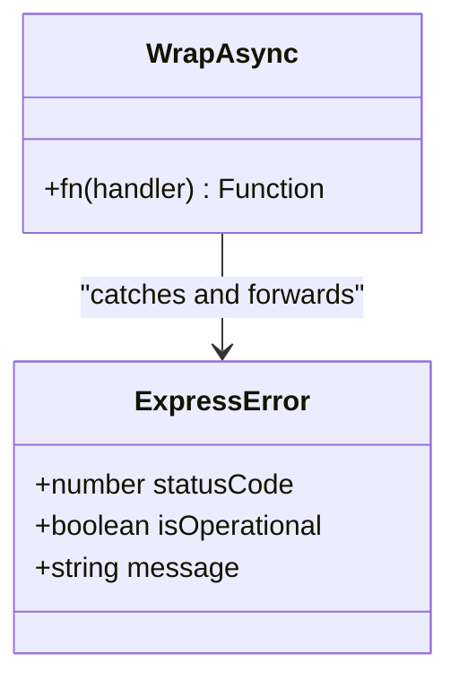
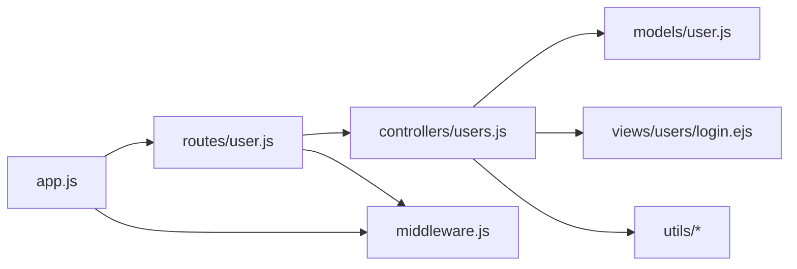

# User Login & Logout

<cite>
**Referenced Files in This Document**
- [app.js](file://app.js)
- [middleware.js](file://middleware.js)
- [controllers/users.js](file://controllers/users.js)
- [routes/user.js](file://routes/user.js)
- [models/user.js](file://models/user.js)
- [views/users/login.ejs](file://views/users/login.ejs)
- [utils/ExpressError.js](file://utils/ExpressError.js)
- [utils/wrapAsync.js](file://utils/wrapAsync.js)
</cite>

## Table of Contents
1. [Introduction](#introduction)
2. [Project Structure](#project-structure)
3. [Core Components](#core-components)
4. [Architecture Overview](#architecture-overview)
5. [Detailed Component Analysis](#detailed-component-analysis)
6. [Dependency Analysis](#dependency-analysis)
7. [Performance Considerations](#performance-considerations)
8. [Troubleshooting Guide](#troubleshooting-guide)
9. [Conclusion](#conclusion)

## Introduction
This document explains the user login and logout functionality, including authentication flow, credential validation, password comparison using bcrypt, session establishment, route handlers, form processing, middleware integration, and logout cleanup. It also covers common scenarios, error states, and security considerations such as CSRF protection.

## Project Structure
The authentication-related code spans controllers, routes, models, views, and shared utilities:
- Controllers implement login/logout logic and session management.
- Routes define HTTP endpoints for login and logout.
- The User model defines schema and password hashing with bcrypt.
- Views render the login form.
- Middleware provides authentication guards and error handling.
- Utilities wrap async handlers and provide a custom error type.

**Diagram sources**
- [app.js](file://app.js)
- [routes/user.js](file://routes/user.js)
- [controllers/users.js](file://controllers/users.js)
- [models/user.js](file://models/user.js)
- [middleware.js](file://middleware.js)
- [views/users/login.ejs](file://views/users/login.ejs)
- [utils/ExpressError.js](file://utils/ExpressError.js)
- [utils/wrapAsync.js](file://utils/wrapAsync.js)

**Section sources**
- [app.js](file://app.js)
- [routes/user.js](file://routes/user.js)
- [controllers/users.js](file://controllers/users.js)
- [models/user.js](file://models/user.js)
- [middleware.js](file://middleware.js)
- [views/users/login.ejs](file://views/users/login.ejs)
- [utils/ExpressError.js](file://utils/ExpressError.js)
- [utils/wrapAsync.js](file://utils/wrapAsync.js)

## Core Components
- Authentication controller functions handle login submission, redirect on success, and flash errors on failure.
- Logout controller function clears the session and redirects to home or a specified path.
- Route definitions wire HTTP methods to controller actions.
- The User model integrates bcrypt for secure password hashing and verification.
- Middleware protects routes by checking session state.
- Views provide the login form UI.

Key responsibilities:
- Credential validation and password comparison via bcrypt.
- Session creation upon successful authentication.
- Session destruction during logout.
- Flash messages for user feedback.
- Error handling with ExpressError and async wrapper.

**Section sources**
- [controllers/users.js](file://controllers/users.js)
- [routes/user.js](file://routes/user.js)
- [models/user.js](file://models/user.js)
- [middleware.js](file://middleware.js)
- [views/users/login.ejs](file://views/users/login.ejs)
- [utils/ExpressError.js](file://utils/ExpressError.js)
- [utils/wrapAsync.js](file://utils/wrapAsync.js)

## Architecture Overview
The login flow is an HTTP request-response cycle that validates credentials, compares passwords securely, establishes a session, and redirects. The logout flow destroys the session and cleans up server-side state.

**Diagram sources**
- [routes/user.js](file://routes/user.js)
- [controllers/users.js](file://controllers/users.js)
- [models/user.js](file://models/user.js)
- [middleware.js](file://middleware.js)

## Detailed Component Analysis

### Login Flow
- Route handler receives POST requests with email and password.
- Controller locates the user by email.
- If found, it compares the provided password with the stored hash using bcrypt.
- On success, it establishes a session and redirects to the intended destination or default page.
- On failure, it redirects back with a flash message indicating invalid credentials.

**Diagram sources**
- [controllers/users.js](file://controllers/users.js)
- [models/user.js](file://models/user.js)

**Section sources**
- [routes/user.js](file://routes/user.js)
- [controllers/users.js](file://controllers/users.js)
- [models/user.js](file://models/user.js)

### Password Comparison with bcrypt
- The User model stores hashed passwords generated by bcrypt.
- During login, the controller calls a method to compare the input password against the stored hash.
- bcrypt ensures timing-safe comparisons and uses salted hashes.

**Diagram sources**
- [models/user.js](file://models/user.js)

**Section sources**
- [models/user.js](file://models/user.js)

### Session Establishment
- Upon successful authentication, the controller sets the session (e.g., via passport’s serialize/deserialize or direct session assignment).
- Subsequent requests include the session cookie, allowing access to protected routes guarded by middleware.

**Diagram sources**
- [controllers/users.js](file://controllers/users.js)
- [middleware.js](file://middleware.js)

**Section sources**
- [controllers/users.js](file://controllers/users.js)
- [middleware.js](file://middleware.js)

### Logout Flow
- The logout route invokes session destruction to clear server-side session data.
- After cleanup, the client is redirected to the homepage or a specified path.

**Diagram sources**
- [routes/user.js](file://routes/user.js)
- [controllers/users.js](file://controllers/users.js)

**Section sources**
- [routes/user.js](file://routes/user.js)
- [controllers/users.js](file://controllers/users.js)

### Form Processing and Validation
- The login view renders a form posting to the login route with email and password fields.
- Server-side validation checks for required fields and valid formats before querying the database.
- Errors are flashed to the user and the form is re-rendered with the original input where appropriate.

**Diagram sources**
- [views/users/login.ejs](file://views/users/login.ejs)
- [controllers/users.js](file://controllers/users.js)

**Section sources**
- [views/users/login.ejs](file://views/users/login.ejs)
- [controllers/users.js](file://controllers/users.js)

### Authentication Middleware Integration
- A global or route-level middleware checks if a user is authenticated by inspecting the session.
- Unauthenticated requests are redirected to the login page with a flash message prompting sign-in.
- Authenticated requests proceed to the target handler with user context attached.

**Diagram sources**
- [middleware.js](file://middleware.js)

**Section sources**
- [middleware.js](file://middleware.js)

### Error Handling
- Custom ExpressError is used to standardize error responses.
- Async route handlers are wrapped to prevent unhandled promise rejections.
- Authentication failures return user-friendly flash messages rather than stack traces.

**Diagram sources**
- [utils/ExpressError.js](file://utils/ExpressError.js)
- [utils/wrapAsync.js](file://utils/wrapAsync.js)

**Section sources**
- [utils/ExpressError.js](file://utils/ExpressError.js)
- [utils/wrapAsync.js](file://utils/wrapAsync.js)

## Dependency Analysis
The following diagram shows how components depend on each other for login/logout:

**Diagram sources**
- [app.js](file://app.js)
- [routes/user.js](file://routes/user.js)
- [controllers/users.js](file://controllers/users.js)
- [models/user.js](file://models/user.js)
- [middleware.js](file://middleware.js)
- [views/users/login.ejs](file://views/users/login.ejs)
- [utils/ExpressError.js](file://utils/ExpressError.js)
- [utils/wrapAsync.js](file://utils/wrapAsync.js)

**Section sources**
- [app.js](file://app.js)
- [routes/user.js](file://routes/user.js)
- [controllers/users.js](file://controllers/users.js)
- [models/user.js](file://models/user.js)
- [middleware.js](file://middleware.js)
- [views/users/login.ejs](file://views/users/login.ejs)
- [utils/ExpressError.js](file://utils/ExpressError.js)
- [utils/wrapAsync.js](file://utils/wrapAsync.js)

## Performance Considerations
- Use bcrypt with appropriate salt rounds to balance security and performance.
- Avoid unnecessary database queries; cache frequently accessed user attributes when safe.
- Ensure session store is efficient (in-memory for development, Redis or similar for production).
- Minimize redirects and avoid heavy computations in hot paths like login.

[No sources needed since this section provides general guidance]

## Troubleshooting Guide
Common issues and resolutions:
- Invalid credentials: Ensure the email exists and the password matches the stored hash. Verify bcrypt usage and salt rounds.
- Session not persisting: Confirm session middleware configuration and cookie settings (secure, httpOnly, sameSite).
- CSRF vulnerabilities: Enable CSRF protection for state-changing routes and ensure tokens are validated.
- Redirect loops: Check middleware conditions and flash message flows to avoid infinite redirects.
- Error pages: Use ExpressError and wrapAsync to surface meaningful errors without leaking internals.

**Section sources**
- [controllers/users.js](file://controllers/users.js)
- [middleware.js](file://middleware.js)
- [utils/ExpressError.js](file://utils/ExpressError.js)
- [utils/wrapAsync.js](file://utils/wrapAsync.js)

## Conclusion
The login and logout system combines secure password handling with robust session management and middleware-based authorization. By validating inputs, comparing passwords via bcrypt, establishing sessions on success, and destroying them on logout, the application maintains a secure and user-friendly authentication experience. Proper error handling and CSRF protection further strengthen security posture.

[No sources needed since this section summarizes without analyzing specific files]