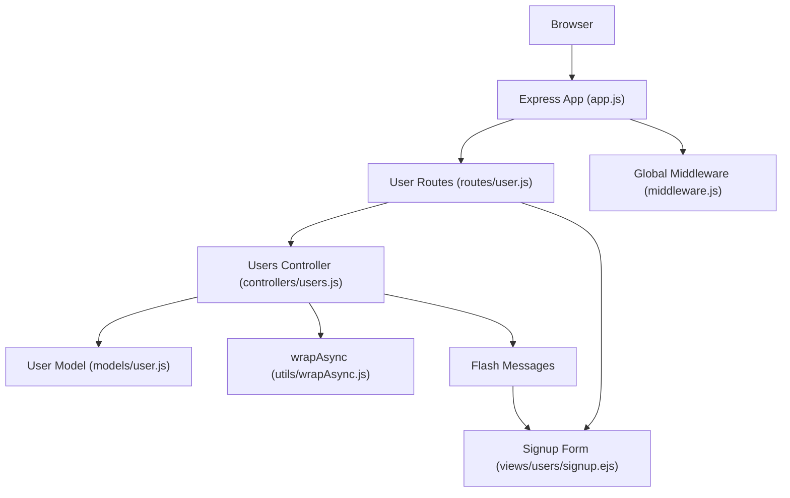
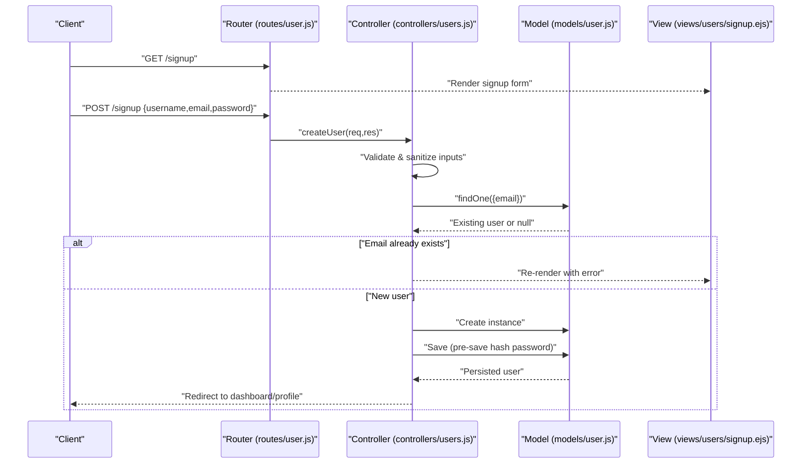
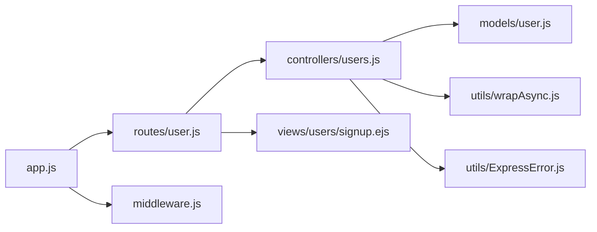

# User Registration

<cite>
**Referenced Files in This Document**
- [app.js](file://app.js)
- [middleware.js](file://middleware.js)
- [models/user.js](file://models/user.js)
- [controllers/users.js](file://controllers/users.js)
- [routes/user.js](file://routes/user.js)
- [views/users/signup.ejs](file://views/users/signup.ejs)
- [utils/ExpressError.js](file://utils/ExpressError.js)
- [utils/wrapAsync.js](file://utils/wrapAsync.js)
</cite>

## Table of Contents
1. [Introduction](#introduction)
2. [Project Structure](#project-structure)
3. [Core Components](#core-components)
4. [Architecture Overview](#architecture-overview)
5. [Detailed Component Analysis](#detailed-component-analysis)
6. [Dependency Analysis](#dependency-analysis)
7. [Performance Considerations](#performance-considerations)
8. [Troubleshooting Guide](#troubleshooting-guide)
9. [Conclusion](#conclusion)

## Introduction
This document explains the user registration system end-to-end: from form submission to account creation. It covers the signup route handler, form validation, error handling, success redirection, password hashing, data sanitization, and security measures such as duplicate email checks and password strength validation. The goal is to help developers understand how users are created in the database and how errors are surfaced to the client.

## Project Structure
The registration feature spans several layers:
- Routes define HTTP endpoints for GET and POST /signup.
- Controllers implement business logic for creating a new user.
- Models define the user schema and persistence behavior.
- Middleware provides request helpers and global error formatting.
- Views render the signup form and display flash messages.
- Utilities wrap async handlers and provide a custom error class.

**Diagram sources**
- [app.js](file://app.js)
- [routes/user.js](file://routes/user.js)
- [controllers/users.js](file://controllers/users.js)
- [models/user.js](file://models/user.js)
- [views/users/signup.ejs](file://views/users/signup.ejs)
- [middleware.js](file://middleware.js)
- [utils/wrapAsync.js](file://utils/wrapAsync.js)

**Section sources**
- [app.js](file://app.js)
- [routes/user.js](file://routes/user.js)
- [controllers/users.js](file://controllers/users.js)
- [models/user.js](file://models/user.js)
- [views/users/signup.ejs](file://views/users/signup.ejs)
- [middleware.js](file://middleware.js)
- [utils/wrapAsync.js](file://utils/wrapAsync.js)

## Core Components
- Signup Route Handler: Exposes GET and POST routes for the signup page and form submission.
- Users Controller: Orchestrates validation, uniqueness checks, hashing, and persistence.
- User Model: Defines fields, default values, and hooks for hashing and sanitization.
- Validation and Sanitization: Ensures required fields, correct types, and safe inputs.
- Error Handling: Uses a custom error class and async wrapper to centralize error propagation.
- Success Redirection: Redirects to a dashboard or profile after successful registration.

Key responsibilities by file:
- routes/user.js: Mounts signup routes and maps them to controller methods.
- controllers/users.js: Implements create logic, including validation and hashing.
- models/user.js: Declares schema, validators, and pre-save hooks for hashing/sanitization.
- views/users/signup.ejs: Renders the form and displays server-side errors and flash messages.
- utils/ExpressError.js: Custom error type used across the app.
- utils/wrapAsync.js: Wraps async route/controller functions to avoid try/catch repetition.
- middleware.js: Global middleware that may set locals like currentUser and handle flash messages.

**Section sources**
- [routes/user.js](file://routes/user.js)
- [controllers/users.js](file://controllers/users.js)
- [models/user.js](file://models/user.js)
- [views/users/signup.ejs](file://views/users/signup.ejs)
- [utils/ExpressError.js](file://utils/ExpressError.js)
- [utils/wrapAsync.js](file://utils/wrapAsync.js)
- [middleware.js](file://middleware.js)

## Architecture Overview
The registration flow follows a standard MVC pattern with Express:
- Client submits a POST to /signup with username, email, and password.
- The router delegates to the controller.
- The controller validates input, checks for duplicates, hashes the password, and saves the user.
- On success, the controller redirects to a protected area; on failure, it re-renders the form with errors.

**Diagram sources**
- [routes/user.js](file://routes/user.js)
- [controllers/users.js](file://controllers/users.js)
- [models/user.js](file://models/user.js)
- [views/users/signup.ejs](file://views/users/signup.ejs)

## Detailed Component Analysis

### User Model Schema and Hooks
- Fields typically include username, email, and password.
- Email should be unique and validated for format.
- Password should be stored hashed; a pre-save hook performs hashing before persistence.
- Optional sanitization can trim whitespace and normalize casing for email.

Security considerations:
- Never store plaintext passwords.
- Enforce minimum length and complexity via model-level validators or controller-level checks.
- Normalize email to prevent case-sensitivity issues.

**Section sources**
- [models/user.js](file://models/user.js)

### Signup Route Handler
- GET /signup renders the signup form view.
- POST /signup processes the form submission and calls the controller’s create method.
- Errors are passed back to the view for display.

Best practices:
- Use an async wrapper around route handlers to simplify error propagation.
- Keep route files thin; delegate logic to controllers.

**Section sources**
- [routes/user.js](file://routes/user.js)
- [utils/wrapAsync.js](file://utils/wrapAsync.js)

### Users Controller (Create Flow)
Responsibilities:
- Validate and sanitize incoming fields (username, email, password).
- Check for duplicate emails using a query against the user collection.
- Hash the password if not already hashed.
- Persist the user and redirect on success.
- Re-render the form with validation and conflict errors on failure.

Validation rules:
- Required fields: username, email, password.
- Email must match a valid email pattern.
- Password must meet minimum length and complexity requirements.

Sanitization:
- Trim whitespace from text fields.
- Lowercase email for consistent lookups.

Duplicate check:
- Query by normalized email; if found, return a specific error message.

Password hashing:
- Ensure hashing occurs before save (either via pre-save hook or explicit call).

Success path:
- Redirect to a protected route (e.g., dashboard or profile).

Failure path:
- Re-render the signup form with localized error messages.

**Section sources**
- [controllers/users.js](file://controllers/users.js)
- [models/user.js](file://models/user.js)
- [utils/ExpressError.js](file://utils/ExpressError.js)
- [utils/wrapAsync.js](file://utils/wrapAsync.js)

### Form View and Flash Messages
- The signup form posts to /signup with fields for username, email, and password.
- Server-side errors are displayed near relevant fields.
- Flash messages (e.g., “Account created successfully”) are shown at the top of the page.

Integration points:
- The view reads local variables set by the controller (errors, flash messages).
- The global middleware may inject currentUser and other locals into all views.

**Section sources**
- [views/users/signup.ejs](file://views/users/signup.ejs)
- [middleware.js](file://middleware.js)

### Error Handling Strategy
- A custom error class (ExpressError) is used to represent application errors consistently.
- An async wrapper ensures unhandled promise rejections in route handlers do not crash the server.
- Global error-handling middleware formats responses and renders error pages.

Common error scenarios:
- Duplicate email during registration.
- Validation failures (missing or invalid fields).
- Database errors (connection issues, constraints).

**Section sources**
- [utils/ExpressError.js](file://utils/ExpressError.js)
- [utils/wrapAsync.js](file://utils/wrapAsync.js)
- [middleware.js](file://middleware.js)

## Dependency Analysis
High-level dependencies:
- routes/user.js depends on controllers/users.js and views/users/signup.ejs.
- controllers/users.js depends on models/user.js and utilities.
- models/user.js encapsulates schema, validation, and hashing logic.
- middleware.js provides shared locals and error formatting.
- utils/wrapAsync.js and utils/ExpressError.js support robust error handling.

**Diagram sources**
- [routes/user.js](file://routes/user.js)
- [controllers/users.js](file://controllers/users.js)
- [models/user.js](file://models/user.js)
- [views/users/signup.ejs](file://views/users/signup.ejs)
- [middleware.js](file://middleware.js)
- [utils/wrapAsync.js](file://utils/wrapAsync.js)
- [utils/ExpressError.js](file://utils/ExpressError.js)
- [app.js](file://app.js)

**Section sources**
- [routes/user.js](file://routes/user.js)
- [controllers/users.js](file://controllers/users.js)
- [models/user.js](file://models/user.js)
- [views/users/signup.ejs](file://views/users/signup.ejs)
- [middleware.js](file://middleware.js)
- [utils/wrapAsync.js](file://utils/wrapAsync.js)
- [utils/ExpressError.js](file://utils/ExpressError.js)
- [app.js](file://app.js)

## Performance Considerations
- Indexing: Add a unique index on the email field to speed up duplicate checks.
- Validation early: Fail fast on invalid inputs to reduce DB round-trips.
- Avoid unnecessary queries: Only perform findOne when required fields pass basic validation.
- Efficient hashing: Use a secure hashing algorithm with appropriate cost factor.
- Minimize view rendering: Re-render only when necessary; prefer redirects on success.

[No sources needed since this section provides general guidance]

## Troubleshooting Guide
Common issues and resolutions:
- Duplicate email error: Ensure normalization (lowercasing) and unique constraint/index exist.
- Validation errors: Verify required fields and patterns; confirm error messages are passed to the view.
- Password not hashed: Confirm pre-save hook or explicit hashing runs before save.
- Redirect not working: Check that the success path returns a proper redirect response.
- Flash messages not showing: Ensure flash middleware is configured and the view renders flash locals.

Use the custom error class and async wrapper to surface meaningful errors without crashing the server.

**Section sources**
- [utils/ExpressError.js](file://utils/ExpressError.js)
- [utils/wrapAsync.js](file://utils/wrapAsync.js)
- [middleware.js](file://middleware.js)
- [views/users/signup.ejs](file://views/users/signup.ejs)

## Conclusion
The registration system follows a clear MVC structure with strong separation of concerns. The controller orchestrates validation, uniqueness checks, and persistence, while the model enforces schema rules and handles password hashing. Robust error handling and flash messaging improve user experience. By following the recommendations above—especially around indexing, validation, and hashing—you can ensure a secure, efficient, and maintainable registration flow.

[No sources needed since this section summarizes without analyzing specific files]